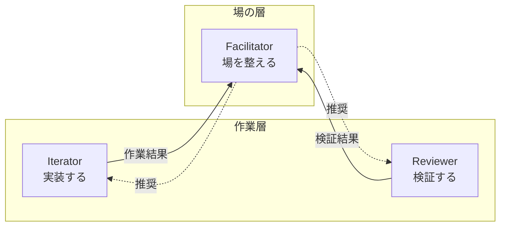
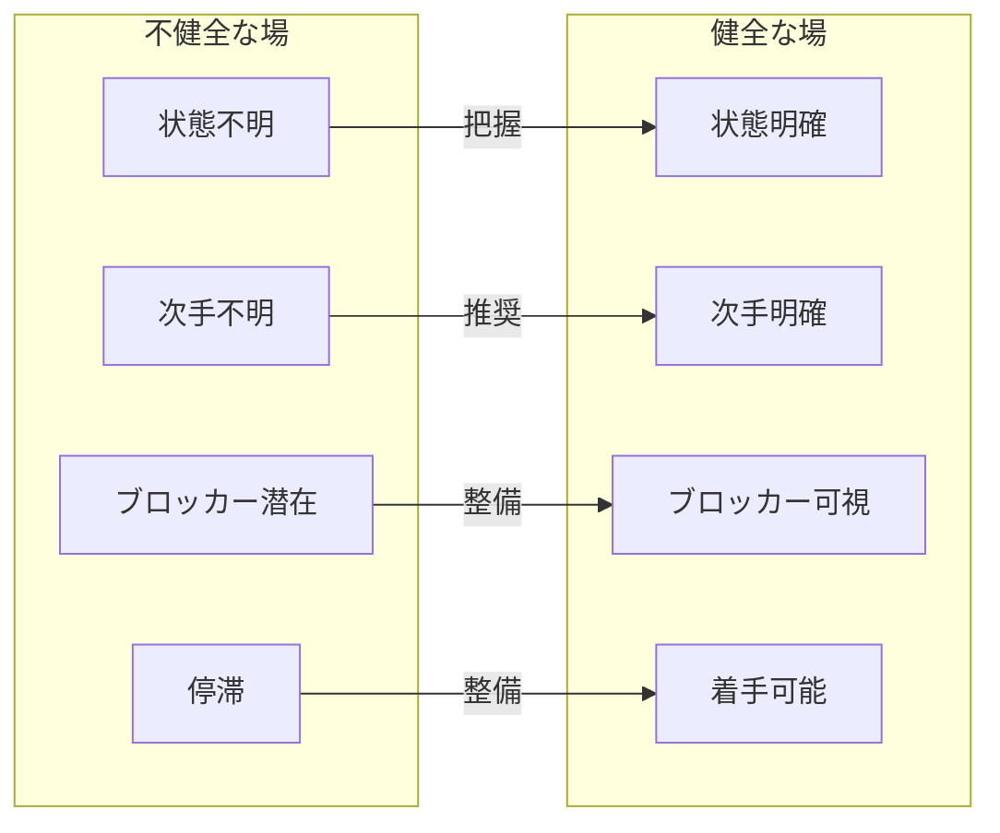
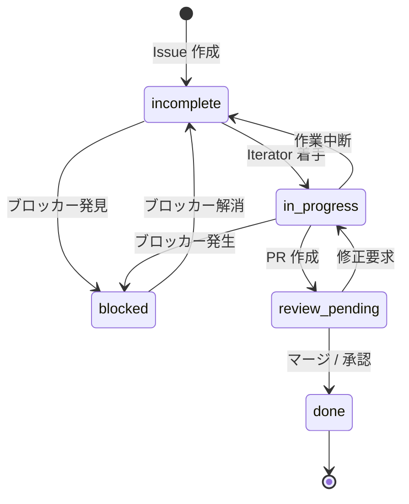
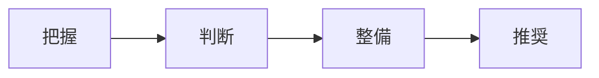
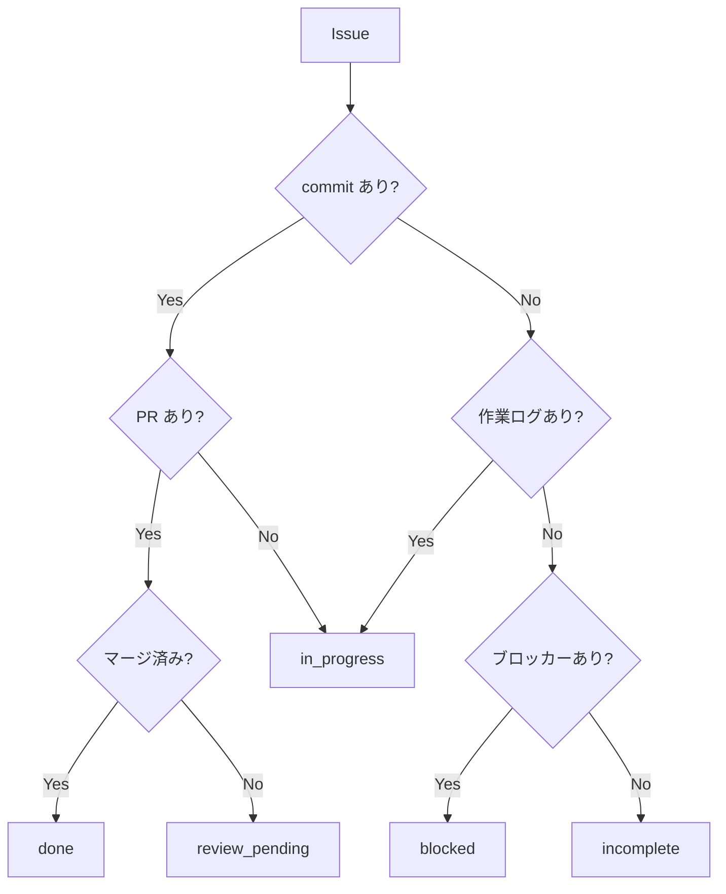
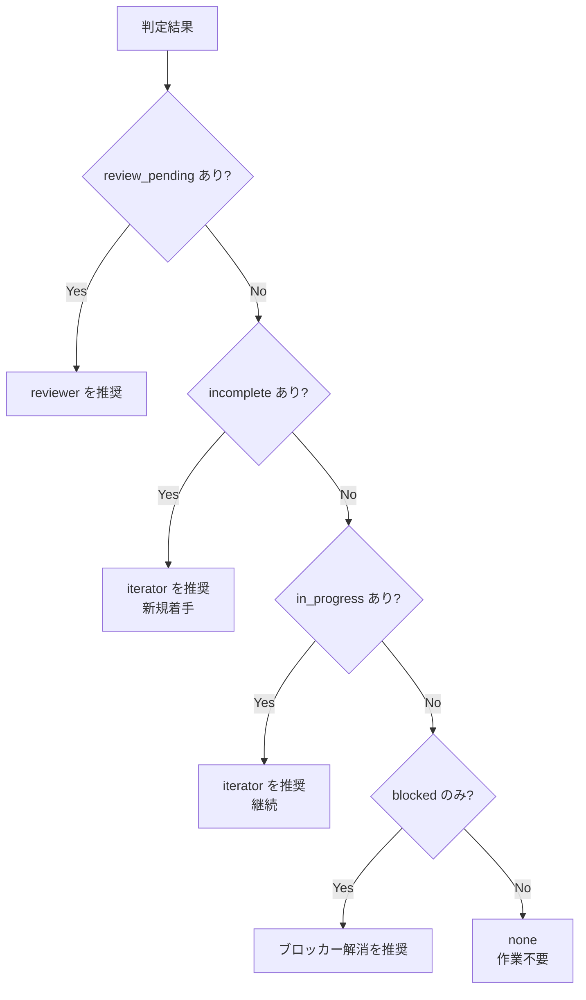

# Facilitator Agent

## What: Facilitator とは

**場の状態を把握し、次の一手を明らかにする Agent。**

Iterator / Reviewer が「作業」を担うのに対し、Facilitator は「場」を担う。



## Why: なぜ場の制御が必要か

### 問題

Iterator / Reviewer が作業した後、以下の状態が発生する:

| 状況 | 結果 |
|------|------|
| 何が完了したか不明 | 重複作業、作業漏れ |
| 次に何をすべきか不明 | 停滞、判断待ち |
| ブロッカーが潜在化 | 進行不能に気づかない |
| Issue の状態が実装と乖離 | 誤った優先度判断 |

### 解決

**場の状態を常に「着手可能」に保つ。**

- 各 Issue の状態が明確
- 次のアクションが分かる
- ブロッカーが可視化されている
- Iterator / Reviewer が迷わず作業できる

---

## 場の制御 (Field Control) - 定義

### 場 (Field)

```
場 = { Issue群, 状態群, 関係群 }
```

| 構成要素 | 定義 | 例 |
|----------|------|-----|
| **Issue群** | Project に属する Issue の集合 | #123, #124, #125 |
| **状態群** | 各 Issue の現在状態 | 完了, 作業中, ブロック |
| **関係群** | Issue 間の依存・関連 | #124 は #123 に依存 |

### 制御 (Control)

```
制御 = 場を健全な状態に維持する行為
```

**制御 ≠ 支配**

| 制御 (やること) | 支配 (やらないこと) |
|-----------------|---------------------|
| 状態を明らかにする | 作業を指示する |
| 次の一手を示す | 作業を強制する |
| ブロッカーを可視化する | ブロッカーを解消する |
| 着手可能な状態を維持する | 作業を実行する |

### 健全な場の条件

場が「健全」であるとは、以下の条件を満たすこと:

| 条件 | 定義 | 測定方法 |
|------|------|----------|
| **状態明確** | 全 Issue の状態が判定済み | `unknown` 状態の Issue が 0 |
| **次手明確** | 次のアクションが特定されている | `nextAgent` が決定している |
| **ブロッカー可視** | ブロックしている要因が明示されている | `blocked` Issue に理由が記載 |
| **着手可能** | 作業できる Issue が存在する | `incomplete` または `in_progress` の Issue がある |



---

## Issue 状態 - 定義

### 状態一覧

| 状態 | 識別子 | 定義 | 判定条件 |
|------|--------|------|----------|
| **完了** | `done` | 作業完了、検証済み | commit あり AND (マージ済み OR レビュー承認) |
| **レビュー待ち** | `review_pending` | 実装完了、検証待ち | commit あり AND PR 作成 AND 未マージ |
| **作業中** | `in_progress` | 実装が進行中 | 作業ログあり AND 未完了 |
| **未着手** | `incomplete` | まだ着手されていない | commit なし AND ブロッカーなし |
| **ブロック** | `blocked` | 進行を妨げる要因がある | 依存 Issue が `done` でない OR 外部ブロッカーあり |
| **不明** | `unknown` | 判断に必要な情報が不足 | 上記いずれにも該当しない |

### 状態遷移



### 状態と推奨アクション

| 状態 | 推奨アクション | 推奨 Agent |
|------|---------------|------------|
| `done` | Close 可能 | `none` |
| `review_pending` | レビュー実施 | `reviewer` |
| `in_progress` | 作業継続 | `iterator` |
| `incomplete` | 作業開始 | `iterator` |
| `blocked` | ブロッカー解消 | 状況による |
| `unknown` | 追加調査 | `facilitator` (自己継続) |

---

## Facilitator の責務 - 定義

### 4つの責務



### 1. 把握 (Grasp)

**目的**: 何が起きたかを知る

| 入力 | 取得元 | 取得内容 |
|------|--------|----------|
| 作業ログ | `tmp/logs/agents/` | どの Issue に対して何をしたか |
| commit | `git log` | どの Issue に対応する変更があるか |
| Issue | `gh project item-list` | 現在の Issue 一覧 |
| コメント | `gh issue view` | Issue の詳細・議論 |

**出力**: 時系列イベントリスト

```json
{
  "events": [
    { "time": "2024-01-15T10:00:00Z", "type": "issue_created", "issue": 123 },
    { "time": "2024-01-15T11:00:00Z", "type": "iterator_started", "issue": 123 },
    { "time": "2024-01-15T12:00:00Z", "type": "commit_pushed", "issue": 123, "sha": "abc1234" }
  ]
}
```

### 2. 判断 (Judge)

**目的**: 各 Issue の状態を判定する

**入力**: 時系列イベントリスト + Issue 一覧

**ロジック**:



**出力**: Issue 状態リスト

```json
{
  "assessments": [
    { "issue": 123, "state": "in_progress", "evidence": ["commit abc1234", "log session-xxx"] },
    { "issue": 124, "state": "blocked", "blocker": "depends on #123" }
  ]
}
```

### 3. 整備 (Maintain)

**目的**: 着手可能な状態を維持する

**入力**: Issue 状態リスト

**アクション**:

| 状態 | 整備アクション |
|------|---------------|
| `in_progress` | 作業継続を促すコメント、完了条件の明確化 |
| `incomplete` | 着手可能であることを明示 |
| `blocked` | ブロッカーを明示するコメント、ラベル付与 |
| `review_pending` | レビュー依頼を明示 |
| `done` | Close 判断が必要であることをコメント |
| `unknown` | 追加情報を求めるコメント |

**出力**: 整備アクションリスト

```json
{
  "actions": [
    { "action": "comment", "issue": 123, "body": "作業継続をお願いします。完了条件: ..." },
    { "action": "label", "issue": 124, "label": "blocked", "body": "#123 の完了待ち" }
  ]
}
```

### 4. 推奨 (Recommend)

**目的**: 次に呼ぶべき Agent を返す

**入力**: Issue 状態リスト

**ロジック**:



**出力**: 推奨

```json
{
  "nextAgent": "iterator",
  "targetIssues": [123, 125],
  "reason": "#123 は作業中、#125 は未着手",
  "priority": "high"
}
```

---

## 完了時の出力 - 定義

Facilitator の完了時には、**次に着手可能な手立て**が示されなければならない。

### 完了条件

Facilitator は以下を全て満たしたとき完了する:

1. 全 Issue の状態が判定済み (`unknown` が 0)
2. 次のアクションが特定されている
3. 整備アクションが実行済み

### 完了時に出力すべきもの

| 出力 | 内容 | 目的 |
|------|------|------|
| **推奨 Agent** | `iterator` / `reviewer` / `none` | 次に何を呼ぶべきか |
| **対象 Issue** | Issue 番号リスト | どの Issue に対して |
| **理由** | 判断根拠 | なぜそう判断したか |
| **実行サジェスト** | 具体的なコマンド | すぐに実行できる形で |

### 実行サジェスト

Facilitator は推奨だけでなく、**具体的な実行コマンド**を優先度付きでサジェストする。

選択肢は複数ありえる。それぞれに**優先度 (priority)** と **スコア (score)** を付与する。

```json
{
  "nextAgent": "iterator",
  "targetIssues": [123, 125],
  "reason": "#123 は作業中、#125 は未着手",
  "suggestions": [
    {
      "command": "deno task agents:run iterator --issue 123",
      "description": "Issue #123 の実装を継続",
      "priority": "high",
      "score": 0.9,
      "rationale": "作業中のため継続が効率的"
    },
    {
      "command": "deno task agents:run iterator --issue 125",
      "description": "Issue #125 の実装を新規着手",
      "priority": "medium",
      "score": 0.6,
      "rationale": "未着手だが #123 完了後が望ましい"
    },
    {
      "command": "deno task agents:run reviewer --project 5",
      "description": "レビュー待ち PR がある場合",
      "priority": "low",
      "score": 0.3,
      "rationale": "現時点で review_pending なし"
    }
  ]
}
```

### スコアの基準

| スコア | 意味 | 判断基準 |
|--------|------|----------|
| 0.8 - 1.0 | 最優先 | 即座に実行すべき |
| 0.5 - 0.7 | 推奨 | 実行が望ましい |
| 0.3 - 0.4 | 可能 | 状況により有効 |
| 0.0 - 0.2 | 低優先 | 他を優先すべき |

### 優先度の基準

| 優先度 | 定義 | 例 |
|--------|------|-----|
| `high` | ブロッカーの解消、期限付き、依存先 | #123 が完了しないと #124 が進まない |
| `medium` | 通常の未着手・作業中 | 特に制約のない Issue |
| `low` | 改善提案、リファクタリング | 急ぎではない |

### サジェストのパターン

| 推奨 Agent | サジェストコマンド |
|------------|-------------------|
| `iterator` (単一 Issue) | `deno task agents:run iterator --issue {N}` |
| `iterator` (Project) | `deno task agents:run iterator --project {N}` |
| `reviewer` | `deno task agents:run reviewer --project {N}` |
| `none` | `gh issue close {N}` または「作業完了」 |
| ブロッカー解消 | ブロッカーの Issue 番号と解消方法を提示 |

---

## 出力仕様

### recommend-action (主出力)

```typescript
interface Suggestion {
  command: string;
  description: string;
  priority: "high" | "medium" | "low";
  score: number;  // 0.0 - 1.0
  rationale: string;
}

interface RecommendAction {
  nextAgent: "iterator" | "reviewer" | "none";
  targetIssues: number[];
  reason: string;
  suggestions: Suggestion[];
}
```

### issue-assessment

```typescript
interface IssueAssessment {
  issue: number;
  state: "done" | "review_pending" | "in_progress" | "incomplete" | "blocked" | "unknown";
  evidence: string[];
  recommendation: string;
}
```

### facilitate-action

```typescript
interface FacilitateAction {
  action: "comment" | "label" | "update" | "attention";
  issue: number;
  body: string;
  label?: string;
}
```

---

## やること / やらないこと

| やること | やらないこと |
|----------|--------------|
| 状態を把握する | コードを実装する |
| 状態を判定する | PR をレビューする |
| コメントで状況を明確化する | Issue を直接クローズする |
| 次の Agent を推奨する | ブランチを操作する |
| 完了条件の更新を提案する | テストを実行する |
| ラベルを付与する | マージを実行する |

---

## Usage

```bash
# Project のファシリテーション
deno task agents:run facilitator --project 5

# ラベルでフィルタ
deno task agents:run facilitator --project 5 --label "sprint-1"

# オーナー指定
deno task agents:run facilitator --project 5 --project-owner "username"
```

## Configuration

| 設定 | 説明 | デフォルト |
|------|------|------------|
| `iterateMax` | 最大イテレーション数 | 50 |
| `checkInterval` | チェック間隔 (分) | 30 |

## Prompt Structure

```
prompts/
├── system.md                              # システムプロンプト (責務の定義)
└── steps/
    ├── initial/
    │   ├── statuscheck/f_default.md       # 把握: 状態チェック
    │   ├── blockercheck/f_default.md      # 把握: ブロッカーチェック
    │   ├── stalecheck/f_default.md        # 把握: 古いアイテムチェック
    │   ├── facilitate/f_default.md        # 整備: ファシリテーションアクション
    │   └── report/f_default.md            # 推奨: レポート生成
    └── continuation/
        ├── statuscheck/f_default.md       # 継続的状態チェック
        └── complete/f_default.md          # 完了
```
