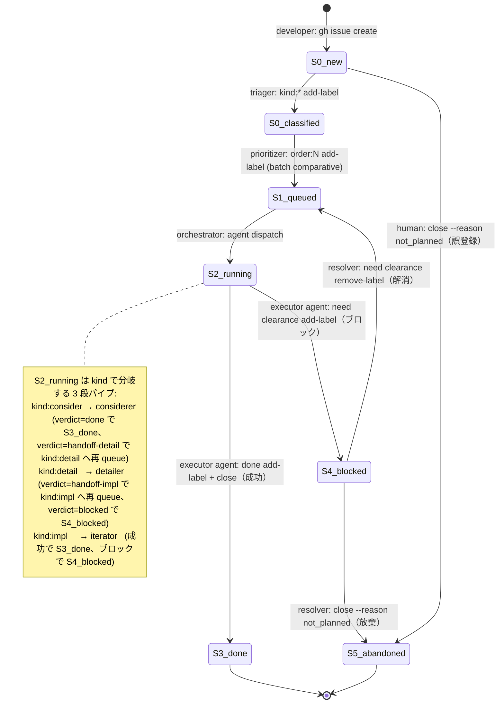
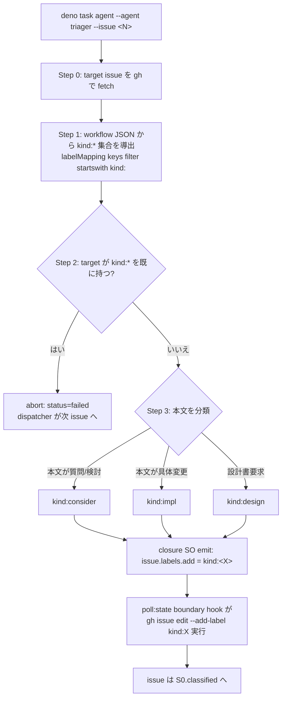
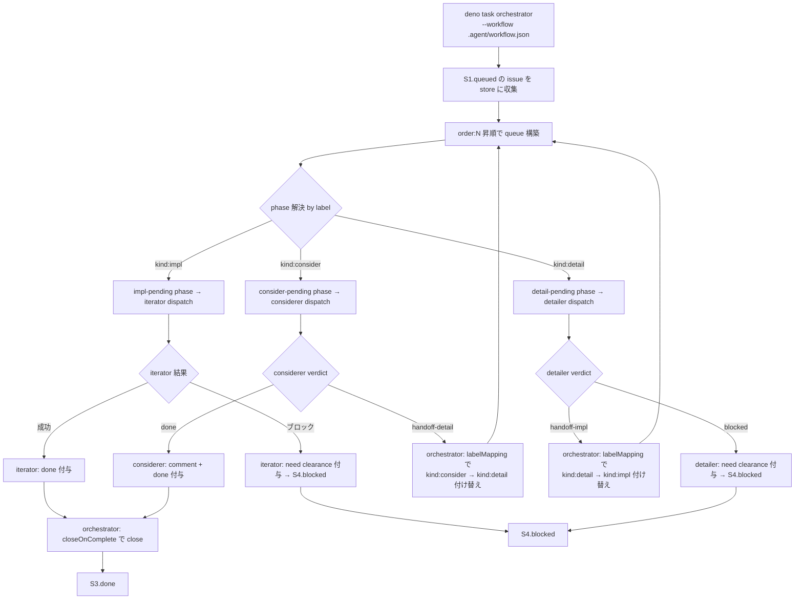

# Issue Workflow — 状態遷移定義

Climpt の 2 段 issue workflow（Triage → Execute）における issue の
**あるべき状態遷移**を定義する。現状の agent 実装に合わせて状態を妥協
するのではなく、**workflow 目的から状態機械を導出し、未実装の遷移は
「実装すべき agent 責務」としてギャップ化**する。

## 設計原則

1. **状態機械は workflow 目的から導出する**。agent の現状機能に状態を
   合わせない。
2. **happy path に human 介入を含めない**。issue は agent だけで
   `open → closed` まで到達しうる設計とする。
3. **例外経路のみ human 介入を許容する**。`blocked` からの復帰、誤登録
   の即時 close 等。
4. **遷移 1 本につき責務主体は 1 つ**。複数 agent に跨る遷移は
   設計上の欠陥とみなす。

## あるべき状態一覧

| State | ラベル条件 | 状態(open/closed) | 意味 |
|---|---|---|---|
| `S0.new`         | `kind:*` なし（非 workflow ラベル混在は可）| open | 登録直後または未分類。triager の入力 |
| `S0.classified`  | `kind:*` あり, `order:N` なし          | open | triager 分類済み・優先度未付与。prioritizer の入力 |
| `S1.queued`      | `kind:*` + `order:N`                  | open | 分類・優先度付け済み。orchestrator dispatch 待ち |
| `S2.running`  | `kind:*` + `order:N`                  | open   | agent 実行中（観測外の瞬間） |
| `S3.done`     | `kind:*` + `order:N` + `done`         | closed | 正常完了 |
| `S4.blocked`  | `kind:*` + `order:N` + `need clearance` | open | 対応不能でブロック中 |
| `S5.abandoned`| `not planned`                         | closed | 放棄・見送り |

**重要**: `S3.done` は必ず `closed` 状態とする。「done 付与だが open のまま」
という宙ぶらりん状態は **設計上認めない**。

## 状態遷移（あるべき姿）



**"executor agent"** は `kind` に応じて iterator / considerer / detailer を指す。
**"resolver"** はブロック解消・放棄判断を行う主体（現状は human、将来は
専用 agent を用意しうる）。

### S2.running の kind 分岐（3 段パイプライン）

`S2.running` は外形上 1 状態だが、内部的に `kind:*` ラベルで分岐する。
consider → detail → impl の 3 段を辿りうる（途中で終了も可）。

| kind         | 実行 agent | 正常 verdict             | 遷移先                                   |
|--------------|-----------|-------------------------|-----------------------------------------|
| `kind:consider` | considerer | `done`                 | `S3.done`（応答のみで完結）               |
| `kind:consider` | considerer | `handoff-detail`        | `S2.running` with `kind:detail`（仕様化へ） |
| `kind:detail`   | detailer   | `handoff-impl`          | `S2.running` with `kind:impl`（実装へ）    |
| `kind:detail`   | detailer   | `blocked`               | `S4.blocked`                             |
| `kind:impl`     | iterator   | `done` / `blocked`      | `S3.done` / `S4.blocked`                 |

**ラベル付け替えの主体**: kind ラベルの付け替え（`kind:consider` →
`kind:detail`、`kind:detail` → `kind:impl`）は workflow.json の
`labelMapping` に基づき orchestrator が verdict を受けて実施する。
agent 自身は `gh issue edit` を呼ばない。`order:N` は保持されるため
triager の再採番は不要。

## 遷移ごとの責務主体

| 遷移 | 責務主体 | 責務 | 現状 |
|---|---|---|---|
| `S0 → S0.classified` | **triager** | 分類 (`kind:*` 付与) | ✅ 実装済み |
| `S0.classified → S1` | **prioritizer**（未実装）| 優先度付与 (`order:N` 付与、batch 比較) | ⚠️ **ギャップあり**（下記 G-PRIORITIZER）|
| `S1 → S2` | **orchestrator** | label 解決 + dispatch | ✅ 実装済み |
| `S2 → S3` (kind:impl) 実装部分     | **iterator**     | 実装 + `done` 付与 | ✅ 実装済み |
| `S2 → S3` (kind:consider, verdict=done) 応答部分 | **considerer**   | comment 投稿 + `done` 付与 | ✅ 実装済み |
| `S2(kind:consider) → S2(kind:detail)` エスカレーション | **considerer** + **orchestrator** | considerer: verdict=handoff-detail 返却／orchestrator: labelMapping で `kind:consider` 除去 + `kind:detail` 付与 | 🆕 新規（detailer 導入） |
| `S2 → S3` (kind:detail) 仕様化部分 | **detailer**     | 実装仕様 comment 投稿（コード変更なし） | 🆕 新規 |
| `S2(kind:detail) → S2(kind:impl)` 引き継ぎ | **detailer** + **orchestrator** | detailer: verdict=handoff-impl 返却／orchestrator: labelMapping で `kind:detail` 除去 + `kind:impl` 付与 | 🆕 新規 |
| `S2 → S3` close 部分（全 kind 共通）| **orchestrator** | `closeOnComplete: true` による close（handoff verdict 時は close しない） | ✅ 実装済み（workflow.json）|
| `S2 → S4` | executor agent | need clearance 付与 | ✅ iterator 実装済み／🆕 detailer は blocked verdict で等価動作／considerer は非該当 |
| `S4 → S1` | **resolver agent**（未実装）| clearance 判定 | ⚠️ **ギャップあり**（下記 G-RESOLVER） |
| `S4 → S5` | **resolver agent**（未実装）| 放棄判断 | ⚠️ **ギャップあり**（下記 G-RESOLVER） |
| `S0 → S5` | human | 誤登録即 close | ✅（例外経路、agent 不要） |

**close 責務の集約**: `S2 → S3` の close は全 kind で orchestrator に集約した。
executor agent (iterator/considerer) は `done` 付与までが責務であり、
**自身では `gh issue close` を呼ばない**。これにより遷移 1 本につき責務
主体 1 つの原則を満たす。

## 実装ギャップ

### G-PRIORITIZER: prioritizer agent を triager から分離（未解消）

**Status**: ⚠️ 未解消（2026-04-25 起票）

**問題**: commit `0171945` の triager per-issue 化により、`order:N` の
割当が **比較ベースの優先度付け** から **arrival-order serial allocation**
に退化した。triager は `--issue <N>` で 1 件しか見ないので、
"smallest unused order:N" を gh から拾うだけで「この issue は他より
重要」という比較判断は行われない。

**契約のズレ**:
- `agents/orchestrator/prioritizer.ts:Prioritizer.run` は **batch 契約**
  （`issue-list.json` 全件 → `priorities.json` で全件マッピング）
- `workflow.json#prioritizer.agent` は本来この batch 契約を満たす agent
  を指す。当初 `"triager"` を指していたが、triager は per-issue 化で
  契約を満たせなくなった
- 2026-04-25 にこの矛盾を解消する第 1 段として `prioritizer.agent`
  を `"prioritizer"` にリネーム（agent 本体は未実装）

**新責務分離**:

| Agent | 入力 | 決定 | カードINALITY |
|---|---|---|---|
| triager | 1 issue | classification (`kind:*`) | per-issue |
| prioritizer | kind-labeled 全候補 | priority (`order:N`) | batch |

**解決経路**: `.agent/prioritizer/` を新設し、`Prioritizer.run` が期待
する batch 契約（`issue-list.json` を読み、`priorities.json` を書く）を
満たす agent を実装する。orchestrator の `--prioritize` モード
(`agents/orchestrator/batch-runner.ts:142-187`) は既にこの契約を呼ぶ
構造になっているので、agent 本体の追加だけで結線する。

**運用上の暫定**: prioritizer 未実装の間、`order:N` は人手付与か
`triage-recovery` で迂回する。`deno task orchestrator --prioritize` は
prioritizer agent が見つからずエラー終了する（これは仕様通りの fail-fast）。

### G-ITER-CLOSE: close 責務を orchestrator に集約（解消済み）

**あるべき姿**: `S2 → S3.done` の close は executor agent ごとに重複
定義せず、単一主体（orchestrator）に集約する。

**過去の現状**: iterator は `done` 付与のみで close しない既存仕様。
considerer は自前で close を呼ぶ prompt になっていた。close 主体が
agent ごとに分岐し、責務 1 本 = 主体 1 つ原則に反していた。

**採用した対応（A）**:

`workflow.json` の iterator / considerer 両方に
`"closeOnComplete": true` を指定。orchestrator が terminal phase `done`
への遷移時に `gh issue close` を実行する。considerer prompt からは
`gh issue close` 呼び出しを除去し、orchestrator との二重 close を防止。

```json
"iterator":  { ..., "closeOnComplete": true },
"considerer": { ..., "closeOnComplete": true }
```

**影響範囲**: この workflow のみ。iterator agent 本体は無変更のため、
reviewer を挟む将来の workflow では別 workflow JSON で `closeOnComplete`
を外すだけで既存挙動に戻せる。

### G-RESOLVER: `S4.blocked` 解消・放棄判断（解消済み — clarifier 導入）

**Status**: ✅ 解消 (2026-04-19, clarifier agent 導入)

**解決経路** (`S4 → S1`):
- orchestrator が `blocked` phase (actionable, priority 4) の issue を
  拾い、clarifier agent を per-issue で dispatch (`--issue <N>`)
- clarifier は body + all comments のみを入力に Gate 0 + 5-gate rubric
  (Alignment / State machine / Scope / Acceptance / Dependency) を評価
- verdict (`ready-to-impl` | `ready-to-consider` | `still-blocked`) を
  structured output に emit + `## Clarifier verdict: ...` comment を
  1 件投稿 (comment-only — C3, body も label も一切触らない)
- orchestrator が verdict を読み、`outputPhases` 経由で phase 遷移を
  計算、`computeLabelChanges()` で label 変更を TransactionScope saga
  内で適用
- `order:N` は一切触らない — prioritizer 単一責務 (C2)

**放棄経路** (`S4 → S5`): human 責務のまま。clarifier は close を呼ばず
(`BOUNDARY_BASH_PATTERNS` + tool-policy で `gh issue close/edit/api` を
物理的に block)、`kind:consider` ルートに振り分けた場合も close の主体は
常に orchestrator (`closeOnComplete: true` on `done` phase) が単独で行う。

**依存**: `.agent/clarifier/` (v3, orchestrator-dispatched per-issue),
`.agent/workflow.json` の `blocked` phase (actionable, agent=clarifier),
design SoT = `tmp/clearance-workflow/active/clarifier-design.md` (v3).

## Triage ステージ（詳細）

triager は `S0.new → S0.classified` のみを担当する。`order:N` の付与は
prioritizer が `S0.classified → S1.queued` で行う（G-PRIORITIZER 参照）。



**triage 対象判定**: 「`kind:*` ラベルを 1 つも持たない open issue」。
`enhancement` / `bug` / `documentation` 等の非 workflow ラベルや、
`order:*` / `done` / `need clearance` だけが付いた issue も対象（triager
は `kind:*` 付与のみを所有するため、それ以外の workflow ラベルの有無は
eligibility に影響しない）。`kind:*` 集合は `--workflow` で指定された
JSON から動的に導出し、ハードコードしない。

**fan-out**: 複数 issue を一括処理する場合は
`.agent/triager/script/dispatch.sh` を使う。`PROJECT=<owner>/<number>`
で project スコープ可能。

## Execute ステージ（詳細）

orchestrator は `S1.queued → S2.running → S3.done|S4.blocked` を駆動する。



**3 段パイプの特徴**:

- 1 つの issue が `kind:consider → kind:detail → kind:impl` と再 queue
  されても **同じ `order:N` を保持**するため prioritizer を再走させる必要はない。
- `handoff-*` verdict では orchestrator は `closeOnComplete` を発火せず、
  **ラベル付け替えのみ**行う。close が走るのは `done` verdict または
  `blocked` 解消時の `resolver` 経由のみ。
- detailer の出力は **issue comment の実装仕様書**（変更ファイル・関数・
  方針・受入条件）であり、**コード変更は行わない**。コード変更は次段の
  iterator が担当する。

## エージェント責務マトリクス

| 責務 | triager | prioritizer | iterator | considerer | detailer | resolver | orchestrator |
|---|:---:|:---:|:---:|:---:|:---:|:---:|:---:|
| ラベル taxonomy bootstrap | × | × | × | × | × | × | ○ |
| `kind:*` 付与 | ○ | × | × | × | × | × | × |
| `order:N` 付与 | × | ○ | × | × | × | × | × |
| コード/ドキュメント変更 | × | × | ○ | × | × | × | × |
| issue コメント投稿（質問への応答） | × | × | × | ○ | × | × | × |
| issue コメント投稿（実装仕様書） | × | × | × | × | ○ | × | × |
| verdict: `handoff-detail` 返却 | × | × | × | ○ | × | × | × |
| verdict: `handoff-impl` 返却 | × | × | × | × | ○ | × | × |
| `kind:*` 付け替え（handoff 時） | × | × | × | × | × | × | ○ |
| `done` ラベル付与 | × | × | ○ | ○ | × | × | × |
| `need clearance` 付与 | × | × | ○ | × | ○ | × | × |
| `need clearance` 除去 | × | × | × | × | × | ○ | × |
| 成功時 `gh issue close` | × | × | × | × | × | × | ○ |
| 放棄時 `gh issue close` | × | × | × | × | × | ○ | × |
| agent dispatch | × | × | × | × | × | × | ○ |
| phase 遷移 | × | × | × | × | × | × | ○ |

**○ (prioritizer)**: prioritizer agent は未実装。G-PRIORITIZER 参照。
**○ (resolver)**: resolver agent は未実装。G-RESOLVER 参照。
**ラベル taxonomy bootstrap**: orchestrator の preflight label sync
(`agents/orchestrator/batch-runner.ts:124`) が `workflow.json#labels` 宣言
から冪等に reconcile する。triager は taxonomy 管理を担わない。

**detailer の責務境界**:
- 入力: issue body + considerer が投稿したコメント（考察結果）
- 出力: 実装仕様の comment（変更対象ファイル・関数・方針・受入条件）
- verdict: `handoff-impl`（仕様化完了、iterator へ）/ `blocked`（仕様化不能）
- **コード変更は行わない**。`done` も付与しない（done は iterator 経由で付く）。

成功時 close は orchestrator が `closeOnComplete: true` で集約実行する。
executor agent (iterator/considerer/detailer) は `done` 付与または verdict
返却までが責務。

## Order seq の消費と解放

`order:N` は seq 1..9 のユニーク識別子。**prioritizer** が使用中集合を
踏まえて kind-labeled issue 群を比較し、batch で割当てる。prioritizer
が使用中集合を算出するクエリ：

```bash
gh issue list --state open --search "-label:done" --json labels \
  | jq -r '.[].labels[].name' \
  | grep -E "^order:[1-9]$" | sort -u
```

| issue の状態 | seq 占有 |
|---|---|
| `S0.classified` (open, kind あり / order なし) | × |
| `S1.queued` (open)        | ○ |
| `S2.running` (open)       | ○ |
| `S3.done` (closed)        | × |
| `S4.blocked` (open)       | ○ |
| `S5.abandoned` (closed)   | × |

**G-ITER-CLOSE 対応前は** `S3.done` 相当だが open のままの issue が
存在しうるため、prioritizer は `-label:done` で除外することで seq を
解放する。G-ITER-CLOSE 対応後は closed 状態で自然に除外されるため、
このフィルタは保険として機能する。

### Order の consumer / non-consumer

| agent | order:N を読む | order:N を発行・更新 |
|-------|:---:|:---:|
| triager    | × | × |
| prioritizer | ○（使用中集合を確認） | ○（採番は prioritizer のみ） |
| orchestrator | ○（昇順 queue 構築用） | × |
| considerer | ○（自身の issue を識別） | × |
| detailer   | ○（自身の issue を識別） | × |
| iterator   | ○（自身の issue を識別） | × |

**重要**: `kind:consider → kind:detail → kind:impl` の 3 段遷移で `order:N`
は **保持される**。detailer も iterator 同様、order を読むだけで消費・
再採番はしない。これにより 1 issue が 3 段を辿っても seq capacity を
1 枠しか占有しない。

## close 理由コード規約

`gh issue close --reason` の使い分け:

| 遷移 | `--reason` | 主体 |
|---|---|---|
| `S2 → S3.done` (kind:impl / kind:consider) | `completed` | orchestrator (`closeOnComplete`) |
| `S4 → S5.abandoned`            | `not_planned` | resolver / human |
| `S0 → S5.abandoned` (誤登録)   | `not_planned` | human |

**注**: orchestrator の `closeOnComplete` は内部的に
`gh issue close` を呼ぶ。現時点では `--reason` を明示指定しておらず、
GH 側のデフォルト扱いになる。明示的に `completed` を指定したい場合は
`agents/orchestrator/github-client.ts` の close 呼び出しを確認・拡張
する必要がある（本 workflow 固有の要求）。

## 境界条件と既知の制約

### C1. prioritizer の並行実行不可

排他制御を持たないため、2 並列で走らせると同一 `order:N` を複数 issue に
割り当てる可能性がある。**単一実行前提**。triager は classify-only で
グローバル状態を触らないので並列でも問題ない（per-issue dispatch）。

### C2. seq capacity 満了

9 件すべて占有されると prioritizer は新規 kind-labeled issue に seq を
振れず停止する。`done` 付与済み open issue は prioritizer 側クエリで
除外されるため占有しない。G-ITER-CLOSE 対応後は closed が即解放となる。

### C3. 考察完了後の仕様化フェーズを `kind:detail` として可視化（解消済み）

**旧症状**: considerer が「これは実装すべき」と判断しても自動で
`kind:consider → kind:impl` に付け替える機構がなく、human が label を
手動で張り替えるか triager を再実行する運用になっていた。結果として
「考察は終わったが実装は始まっていない」中間状態が **ラベル上に表現
されず**、進捗可視化と担当分界が曖昧だった。

**原因**: 考察（質問への回答）と実装仕様化（変更ファイル・関数・方針・
受入条件の明文化）を considerer 1 agent に同居させていたため、
considerer の責務が「応答 + close」か「応答 + エスカレーション」かで
分岐し、label 操作主体が不明瞭だった。

**解決策（detailer agent 導入）**:

1. 中間ラベル `kind:detail` を新設し、仕様化待ちフェーズを可視化。
2. 新 agent **detailer** を挿入し、issue body + considerer コメントを
   入力として **実装仕様コメント**（コード変更なし）を投稿する責務を
   担わせる。
3. considerer の verdict を `{done, handoff-detail}` に、detailer の
   verdict を `{handoff-impl, blocked}` に拡張。label 付け替えは
   orchestrator が `labelMapping` で一元実施（agent は verdict 返却のみ）。
4. これにより 3 段フロー `kind:consider → kind:detail → kind:impl` が
   全自動で流れ、`S4.blocked` や `done` 以外で human 介入は不要。

C3 は detailer 導入によって **ギャップではなく実装済み仕様**に格上げ
された。本節は歴史的記録として残す。

### C4. closed → reopen 時は再 triage 対象外

reopen された issue は既存ラベルが残るため `search:no:label` にヒット
しない。完全再 triage したい場合は human が kind/order/done を除去して
から reopen する。

## 関連ファイル

- `.agent/triager/` — triager agent 定義・prompt（classify-only）
- `.agent/triager/README.md` — triager の責務と prioritizer との分担
- `.agent/prioritizer/` — prioritizer agent 定義（**未実装**、G-PRIORITIZER 参照）
- `.agent/considerer/` — considerer agent 定義・prompt（verdict: `done` | `handoff-detail`）
- `.agent/detailer/` — detailer agent 定義・prompt（verdict: `handoff-impl` | `blocked`）
- `.agent/iterator/` — iterator agent 定義（既存、再利用）
- `.agent/workflow.json` — execute ステージの workflow 定義（`detail-pending` phase + `labelMapping` による kind 付け替え、`prioritizer.agent: prioritizer`）
- `.agent/CLAUDE.md` — 運用手順（コマンド例）
- `agents/orchestrator/workflow-schema.json` — workflow 定義の JSON Schema
