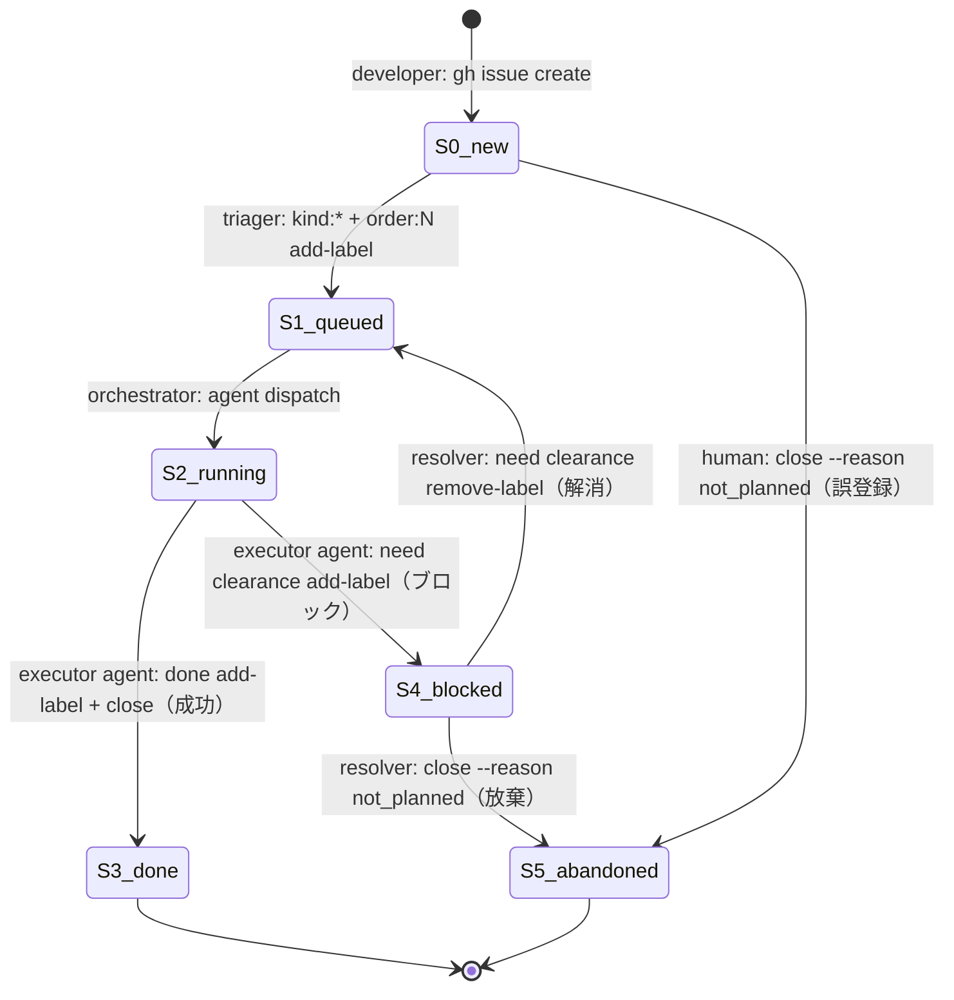
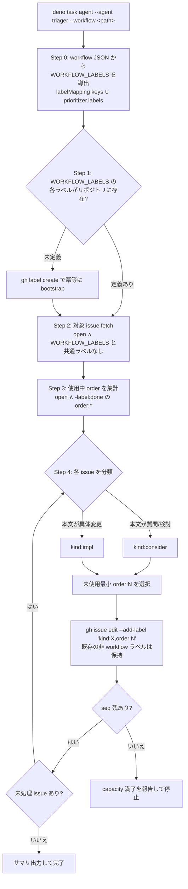
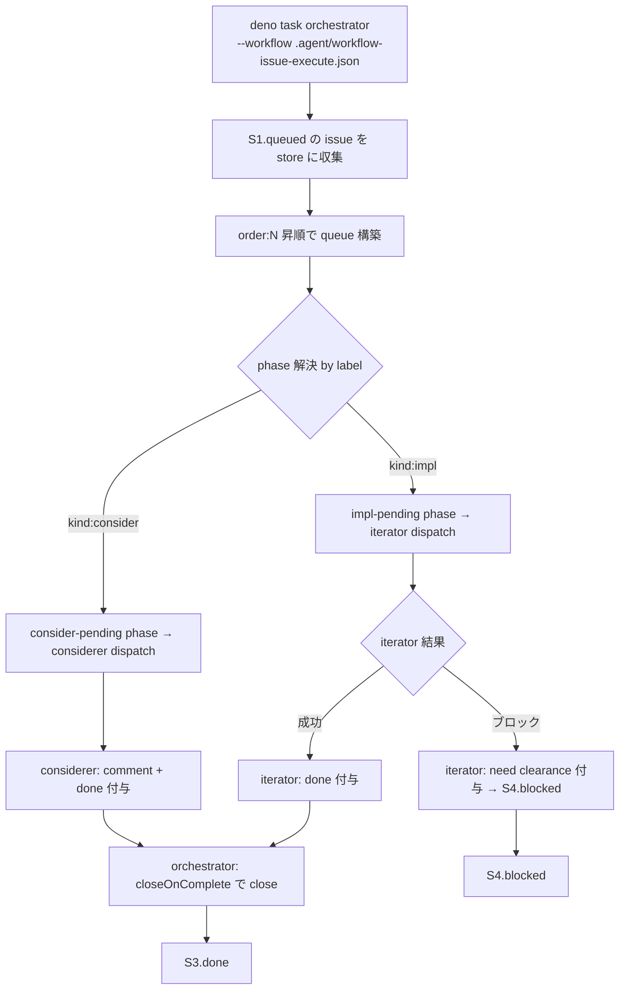

# Issue Workflow — 状態遷移定義

Climpt の 2 段 issue workflow（Triage → Execute）における issue の
**あるべき状態遷移**を定義する。現状の agent 実装に合わせて状態を妥協
するのではなく、**workflow 目的から状態機械を導出し、未実装の遷移は
「実装すべき agent 責務」としてギャップ化**する。

## 設計原則

1. **状態機械は workflow 目的から導出する**。agent の現状機能に状態を
   合わせない。
2. **happy path に human 介入を含めない**。issue は agent だけで
   `open → closed` まで到達しうる設計とする。
3. **例外経路のみ human 介入を許容する**。`blocked` からの復帰、誤登録
   の即時 close 等。
4. **遷移 1 本につき責務主体は 1 つ**。複数 agent に跨る遷移は
   設計上の欠陥とみなす。

## あるべき状態一覧

| State | ラベル条件 | 状態(open/closed) | 意味 |
|---|---|---|---|
| `S0.new`      | workflow ラベルなし（非 workflow ラベル混在は可）| open | 登録直後または未 triage。triager の入力 |
| `S1.queued`   | `kind:*` + `order:N`                  | open   | 分類・優先度付け済み。dispatch 待ち |
| `S2.running`  | `kind:*` + `order:N`                  | open   | agent 実行中（観測外の瞬間） |
| `S3.done`     | `kind:*` + `order:N` + `done`         | closed | 正常完了 |
| `S4.blocked`  | `kind:*` + `order:N` + `need clearance` | open | 対応不能でブロック中 |
| `S5.abandoned`| `not planned`                         | closed | 放棄・見送り |

**重要**: `S3.done` は必ず `closed` 状態とする。「done 付与だが open のまま」
という宙ぶらりん状態は **設計上認めない**。

## 状態遷移（あるべき姿）



**"executor agent"** は `kind` に応じて iterator または considerer を指す。
**"resolver"** はブロック解消・放棄判断を行う主体（現状は human、将来は
専用 agent を用意しうる）。

## 遷移ごとの責務主体

| 遷移 | 責務主体 | 責務 | 現状 |
|---|---|---|---|
| `S0 → S1` | **triager** | 分類 + seq 付与 | ✅ 実装済み |
| `S1 → S2` | **orchestrator** | label 解決 + dispatch | ✅ 実装済み |
| `S2 → S3` (kind:impl) 実装部分     | **iterator**     | 実装 + `done` 付与 | ✅ 実装済み |
| `S2 → S3` (kind:consider) 応答部分 | **considerer**   | comment 投稿 + `done` 付与 | ✅ 実装済み |
| `S2 → S3` close 部分（両 kind 共通）| **orchestrator** | `closeOnComplete: true` による close | ✅ 実装済み（workflow-issue-execute.json）|
| `S2 → S4` | executor agent | need clearance 付与 | ✅ iterator は実装済み、considerer は非該当 |
| `S4 → S1` | **resolver agent**（未実装）| clearance 判定 | ⚠️ **ギャップあり**（下記 G-RESOLVER） |
| `S4 → S5` | **resolver agent**（未実装）| 放棄判断 | ⚠️ **ギャップあり**（下記 G-RESOLVER） |
| `S0 → S5` | human | 誤登録即 close | ✅（例外経路、agent 不要） |

**close 責務の集約**: `S2 → S3` の close は全 kind で orchestrator に集約した。
executor agent (iterator/considerer) は `done` 付与までが責務であり、
**自身では `gh issue close` を呼ばない**。これにより遷移 1 本につき責務
主体 1 つの原則を満たす。

## 実装ギャップ

### G-ITER-CLOSE: close 責務を orchestrator に集約（解消済み）

**あるべき姿**: `S2 → S3.done` の close は executor agent ごとに重複
定義せず、単一主体（orchestrator）に集約する。

**過去の現状**: iterator は `done` 付与のみで close しない既存仕様。
considerer は自前で close を呼ぶ prompt になっていた。close 主体が
agent ごとに分岐し、責務 1 本 = 主体 1 つ原則に反していた。

**採用した対応（A）**:

`workflow-issue-execute.json` の iterator / considerer 両方に
`"closeOnComplete": true` を指定。orchestrator が terminal phase `done`
への遷移時に `gh issue close` を実行する。considerer prompt からは
`gh issue close` 呼び出しを除去し、orchestrator との二重 close を防止。

```json
"iterator":  { ..., "closeOnComplete": true },
"considerer": { ..., "closeOnComplete": true }
```

**影響範囲**: この workflow のみ。iterator agent 本体は無変更のため、
reviewer を挟む将来の workflow では別 workflow JSON で `closeOnComplete`
を外すだけで既存挙動に戻せる。

### G-RESOLVER: ブロック解消・放棄判断 agent 不在

**あるべき姿**: `S4.blocked` からの復帰（`S4 → S1`）と放棄（`S4 → S5`）
は自律で行えるべき。need clearance の原因が修正可能なら clearance 除去
で再 queue、修正不能なら close。

**現状**: 両遷移とも human 責務。`need clearance` label は iterator が
付与するが、除去・判定を行う agent は存在しない。

**対応選択肢**:

| 対応 | 実装内容 | 影響範囲 |
|---|---|---|
| D. **resolver agent 新設** | `need clearance` 付き issue を定期スキャンし、clearance 原因が解消済みか判定、再 queue or close | 新 agent 1 本 + workflow への phase 追加 |
| E. **現状維持（human resolver）**| human が対応 | 追加実装なし |

**推奨**: 当面 **E**（human）で運用し、ブロック頻度が高くなった段階で D
を検討。現時点で優先度低。

## Triage ステージ（詳細）

triager は `S0.new → S1.queued` のみを担当する。



**triage 対象判定**: 「workflow ラベルを 1 つも持たない open issue」。
`enhancement` 等の非 workflow ラベルのみが付いた issue も対象。workflow
ラベル集合は `--workflow` で指定された JSON から動的に導出し、ハード
コードしない。これにより workflow JSON を切り替えれば triager が扱う
ラベル taxonomy も自動で追従する。

## Execute ステージ（詳細）

orchestrator は `S1.queued → S2.running → S3.done|S4.blocked` を駆動する。



## エージェント責務マトリクス

| 責務 | triager | iterator | considerer | resolver | orchestrator |
|---|:---:|:---:|:---:|:---:|:---:|
| ラベル taxonomy bootstrap | ○ | × | × | × | × |
| kind/order ラベル付与 | ○ | × | × | × | × |
| コード/ドキュメント変更 | × | ○ | × | × | × |
| issue コメント投稿 | × | × | ○ | × | × |
| `done` ラベル付与 | × | ○ | ○ | × | × |
| `need clearance` 付与 | × | ○ | × | × | × |
| `need clearance` 除去 | × | × | × | ○ | × |
| 成功時 `gh issue close` | × | × | × | × | ○ |
| 放棄時 `gh issue close` | × | × | × | ○ | × |
| agent dispatch | × | × | × | × | ○ |
| phase 遷移 | × | × | × | × | ○ |

**○ (resolver)**: resolver agent は未実装。G-RESOLVER 参照。

成功時 close は orchestrator が `closeOnComplete: true` で集約実行する。
executor agent (iterator/considerer) は `done` 付与までが責務。

## Order seq の消費と解放

`order:N` は seq 1..9 のユニーク識別子。triager は使用中集合を次のクエリ
で算出する：

```bash
gh issue list --state open --search "-label:done" --json labels \
  | jq -r '.[].labels[].name' \
  | grep -E "^order:[1-9]$" | sort -u
```

| issue の状態 | seq 占有 |
|---|---|
| `S1.queued` (open)        | ○ |
| `S2.running` (open)       | ○ |
| `S3.done` (closed)        | × |
| `S4.blocked` (open)       | ○ |
| `S5.abandoned` (closed)   | × |

**G-ITER-CLOSE 対応前は** `S3.done` 相当だが open のままの issue が
存在しうるため、triager は `-label:done` で除外することで seq を解放する。
G-ITER-CLOSE 対応後は closed 状態で自然に除外されるため、このフィルタは
保険として機能する。

## close 理由コード規約

`gh issue close --reason` の使い分け:

| 遷移 | `--reason` | 主体 |
|---|---|---|
| `S2 → S3.done` (kind:impl / kind:consider) | `completed` | orchestrator (`closeOnComplete`) |
| `S4 → S5.abandoned`            | `not_planned` | resolver / human |
| `S0 → S5.abandoned` (誤登録)   | `not_planned` | human |

**注**: orchestrator の `closeOnComplete` は内部的に
`gh issue close` を呼ぶ。現時点では `--reason` を明示指定しておらず、
GH 側のデフォルト扱いになる。明示的に `completed` を指定したい場合は
`agents/orchestrator/github-client.ts` の close 呼び出しを確認・拡張
する必要がある（本 workflow 固有の要求）。

## 境界条件と既知の制約

### C1. triager の並行実行不可

排他制御を持たないため、2 並列で走らせると同一 `order:N` を複数 issue に
割り当てる可能性がある。**単一実行前提**。

### C2. seq capacity 満了

9 件すべて占有されると triager は新規 issue に seq を振れず停止する。
`done` 付与済み open issue は triager 側クエリで除外されるため占有
しない。G-ITER-CLOSE 対応後は closed が即解放となる。

### C3. considerer → iterator エスカレーションは手動

considerer が「これは実装系」と判断しても自動で label を付け替えない。
応答コメントに明記し、human が `kind:consider` を除去 → triager 再実行。
将来的に resolver 系 agent で自動化可能。

### C4. closed → reopen 時は再 triage 対象外

reopen された issue は既存ラベルが残るため `search:no:label` にヒット
しない。完全再 triage したい場合は human が kind/order/done を除去して
から reopen する。

## 関連ファイル

- `.agent/triager/` — triager agent 定義・prompt
- `.agent/considerer/` — considerer agent 定義・prompt
- `.agent/iterator/` — iterator agent 定義（既存、再利用）
- `.agent/workflow-issue-execute.json` — execute ステージの workflow 定義
- `.agent/CLAUDE.md` — 運用手順（コマンド例）
- `agents/orchestrator/workflow-schema.json` — workflow 定義の JSON Schema
