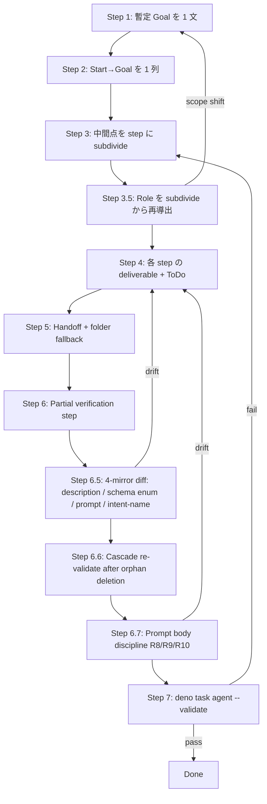

# Agent Step Design

`.agent/<name>/` 配下の新規 agent を設計する skill。Role と goal を一致させ、start から goal までを線形 step に分解し、各 step の中間成果物・handoff・部分検証を定義し、最後に runner の `--validate` で構造整合を検証する。

## When to Use / When NOT to Use

| Use this skill | Skip |
|---|---|
| 新規 agent (`.agent/<name>/`) を立ち上げる | 既存 agent の prompt 文面だけ修正 |
| `steps_registry.json` の step 構成を初めて切る / 大幅に再設計する | 1 step の `uvVariables` 1 個追加など軽微な edit |
| step 数や transitions を増減し flow shape が変わる | workflow.json (`.agent/workflow.json`) の phase graph 設計 (= agent 間遷移は別レイヤ) |
| Handoff field / intermediate deliverable 形を決める | breakdown wrapper / C3L prompt 解決ロジック (`agents/common/prompt-resolver.ts`) |

agent の **archetype 判定** (Single-Step / Multi-Step Linear / Branching+Validator) は [`references/archetypes.md`](references/archetypes.md) を先に開く。本 skill は archetype を入力として受け取り、step 内部設計に集中する。

## Decision Rules (絶対)

| # | Rule | 違反時の症状 |
|---|------|--------------|
| R1 | **Role == Goal**: agent の役割 = ゴール = 単一目的。1 agent に 2 目的を持たせない | step 内で intent が際限なく増え、prompt が IF-THEN ルーティングに腐る |
| R2 | **Linear only**: step 列は単線。分岐させたい時は別 agent にする (workflow.json で phase 分割) | gate transitions が多 target に膨れ、failure 経路の検証が指数化 |
| R3 | **Length is fine**: 線形が長くなることは許容。短くするために責務を混ぜない | 1 step が「scan + verify + emit」を兼任、中間成果物が消失 |
| R4 | **Start condition explicit**: 初期 step は前提 (ラベル / 入力 UV / artifact) を `description` と prompt 冒頭で明示し、未充足を検知して fail-fast する | 上流が壊れた時に silent に進行し、結果が空のまま closing |
| R5 | **4-mirror invariant**: 1 step の `description` 文 / `outputSchemaRef` の enum / prompt の verdict 列挙 / `transitions` の intent name は同一 role の 4 つの鏡。1 つを変えたら 4 つ全てを書き換え手で diff する。`--validate` は prose も intent-name semantics も部分的にしか読まないので silent drift する | description に旧 enum / 役割外の動詞が残り、schema と乖離。runtime まで気付かない |
| R6 | **Intent-name semantics**: transition の intent 名 (`next` / `repeat` / `handoff` / `closing` / `jump` / `escalate`) は framework の StepKind boundary contract。`work.next → {work, verification}`、`work.handoff → closure のみ`、`verification.next → {verification, closure}` 等。intent の選択は target step の `kind` に従う。`work` から `verification` への前進は **`next`** であり、`handoff` ではない | rule 表は §StepKind Boundary Rules。誤った intent 名を選ぶと `--validate` Flow check が fail するが、その時点で「validator-side fix が必要」と即断しないこと |
| R7 | **Reachability**: `steps_registry.json#steps` の全 stepId が `entryStepMapping` から到達可能。orphan step は `--validate` Flow check で fail するが、design-time に Phase 3.5 / 6.5 で目視確認する (validate 任せにしない) | orphan を残したまま role を「subdivide した step 列」から再導出すると、削除すべき責務が role に紛れ込む |
| R8 | **Linear prompt with bounded scope (split trigger)**: 各 step prompt は次の 3 条件を満たす — (1) **線形** — Action 内に if/else / case 分岐を持たない単線手順、(2) **start/end が明瞭** — `## Inputs (handoff)` (start checklist: 受領 artifact) と `## Outputs (intermediate artifacts)` + `## Verdict` (end checklist: emit artifact、`next` 条件 / `repeat` 条件を 1 bit ずつ宣言) を専用 section で declarative に書く、(3) **scope が必ず到達可能** — Action が宣言する作業は 1 回の execution で完了でき、open-ended な探索を含まない。**(1)–(3) のいずれかを超える prompt は step を分割する** (R8 = split trigger)。verdict 条件を `## Do ONLY this` の guard 行や手順 prose に押し込まない。kind:work prompt は形が異なってもよいが、handoff inputs (start) と allowed `next_action.action` 値 + 条件 (end) を必ず discoverable な section に置き、scope は work loop 1 iteration で完結する粒度に保つ | (1) 違反: prompt 内に branching が混入し R2 (graph linearity) が prompt level で崩れる。(2) 違反: start・end が prose に埋没し reader が verdict 条件を読めない (R5 4-mirror は intent **名**の整合だけで verdict **条件**の drift は silent に通る)。(3) 違反: scope が open-ended で `repeat` が livelock する。いずれも step 細分化で解消する |
| R9 | **Repeat-iteration convergence**: `repeat` を emit しうる prompt は収束保証を持つ。(a) Action が idempotent (kind:verification 標準) で同入力が同 verdict に収束する、または (b) prompt が retry context を明示的に参照する (`completed_iterations` UV / `iteration_count` / TodoWrite による進捗 anchoring 等)。orchestrator は `repeat` で同 prompt を同 edition で再走するため、open-ended な kind:work prompt は livelock 余地を持つ | kind:work step が retry-aware framing 無しで `repeat` を許可。同 prompt が同 input で再入し、外部状態の変化が無ければ無限再入 |
| R10 | **Adaptation prompt diff necessity**: 各 `f_failed_<adaptation>.md` は同 step の `f_default.md` (または `f_<edition>.md`) と意味的に異なる。Inputs (handoff carry-through) は同じ、Action (failure-specific 是正指示) は異なる、Outputs schema は同じ、Verdict semantics は異なってよい。frontmatter だけ差し替えた byte-near-identical adaptation は禁止 | failurePattern → adaptation mapping が path 切替えのみで LLM directive に変化が無い。validator の failureMode が path churn を起こすが LLM 行動は変わらず、失敗 loop が解消しない |

R2 の根拠: 1 directory = 1 agent = 1 purpose という per-agent convention (`.agent/CLAUDE.md`) と、validator 化 (= 多分岐) は **agent 単位** で行うべきという責務分離原則。本 skill では「分岐は agent を分けて workflow.json で繋ぐ」と扱う。

R5 の根拠: registry の `description` 文は free comment ではなく **role 宣言の text 鏡**。schema enum を変えたら description / prompt の verdict 列挙も同期させないと、reader が registry を読んだ時に「description は X、enum は Y」のどちらが authoritative か判定できない。`--validate` の 13 check (§Validation) は schema / cross-reference / path / handoff の構造整合のみ見て、prose 内容は読まない。

R6 の根拠: framework (`agents/config/flow-validator.ts` の `BOUNDARY_RULES`) は intent 名ごとに許可される target.kind を固定する。例: `work.handoff` は closure 専用。registry 側で `transitions.handoff.target` を verification step に向けると Flow check で fail する。intent 名は単なるラベルではなく **target.kind との契約**なので、§StepKind Boundary Rules を rule book として開いた上で選ぶ。

## Process Flow

Role 定義は **step subdivide の出力** で確定する。Phase 1 は暫定 goal を立てるだけで、subdivide した step 列に名前を付け直すことで「この agent の role scope」が見える。`.agent/CLAUDE.md` の per-agent purpose 文は input の 1 つだが **絶対ではなく書き換え対象**。enumeration が source of truth。



| Phase | 入力 | 出力 | 失敗の見え方 |
|-------|------|------|--------------|
| 1. 暫定 Goal | 要件 + 既存 purpose 文 (`.agent/CLAUDE.md` 等の input、絶対ではない) | 暫定 1 文 (`<agent> の役割は <goal> である`) | 「と」「および」が含まれていたら R1 違反。Phase 3.5 で再導出するため確定ではない |
| 2. Linear path | 暫定 Goal | start step → ... → terminal step の列 | 矢印が分岐する → 別 agent へ切り出す (R2) |
| 3. Subdivide | 線形列 | step ID 列 (各 step は 1 deliverable) | 1 step が複数 deliverable を出す → 分割 |
| **3.5. Role 再導出** | subdivide した step 列 のうち **`entryStepMapping` の各 entry から到達可能なもの** | **scope 文 (= 役割境界)** + 「この agent が扱わない作業」negative list | step 列に含まれない動詞 (例: `assign order:N`) が暫定 Goal に残っている → Goal を絞るか、step を増やすか判断。orphan step を含めると role に dead code の責務が紛れ込む (R7) ので、reachability を先に確認する。`.agent/CLAUDE.md` purpose 表と diff し drift があれば table 側 / agent 側どちらを直すかを明示的に decide |
| 4. Deliverable + ToDo | step ID 列 + 確定 Role | step ごとの `description` / `outputSchemaRef` / ToDo 一覧 | deliverable 名と step stem (`c3` + edition) が揃っていない。`description` 文に Phase 3.5 の negative list 動詞が混入 → R5 違反 |
| 5. Handoff design | step ごとの deliverable | `structuredGate.handoffFields` 列 + folder layout (`.agent/climpt/tmp/.../<step-stem>/`) | handoff field に空配列、または folder 名が step stem と乖離 |
| 6. Partial verification | step 列 | 検証 step (例: `verify-design-only`, `verify-impl-only`) | system 全体検証の 1 step に集約されている → R3 違反 (混在) |
| **6.5. 4-mirror diff** | step ごとの `description` / `outputSchemaRef` enum / prompt 内 verdict 列挙 / `transitions` の intent name | 1 step ごとに 4 mirror が同一 role を語ることを目視確認。intent name は §StepKind Boundary Rules と target.kind の対応を確認 | description に旧 enum 残存、prompt と schema が同期しているのに description だけ drift → R5 違反。intent name と target.kind が R6 違反 (例: `work.handoff` の target が `verification`)。`--validate` は prose を部分的にしか読まないため Phase 7 で完全には捕まらない |
| **6.6. Cascade re-validate** | orphan / 未使用 step を削除した直後 | `--validate` を再実行し、削除によって UV supplier / handoff source を失った step が無いか確認 | 大量削除を 1 commit で済ませると UV reachability 違反が後段で発生する。leaf-first で削除し、各 layer 後に再 validate する |
| **6.7. Prompt body discipline (split trigger audit)** | 各 step prompt (`prompts/steps/<c2>/<c3>/f_<edition>[_<adaptation>].md`) | R8 audit (= step 分割の最終判定): (1) **線形** — Action に if/else / case 分岐が無いか、(2) **start/end 明瞭** — `## Inputs (handoff)` / `## Outputs (intermediate artifacts)` / `## Verdict` の専用 section が存在し verdict 条件が `## Verdict` で declarative (guard 行に埋没していない)、(3) **到達可能 scope** — Action が 1 execution で完了し open-ended な探索を含まない。**いずれか違反 → 該当 step を分割**する。R9 (repeat convergence) / R10 (adaptation diff) は補助 audit として同 phase で実行 | R8 違反: branching が prompt body に表面化 / verdict が `## Do ONLY this` に圧縮 / scope が open-ended — 当該 step を 2 つ以上に分割。R9 違反: kind:work step が `repeat` 許可かつ retry context 参照無し → livelock。R10 違反: failurePattern 経由で adaptation prompt に切り替わるが LLM directive が変わらず、failure loop が解消しない |
| 7. Validate | 完成した `steps_registry.json` | `Validation passed.` | 下記 §Validation 節 |

step record / `structuredGate` / C3LAddress (5-tuple) の field 定義は [`references/registry-shape.md`](references/registry-shape.md) を参照。

## Intermediate Deliverable Contract

各 step は **1 つの中間成果物** を出す。形は次の 2 路で運ばれる:

| Channel | 媒体 | いつ使う | 制約 |
|---------|------|----------|------|
| Handoff (primary) | `structuredGate.handoffFields` で宣言した structured output の subtree | 後続 step が *必ず* 必要とする情報 | schema validation を通る (`outputSchemaRef`) |
| Folder (fallback) | `.agent/climpt/tmp/.../{step-stem}/` 配下のファイル | handoff に乗せると重い、または後続 step が *条件付きで掘り下げる* 場合 | folder 名 = step stem (`{c3}` または `{c3}.{edition}`) |

`.agent/CLAUDE.md` の directory layout convention により:

- shared なドロップ場所は `.agent/climpt/` 配下のみ。`.agent/<agent>/tmp/` を勝手に作らない
- folder 名 = step stem。step を rename したら folder 名も同期する (registry validation の path check が捕まえる)

**設計の決め手**:

1. 後続 step が「必ず」読むなら handoff
2. 「探索的に必要なら掘る」なら folder fallback
3. 両方に同じ情報を duplicate しない (drift の温床)

## Partial Verification Steps

Verification step は **scope を限定** して挿入する。設計のみ検証 / 実装のみ検証 / artifact 単位の検証を、それぞれ独立 step に分ける (R3)。

| Verification の粒度 | 例 | 配置 |
|----------------------|-----|------|
| Per-deliverable | `verify-doc-paths` (doc-scan の出力だけを検証) | 該当 step の直後 |
| Per-artifact-class | `verify-design`, `verify-impl` | 関連 step 群の末尾 |
| End-of-flow | `closure` (全成果物を集約して closing intent を emit) | terminal step |

System 全体を 1 つの verification step に詰め込まない: 失敗時に「どの deliverable が壊れたか」を localize できなくなる。`.agent/considerer/steps_registry.json` の `doc-scan → doc-verify → doc-evidence → consider` 列が partial verification の実例 (各 step が 1 軸の検証を担う)。

## 4-Mirror Invariant (R5 + R6 の applier-driven check)

`--validate` は registry の prose (description / 自由文) を読まず、intent-name semantics は `--validate` Flow check 経由で部分的にしか出ない。drift は applier が手で diff する必要がある。1 step ごとに次の **4 つの鏡が同じ role を語っているか** を目視確認する:

> **Scope note (R5 ↔ R8)**: 本節の 4-mirror diff は intent **名** が 4 鏡で揃っているかを check する (R5)。一方、各 prompt body 内で verdict **条件** (どの状態で `next` を emit、どの状態で `repeat` を emit するか) が dedicated `## Verdict` section に明示されているかは別の concern であり、R8 (Prompt checklist discipline) で扱う。R5 は名前の整合、R8 は条件の可視性 — 両方が pass して初めて prompt と registry が同じ役割を語る。

| Mirror | 場所 | 何を語る |
|--------|------|----------|
| (a) Schema enum | `outputSchemaRef` が指す JSON Schema の `enum` | runtime が emit を許す verdict 集合 |
| (b) Prompt verdict 列挙 | step 用 C3L prompt (`prompts/steps/<c2>/<c3>/f_<edition>.md`) 内の verdict 列挙 / heuristics 表 | LLM に提示される verdict 集合 |
| (c) Step description | `steps_registry.json` の step record の `description` 文字列 | reader が registry を読んだ時に見る role 説明 |
| (d) Transitions の intent name ↔ target.kind | `steps_registry.json` の `transitions` map と target step の `kind` | framework の §StepKind Boundary Rules contract |

**Diff 手順** (Phase 6.5):

1. 各 step について (a) (b) (c) を並べ、verdict 集合が完全一致するか確認する
2. 一致しなければ 3 つ全てを Phase 3.5 で確定した role 表現に揃える (一方だけ更新しない)
3. (c) に **step が扱わない動詞** (= Phase 3.5 で出した negative list の語) が混入していないか確認する。例: triager は分類のみ → description に "pick smallest unused order:N" が入っていれば R5 違反
4. (d) の intent name (`next` / `repeat` / `handoff` / `closing` / `jump` / `escalate`) が target step の `kind` と §StepKind Boundary Rules の表で許容される組み合わせか確認する。例: `work.handoff` の target が `verification` 以下になっていれば R6 違反 — `next` にリネームし allowedIntents / schema enum / prompt も同期させる

**典型的な silent drift パターン**:

- schema enum を変更したが description が旧 enum のまま → reader が `description` を信じると runtime と齟齬
- 別 agent からコピーして作った step record の description が前の agent の役割表現を残している
- prompt 内の verdict heuristics 表は更新したが description は touch しなかった
- `transitions.handoff` の target を verification step に向けたまま (R6 違反)。`--validate` Flow check は捕まえるが、エラー内容を「validator 側の制約」と誤読しがち。intent-name の選び直し (handoff → next) で解消する

これらは `--validate` の Cross-references / Schema check では補足できない (prose vs structured field の比較ではないため)。4-mirror diff が完了するまで Phase 7 (`--validate`) に進まない。

## StepKind Boundary Rules (R6 の rule book)

`agents/config/flow-validator.ts` の `BOUNDARY_RULES` (P2-3) を本 skill の rule book として転記する。intent 名は target step の `kind` との契約。intent 名は単なるラベルではなく **transition の意味** を framework と共有する。

| from.kind    | from.intent | 許可される to.kind         | 意味                                              |
|--------------|-------------|----------------------------|---------------------------------------------------|
| work         | next        | work, verification         | 作業を前進。同じ work loop 内 / 次 phase の verification への突入 |
| work         | repeat      | (self only)                | 同じ work step を再入                              |
| work         | handoff     | **closure のみ**           | work loop を抜けて closure terminal へ直行 (verification は経由しない) |
| verification | next        | verification, closure      | 検証を前進。同じ verification chain 内 / 次 phase の closure への突入 |
| verification | repeat      | (self only)                | 同じ verification step を再入                       |
| closure      | closing     | null (terminal)            | terminate                                         |
| closure      | repeat      | (self only)                | 同じ closure step を再入                            |

**Intent 名の選び方** (Phase 4 で決定):

1. transition の target step の `kind` を確認する
2. 上記表の `(from.kind, to.kind)` 行を引く
3. その行の `from.intent` 列の名前を `transitions` の key にする (= `allowedIntents` / schema enum / prompt verdict 列も同名)

例:
- `work` → `verification` の前進 → **`next`** (`handoff` ではない。`handoff` は closure 専用)
- `work` → `closure` の terminate → `handoff`
- `verification` → `closure` の closure 突入 → `next`
- `closure` → terminate → `closing`

**`--validate` Flow check が fail したとき**: まず本表を引いて `(from.kind, to.kind)` の組み合わせが許容されているか確認する。許容されているのに intent 名が違う場合は、agent 側で intent 名をリネームすれば解消する (1-line fix)。「validator-side fix が必要」と即断しない (Anti-Pattern の対象)。

## Validation (registry 検証)

設計が完成したら必ず runner の `--validate` を実行する。**ただし `--validate` は構造整合のみを検証する** — schema / cross-reference / path / handoff / UV reachability は捕まるが、registry 内の **prose (description / 自由文) の意味整合は読まない**。R5 (4-mirror invariant) は §4-Mirror Invariant の手 diff で先に潰す。

```bash
deno task agent --validate --agent <agent-name>
```

実装位置: `agents/scripts/run-agent.ts:168-507` (`if (args.validate)` ブロック)。`agents/config/mod.ts` の `validateFull(agent, cwd)` を呼び、以下を逐次チェックする (同 ts:188-481):

| Check | 失敗が示すもの |
|-------|---------------|
| `agent.json` Schema | agent.json の構造不正 |
| `agent.json` Configuration | 値の整合性 (`verdict.type` 等) |
| `steps_registry.json` Schema | registry JSON の構造不正 |
| Cross-references | step の `outputSchemaRef` / transition target の解決失敗 |
| Paths | C3L prompt ファイル / schema ファイルの不在 |
| Labels | workflow.json で宣言した label が repo に存在しない |
| Flow | reachability (`entryStepMapping` から terminal までの到達可能性) |
| Prompts | 各 step の prompt 設定不正 |
| UV Reachability | UV 変数の supply source 不在 |
| Template UV | prompt 内 placeholder と宣言の整合 |
| Step Registry | step 定義レベルの ADT 整合 |
| Handoff Inputs | step A の handoff field が step B の input 期待と互換 |
| Config Registry | `.agent/climpt/config/*.yml` と registry の pattern 整合 |

`Validation passed.` が出るまで step 設計は完了していない。Sub-agent から実行する場合は二重 sandbox に注意 (Bash tool sandbox + SDK sandbox)。Claude Code の Bash から `deno task agent` を呼ぶ際は `dangerouslyDisableSandbox: true` を付ける、またはターミナルから直接実行する。

## Anti-Patterns

| Anti-pattern | なぜダメか | 直し方 |
|--------------|------------|--------|
| **Branching steps** within 1 agent | R2 違反。failure 経路が指数化し、validator 検証が表現しきれない | 分岐の先端を別 agent にし、workflow.json の phase 遷移で結ぶ |
| **Role drift** ("分類 + 順序付け" を 1 agent で) | R1 違反。1 agent に 2 goal が同居 | 例: `.agent/triager` (classify) と `.agent/prioritizer` (order) のように責務ごとに agent を分ける |
| **Implicit start condition** (前提 label / artifact を prompt にも `description` にも書かない) | R4 違反。上流壊れた時に silent fail | step `description` に前提を明文化し、prompt 冒頭で前提チェック → 不一致なら handoff field で `verdict: "blocked"` を emit |
| **Whole-system verification** (1 step が design + impl + integration を全部検証) | partial verification の原則違反 (R3 解釈) | verification を deliverable ごとに切り、各 step に partial verifier を 1 つだけ持たせる |
| **Handoff/folder duplication** (同じ情報を両方に置く) | drift の温床、registry validation も両方の整合まで保証しない | primary は handoff、folder は「重い / 探索的」な場合のみ。両方に書かない |
| **Folder name ≠ step stem** | 他 step から folder fallback を引く時に referent が解決できない | folder 名を `{c3}` または `{c3}.{edition}` に揃え、step rename と同時に rename |
| **Description text drift** (schema enum を更新したが step record の `description` 文字列に旧 enum / 役割外動詞が残る) | R5 違反。`--validate` は prose を読まないので silent drift する。reader が `description` を信じると runtime と齟齬 | §3-Mirror Invariant の手 diff を Phase 6.5 で実施。schema / prompt / description を 1 つの role 表現に揃える |
| **Role を input 文 (`.agent/CLAUDE.md` purpose 表 等) で確定したつもりになる** | input 文は revisable な参考文。subdivide 結果と diff せずに採用すると、step 列に存在しない動詞が role に残る | Phase 3.5 で **subdivide した step 列から role を再導出** し、negative list (扱わない動詞) を明示してから input 文と diff する |
| **`--validate` 結果だけで設計完成を宣言** | R5 違反を見逃す。`--validate` は構造整合のみで prose を読まない | Phase 6.5 (4-mirror diff) を通してから `--validate` を実行し、両方が pass した時だけ Done |
| **`--validate` 失敗を即「validator-side fix」と即断** | rule source (§StepKind Boundary Rules) を読まずに早合点する。intent-name 違反は agent 側 1-line リネームで済むケースが多く、framework 側修正に逃げると本質を見失う | §StepKind Boundary Rules 表で `(from.kind, from.intent → to.kind)` を照合し、agent 側で intent 名を選び直して解消できないか先に判定する。3-mirror (description / schema / prompt) も同期させる |
| **Branching prose inside prompt body** ("if X then ... else if Y then ..." / "case A: ... case B: ..." / 「該当する場合は ... それ以外は ...」) | R8 (1) 違反。1 prompt が複数 path を持つと Action が線形でなくなり、verdict 条件が path ごとに分散して reader が挙動を予測できない | 各 case を別 step に切り出す (split trigger)。同 step に残すなら schema を分割し、各 path を独立 axis として 1-bit verdict に変換する |
| **Verdict conditions packed into `## Do ONLY this` guard line** (例: 「Do not emit intents other than `next` or `repeat`」だけで next vs repeat の境界条件が無い) | R8 (2) 違反。`## Do ONLY this` は negative guard 用 section で「allowed values の列挙」に過ぎない。verdict **条件** (どの観測で next、どの観測で repeat) を読み取れず、reader が prompt 単体から step 挙動を予測できない | dedicated `## Verdict` section を追加し、`next` 条件 / `repeat` 条件を 1 bit ずつ明示する。`## Do ONLY this` には negative guard (やってはいけない動作) のみ残す |
| **Open-ended scope in prompt body** (Action が「until X」「continue until ...」「further exploration is required」等、終了条件を 1 execution 内で到達できない指示を含む) | R8 (3) 違反。scope が 1 execution で閉じず、`repeat` が同 prompt を再入しても収束しない (livelock 余地)。kind:work で典型的に発生 | scope を 1 execution で完結する粒度に縮小し、進捗 anchor (TodoWrite / `completed_iterations` UV) で状態を外部化する。縮小しきれない場合は work loop を 2 step に分割する (split trigger) |
| **kind:work prompt with `repeat` allowed but no retry-aware framing** (`completed_iterations` UV / `iteration_count` / TodoWrite checkpoint いずれも参照しない) | R9 違反。`repeat` で同 prompt が同 edition で再入するが、prompt が retry context を持たないため LLM は同じ判断を再現し livelock 余地を持つ | prompt 冒頭で `completed_iterations` を参照させ「N 回目以降は別 path を取る」分岐を明示する、または TodoWrite で前回の進捗を anchor させる。kind:verification は Action の idempotency を確認する |
| **`f_failed_<adaptation>.md` byte-identical to `f_default.md` aside from frontmatter** | R10 違反。failurePattern → adaptation mapping が path 切替えだけ起こし、LLM directive が変化しないため failure loop が解消しない。validator の failureMode が path churn を発生させるが behavioral change が無い | `f_default` と diff を取り、Action section を failure-specific に書き直す (例: 「git status を読み直してから add → commit」)。意味的に書けない場合は failurePattern を削除し、adaptation エントリを撤去する |

## References (intra-skill)

archetype を確定したら本 skill ディレクトリの該当 reference を開く:

| Archetype | Reference | 対応する `.agent/` 実例 |
|-----------|-----------|--------------------------|
| 原型 A: Single-Step (Triage 系: 分類して route) | [`references/triage.md`](references/triage.md) | `.agent/clarifier/`, `.agent/triager/` |
| 原型 B: Multi-Step Linear (Architecture / Design 系: 設計 doc を出す) | [`references/architecture-design.md`](references/architecture-design.md) | `.agent/considerer/`, `.agent/detailer/` |
| 原型 C: Branching+Validator (Implement 系: 作業して artifact を出す) | [`references/implement.md`](references/implement.md) | `.agent/iterator/`, `.agent/merger/` |

Shape の正典 (本 skill 内):

- [`references/archetypes.md`](references/archetypes.md) — 3 原型 taxonomy + 判定フロー
- [`references/registry-shape.md`](references/registry-shape.md) — Step record / structuredGate / C3LAddress / failurePatterns

Code citation (runtime contract — skill 外側に必須):

- `agents/scripts/run-agent.ts:168-507` — `--validate` 実装
- `agents/config/mod.ts` — `validateFull(agent, cwd)` 本体
- `agents/config/flow-validator.ts` — `BOUNDARY_RULES` (P2-3)。§StepKind Boundary Rules の rule book 出典。`--validate` Flow check が fail したときは即ここを引いて `(from.kind, from.intent, to.kind)` を照合する

Cross-skill (runtime 側):

- 既存 agent の runtime 挙動 (verdict drift / fallbackIntent 発火 / 失敗パターン頻度 / step 滞留) を分析して step 設計を見直す場合は `/logs-analysis` skill を併用する。本 skill は静的設計、`/logs-analysis` は運用 artifact (`tmp/logs/` 配下の orchestrator session JSONL / per-agent JSONL) を扱う

Further reading (optional, may be stale): `agents/docs/builder/` 配下の guide 群は scheme drift の可能性があるため、本 skill の reference と矛盾した場合は **本 skill 側を優先** する。
