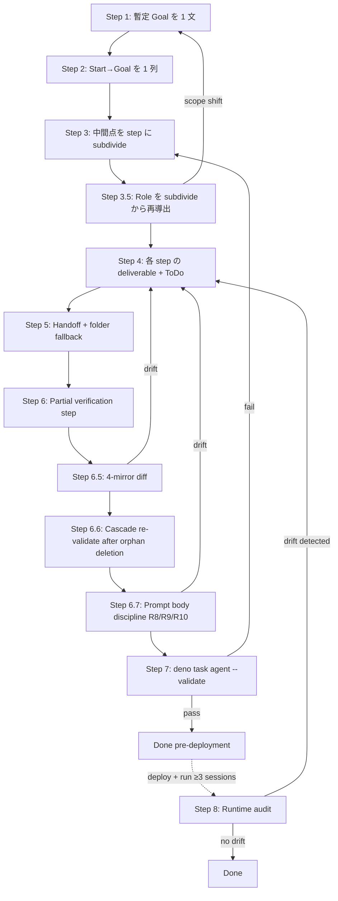

# Agent Step Design

`.agent/<name>/` 配下の新規 agent を設計する skill。Role と goal を一致させ、start から goal までを線形 step に分解し、各 step の中間成果物・handoff・部分検証を定義し、`--validate` で構造整合を検証し、本番投入後は実行ログから behavioral drift を再 audit する。

## When to Use / When NOT to Use

| Use this skill | Skip |
|---|---|
| 新規 agent (`.agent/<name>/`) を立ち上げる | 既存 agent の prompt 文面だけ修正 |
| `steps_registry.json` の step 構成を初めて切る / 大幅に再設計する | 1 step の `uvVariables` 1 個追加など軽微な edit |
| step 数や transitions を増減し flow shape が変わる | workflow.json (`.agent/workflow.json`) の phase graph 設計 (= agent 間遷移は別レイヤ) |
| Handoff field / intermediate deliverable 形を決める | breakdown wrapper / C3L prompt 解決ロジック (`agents/common/prompt-resolver.ts`) |
| 本番投入後の実行ログから design drift を再 audit する (Phase 8) | 単発の log 調査だけ (= `/logs-analysis` 単独) |

agent の **archetype 判定** (Single-Step / Multi-Step Linear / Branching+Validator) は [`references/archetypes.md`](references/archetypes.md) を先に開く。本 skill は archetype を入力として受け取り、step 内部設計に集中する。

## Decision Rules (絶対)

| # | Rule | 違反時の症状 |
|---|------|--------------|
| R1 | **Role == Goal**: agent の役割 = ゴール = 単一目的。1 agent に 2 目的を持たせない | step 内で intent が際限なく増え、prompt が IF-THEN ルーティングに腐る |
| R2 | **Linear only**: step 列は単線。分岐させたい時は別 agent にする (workflow.json で phase 分割) | gate transitions が多 target に膨れ、failure 経路の検証が指数化 |
| R3 | **Length is fine**: 線形が長くなることは許容。短くするために責務を混ぜない | 1 step が「scan + verify + emit」を兼任、中間成果物が消失 |
| R4 | **Start condition explicit**: 初期 step は前提 (ラベル / 入力 UV / artifact) を `description` と prompt 冒頭で明示し、未充足を検知して fail-fast する | 上流が壊れた時に silent に進行し、結果が空のまま closing |
| R5 | **4-mirror invariant**: 1 step の `description` 文 / `outputSchemaRef` の enum / prompt の verdict 列挙 / `transitions` の intent name は同一 role の 4 つの鏡。1 つを変えたら 4 つ全てを書き換え手で diff する。手順は §4-Mirror Invariant | description に旧 enum / 役割外の動詞が残り、schema と乖離。runtime まで気付かない |
| R6 | **Intent-name semantics**: transition の intent 名 (`next` / `repeat` / `handoff` / `closing` / `jump` / `escalate`) は framework の StepKind boundary contract。intent の選択は target step の `kind` に従う。表は §StepKind Boundary Rules。**stepKind は registry record の `kind` field でのみ決まる。stepId path segments (`closure.*`, `continuation.*`) は organizational label であり type-bearing ではない** (`agents/config/flow-validator.ts` の `inferStepKindFromDef` と同じ規則で読む) | 誤った intent 名で `--validate` Flow check が fail。「validator-side fix」と即断しない |
| R7 | **Reachability + UV usage grep**: `steps_registry.json#steps` の全 stepId が `entryStepMapping` から到達可能。orphan step は `--validate` Flow check で fail するが、design-time に Phase 3.5 / 6.5 で目視確認する (validate 任せにしない)。**`uvVariables` 宣言の存在のみで pass としない**。各 declared UV key について prompt 本文を `{uv-<key>}` で grep し、不在なら declaration unused → 削除 (または本文に追加) を提案 | orphan を残したまま role を「subdivide した step 列」から再導出すると、削除すべき責務が role に紛れ込む |
| R8 | **Linear prompt with bounded scope (split trigger)**: 各 step prompt は (1) **線形** = Action に if/else 分岐なし、(2) **start/end 明瞭** = `## Inputs (handoff)` / `## Outputs` / `## Verdict` の専用 section に受領 artifact / emit artifact / `next`・`repeat` 条件を 1 bit ずつ declarative に書く、(3) **scope 到達可能** = Action は 1 execution で完了し open-ended 探索を含まない。**(1)–(3) のいずれか違反 → step 分割** (= split trigger) | 詳細症状と直し方は §Anti-Patterns |
| R9 | **Repeat-iteration convergence**: `repeat` を emit しうる prompt は収束保証を持つ。(a) Action が idempotent (kind:verification 標準)、または (b) prompt が retry context を明示参照する (`completed_iterations` UV / `iteration_count` / TodoWrite 等) | kind:work step が retry-aware framing 無しで `repeat` を許可 → 同 prompt が同 input で再入し livelock |
| R10 | **Adaptation prompt diff necessity**: 各 `f_failed_<adaptation>.md` は同 step の `f_default.md` (または `f_<edition>.md`) と意味的に異なる Action を持つ。Inputs / Outputs schema は同じ、Action は failure-specific、Verdict semantics は異なってよい。frontmatter だけ差し替えた byte-near-identical adaptation は禁止 | failurePattern → adaptation が path 切替のみで LLM directive 不変、failure loop が解消しない |

R2 の根拠: 1 directory = 1 agent = 1 purpose という per-agent convention (`.agent/CLAUDE.md`)。validator 化 (= 多分岐) は **agent 単位** で行い、本 skill では「分岐は agent を分けて workflow.json で繋ぐ」と扱う。

## Process Flow

Role 定義は **step subdivide の出力** で確定する。Phase 1 は暫定 goal を立てるだけで、subdivide した step 列に名前を付け直すことで「この agent の role scope」が見える。`.agent/CLAUDE.md` の per-agent purpose 文は input の 1 つだが **絶対ではなく書き換え対象**。enumeration が source of truth。



| Phase | 入力 | 出力 | 失敗の見え方 |
|-------|------|------|--------------|
| 1. 暫定 Goal | 要件 + 既存 purpose 文 (`.agent/CLAUDE.md` 等の input、絶対ではない) | 暫定 1 文 (`<agent> の役割は <goal> である`) | 「と」「および」が含まれていたら R1 違反。Phase 3.5 で再導出 |
| 2. Linear path | 暫定 Goal | start step → ... → terminal step の列 | 矢印が分岐する → 別 agent へ切り出す (R2) |
| 3. Subdivide | 線形列 | step ID 列 (各 step は 1 deliverable) | 1 step が複数 deliverable を出す → 分割 |
| **3.5. Role 再導出** | subdivide した step 列 のうち **`entryStepMapping` から到達可能なもの** | **scope 文 (= 役割境界)** + negative list (扱わない動詞) | step 列に無い動詞が Goal に残る → Goal を絞るか step を増やす。orphan を含めると dead code 責務が混入 (R7)。`.agent/CLAUDE.md` purpose 表と diff し table / agent どちらを直すか明示 decide |
| 4. Deliverable + ToDo | step ID 列 + 確定 Role | step ごとの `description` / `outputSchemaRef` / ToDo | deliverable 名と step stem (`c3` + edition) 不一致。`description` に negative list 動詞混入 → R5 違反 |
| 5. Handoff design | step ごとの deliverable | `structuredGate.handoffFields` 列 + folder layout (`.agent/climpt/tmp/.../<step-stem>/`) | handoff field 空、または folder 名が step stem と乖離 |
| 6. Partial verification | step 列 | 検証 step (例: `verify-design-only`, `verify-impl-only`) | 1 step に集約 → R3 違反 |
| **6.5. 4-mirror diff** | step ごとの 4 鏡 | 4 鏡が同一 role を語る確認 | §4-Mirror Invariant 参照 |
| **6.6. Cascade re-validate** | orphan 削除直後 | `--validate` 再実行 | 大量削除を 1 commit で済ますと UV reachability 違反。leaf-first で削除し各 layer 後に再 validate |
| **6.7. Prompt body discipline** | 各 step prompt (`prompts/steps/<c2>/<c3>/f_<edition>[_<adaptation>].md`) | R8 split-trigger / R9 repeat 収束 / R10 adaptation diff の 3 axis 確認 | §Anti-Patterns 参照 |
| 7. Validate | 完成 `steps_registry.json` | `Validation passed.` | §Validation 節 |
| **8. Runtime audit** | `tmp/logs/` の ≥3 session JSONL / `cycle_exceeded` 観測時は workflow-state.json | (signal, suspected rule violation, target phase) リスト | §Runtime Audit + §Exceeded forensics。drift 検出 → 指定 phase ループ |

step record / `structuredGate` / C3LAddress (5-tuple) の field 定義は [`references/registry-shape.md`](references/registry-shape.md) を参照。

## Intermediate Deliverable Contract

各 step は **1 つの中間成果物** を出す。2 路の channel:

| Channel | 媒体 | いつ使う | 制約 |
|---------|------|----------|------|
| Handoff (primary) | `structuredGate.handoffFields` の SO subtree | 後続 step が *必ず* 必要とする情報 | `outputSchemaRef` validation を通る |
| Folder (fallback) | `.agent/climpt/tmp/.../{step-stem}/` 配下 | handoff に乗せると重い / 条件付きで掘り下げる | folder 名 = step stem (`{c3}` または `{c3}.{edition}`) |

ルール: shared な drop 先は `.agent/climpt/` 配下のみ (`.agent/<agent>/tmp/` 禁止) / step rename と folder rename を同期 / handoff と folder に同情報を duplicate しない (drift 温床)。決め手: 後続が「必ず読む」= handoff、「掘るかも」= folder。

## Partial Verification Steps

Verification は **scope を限定** して挿入し、設計のみ / 実装のみ / artifact 単位を独立 step に分ける (R3)。

| 粒度 | 例 | 配置 |
|------|-----|------|
| Per-deliverable | `verify-doc-paths` | 該当 step 直後 |
| Per-artifact-class | `verify-design`, `verify-impl` | 関連 step 群末尾 |
| End-of-flow | `closure` (全成果物集約 + closing emit) | terminal step |

System 全体を 1 step に詰め込むと失敗 localize 不能。実例: `.agent/considerer/steps_registry.json` の `doc-scan → doc-verify → doc-evidence → consider`。

## 4-Mirror Invariant (R5 + R6 の applier-driven check)

`--validate` は registry の prose を読まず intent-name semantics も Flow check 経由で部分的にしか出ない。drift は手で diff する。1 step ごとに **4 つの鏡が同じ role を語るか** 目視確認:

> **Scope note (R5 ↔ R8)**: R5 = intent **名** の 4 鏡整合、R8 = prompt body 内 verdict **条件** の section 明示。両方 pass で初めて prompt と registry が同じ役割を語る。

| Mirror | 場所 |
|--------|------|
| (a) Schema enum | `outputSchemaRef` の JSON Schema `enum` |
| (b) Prompt verdict 列挙 | C3L prompt (`prompts/steps/<c2>/<c3>/f_<edition>.md`) 内の verdict 列挙 |
| (c) Step description | `steps_registry.json` の step record の `description` |
| (d) Intent name ↔ target.kind | `transitions` map と target step `kind` (§StepKind Boundary Rules contract) |

**Diff 手順** (Phase 6.5):

1. (a)(b)(c) を並べ verdict 集合の完全一致を確認
2. 不一致 → 3 つ全てを Phase 3.5 確定 role に揃える (一方だけ更新しない)
3. (c) に negative list の語 (扱わない動詞) が混入していないか確認
4. (d) の intent name と target.kind の組が §StepKind Boundary Rules で許容されるか確認。例: `work.handoff` の target が `verification` 以下 → R6 違反 → `next` にリネームし allowedIntents / schema / prompt も同期

**典型的 silent drift**: schema enum 変更後 description が旧 enum / 別 agent コピー時の description 残存 / prompt verdict 表更新後 description 未 touch / `transitions.handoff` の target が verification (R6)。`--validate` の Cross-references / Schema check では補足できない。4-mirror diff 完了まで Phase 7 に進まない。

## StepKind Boundary Rules (R6 の rule book)

`agents/config/flow-validator.ts` の `BOUNDARY_RULES` (P2-3) からの転記。intent 名は target step の `kind` との契約。

| from.kind    | from.intent | 許可される to.kind         | 意味 |
|--------------|-------------|----------------------------|------|
| work         | next        | work, verification         | 前進。同 work loop 内 / 次 phase verification 突入 |
| work         | repeat      | (self only)                | 同 work step 再入 |
| work         | handoff     | **closure のみ**           | work loop を抜け closure terminal 直行 (verification 経由しない) |
| verification | next        | verification, closure      | 前進。同 verification chain 内 / 次 phase closure 突入 |
| verification | repeat      | (self only)                | 同 verification step 再入 |
| closure      | closing     | null (terminal)            | terminate |
| closure      | repeat      | (self only)                | 同 closure step 再入 |

**Intent 名の選び方** (Phase 4): (1) target.kind 確認 → (2) 上表で `(from.kind, to.kind)` 行を引く → (3) `from.intent` 列の名前を `transitions` key に (allowedIntents / schema enum / prompt verdict 列も同名)。

例: `work` → `verification` = **`next`** (`handoff` は closure 専用) / `work` → `closure` terminate = `handoff` / `verification` → `closure` 突入 = `next` / `closure` terminate = `closing`。

**`--validate` Flow check fail 時**: 本表で `(from.kind, to.kind)` の許容を確認。許容されているのに intent 名が違うなら agent 側 1-line rename で解消する。「validator-side fix」と即断しない。

## Validation (registry 検証)

設計が完成したら必ず `--validate` を実行。**構造整合のみを検証** — schema / cross-reference / path / handoff / UV reachability は捕まるが、prose の意味整合は読まない。R5 (4-mirror) は §4-Mirror Invariant の手 diff で先に潰す。

**Validator-first triage**: Phase 5 では必ず先に下記コマンドを走らせ、その output を一次資料として triage する。手作業の R1–R10 trace は validator が cover しない領域 (R10 prompt diff 必要性、R8 split trigger 妥当性、R3 1 step 1 deliverable など意味的判断) に限定する。kind field 違反 (R6) や UV 宣言 unused (R7) など静的に拾える項目を手 trace で見落とすのを防ぐ。

```bash
deno task agent --validate --agent <agent-name>
```

実装: `agents/scripts/run-agent.ts:168-507` の `if (args.validate)` ブロック → `agents/config/mod.ts` の `validateFull(agent, cwd)` (同 ts:188-481)。13 check: `agent.json` Schema / `agent.json` Configuration (`verdict.type` 等) / `steps_registry.json` Schema / Cross-references (`outputSchemaRef`, transition target) / Paths (C3L prompt, schema file) / Labels (workflow.json ↔ repo) / Flow (reachability `entryStepMapping`→terminal) / Prompts / UV Reachability (supply source) / Template UV (placeholder ↔ 宣言) / Step Registry (ADT) / Handoff Inputs (step A handoff ↔ step B input) / Config Registry (`.agent/climpt/config/*.yml` ↔ registry pattern)。

`Validation passed.` が出るまで設計は完了していない。Sub-agent から実行する場合は二重 sandbox に注意 (Bash tool sandbox + SDK sandbox)。Claude Code の Bash から呼ぶ際は `dangerouslyDisableSandbox: true` を付けるか、ターミナルから直接実行する。

## Runtime Audit (log-based design evaluation)

**Bridge from Phase 5**: Phase 8 を始める前に Phase 5 validator output が clean (✗0 ⚠0) であることを再確認。validator が拾える静的違反 (kind field 違反 / UV declaration unused / orphan step 等) を runtime drift と取り違えない。

`--validate` / Phase 6.5 / 6.7 は **静的設計** (registry shape / 4-mirror / prompt body) を検証する。一方、本番投入後に現れる **behavioral drift** — LLM が実際に何を emit するか、どの step で滞留するか、どの transition が死んでいるか — は実行ログでしか観測できない。Phase 8 は `tmp/logs/` を signal source とし、R1–R10 を **execution-time evidence で再 audit** する procedure (新 rule は追加しない)。

**When to run**: ≥3 sessions が `tmp/logs/orchestrator/` に蓄積 / 新 step 追加 or transitions 変更直後 / `fallbackIntent` 発火 1 件以上 / 同 step で `repeat` 連続 or 滞留時間が突出。

**Signals → rule mapping** (`/logs-analysis` の digest scripts で集計):

| Signal | 取得元 | suspected violation → re-enter phase |
|--------|--------|--------------------------------------|
| `fallback_intent_used` per step | session JSONL `metadata.event=dispatch_result` | R5 / R6 (verdict 列挙 drift / intent-name 不整合) → **Phase 6.5** |
| `repeat` count / 連続 `repeat` per step | `metadata.event=transition` の intent | R8 (3) open-ended / R9 livelock → **Phase 6.7** |
| step occupation time / iteration 分布 | `run_start` → 次 transition elapsed | R3 (1 step に 2 job) → **Phase 3 + 3.5** |
| `next_action.action` 分布 per step | per-agent JSONL の Assistant SO | R5 / R8 (1) (verdict 偏りなし = 隠れ branching) → **Phase 6.5** |
| failurePattern adaptation 切替後の SO 不変 | `[ClosureAdaptation] Resolved` 前後の SO 比較 | R10 (directive 不変) → **Phase 6.7 R10 audit** |
| terminal closing rate (emitted vs blocked) | `run_end` outcome | R4 / R1 (start condition fail / role over-scoped) → **Phase 1 / 4** |
| dead transitions (0 回発火キー) | session 全体の transition 集計 | R7 (orphan target 残存) → **Phase 6.6 + 7** |

**Tooling delegation**: 実 log の読取 / digest は `/logs-analysis` skill に委譲 (本 skill は signal → rule mapping と re-enter phase 決定を担う)。`/logs-analysis` Step 4 で得た JSON を main (Opus) が読み、上表で Phase 8 出力 (signal, suspected rule, target phase) を作る。Haiku/Sonnet には解釈を任せない (`/logs-analysis` 責任分担表に従う)。

### Exceeded forensics (per-step intent deviation)

`"status": "cycle_exceeded"` (orchestrator-level) は「該当 agent の step が意図した挙動を取らなかった」evidence。`maxCycles` 閾値を上げる前に、どの step がループ起点かを特定し、R1–R10 のどれが破れているかを step 単位で診断する。機構詳細 (subjectStore / cycleCount 復元 / writeWorkflowState) は `/workflow-consistency` skill §"Exceeded History Analysis" の正典を参照。本 sub-section は per-step diagnosis に集中する。

#### Source artifacts

| Artifact | Path | 何が分かるか |
|----------|------|--------------|
| workflow-state | `.agent/climpt/tmp/issues-execute/<N>/workflow-state.<workflowId>.json` | phase 列 / agent 列 / outcome 列 (= どの step / phase が repeat したか) |
| per-agent session JSONL | `tmp/logs/<agent>/*.jsonl` | step 単位の Assistant SO / verdict / iteration count |
| orchestrator session JSONL | `tmp/logs/orchestrator/*.jsonl` | dispatch 結果 / fallback intent / cycle 増分 trigger |

#### Diagnosis 手順

1. workflow-state を `jq` で読み、history の `phase` × `agent` × `outcome` を時系列で並べる (`/logs-analysis` 経由でも可)
2. 同 agent の連続 entry を抽出 (= per-agent step loop 起点候補)
3. 該当 agent の per-agent JSONL を `/logs-analysis` で digest し、ループ中の step ID と verdict を取得
4. 下表で step pattern → suspected R を引き、対応 phase へ戻る

| Step pattern (repeat 軌跡) | suspected R | re-enter phase |
|----------------------------|-------------|----------------|
| 同 step が `repeat` を連発し livelock | R9 (retry 収束保証なし) | Phase 6.7 R9 audit |
| 同 step が verdict 出すが orchestrator は同 phase に戻す (4-mirror drift) | R5 / R6 (verdict 列挙不一致 / intent-name 不整合) | Phase 6.5 |
| `f_failed_<adaptation>` 切替後も同 SO が続く | R10 (adaptation directive 不変) | Phase 6.7 R10 audit |
| step が前提不一致で blocked → 再 dispatch される | R4 (start condition 不明文化) | Phase 1 / 4 |
| step description と Schema enum が乖離した状態で transition 連発 | R5 (description drift) | Phase 6.5 |
| 1 step が複数 deliverable を抱え滞留 | R3 / R8 split-trigger | Phase 3 + 6.7 |

#### 反パターン (前提)

`cycle_exceeded` 観測 → 即座に `rules.maxCycles` 引き上げ は禁止。閾値を上げても step 意図不一致は解消せず、grind の長さが伸びるだけ。step 設計修正後 (R3/R8/R9/R10 のいずれか) → workflow-state を `rm` してから再実行 (Manual reset 手順は `/workflow-consistency` skill 参照)。閾値の引き上げは R3/R8/R9/R10 解消が verify されてからの最後の調整。

## Anti-Patterns

| Anti-pattern | なぜダメか | 直し方 |
|--------------|------------|--------|
| **Branching steps** within 1 agent | R2 違反。failure 経路が指数化、validator 検証が表現しきれない | 分岐先端を別 agent にし workflow.json で結ぶ |
| **Role drift** (1 agent に 2 goal: 分類 + 順序付け 等) | R1 違反 | 責務ごとに agent を分ける (`.agent/triager` / `.agent/prioritizer`) |
| **Implicit start condition** (前提を `description` にも prompt にも書かない) | R4 違反。上流壊れて silent fail | `description` に前提明文化、prompt 冒頭でチェック → 不一致は `verdict: "blocked"` |
| **Whole-system verification** (1 step が design + impl + integration を全部) | R3 違反 | deliverable ごとに verification を切り、各 step に partial verifier 1 つ |
| **Handoff/folder duplication** | drift 温床、validation も両方の整合まで保証しない | primary は handoff、folder は「重い / 探索的」のみ。両方に書かない |
| **Description text drift / Role を input 文で確定したつもり** | R5 違反 / Phase 3.5 skip で step 列に無い動詞が role 残存 | Phase 3.5 で step 列から role 再導出 + Phase 6.5 で 4-mirror diff |
| **`--validate` だけで設計完成宣言 / 失敗を即「validator-side fix」と即断** | R5 / R6 を見逃す。intent-name 違反は agent 側 1-line rename で済む | Phase 6.5 を通してから `--validate`。失敗時は §StepKind Boundary Rules で `(from.kind, from.intent → to.kind)` 照合 |
| **stepId path segments で stepKind を推測** (kind field を読まずに `closure.*` を closure 扱い) | R6 違反。stepId は organizational label。`work` kind step が `closure.foo` という名前で `next → consider` を持っていても path 名で見逃す | record の `kind` field を直接読む。validator output (`inferStepKindFromDef`) を一次資料に |
| **`uvVariables` 宣言の存在を R7 pass の根拠にする** (本文 `{uv-<key>}` grep をスキップ) | R7 違反。declared だが unused な UV が累積し warning が常態化 | 各 declared key を prompt 本文で `{uv-<key>}` grep。不在なら宣言削除 or 本文に追加 |
| **Verdict in `## Do ONLY this` / open-ended scope in prompt** | R8 (2)(3) 違反。verdict 条件が読めない / scope が 1 execution で閉じず livelock | dedicated `## Verdict` section に `next` / `repeat` 条件を 1 bit ずつ。scope を 1 execution 完結に縮小し進捗 anchor で外部化。縮小不能なら 2 step 分割 |
| **`repeat` w/o retry-aware framing / `f_failed_<adaptation>.md` byte-identical to default** | R9 / R10 違反。retry context 不参照で livelock / directive 不変で failure loop 継続 | R9: 冒頭で `completed_iterations` 参照し N 回目以降 path 分岐を明示、または TodoWrite で前回進捗を anchor。R10: `f_default` と diff を取り Action を failure-specific 化、意味的に書けなければ failurePattern を削除 |
| **`cycle_exceeded` を agent 設計問題ではなく orchestrator 閾値問題と誤診** | exceeded は「step が意図通り動かなかった」signal。`rules.maxCycles` を上げる対処は step 不全を温存し、grind 時間を伸ばすだけ | §Exceeded forensics の表で step pattern → R を引き、R3/R8/R9/R10 のいずれかとして step 設計を直す。閾値の引き上げは設計修正 verify 後の最後の調整 |

## References

Archetype 別 reference (確定後に開く):

| Archetype | Reference | 実例 |
|-----------|-----------|------|
| A: Single-Step (Triage 系) | [`references/triage.md`](references/triage.md) | `.agent/clarifier/`, `.agent/triager/` |
| B: Multi-Step Linear (Architecture / Design 系) | [`references/architecture-design.md`](references/architecture-design.md) | `.agent/considerer/`, `.agent/detailer/` |
| C: Branching+Validator (Implement 系) | [`references/implement.md`](references/implement.md) | `.agent/iterator/`, `.agent/merger/` |

Shape 正典: [`references/archetypes.md`](references/archetypes.md) (taxonomy + 判定) / [`references/registry-shape.md`](references/registry-shape.md) (Step record / structuredGate / C3LAddress / failurePatterns)。

Code citation: `agents/scripts/run-agent.ts:168-507` (`--validate` 実装) / `agents/config/mod.ts` (`validateFull`) / `agents/config/flow-validator.ts` (`BOUNDARY_RULES` P2-3, §StepKind Boundary Rules 出典)。

**Cross-skill (load-bearing for Phase 8)**:
- `/logs-analysis` — `tmp/logs/` 配下の orchestrator session JSONL / per-agent JSONL の digest 化と行特定を担う。本 skill は signal → rule mapping を担当 (log 読取 procedure は `/logs-analysis` 側を参照、重複定義しない)。
- `/workflow-consistency` — workflow-state JSON / cycleCount 永続化機構の正典。Exceeded forensics で per-step diagnosis に進む前に、cross-agent graph 起源 (R5/R6/R9 cross-agent 違反) を排除する場合に参照。

Further reading (optional, may be stale): `agents/docs/builder/` 配下の guide は scheme drift の可能性があるため、本 skill の reference と矛盾した場合は **本 skill 側を優先**。
