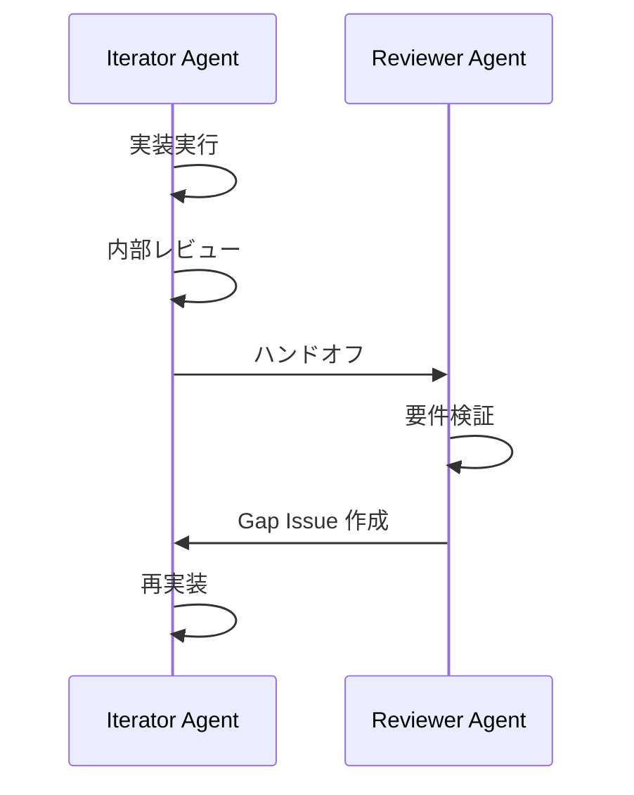

# Climpt Agents Overview

自律型エージェントシステム（Iterator Agent, Reviewer Agent）の概要と使用方法。

## アーキテクチャ

### 全体構成

```
agents/
├── common/                    # 共有モジュール
│   ├── mod.ts                 # エクスポート
│   ├── types.ts               # 共通型定義
│   ├── logger.ts              # JSONL ロガー
│   ├── worktree.ts            # Git worktree 操作
│   ├── merge.ts               # ブランチマージ
│   ├── step-registry.ts       # ステップレジストリローダー
│   ├── prompt-resolver.ts     # プロンプト解決
│   └── coordination.ts        # Agent 間連携
├── iterator/                  # Iterator Agent
│   ├── mod.ts                 # runIterator エクスポート
│   ├── config.json            # Agent 設定
│   ├── registry.json          # プロンプトレジストリ
│   ├── prompts/               # プロンプトテンプレート
│   │   ├── system.md
│   │   └── steps/             # C3L 構造
│   │       ├── initial/
│   │       │   ├── issue/
│   │       │   ├── project/
│   │       │   └── iterate/
│   │       └── continuation/
│   └── scripts/
│       ├── agent.ts           # メインエントリ
│       ├── cli.ts             # CLI 解析
│       └── completion/        # 完了ハンドラー
├── reviewer/                  # Reviewer Agent
│   └── (同様の構造)
├── schemas/                   # JSON Schema
│   ├── agent.schema.json
│   └── steps_registry.schema.json
└── docs/                      # 設計ドキュメント
    ├── 01_architecture.md
    ├── 02_agent_definition.md
    ├── 03_runner.md
    ├── 04_completion_handlers.md
    └── 05_prompt_system.md
```

### ユーザープロジェクト側構造

```
.agent/
├── iterator/                  # Iterator Agent 設定
│   ├── agent.json             # Agent 定義（任意）
│   ├── config.json            # ランタイム設定
│   ├── steps_registry.json    # ステップ定義
│   └── prompts/               # プロンプトテンプレート
│       ├── system.md
│       └── steps/
├── reviewer/                  # Reviewer Agent 設定
│   └── (同様)
└── climpt/                    # Climpt 設定
    ├── registry.json
    └── config/
        └── registry_config.json
```

## 主要コンポーネント

### Completion Handlers (完了ハンドラー)

Agent の完了条件を判定するハンドラー。

| Type      | 完了条件                       | 使用例                      |
| --------- | ------------------------------ | --------------------------- |
| `issue`   | GitHub Issue がクローズ        | `--issue 123`               |
| `project` | Project フェーズが完了         | `--project 5`               |
| `iterate` | 指定回数の反復完了             | `--iterate-max 10`          |
| `manual`  | 特定キーワード出力             | `completionKeyword` 設定    |
| `custom`  | カスタムハンドラー             | `handlerPath` 設定          |

### Prompt System (プロンプトシステム)

C3L (Category/Classification/Chapter) 構造でプロンプトを管理。

```
steps/
├── initial/           # C2: initial
│   ├── issue/         # C3: issue
│   │   └── f_default.md
│   ├── project/       # C3: project
│   │   ├── f_preparation.md
│   │   ├── f_processing.md
│   │   └── f_review.md
│   └── iterate/       # C3: iterate
│       └── f_default.md
└── continuation/      # C2: continuation
    └── ...
```

### UV Variables (UV 変数)

プロンプトテンプレートで使用する変数。

| 変数                    | 説明                 |
| ----------------------- | -------------------- |
| `uv-agent_name`         | Agent 名             |
| `uv-issue_number`       | GitHub Issue 番号    |
| `uv-project_number`     | Project 番号         |
| `uv-iteration`          | 現在の反復回数       |
| `uv-max_iterations`     | 最大反復回数         |
| `uv-completion_criteria`| 完了条件テキスト     |

## 使用方法

### CLI 実行

```bash
# Iterator Agent
deno run -A jsr:@aidevtool/climpt/agents/iterator --issue 123
deno run -A jsr:@aidevtool/climpt/agents/iterator --project 5
deno run -A jsr:@aidevtool/climpt/agents/iterator --iterate-max 10

# Reviewer Agent
deno run -A jsr:@aidevtool/climpt/agents/reviewer --project 25

# 初期化（設定ファイル生成）
deno run -A jsr:@aidevtool/climpt/agents/iterator --init
```

### Programmatic API

```typescript
import { runIterator, runReviewer } from "jsr:@aidevtool/climpt/agents";

// Iterator Agent
const result = await runIterator({
  issue: 123,
  cwd: Deno.cwd(),
});
console.log(`Completed: ${result.totalIterations} iterations`);

// Reviewer Agent
const reviewResult = await runReviewer({
  project: 25,
  cwd: Deno.cwd(),
});
```

### deno.json Task

```json
{
  "tasks": {
    "iterate-agent": "deno run -A jsr:@aidevtool/climpt/agents/iterator",
    "review-agent": "deno run -A jsr:@aidevtool/climpt/agents/reviewer"
  }
}
```

## 設定ファイル詳細

### config.json

```json
{
  "version": "1.0.0",
  "$coordination": "../common/coordination-config.json",
  "prompts": {
    "registry": "registry.json",
    "fallbackDir": "prompts/",
    "systemPromptPath": "prompts/system.md"
  },
  "agents": {
    "climpt": {
      "allowedTools": ["Skill", "Read", "Write", "Edit", "Bash", "Glob", "Grep"],
      "permissionMode": "acceptEdits"
    }
  },
  "logging": {
    "directory": "tmp/logs/agents",
    "maxFiles": 100,
    "format": "jsonl"
  },
  "coordination": {
    "role": "implementer",
    "handoffBehavior": {
      "onInternalReviewPass": "trigger-handoff",
      "onAllIssuesClosed": "trigger-handoff"
    }
  }
}
```

### steps_registry.json

```json
{
  "agentId": "iterator",
  "version": "1.2.0",
  "userPromptsBase": ".agent/iterator/prompts",
  "c1": "steps",
  "pathTemplate": "{c1}/{c2}/{c3}/f_{edition}_{adaptation}.md",
  "steps": {
    "initial.issue": {
      "stepId": "initial.issue",
      "name": "Issue Initial Prompt",
      "c2": "initial",
      "c3": "issue",
      "edition": "default",
      "uvVariables": ["issue_number"]
    }
  }
}
```

## Agent 間連携

### Coordination Config

Iterator と Reviewer の連携設定。

```json
{
  "role": "implementer",
  "handoffBehavior": {
    "onInternalReviewPass": "trigger-handoff",
    "onAllIssuesClosed": "trigger-handoff",
    "onError": "comment-and-exit"
  }
}
```

### 連携フロー



## 共有モジュール (agents/common)

### types.ts

共通型定義。

- `AgentName` - Agent 名
- `PermissionMode` - 権限モード (plan | acceptEdits | bypassPermissions)
- `LogLevel` - ログレベル
- `LogEntry` - JSONL ログエントリ
- `BaseAgentConfig` - Agent 基本設定
- `WorktreeConfig` - Worktree 設定
- `MergeStrategy` - マージ戦略

### logger.ts

JSONL 形式ロガー。

```typescript
import { createLogger } from "./logger.ts";

const logger = await createLogger(config, "iterator");
logger.info("Agent started", { iteration: 1 });
```

### worktree.ts

Git worktree 操作。

```typescript
import { setupWorktree, cleanupWorktree } from "./worktree.ts";

const result = await setupWorktree(
  { forceWorktree: true, worktreeRoot: "../worktree" },
  { branch: "feature/docs", baseBranch: "develop" }
);
```

### merge.ts

ブランチマージ操作。

```typescript
import { mergeBranch, ITERATOR_MERGE_ORDER } from "./merge.ts";

const result = await mergeBranch(
  "feature/docs",
  "develop",
  ITERATOR_MERGE_ORDER  // squash -> ff -> merge
);
```

## トラブルシューティング

### gh command not found

```bash
brew install gh  # macOS
gh auth login
```

### Configuration file not found

```bash
# プロジェクトルートで初期化
deno run -A jsr:@aidevtool/climpt/agents/iterator --init
```

### Empty output from breakdown CLI

```bash
# .agent/iterator/ プロンプトテンプレートを確認
ls -la .agent/iterator/prompts/
```

### Sandbox 制限

Claude Code から実行時は `dangerouslyDisableSandbox: true` が必要。

```typescript
Bash({
  command: "deno run -A jsr:@aidevtool/climpt/agents/iterator --issue 123",
  dangerouslyDisableSandbox: true,
})
```

## 関連ドキュメント

- `agents/docs/01_architecture.md` - 全体アーキテクチャ
- `agents/docs/02_agent_definition.md` - Agent 定義スキーマ
- `agents/docs/03_runner.md` - Runner 設計
- `agents/docs/04_completion_handlers.md` - 完了ハンドラー
- `agents/docs/05_prompt_system.md` - プロンプトシステム
- `agents/iterator/README.md` - Iterator Agent 詳細
- `agents/reviewer/README.md` - Reviewer Agent 詳細
- `agents/common/README.md` - 共有モジュール
