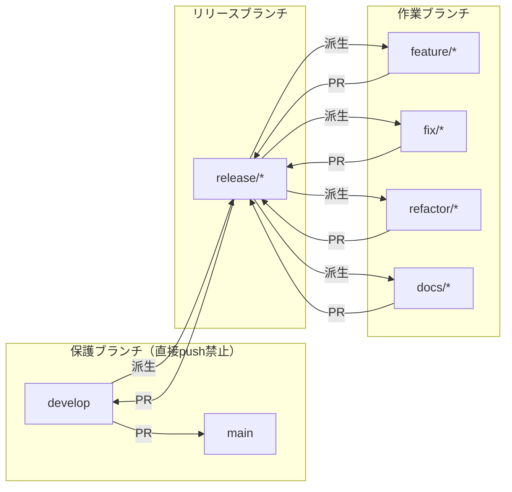
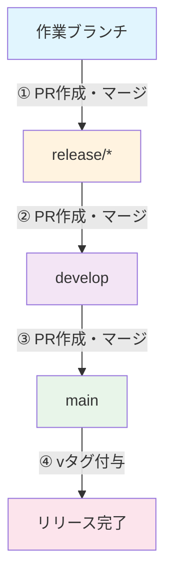
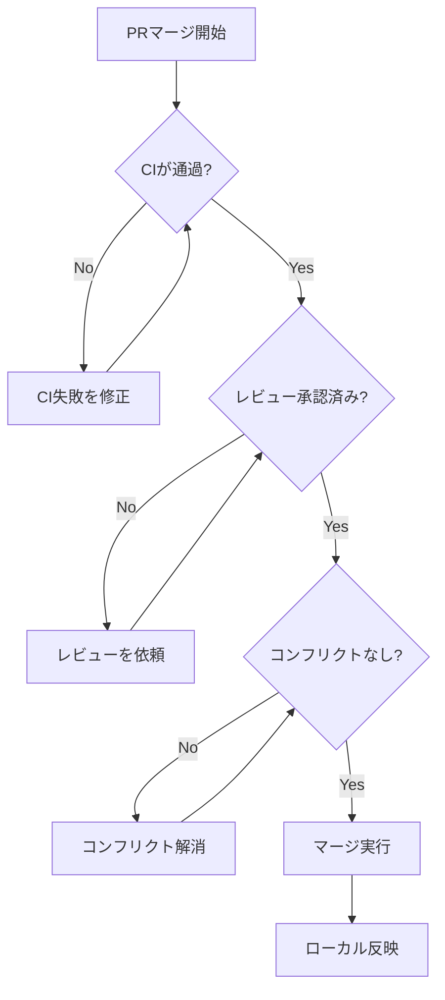
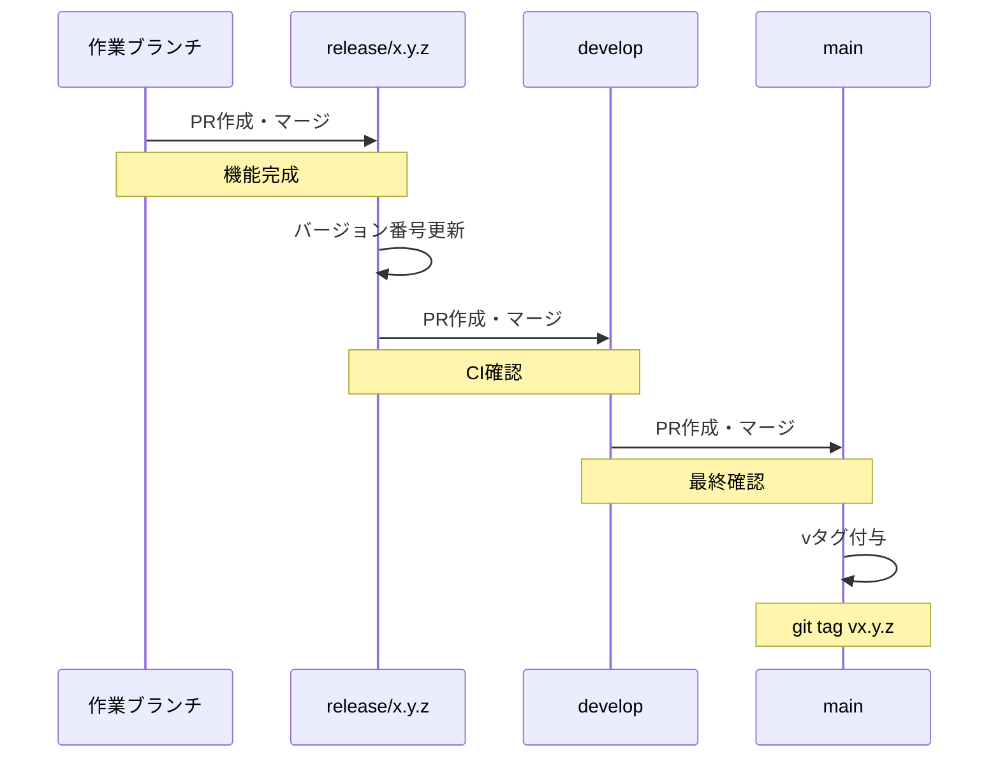

# ブランチ管理ガイド

## 目的

main, develop, release ブランチの操作が正しいフローで行われることを担保する。

## トリガー条件

以下の操作について議論・作業する際に自動的に実行:

- `main` ブランチへのマージ・PR作成
- `develop` ブランチへのマージ・PR作成
- `release/*` ブランチの作成・マージ
- 作業ブランチの作成・派生元の決定

## ブランチ戦略

### 全体フロー図



### マージ方向図



## ルール一覧

| 操作 | 許可 | 禁止 |
|------|------|------|
| main への変更 | develop からの PR マージのみ | 直接 push、他ブランチからのマージ |
| develop への変更 | release/* からの PR マージのみ | 直接 push |
| release/* の作成 | develop から派生 | main や作業ブランチから派生 |
| 作業ブランチの作成 | release/* から派生 | main や develop から直接派生 |

## 実施手順

### 1. 現在のブランチ状態を確認

```bash
git branch -a
git log --oneline -5
```

### 2. 操作タイプ別の確認

#### 作業ブランチを作成する場合

```bash
# 正しい手順
git checkout release/x.y.z
git checkout -b feature/my-feature

# または
git checkout -b feature/my-feature release/x.y.z
```

#### PR を作成する場合

| 現在のブランチ | PR先 | コマンド例 |
|---------------|------|-----------|
| feature/*, fix/*, refactor/*, docs/* | release/* | `gh pr create --base release/x.y.z` |
| release/* | develop | `gh pr create --base develop` |
| develop | main | `gh pr create --base main` |

#### PR をマージする場合

##### 1. PR の状態確認

```bash
# PR一覧を確認
gh pr list

# 特定のPRの詳細を確認
gh pr view <PR番号>

# CIステータスを確認
gh pr checks <PR番号>
```

##### 2. マージ前チェックリスト



##### 3. マージ実行

```bash
# Squash マージ（推奨：コミット履歴をクリーンに保つ）
gh pr merge <PR番号> --squash

# 通常マージ（コミット履歴を保持）
gh pr merge <PR番号> --merge

# リベースマージ
gh pr merge <PR番号> --rebase
```

##### 4. マージ方法の選択基準

| マージ方法 | 使用場面 | コマンド |
|-----------|---------|---------|
| Squash | 作業ブランチ → release（複数コミットを1つに） | `gh pr merge --squash` |
| Merge | release → develop（履歴保持） | `gh pr merge --merge` |
| Merge | develop → main（履歴保持） | `gh pr merge --merge` |

##### 5. マージ後の確認

```bash
# マージ完了を確認
gh pr view <PR番号> --json state

# リモートの状態を確認
git fetch origin
git log origin/develop --oneline -5
```

#### マージ後のローカル反映

```bash
git checkout develop
git pull origin develop
```

### 3. リリースフロー



## 警告パターン

以下の操作を検知した場合は警告:

| 操作 | 警告メッセージ |
|------|---------------|
| `git push origin main` | main への直接 push は禁止です。develop からの PR を作成してください。 |
| `git push origin develop` | develop への直接 push は禁止です。release/* からの PR を作成してください。 |
| `git checkout -b feature/* develop` | 作業ブランチは release/* から派生してください。 |
| `git checkout -b refactor/* develop` | 作業ブランチは release/* から派生してください。 |
| `git merge main` | main からのマージは想定外です。派生元を確認してください。 |

## クイックリファレンス

```
作業ブランチの種類:
  feature/*  - 新機能
  fix/*      - バグ修正
  refactor/* - リファクタリング
  docs/*     - ドキュメント

作業開始:
  git checkout release/x.y.z
  git checkout -b feature/my-work   # または refactor/*, fix/*, docs/*

作業完了（PR作成）:
  gh pr create --base release/x.y.z

PRマージ:
  gh pr checks <PR番号>           # CI確認
  gh pr merge <PR番号> --squash   # 作業ブランチ用
  gh pr merge <PR番号> --merge    # release/develop用

マージ後のローカル反映:
  git checkout <マージ先ブランチ>
  git pull origin <マージ先ブランチ>

完全リリースフロー:
  1. 作業ブランチ → release/* (PR作成 → マージ)
  2. release/* → develop (PR作成 → マージ)
  3. develop → main (PR作成 → マージ)
  4. main に vタグ付与: git tag vx.y.z && git push origin vx.y.z
```
