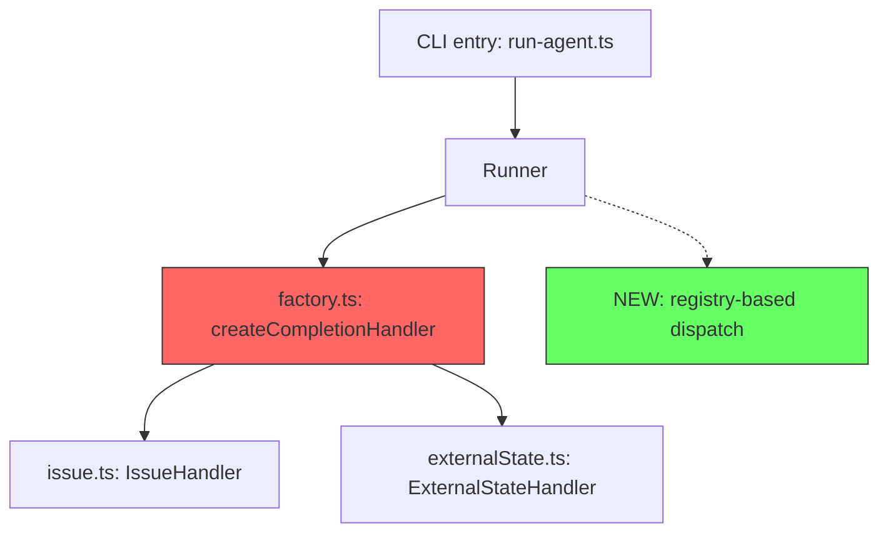

# Refactoring

Prove the new path inherits every contract from the old path before deleting it. If you cannot prove it, do not delete.

## Past Incidents

| Date | What happened | Why | Impact |
|------|--------------|-----|--------|
| 2/14 | externalState handler became a throw stub | New path was not implemented when old path was deleted | completionType functionality lost |
| 2/14 | Deno cache served stale version | --reload not run, so fixed code was not picked up | Fix existed but bug reproduced |
| 2/13 | V1 handler exports removed | Adapter not created, old interface compatibility lost | import errors |
| 1/18 | Legacy completionType aliases removed | Old agent.json configs broken with no migration grace period | Config file incompatibility |
| 1/9 | Dead code left behind (cli.ts, runner/cli.ts) | Old entry points not cleaned up after migration | Multiple paths caused confusion |

## Failure Patterns

| Pattern | Why it breaks | Prevention |
|---------|--------------|------------|
| Old path deleted + new path incomplete | Contract breaks in the intermediate state | List all contracts in Before/After table before deleting |
| Parameter gate declaration missing | Filter blocks undeclared arguments silently | Verify declarations at every gate from entry to consumer |
| Build cache inconsistency | Cache serves old module instead of updated one | Run --reload or clear cache after every change |
| Dead code left behind | Produces false positives in grep/search, causes confusion | Delete superseded code in the same PR |
| Documentation not updated | Users cannot discover preconditions | Grep docs for changed names and update all references |

---

## Phase 1: Scope & Inventory

Map everything being removed or changed before writing any code.

### Step 1-A: Identify Refactoring Targets

Before deciding what to change, enumerate all candidates. Grep, glob, and read to build a complete target list.

```markdown
| # | Target | File:Line | Type | Reason |
|---|--------|-----------|------|--------|
| 1 | createCompletionHandler | factory.ts:42 | function | Replaced by registry |
| 2 | legacyAlias | types.ts:15 | type alias | Dead after V2 migration |
```

### Step 1-B: Git History Investigation

For each target identified in 1-A, run `git log` to understand its history and assess risk.

```bash
git log --oneline --follow -n 20 -- <file>
git log --oneline -n 10 -S "<function_name>"
```

Record findings per target:

```markdown
| Target | Last changed | Author | Recent commits | Risk |
|--------|-------------|--------|----------------|------|
| createCompletionHandler | 2/14 | user | 4b91032, bcc85a8 | High — changed recently |
```

### Step 1-C: Deletion Plan Report (required when removing functionality)

If any target is being deleted, produce a dedicated **Refactoring Plan Report** before proceeding. The report MUST include a Mermaid dependency diagram.

````markdown
## Refactoring Plan Report: <Target Name>

### Summary
What is being deleted and why.

### Dependency Graph



### Deletion Items

| Item | File:Line | Consumers | Migration target | Status |
|------|-----------|-----------|-----------------|--------|
| createCompletionHandler | factory.ts:42 | runner.ts, builder.ts | registryDispatch | Ready |

### Risk Assessment

| Risk | Likelihood | Mitigation |
|------|-----------|------------|
| Parameter lost at gate | High | Before/After table + test |
| Cache serves stale module | Medium | --reload after change |
````

### Step 1-D: Removal Inventory

List what is being removed, who consumes it, and what parameters it receives.

```markdown
| Item | File | Consumers | Parameters |
|------|------|-----------|------------|
| createCompletionHandler | factory.ts:42 | builder.ts, runner.ts | args.issue, args.repo |
```

### Step 1-E: Gateway Audit

Trace every value from entry point to consumer, identifying filters and gates in between. Confirm the new path passes every parameter the old path consumed.

```
Entry (CLI) → Filter (run-agent.ts:196) → Runner → Factory → Handler
                 ↑ blocked if not declared in definition.parameters
```

### Step 1-F: Consumer Audit

Grep imports and call sites to identify every consumer. Determine the migration target for each. If any consumer has no migration target, deletion is not allowed.

## Phase 2: Contract & Verification Design

Define what contracts to preserve and how to prove preservation before writing any code.

**4. Before/After Table** — List each old-path behavior as a row and describe how the new path achieves it. Any row with an empty "After" column means the refactoring is not ready.

```markdown
| Behavior | Before | After | Verified |
|----------|--------|-------|----------|
| args.issue reaches handler | Direct path in createCompletionHandler | Registry + definition.parameters declaration | [ ] |
```

**5. Verification Design** — For each row in the Before/After table, decide what to verify, why, and how.

**What (what to protect)**: The input/output and error contracts that callers depend on. Boundary behavior, not implementation details.

**Why (why verify there)**: Past failures show that breakage occurs at boundaries, not at the point of change.

| Fragile boundary | Why it breaks | Example |
|-----------------|---------------|---------|
| Parameter reachability | Intermediate filter blocks undeclared args | --issue lost because definition.parameters lacked declaration |
| Interface compatibility | Old and new API method signatures differ | V2 refreshState/check vs V1 isComplete |
| Export continuity | Removing re-exports breaks downstream imports | V1 exports bulk deletion |
| Module resolution | Cache serves old version of the module | DENO_DIR split across two directories |

**How (how to choose the proof method)**: Match proof method to path complexity. Tests are a means of proof, not a goal.

| Path characteristic | Proof method |
|--------------------|-------------|
| Straight line, 1-2 hops | Code review is sufficient |
| Contains branches, filters, or async | Automated test on boundary input/output pairs |
| Depends on external state (cache, API) | E2E execution through the real environment |

## Phase 3: Execute

**6.** 1 commit = 1 concern. Separate into: add new path → migrate consumers → delete old path → update docs.

**7.** Every commit must pass `deno task ci`. If the intermediate state breaks, the commit granularity is too coarse.

**8.** Delete dead code in the same PR. "Cleanup later" never comes.

**9. Delete fallback locations** — When planning, explicitly list all fallback code paths (try/catch stubs, default branches, compatibility shims) tied to the deleted functionality. Include them in the deletion plan. Fallbacks that silently swallow errors are more dangerous than missing code.

```markdown
| Fallback | File:Line | Purpose | Action |
|----------|-----------|---------|--------|
| catch → return defaultHandler | factory.ts:58 | Masked missing handler | Delete |
| fallback prompt template | fallback.ts:12 | V1 compatibility | Delete after migration |
```

**10. Error Remediation List** — If any step induces errors (test failures, import errors, runtime exceptions), do NOT fix inline. Instead, append to a remediation list and continue the current plan. Fix items from the list after the main refactoring is complete.

```markdown
## Remediation List

| # | Error | Caused by step | File:Line | Status |
|---|-------|---------------|-----------|--------|
| 1 | ImportError: no export 'createHandler' | Step 6: delete old path | runner.ts:23 | Pending |
| 2 | TypeError: handler is undefined | Step 6: delete old path | builder.ts:45 | Pending |
```

This prevents context-switching mid-refactor and keeps the commit sequence clean.

## Phase 3-B: Test Creation

Create tests that prove the refactoring preserves contracts. Organize by use case and responsibility, not by file.

### Step T-1: Use Case Enumeration

Before writing tests, list all use cases affected by the refactoring.

```markdown
| Use case | Responsibility | Boundary | Priority |
|----------|---------------|----------|----------|
| Issue completion triggers state change | CompletionHandler | factory → handler | High |
| Missing issue param returns error | ParameterValidation | CLI → runner | High |
| Unknown completionType falls back | FallbackDispatch | factory → fallback | Medium |
```

### Step T-2: Test Per Responsibility

Create one test file per responsibility, not per source file. Each test file covers a single contract boundary.

```typescript
import { BreakdownLogger } from "jsr:@tettuan/breakdownlogger";
import { assertEquals, assertRejects } from "jsr:@std/assert";

const logger = new BreakdownLogger("refactor:completion-handler");

Deno.test("CompletionHandler — issue param reaches handler", () => {
  logger.debug("Testing issue parameter reachability", { param: "issue" });
  // Arrange → Act → Assert on boundary input/output
});

Deno.test("CompletionHandler — missing issue returns error", async () => {
  logger.debug("Testing missing issue rejection");
  await assertRejects(
    () => createHandler({ /* no issue */ }),
    Error,
    "issue is required",
  );
});
```

### Step T-3: Logger Convention

Every refactoring test MUST use `@tettuan/breakdownlogger` for traceability.

| Convention | Example |
|-----------|---------|
| Logger name | `"refactor:<responsibility>"` |
| Log at Arrange | `logger.debug("setup", { input })` |
| Log at Assert failure | `logger.error("contract broken", { expected, actual })` |
| Log boundary crossing | `logger.info("param reached handler", { param })` |

Import:
```typescript
import { BreakdownLogger } from "jsr:@tettuan/breakdownlogger";
```

### Step T-4: Verification Matrix

After tests are written, fill the verification matrix linking use cases back to Before/After table rows.

```markdown
| Before/After row | Use case | Test file | Test name | Pass |
|-----------------|----------|-----------|-----------|------|
| args.issue reaches handler | Issue completion | completion_handler_test.ts | issue param reaches handler | [ ] |
```

## Phase 4: Verify

**11. Cache clear** — On macOS, DENO_DIR can split across `~/.cache/deno` and `~/Library/Caches/deno`. Clear both.

```bash
deno cache --reload <entry-point>
```

**12. E2E parameter trace** — Confirm changed parameters reach the endpoint by running the actual command.

**13. Consumer grep** — Ensure zero remaining references. `grep -r "OldName" --include='*.ts' | grep -v test` must return empty.

**14. Docs grep** — Ensure zero stale references in docs. `grep -r "OldName" --include='*.md'` must return empty. See `docs-consistency` skill for full procedure.

---

## Anti-Patterns

| Bad | Good |
|-----|------|
| Delete old path, implement new path later | Make new path work first, then delete old |
| Assume "nobody uses this" without grep | Show evidence via consumer audit |
| Combine refactor and feature in one PR | Separate for bisectability |
| Fix the throw site | Trace where the parameter was lost |
| Skip cache clear after refactor | Always --reload after changes |

## Related Skills

| Skill | When to use together |
|-------|---------------------|
| `fix-checklist` | Root cause analysis before deciding what to refactor |
| `functional-testing` | Automated test design in Phase 2 |
| `docs-consistency` | Documentation updates in Phase 4 |
| `workflow` | Team delegation for large-scale refactors |
