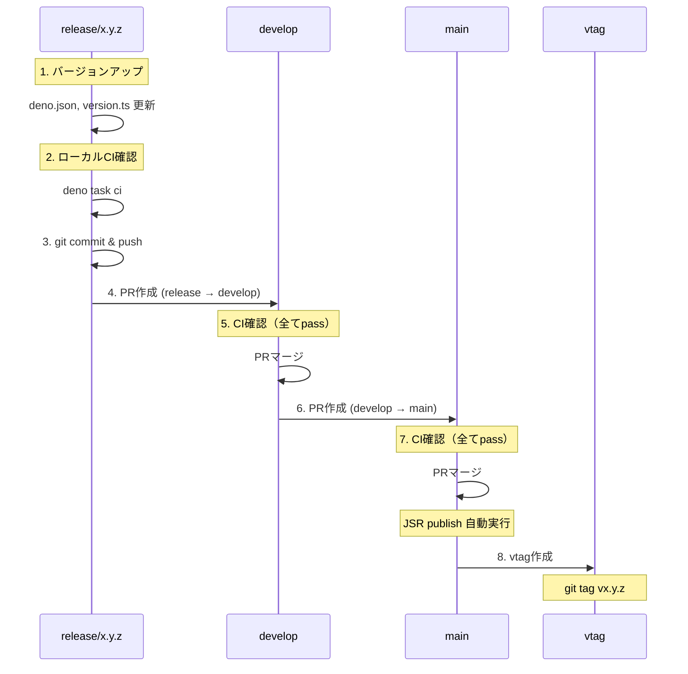

# リリース手順ガイド

## 目的

バージョンアップとリリースが正しい手順で行われることを担保する。

## 重要: 連続マージの禁止事項

**release/* → develop → main への連続マージは、必ずユーザーの明示的な指示を受けてから実行すること。**

禁止事項:
- ユーザーの指示なしに連続マージを実行
- 「リリースして」等の曖昧な指示で main まで一気にマージ
- 独自判断での develop → main マージ

正しい手順:
1. 各 PR 作成後、ユーザーに報告して次の指示を待つ
2. 「develop まで」「main まで」等の明示的な指示を確認
3. vtag 作成もユーザーの指示を待つ

## トリガー条件

以下の操作について議論・作業する際に自動的に実行:

- `release/*` ブランチへの push
- `release/*` → `develop` への PR 作成・マージ
- `develop` → `main` への PR 作成・マージ
- バージョンアップ・リリースに関する議論
- vtag の作成

## バージョン管理ファイル

このプロジェクトでは以下の2ファイルでバージョンを管理:

| ファイル | 用途 |
|---------|------|
| `deno.json` | JSR パッケージバージョン（`"version": "x.y.z"`） |
| `src/version.ts` | CLI バージョン定数（`CLIMPT_VERSION = "x.y.z"`） |

**重要**: 両ファイルのバージョンは必ず一致させること。CIで自動チェックされる。

## バージョンアップ手順

### 1. バージョン番号の決定

```
パッチ (x.y.Z): バグ修正、ドキュメント改善
マイナー (x.Y.0): 新機能追加（後方互換あり）
メジャー (X.0.0): 破壊的変更
```

### 2. ファイル更新

```bash
# deno.json
# "version": "1.9.13" → "version": "1.9.14"

# src/version.ts
# export const CLIMPT_VERSION = "1.9.13"; → "1.9.14";
```

### 3. 確認コマンド

```bash
# バージョン一致確認
grep '"version"' deno.json | head -1
grep 'CLIMPT_VERSION' src/version.ts | grep export
```

## リリースフロー

### フロー図



### 手順詳細

#### ステップ 0: 準備

```bash
# 作業ブランチを release/* に統合済みか確認
git checkout release/x.y.z
git log --oneline -10
```

#### ステップ 1: release/* ブランチでバージョンアップ

```bash
# develop から新規作成する場合
git checkout develop
git checkout -b release/x.y.z

# または既存 release/* で作業
git checkout release/x.y.z
```

deno.json と version.ts を編集:

```bash
# 編集後、確認
grep '"version"' deno.json
grep 'export const CLIMPT_VERSION' src/version.ts
```

#### ステップ 2: ローカルCI確認

**重要**: プッシュ前に必ずローカルでCIを通すこと

```bash
deno task ci
```

全てのステージがパスすることを確認してから次のステップへ進む。

#### ステップ 3: コミット & プッシュ

```bash
git add deno.json src/version.ts
git commit -m "chore: bump version to x.y.z"
git push -u origin release/x.y.z
```

**注意**: `dangerouslyDisableSandbox: true` が必要

#### ステップ 4: release/* → develop PR

```bash
gh pr create --base develop --head release/x.y.z \
  --title "Release x.y.z: <変更概要>" \
  --body "## Summary
- <変更点>

## Version
- x.y.z"
```

#### ステップ 5: CI確認 & develop へマージ

**重要**: マージ前にPRのCIが全てパスすることを確認

```bash
# CI確認（全てpassになるまで待機）
gh pr checks <PR番号> --watch

# CIがpassしたらマージ
gh pr merge <PR番号> --merge
```

#### ステップ 6: develop → main PR

```bash
gh pr create --base main --head develop \
  --title "Release x.y.z" \
  --body "Release version x.y.z to production"
```

#### ステップ 7: CI確認 & main へマージ

**重要**: マージ前にPRのCIが全てパスすることを確認

```bash
# CI確認（全てpassになるまで待機）
gh pr checks <PR番号> --watch

# CIがpassしたらマージ
gh pr merge <PR番号> --merge
```

**自動処理**: main マージ時に JSR publish が自動実行される

#### ステップ 8: vtag 作成

```bash
# main の最新コミットを取得
git fetch origin main

# vtag 作成 & push
git tag vx.y.z origin/main
git push origin vx.y.z
```

**重要**: vtag は必ず main ブランチのコミットに付与する

#### ステップ 9: クリーンアップ

```bash
# develop に戻る
git checkout develop
git pull origin develop

# release ブランチ削除
git branch -d release/x.y.z
git push origin --delete release/x.y.z
```

## CI バージョンチェック

`.github/workflows/test.yml` で以下を自動チェック:

### チェック内容

| チェック項目 | 対象ブランチ | 失敗時のエラー |
|-------------|-------------|---------------|
| deno.json と version.ts の一致 | 全ブランチ | `Version mismatch: deno.json=X, version.ts=Y` |
| ブランチ名とバージョンの一致 | release/* のみ | `Branch version mismatch: branch=X, deno.json=Y` |

### release/* ブランチでの追加チェック

```
release/1.9.15 ブランチでは:
- deno.json の version が "1.9.15" であること
- src/version.ts の CLIMPT_VERSION が "1.9.15" であること
```

### チェックを通すための確認コマンド

```bash
# 現在のブランチ名からバージョンを確認
git branch --show-current | sed 's|release/||'

# deno.json のバージョン
grep '"version"' deno.json | head -1 | sed 's/.*"\([0-9.]*\)".*/\1/'

# version.ts のバージョン
grep 'export const CLIMPT_VERSION' src/version.ts | sed 's/.*"\([0-9.]*\)".*/\1/'

# 3つが全て一致することを確認
```

### チェック失敗時の対処

```bash
# release/1.9.15 でバージョンが 1.9.14 のままだった場合
# 1. deno.json を編集: "version": "1.9.15"
# 2. version.ts を編集: CLIMPT_VERSION = "1.9.15"
# 3. コミット & push
git add deno.json src/version.ts
git commit -m "fix: correct version to 1.9.15"
git push origin release/1.9.15
```

## クイックリファレンス

```
バージョンアップ:
  1. deno.json の version を更新
  2. src/version.ts の CLIMPT_VERSION を更新
  3. deno task ci  ← ローカルCIを通す（重要）
  4. git commit -m "chore: bump version to x.y.z"

リリースフロー:
  1. release/* → develop PR作成
  2. gh pr checks <PR番号> --watch  ← CIがpassするまで待機
  3. gh pr merge <PR番号> --merge
  4. develop → main PR作成
  5. gh pr checks <PR番号> --watch  ← CIがpassするまで待機
  6. gh pr merge <PR番号> --merge (JSR publish 自動)
  7. vtag作成: git tag vx.y.z origin/main && git push origin vx.y.z
  8. クリーンアップ: release/* ブランチ削除

サンドボックス注意:
  git push, gh コマンドは dangerouslyDisableSandbox: true が必要
```

## トラブルシューティング

### JSR publish がスキップされた

原因: deno.json のバージョンが既存と同じ

```bash
# 確認
gh run view <run-id> --log | grep -i "skip"

# 対処: バージョンを上げて再リリース
```

### CI バージョンチェック失敗

原因: deno.json と version.ts の不一致、またはブランチ名との不一致

```bash
# 確認
grep '"version"' deno.json
grep 'export const CLIMPT_VERSION' src/version.ts
git branch --show-current

# 対処: 全て同じバージョンに統一
```

### vtag が古いコミットを指している

```bash
# 確認
git show vx.y.z --oneline

# 対処: タグ削除 & 再作成
git tag -d vx.y.z
git push origin :refs/tags/vx.y.z
git tag vx.y.z origin/main
git push origin vx.y.z
```
