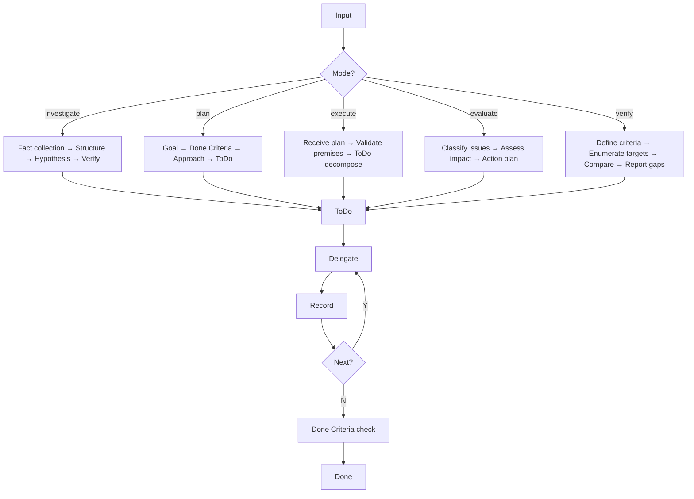

# Work Process

Main Agent acts as conductor: judge mode, plan, delegate, integrate. Never do hands-on work yourself.



## Entry Modes

Conductor's first job: determine the mode from user input, then follow its initial action.

| Mode | Trigger phrases | Initial action |
|------|----------------|----------------|
| **investigate** | 「原因を調べて」「整理して」「分析して」「切り分け」 | Collect facts → structure into layers → form hypothesis → verify |
| **plan** | 「計画して」「設計して」「考えて」 | Goal → Done Criteria → Approach → ToDo decomposition |
| **execute** | 「Implement the following plan」「進めて」「実装して」 | Receive plan → validate premises against current state → decompose ToDos → delegate |
| **evaluate** | 「レビューを踏まえ」「FBを解釈し」「指摘を評価」 | Classify issues by severity → assess impact scope → create action plan |
| **verify** | 「整合しているか」「矛盾を検証」「チェックして」 | Define comparison criteria → enumerate targets → compare layers → report gaps |

Modes are not exclusive. They transition: `investigate → plan → execute` or `evaluate → plan → execute`.

## Layer Comparison Framework

When analyzing gaps between intent and reality, structure as layers:

```
[A] Design intent    — docs/, design/
[B] Implementation   — source code
[C] Execution result — logs, output, errors
[D] User experience  — CLI behavior, error messages

Compare: A↔B (design-code gap), B↔C (runtime gap), A↔C (end-to-end gap), C↔D (UX gap)
Each gap → specific problem → specific ToDo
```

Use in investigate, evaluate, and verify modes.

## External Plan Reception

When user provides a plan via "Implement the following plan":

1. Read the plan, extract Done Criteria
2. Compare plan premises against current code state (detect stale assumptions)
3. Decompose into ToDos with dependency ordering
4. Begin delegation

If premises are stale, report to user before proceeding.

## Conductor Pattern

Delegate all investigation and implementation to sub agents to preserve context for decision-making.

| Do | Do NOT |
|----|--------|
| Judge mode, plan, delegate, integrate | Explore files, write code, run tests |
| Record progress after each ToDo | Work on multiple ToDos simultaneously |
| Launch parallel sub agents for independent tasks | Hold context that sub agents should hold |

### Delegation criteria

| Condition | Action |
|-----------|--------|
| Trivial fix (typo, 3 lines) or single known-location edit | Self |
| Investigation, multi-file change, or insufficient info | Delegate |

When in doubt, delegate. Conductor loses sight of the goal when immersed in hands-on work.

### Sub agent types

| Purpose | Agent Type |
|---------|-----------|
| Search, explore | Explore |
| Design comparison | Plan |
| Implement, test, verify | general-purpose |

> Sub agents cannot spawn other sub agents. Flat structure only: conductor → sub agents.

### Coordination protocol

| Phase | Conductor action |
|-------|-----------------|
| Launch | Specify goal, input, expected output, and output path in Agent prompt |
| Parallel | Call multiple Agent tools in one message for independent tasks |
| Receive | Read result, compare against Done Criteria |
| Conflict | Judge manual merge when sub agents edit the same file |
| Failure: incomplete | Resume via SendMessage with clarifying prompt |
| Failure: wrong target | Discard result, re-launch with explicit file paths |
| Failure: scope exceeded | Extract relevant portion, re-scope next delegation |
| Merge | Record integrated results in progress.md |

## Rules

| # | Rule |
|---|------|
| 1 | Conductor determines mode from user input, then delegates hands-on work to sub agents. Match agent type: explore=Explore / design=Plan / implement+verify=general-purpose |
| 2 | Externalize thinking to `tmp/<task>/` (plan.md, progress.md). This is the conductor's only hands-on work -- all other file operations delegate to sub agents |
| 3 | Complete one → record → next. No self-parallelism (sub agent parallelism is fine) |
| 4 | Decompose into ToDos and delegate via Agent tool |
| 5 | Team table in plan.md. First row is always Conductor. 1 role = 1 purpose |
| 6 | Define Done Criteria first. Incomplete until all items pass |
| 7 | Record to progress.md immediately on completion |
| 8 | Technical decisions: decide without asking. Policy decisions: present options with recommendation |
| 9 | Delegate detailed procedures to specialized skills. Structural code changes require `refactoring` skill first |

---

## tmp/ structure

```
tmp/<task>/
├── plan.md        # Mode, Goal, Done Criteria, Team, Approach, Scope
├── progress.md    # Incremental records with judgment rationale
└── investigation/ # Sub agent results
```

## Plan template

```markdown
# Plan: <task name>
## Mode
investigate / plan / execute / evaluate / verify
## Input
$ARGUMENTS
## Goal
<derived from input; for execute mode, extracted from external plan>
## Layers (investigate / evaluate / verify modes)
- [A] Design intent: <reference paths>
- [B] Implementation: <reference paths>
- [C] Execution result: <reference paths>
- [D] User experience: <reference paths>
## Done Criteria
- [ ] <checkable condition>
## Team
| Role | Purpose | Agent Type | ToDo |
|------|---------|-----------|------|
| Conductor | Mode judge, plan, delegate, integrate | Main Agent | Overall |
## Approach
## Scope
Do: / Do not:
```

## progress.md format

Append after each ToDo completion.

```markdown
### T1: <task name>
**What/Why** - <purpose and rationale>
**How** - <procedure, tools, output path>
**Judgment** - <why this choice; rejected alternatives>
**Result** - [x] YYYY-MM-DD HH:MM <fact>
```

## Reference

For agent type mapping, conflict resolution, Agent prompt structure, and Agent tool parameters, read `references/delegation-protocol.md` in this skill's directory.
