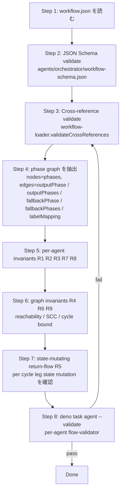

# Workflow Consistency

`.agent/workflow.json` の **cross-agent phase graph** を整合検証する skill。1 agent = 1 purpose を保ちつつ、phase graph 全体で「無限ループにならない」「return-flow が必ず別 agent の state-mutating step を経由する」「terminal / fallback / closeBinding が漏れなく宣言される」ことを確認する。検証は既存 validator (`workflow-loader.ts` + `flow-validator.ts`) を **invoke** し、cross-agent semantic check (R5 / R9) を上乗せする。

## When to Use / When NOT to Use

| Use this skill | Skip |
|---|---|
| `.agent/workflow.json` の `phases` / `agents` を 2 件以上追加・編集する | 1 agent 内の `steps_registry.json` を編集する → `/agent-step-design` |
| Return-flow / revision loop / handoff chain を新設する | C3L prompt の文面 / breakdown wrapper 解決ロジック |
| `closeBinding` / `fallbackPhase` / `outputPhases` の網羅性を見直す | `agent.json` の verdict type / maxIterations の調整 (per-agent) |
| 新しい agent を phase graph に組み込み、出入口を結線する | 既存 phase 1 つに priority を付け替えるだけ |
| Reviewer-precision PR で workflow graph を再点検する | `agents/orchestrator/*.ts` の実装変更 (skill ではなく code review 領域) |

per-agent の step graph (`steps_registry.json`) は **`/agent-step-design`** が source of truth。本 skill は **agent 同士の繋ぎ目**だけを扱う。両方が必要な PR では先に `/agent-step-design` を回し、step graph の正当性を確定させてから本 skill で workflow graph を見る。

## Decision Rules (絶対)

| # | Rule | 違反時の症状 |
|---|------|--------------|
| R1 | **1 agent = 1 purpose**: 1 agent definition は 1 directory / 1 role / 1 goal に紐づく。1 agent に 2 verb (例: classify + order, write + review) を持たせない | per-agent prompt が IF-THEN routing に腐り、`outputPhases` / `fallbackPhases` が増殖。状態の責務主体が不明になる |
| R2 | **Role purity**: `transformer` は 1 出力 (`outputPhase`)、`validator` は 多出力 (`outputPhases`) で **同じ agent に両 form を混在させない**。`fallbackPhase` は両 role 共通の optional だが、`fallbackPhases` (transformer の outcome 別 fallback) を使うなら verdict 分岐が必要なサインで、validator 昇格を検討 | role 宣言と実 outcome の semantics が乖離。schema validator は通っても dispatcher が予期せぬ phase へ落ちる |
| R3 | **Completion point per agent**: 各 actionable agent は到達可能な terminal phase (`type: "terminal"`) を **少なくとも 1 つ** `outputPhase` / `outputPhases` のいずれかから持つ。`fallbackPhase` だけが終端では「成功路の完了点」が無い | issue が happy path で永遠に閉じない。`done` ラベルが付かない / `closeBinding.primary` が発火しない |
| R4 | **Reachability from issueSource entry**: `labelMapping` で参照される全 phase が、`issueSource` / 初期 label 経由で必ず entry phase になりうる。`labelMapping` に無い phase は agent の `outputPhase(s)` / `fallbackPhase(s)` のみで到達可能でなければならない | 「labelMapping にも誰の outputPhase にも無い」orphan phase が `phases` に残る。silent dead state |
| R5 | **State-mutating return-flow** (本 skill 固有): 同一 issue が同 phase に再入する経路 (revision loop / handoff cycle) は、必ず **別 agent** の `transformer` か `validator` を経由し、その agent が **state を mutate** する step (label 付け替え / comment 投稿 / artifact 出力 / verdict emit) を実行する。考察 → 詳細化 → 実装 のような chain で「詳細化」が実体作業せずに即 forward すると、外形上 loop は閉じても **意味のある状態前進が起きない** | 例: `considerer → handoff-detail → detail-pending → detailer → handoff-impl → impl-pending → iterator` で `detailer` が SO だけ emit して comment / artifact を残さないと、iterator が同じ未仕様の issue を再受領して maxCycles まで grind する |
| R6 | **`maxCycles` / `maxConsecutivePhases` consistency**: `rules.maxCycles` は phase graph の **最長 legitimate path** + 余裕 1〜2 で設定。`maxConsecutivePhases` は revision loop / retry loop を持つ workflow で `3` 程度を目安に設定し、stuck pattern を `maxCycles` より先に捕まえる | 最長 path > maxCycles で完了前に `cycle_exceeded` 停止。逆に `maxConsecutivePhases=0` のまま revision loop を持つと、同 phase で 5 連続滞留しても気付けない |
| R7 | **Explicit `closeBinding` on terminal-producing agents**: terminal phase へ到達する `outputPhase` / `outputPhases` を持つ agent は `closeBinding.primary` を **実 close kind** (`direct` / `boundary` / `outboxPre` / `custom`) で declare する。terminal を出力しない agent は `none` を明記する。**Exception (sentinel-reuse, two-tier)**: 1) agent が marker label (`workflow.json#labels.<L>.role: "marker"`) 付き subject **専用** であり、2) prompt / README に「Sentinel reuse — must not be closed」を verbatim で明記すれば、terminal 出力でも `primary.kind: "none"` を許容。Close-skip だけが目的なら marker label 宣言で十分。`projectBinding` ブロックは cascade-close / parent-project inheritance が必要な場合に限り required | 省略すると `{ primary: "none" }` 等価 = silent に close しない。`done` ラベルだけ付いて issue が open のまま、という宙ぶらりん状態を生む。逆に sentinel subject を `direct` 等に書き換えると、`DirectClose.handleTransition` が一度きりの close を発火して再利用 issue が消滅する |
| R8 | **`fallbackPhase` on every actionable agent**: validator / transformer 問わず actionable agent には `fallbackPhase` を declare する。未定義のまま該当経路 (transformer の非 success / validator の未知 outcome) に落ちると `computeTransition` が `Error` を throw する | 例外 path が agent runtime まで波及し、orchestrator が abort。「迷ったら transformer で fallbackPhase は後回し」は罠 |
| R9 | **No bypass self-cycle**: agent A の `outputPhase` / `fallbackPhase` / `outputPhases.*` の値が **A 自身を直接担当する phase** を指す場合、その phase は別 agent / 外部状態 mutation を経由してから戻る経路でなければならない。`A → A_phase → A` の直接 self-cycle は retry loop (§3.2) として明示的に declare し、`maxCycles` で停止条件を持たせる。明示宣言なしの self-cycle は禁止 | 同 agent の同一 closure を繰り返し dispatch し、外部から見ると `cycle_exceeded` するまで無音で grind する |

R1 の根拠: `.agent/CLAUDE.md` の "directory layout convention" — `.agent/{agent-name}/` は 1 agent owner、cross-agent state は `.agent/climpt/` に局在。R1 を破ると agent 間の責務境界が消え、debug 時に「誰が label を付けたか / 誰が comment を投げたか」が log だけでは追えなくなる (`workflow-issue-states.md` §"遷移ごとの責務主体" も同設計を要求)。

R2 の根拠: `agents/docs/builder/06_workflow_setup.md` §"Agent 定義" + `agents/docs/builder/07_flow_design.md` §1.1 の role 仕様。schema (`agents/orchestrator/workflow-schema.json`) は `role: "transformer"` と `outputPhase` 必須、`role: "validator"` と `outputPhases` 必須を `allOf` で enforce するが、`fallbackPhases` (transformer 用 outcome map) は schema 上 transformer に許される — runtime semantics が validator 昇格サイン (`07_flow_design.md` §1.5) なので skill 側で gate する。

R5 の根拠: `agents/docs/design/realistic/16-flow-completion-loops.md` §C "CompletionLoop" + `.agent/workflow-issue-states.md` §"S2.running の kind 分岐". `kind:consider → kind:detail → kind:impl` の 3 段 chain は label の付け替えを **orchestrator が verdict を受けて実施** する設計だが、各 agent の closure step は **必ず comment を 1 件 emit** する (考察 / 仕様化 / 実装変更) ことで状態が前進する。本 skill は「graph 上 loop を閉じる」だけでは不十分で「loop の各 leg が state-mutating step を含む」ことを cross-agent invariant として check する。

R7 sentinel-reuse exception の根拠: `agents/scripts/project-init.ts:108-113` で生成される sentinel issue は body に "Do not close manually." を埋め込み、`planLabel` + marker label (例: `project-sentinel`) を貼って **長寿命の trigger** として再利用される設計。`agents/orchestrator/orchestrator.ts:1187-1224` の `DirectClose.handleTransition` は terminal 到達時に `gh issue close` を一度だけ発火するため、sentinel agent (例: `.agent/workflow.json` の `project-planner`: `outputPhase: "done"` + `closeBinding.primary.kind: "none"`) を `direct` 等に書き換えると sentinel が消滅する。R7 は通常 `none` を「silent に close しない」アンチパターンとして扱うが、sentinel-reuse は **意図的に close しない** 設計なので exception 対象。Exception の two-tier 判定: close-skip だけが目的なら marker label 宣言 (`workflow.json#labels.<L>.role: "marker"`) + prompt / README の verbatim 記述で成立。`projectBinding` ブロック宣言は cascade-close / parent-project inheritance を活性化する場合にのみ追加で required (loader が `evalPhase` + evaluator agent を強制するため、close-skip 単独では declare しない方が良い)。Reviewer は exception 主張側に marker label declaration と prompt / README の citation を要求する。

R9 の根拠: `agents/docs/builder/07_flow_design.md` §3.2 (Retry Loop) は `fallbackPhase` 経由の self-cycle を明示パターンとして承認しているが、`outputPhase` 経由の self-cycle は同 §3.6 と矛盾しない範囲でしか許容されない。明示パターンに当てはまらない self-cycle は無限ループの温床なので、skill で reject する。

## Process Flow



| Phase | 入力 | 出力 | 失敗の見え方 |
|-------|------|------|--------------|
| 1. Read | `.agent/workflow.json` | `WorkflowConfig` | file 不在 → `WF-LOAD-001` |
| 2. Schema | `workflow-schema.json` | accept / reject | `additionalProperties` 違反 / `allOf` 違反 |
| 3. Cross-ref | parsed config | `WF-REF-001..006`, `WF-PROJECT-*` の検出 | `Phase "X" references unknown agent "Y"` 等 |
| 4. Graph extract | parsed config | `Map<phaseId, edge[]>` | edge label = `outputPhase` / `outputPhases.<key>` / `fallbackPhase` / `fallbackPhases.<key>` / `labelMapping.<label>` |
| 5. Per-agent | each agent definition | R1 / R2 / R3 / R7 / R8 結果 | role purity 違反 / completion point 不在 / closeBinding 省略 |
| 6. Graph invariants | extracted graph | R4 / R6 / R9 結果 | orphan phase / SCC without exit / unbounded self-cycle |
| 7. State-mutating | extracted graph + agent role | R5 結果 | bypass return-flow (例: detailer が transformer/validator どちらでも emit が無い) |
| 8. Validate | `deno task agent --validate --agent <each>` | `Validation passed.` per agent | per-agent flow check (`flow-validator.ts`) で fail |

graph extraction は per-agent step graph と異なり、**phase node + agent edge** で構築する。1 agent が複数 phase で参照される場合 (例: `iterator` が `impl-pending` と `done` の間、`detailer` が `detail-pending` と `impl-pending` の間) は同じ agent ノードを複数 edge が指す形になる。

## Validation Commands

per-agent (内側) と cross-agent (本 skill 固有 R5 / R9) を順に走らせる。

```bash
# Step 1-3: workflow.json の structural / schema / cross-reference
deno run --allow-read --allow-env agents/scripts/run-agent.ts --validate --agent <agent-name>
# (loader が WF-* error を throw)

# Step 8 (内側): per-agent flow validator (steps_registry.json を含む agent 単位)
deno task agent --validate --agent <agent-name>
# 各 agent 個別に走らせる。本 skill では「workflow.json で参照する全 agent」が対象
```

`deno task agent --validate` は `agents/scripts/run-agent.ts:168-507` (`if (args.validate)` ブロック) で `validateFull(agent, cwd)` を実行し、その内部で `flow-validator.ts` (per-agent step graph) と `workflow-loader.ts` (workflow.json) を逐次 invoke する。本 skill は workflow.json 側 (cross-agent) の rule を上乗せするため、`flow-validator` の output に対し R5 / R9 のチェックを **手で** 重ねる手順 (Process Flow §7) を踏む。

**error code 読み方**: `agents/shared/errors/config-errors.ts` の WF-* prefix は workflow.json 由来、SR-* / AC-* は steps_registry / agent.json 由来。本 skill が trigger するのは原則 WF-* + 本 skill 独自診断 (R5 / R9) のみ。SR-* が出た場合は `/agent-step-design` 領域に逸脱しているので skill を切り替える。

| Error code prefix | 由来 | 本 skill での扱い |
|-------------------|------|-------------------|
| `WF-LOAD-*` | workflow.json 読み込み (`config-errors.ts` L387–417) | Step 1 で fail-fast |
| `WF-SCHEMA-*` | required field 欠落 (L419–457) | Step 2 |
| `WF-PHASE-*` | phase 個別違反 (L461–497) | Step 2 |
| `WF-LABEL-*` | labelMapping / labels (L499–561) | Step 3 |
| `WF-RULE-*` | `rules.*` (L563–581) | Step 6 R6 |
| `WF-REF-*` | cross-reference (L585–668) | Step 3 |
| `WF-PROJECT-*` | projectBinding (L672–823) | Step 3 (sentinel / done / eval / plan) |
| `WF-ISSUE-SOURCE-*` | issueSource ADT (L1278–) | Step 2-3 |
| (本 skill 独自) | R5 / R9 違反 | Step 7 / Step 6 で手で診断、issue として report |

R5 / R9 は既存 validator では検出されない (semantic invariant のため)。本 skill が検出した場合は WF-* と並べて「[skill:WORKFLOW-CONSISTENCY-R5] Bypass return-flow detected: <agent> <phase> ...」のように prefix を付けて report する。

## State-Mutating Return-Flow Invariant (R5 の applier-driven check)

return-flow (= 同 issue が複数 cycle を経て同 phase に再入する経路) を見つけたら、loop を構成する各 leg が **state を mutate** することを 1 つずつ確認する。本 skill では state mutation を以下の 4 つで定義する。

| Mutation kind | どこで起きる | 確認方法 |
|---------------|--------------|----------|
| (a) Label change | orchestrator が `labelMapping` 経由で `gh issue edit --add/--remove-label` | agent の `outputPhase(s)` が **異なる label** が貼られる phase を指している |
| (b) Comment post | agent の closure step が `handoffFields` 経由で template を埋め、`workflow.handoff.commentTemplates` が投稿 | `commentTemplates` に該当キー (`{agentId}{Outcome}` / `{agentId}To{Outcome}`) が存在し、本文が空でない |
| (c) Artifact emit | agent が `.agent/climpt/tmp/...` 配下に file を置く / outbox payload を produce | per-agent `steps_registry.json` の `handoffFields` で artifact key を宣言 (skill 外参照、`/agent-step-design` 領域) |
| (d) Verdict emit | validator agent が `outputPhases` のキーに乗る verdict を SO から emit | per-agent closure step の `outputSchemaRef` enum + `structuredGate.handoffFields` で verdict 値が観測可能 |

**Diff 手順** (Step 7):

1. graph 上の SCC (Strongly Connected Component) を列挙する。SCC が 1 phase だけなら R9 へ (self-cycle)。
2. 2 phase 以上の SCC について、その SCC を構成する agent を順に並べる (例: `consider-pending → considerer → detail-pending → detailer → impl-pending → iterator → done` が cycle なら `[considerer, detailer, iterator]`)。
3. 各 agent について (a)-(d) のいずれかを満たすか確認する。`closeBinding.primary === "none"` かつ `commentTemplates` も無い agent は (b) を欠いているサイン。`directory` に対応する `steps_registry.json` の closure step `handoffFields` も併読する。
4. 1 つでも欠けていれば R5 違反。skill report に `[R5] Agent "<id>" lacks state mutation in return-flow leg: <phase-from> → <phase-to>` を出す。

**典型的な silent bypass パターン**:

- detailer の closure step が `handoffFields: ["verdict"]` のみで `comment_body` を持たず、`commentTemplates.detailerHandoffImpl` も未定義 → (b)/(c) 共に欠落。`handoff-impl` verdict は emit されるが、issue body / comment が変化しない
- considerer が `outputPhases: { done: done, handoff-detail: detail-pending }` を持つのに `closeBinding.primary === "none"` → done verdict 時に close されず、(a) の `done` label のみ。orchestrator の `closeOnComplete` (legacy) が無いと `S3.done` (closed) 状態に到達しない
- iterator が `fallbackPhase: "blocked"` だけ持ち、`fallbackPhases` で `git-dirty` と `branch-not-pushed` を区別しない → recovery agent が無い ad-hoc loop で grind する (R6 で maxConsecutivePhases を要求)

これらは `WF-REF-*` / `WF-PHASE-*` には現れない (cross-reference は通る)。R5 が検出する責務範囲。

## Bypass Self-Cycle Rule (R9 の rule book)

`outputPhase` / `outputPhases.*` / `fallbackPhase` / `fallbackPhases.*` のいずれかが、**その値を出力する agent 自身が担当する phase** を指す経路を「self-cycle」と呼ぶ。`07_flow_design.md` §3.2 / §3.5 / §3.6 で declarative に承認される 3 パターン以外は禁止。

| Pattern | 経路 | 承認条件 |
|---------|------|----------|
| Retry Loop (`07_flow_design.md` §3.2) | `A.fallbackPhase = a-pending` (= A の担当 phase) | `rules.maxCycles` で停止。idempotent agent が望ましい。明示的 declare として skill が認める |
| Recovery → Resume (§3.5) | `A.fallbackPhase = recovery-pending` → `recovery.outputPhase = a-pending` | A 自身は self-cycle ではない。recovery agent が間に挟まる (本 skill 的には R9 違反ではなく R5 を満たすべき) |
| Revision Loop (§3.3) | `writer.outputPhase = review-pending` → `reviewer.outputPhases.rejected = revision-pending` → `writer` 再 dispatch | A (writer) は別 phase 経由でしか戻らないので self-cycle ではない (R5 観点で reviewer の verdict emit が状態前進) |

**判定手順** (Step 6):

1. 各 agent A について、A が担当する phase 集合 `P_A = { p | phases[p].agent === A }` を集める
2. A の出力 edge (`outputPhase`, `outputPhases.*`, `fallbackPhase`, `fallbackPhases.*`) の値 `q` について `q ∈ P_A` を check
3. true なら self-cycle 候補。表の Retry Loop に当てはまる (`fallbackPhase` 経由 + `rules.maxCycles` 設定済み + agent role が transformer) なら承認
4. それ以外の self-cycle は R9 違反として report

## Exceeded History Analysis (post-incident forensics)

`"status": "cycle_exceeded"` (`agents/orchestrator/orchestrator.ts:527-540`) は **「処理が期待通りに前進しなかった」サイン** であり、`maxCycles` の閾値が低いサインではない。閾値を上げて黙らせる対処は反パターンで、history を読んで「どの leg で state mutation が起きていなかったか / どの phase で self-cycle が回ったか」を診断し、R5 / R6 / R9 の根本原因に対処する。

### Local record の在り処

cycle 履歴 / cycleCount は per-issue (subjectId 単位) で disk に永続化される。

| Item | Value |
|------|-------|
| Path schema | `<subjectStore.path>/<subjectId>/workflow-state.<workflowId>.json` |
| Default `subjectStore.path` (workflow.json で未指定時) | `.agent/climpt/tmp/issues` (`agents/orchestrator/workflow-types.ts:362-365`) |
| `.agent/workflow.json` で設定済みの path | `.agent/climpt/tmp/issues-execute` (`subjectStore.path` field) |
| 書き込み実装 | `agents/orchestrator/subject-store.ts:179-191` (`SubjectStore#writeWorkflowState`) |
| 書き込み trigger | `agents/orchestrator/orchestrator.ts:1310-1316` (dispatch 後) |
| 復元 (次回起動時) | `agents/orchestrator/orchestrator.ts:340-376` |
| 増分 | `agents/orchestrator/orchestrator.ts:1287` (本番 dispatch) / `1324` (dry-run) |
| 判定 | `agents/orchestrator/cycle-tracker.ts:48-50` (`isExceeded`: `count >= maxCycles`) |
| `getCount` 実装 | `agents/orchestrator/cycle-tracker.ts:87-89` (history 配列長) |

履歴 entry には phase / agent / outcome / timestamp が含まれる。orchestrator は `count >= maxCycles` で `status: "cycle_exceeded"` を立てる。

### Analysis 手順

1. **history を読む**: 対象 issue の workflow-state を `jq` で展開する。配列の phase 列挙が実際の遷移軌跡で、agent / outcome 列を併読する。

   ```bash
   cat .agent/climpt/tmp/issues-execute/<N>/workflow-state.<workflowId>.json | jq '.history'
   ```

2. **パターン抽出**: 連続する entry を並べ、以下のいずれに当てはまるか分類する。

   | Pattern | history shape | 違反 rule |
   |---------|---------------|-----------|
   | A. 同 phase 連続 | `[X, X, X, ...]` 1 agent が同 phase に再 dispatch | R9 (明示宣言なしの self-cycle) |
   | B. 2 phase 振動 | `[X, Y, X, Y, ...]` A↔B の return-flow で B agent が state mutation を欠く | R5 |
   | C. 線形だが長い | `[X, Y, Z, W, ...]` 最長 path が `maxCycles` を超える | R6 (`maxCycles` の設計値が低すぎる or graph が長すぎる) |

3. **mutation 欠落の検査** (パターン B / C 用): 各 leg を構成する agent について `commentTemplates` / closure step `handoffFields` / artifact 出力 / verdict emit のいずれかが効いているかを §"State-Mutating Return-Flow Invariant" の (a)-(d) 表で 1 つずつ確認する。

4. **Resolution の選択**: 違反 rule が R5 / R9 なら graph 修正 (P3 / P4) を優先。R6 単独 (線形に長い) と判明した場合のみ `maxCycles` を最長 path + 1〜2 で正当に引き上げる。**閾値だけを上げる修正は禁止** — R5 / R9 の grind を遅らせるだけで、無限ループ化する。

### Manual reset

graph 修正後に history を残したまま起動すると、過去 cycle を引き継いだまま `cycle_exceeded` が再発する。修正後 1 度だけ history を捨てる。

```bash
rm .agent/climpt/tmp/issues-execute/<N>/workflow-state.*.json
```

reset の正規手順は `.agent/recovery-procedures.md` を参照。reset を「graph 修正なし」に行うと、症状が再発するだけで無意味。

### `--project` scope の効き方

`--project tettuan/41` 等の project scope は **対象 issue のフィルタ** にしか効かない (`agents/scripts/run-workflow.ts:148, 214, 224` / `agents/orchestrator/batch-runner.ts:203-295`)。cycle 計上は per-issue (subjectId 単位、`agents/orchestrator/cycle-tracker.ts:39-44`)。

project 単位 / global の cycle counter は存在しないので、`--project` を変えても history には影響しない。issue 単位の history を直接 reset する必要がある。

## Resolution Principles (解決策の判断基準)

違反を検出した後、どう直すかの判断軸。R1–R9 の各 rule の reverse 視点で、`/option-scoring` の derived axes として使える設計指針。

1. **P1: agent は 1 目的 1 役割**。ゴール到達が明確な線形にする。1 agent の closure が 2 verb (例: classify + order, write + review) に分裂していたら agent を分割する。R1 / R3 と対応。
2. **P2: workflow の評価で、線形なステップが描けない場合、agent を追加・統合してよい**。phase graph を上から下に追えない (orphan branch / 無方向な分岐 / 責務不明な中継 phase) 場合、agent を新設するか既存 agent を統合して再線形化する。R3 / R4 と対応。
3. **P3: 複雑なループは分岐が多いケース。分岐は必ず 1 つの線形に戻すようにつくる**。
   - 例: `a → b → {c,d,e} → f` のように、分岐後は必ず合流 phase を 1 つ持たせる。
   - 合流先 (`f`) が無い分岐は dead leaf を生み、`outputPhases` の expand で issue が宙に浮く。R5 と対応。
4. **P4: 回帰的なループは無限ループの可能性があるため、step が必ず進展をさせるか強く評価する**。
   - 「単純な差し戻し」→「同一処理」が無限ループ構造。
   - この場合は差し戻し先を変えて、差し戻し処理を経てから本来の差し戻し場所へ戻させる。
   - 例: c で b に戻したい時、`a→b→c→b→c→d...` は危険。`a→b→c→{b1,b2,b3...}→b→c→d` を期待する。
   - R5 / R9 と対応。

| Symptom | Applicable principle | Fix shape | Related rule |
|---|---|---|---|
| 1 agent に 2 verb (classify + order 等) | P1 | agent 分割 | R1 |
| phase graph が分岐しすぎて線形に追えない | P2 | agent 追加 / 統合で再線形化 | R3 / R4 |
| 同一 input から複数 outcome に分岐するが合流先が無い | P3 | 分岐先を 1 つの線形に集約 (`{c,d,e} → f`) | R5 |
| 単純な差し戻し self-loop (`c → b → c → b ...`) | P4 | 差し戻し leg を別 phase 群経由に変える (`c → {b1,b2,b3} → b`) | R5 / R9 |

**When to apply which principle**:

- 各 agent が 1 verb に収まるか? → No なら P1 で分割
- phase graph を線形に辿れるか? → No なら P2 で agent 追加 / 統合
- 分岐後に合流点があるか? → No なら P3 で合流 phase を追加
- return-flow の各 leg に state mutation があるか? → No なら P4 で間接化 (intermediate phase 群を挟む)

## Anti-Patterns

| Anti-pattern | なぜダメか | 直し方 |
|--------------|------------|--------|
| **Multi-purpose agent** (例: triager が classify + order を兼ねる) | R1 違反。input cardinality (per-issue / batch) が混ざり、prioritizer 契約が破綻 (`.agent/workflow-issue-states.md` §G-PRIORITIZER) | agent を分割 (`triager` per-issue / `prioritizer` batch)。workflow.json の `prioritizer.agent` を後者に向ける |
| **Implicit `closeBinding`** (terminal を出力する agent で省略) | R7 違反。`{ primary: "none" }` 等価 = `done` ラベル付きで open のまま放置。`closeOnComplete` legacy 文字列で書いている場合は loader が reject (T6.2) | `closeBinding.primary.kind` を `direct` 等で明示。validator で outcome 別に close したいなら `condition` を `outputPhases` のキーに合わせる (`WF-REF-006` 回避) |
| **Sentinel-pattern 見落とし** (sentinel subject 対象 agent で `none` を `direct` に書き換える) | R7 sentinel-reuse exception 違反。marker label (`workflow.json#labels.<L>.role: "marker"`) 付き subject は再利用前提なので、`DirectClose.handleTransition` (`agents/orchestrator/orchestrator.ts:1187-1224`) が一度きりの close を発火すると trigger が消える | exception 該当条件 (marker label + prompt verbatim 記述) を agent prompt / README で確認してから `none` を維持。書き換えない |
| **Missing `fallbackPhase`** (validator / transformer 問わず) | R8 違反。`computeTransition` が `Error` throw (`07_flow_design.md` §1.1) | actionable agent には必ず `fallbackPhase: "<blocking 系 phase>"` を declare。blocking phase は `type: "blocking"` で別途宣言 |
| **Orphan phase** (`labelMapping` にも `outputPhase(s)` にも参照されない) | R4 違反。silent dead state。`WF-LABEL-*` / `WF-REF-*` は通る | unused phase を削除する。意図的な dispatch-target なら `labelMapping` に entry を追加 |
| **Bypass return-flow** (`considerer → handoff-detail → detailer → handoff-impl → iterator` で detailer が comment 投稿しない) | R5 違反。loop は閉じるが状態前進が無く、iterator が同じ未仕様 issue を再受領 | detailer の closure step に comment 投稿を含む `handoffFields` を declare し、`workflow.handoff.commentTemplates.detailerHandoffImpl` を template 化 |
| **Unbounded self-cycle** (`A.outputPhase = A_phase` を retry 宣言なしで設定) | R9 違反。明示的 declare なしの self-cycle は無音 grind の温床 | `fallbackPhase` 経由の retry loop に書き換える、または別 agent (recovery) を挟む。`rules.maxCycles` を最長 path + 1〜2 で設定 |
| **`maxCycles` 設定漏れ** (revision loop 持ちで default 5 のまま) | R6 違反。最長 path > 5 で `cycle_exceeded` 早期停止 | 最長 path を workflow.json から手で辿り、+1〜2 で設定 (`07_flow_design.md` §2.3 の例)。`maxConsecutivePhases=3` も併設 |
| **`cycle_exceeded` を `maxCycles` 引き上げで黙らせる** | 症状の閾値だけを上げる対処は R5 / R9 の bypass loop を温存し、無限 grind の閾値を上げるだけになる。`cycle_exceeded` は「処理が期待通り前進していない」サイン | history (`workflow-state.<workflowId>.json`) を読み、A / B / C パターンに分類して R5 / R9 の graph 修正を優先。R6 単独 (線形に長い) と判明した場合のみ閾値を上げる。詳細は §"Exceeded History Analysis" |
| **Schema-only review で workflow を承認** | R5 / R9 を見逃す。schema validator は structural のみ | Process Flow の Step 5–7 を必ず通す。`deno task agent --validate` 結果だけで済ませない |
| **`prioritizer.agent` を per-issue agent に向ける** | `.agent/workflow-issue-states.md` §G-PRIORITIZER の契約 (batch comparative) 違反 | `Prioritizer.run` が要求する batch 契約 (`issue-list.json` 全件 → `priorities.json`) を満たす独立 agent を別 directory に立てる |

## Quick Check

```
R1: - [ ] 各 agent definition が 1 directory / 1 role / 1 goal
R2: - [ ] transformer は outputPhase 単数のみ (fallbackPhases を使うなら validator 昇格を再考)
R3: - [ ] 各 actionable agent に terminal phase に到達する出力経路がある
R4: - [ ] phases に列挙された全 phase が labelMapping か他 agent の出力経路から到達可能
R5: - [ ] return-flow を構成する全 leg が state mutation (label / comment / artifact / verdict) を持つ
R6: - [ ] rules.maxCycles >= 最長 legitimate path + 1〜2
       - [ ] revision loop 持ちなら maxConsecutivePhases を 3 程度に設定
R7: - [ ] terminal phase を出力する agent は closeBinding.primary を実 close kind (direct/boundary/outboxPre/custom) で明示宣言
       - [ ] terminal を出力しない agent も closeBinding.primary = "none" を明記
       - [ ] sentinel-reuse exception を主張する場合、対象 subject が marker label (`workflow.json#labels.<L>.role: "marker"`) を持ち、agent prompt / README に "Sentinel reuse — must not be closed" が verbatim で明記されていること (projectBinding 宣言は cascade-close / inheritance が必要なときのみ追加)
R8: - [ ] 全 actionable agent に fallbackPhase が declare されている
R9: - [ ] 明示宣言なしの self-cycle (outputPhase / outputPhases.* が自 agent の phase) が無い

Validation:
   - [ ] deno task agent --validate --agent <each agent referenced from workflow.json> が pass
   - [ ] R5 / R9 の手診断を report に書き出した (skill 独自診断)

Resolution check (P1–P4):
   - [ ] P1: 各 agent が 1 verb / 1 goal に収まるか
   - [ ] P2: phase graph を線形に辿れるか (辿れない場合は agent 追加 / 統合を検討)
   - [ ] P3: 分岐がある場合、合流 phase が 1 つに収束するか
   - [ ] P4: return-flow の各 leg が間接化 (intermediate phase 群経由) されているか

Forensics (post-incident):
   - [ ] cycle_exceeded を観測した場合、`.agent/climpt/tmp/issues-execute/<N>/workflow-state.<workflowId>.json` の history を read した
   - [ ] history 軌跡を A (self-cycle) / B (2-phase 振動) / C (線形長過ぎ) に分類した
   - [ ] 違反 rule (R5 / R6 / R9) を identify してから graph 修正 / 閾値調整を選んだ
   - [ ] 修正後、history を `rm` で reset した上で再実行を verify した
```

## References (intra-skill)

| Topic | Reference |
|-------|-----------|
| 9 rule の formal definition + phase graph notation + bypass-loop invariant | [`references/graph-rules.md`](references/graph-rules.md) |
| 検証コマンドの正確な invocation + error code mapping | [`references/validation-commands.md`](references/validation-commands.md) |
| Worked examples (valid return-flow / invalid bypass-loop) | [`references/examples.md`](references/examples.md) |

## References (project docs)

- `agents/docs/builder/06_workflow_setup.md` §"Phase 定義" / §"Agent 定義" / §"Close binding (per agent)" / §"Rules" — workflow.json field semantics
- `agents/docs/builder/07_flow_design.md` §1 "Role の選び方" / §2 "Cycle とは何か" / §3 "Flow Patterns" — design rationale, retry / revision / recovery / escalation patterns
- `agents/docs/builder/10_archetypes.md` §"3 原型 比較表" / §"原型 C — Branching + Validator" — agent archetype 入力として
- `agents/docs/design/realistic/12-workflow-config.md` §B "WorkflowConfig (root ADT)" / §F "Boot validation" W1–W11 — schema-level invariant の正典
- `agents/docs/design/realistic/15-dispatch-flow.md` §C "Multi-agent dispatch (sequential model)" — phase versioning と R9 self-cycle 禁止の根拠
- `agents/docs/design/realistic/16-flow-completion-loops.md` §C "CompletionLoop" / §F "SO single hinge" — Closure step を経由する verdict emit と state mutation
- `.agent/CLAUDE.md` §"Directory layout" — 1 directory = 1 agent の運用契約
- `.agent/recovery-procedures.md` — workflow-state poisoning 後の手動 reset 手順 (cycle_exceeded forensics と組合せ)
- `.agent/workflow-issue-states.md` §"S2.running の kind 分岐" / §"遷移ごとの責務主体" / §"G-ITER-CLOSE" / §"C3" — return-flow chain の現行設計と歴史的修復経緯

## References (code citation)

- `agents/orchestrator/workflow-schema.json` — JSON Schema (本 skill が参照する authoritative schema)
- `agents/orchestrator/workflow-types.ts` — `WorkflowConfig` / `PhaseDefinition` / `AgentDefinition` / `WorkflowRules` 型
- `agents/orchestrator/workflow-loader.ts` `loadWorkflow()` / `validateRequiredFields` / `validateCrossReferences` — Step 1-3 の実装
- `agents/orchestrator/phase-transition.ts` — `computeTransition` (R3 / R8 の throw 挙動の根拠)
- `agents/config/flow-validator.ts` — per-agent step graph 用 (本 skill は **invoke** するだけで、reimplement しない)
- `agents/shared/errors/config-errors.ts` — `WF-*` error catalog (Validation Commands §"error code 読み方" 表の出典)

Cross-skill:

- `/agent-step-design` — per-agent steps_registry.json 設計。本 skill は **cross-agent**、agent-step-design は **per-agent** の責務分担
- `/option-scoring` — workflow shape の候補比較 (例: revision loop vs recovery → resume) 時に先行で実行
- `/logs-analysis` — runtime artifact (orchestrator session JSONL) で R5 / R6 違反の症状 (`cycle_exceeded`, `phase_repetition_exceeded`) を観測する場合
