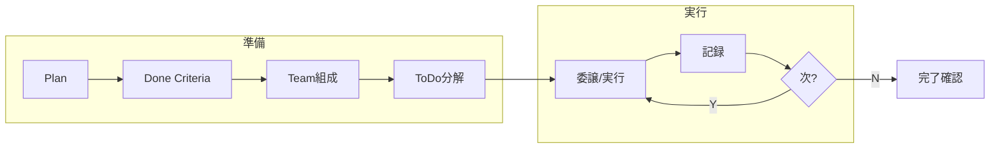
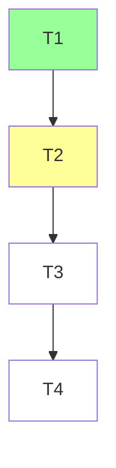

# Workflow



## Conductor（指揮者）パターン

メインAgentは**指揮者**として振る舞う。自ら手を動かすのではなく、計画・委譲・判断・統合に専念する。

### 指揮者の責務

| 責務 | 内容 |
|------|------|
| 計画 | Goal → Done Criteria → Team → ToDo の設計 |
| 委譲 | 各ToDoを適切なSub Agentに割り当て、Task toolで起動 |
| 判断 | Sub Agent成果物の採否、方針変更、ユーザーへの確認 |
| 統合 | Sub Agent結果を合流させ、最終成果物にまとめる |
| 記録 | progress.mdへの記録、ToDo進捗の更新 |

### 指揮者がやらないこと

- ファイル探索・コード調査（→ Explore Agent）
- 設計案の比較検討（→ Plan Agent）
- 実装・テスト実行（→ general-purpose Agent）
- 上記をSubAgentに委譲せず自分で行うこと

### 委譲の判断基準

| 条件 | 判断 |
|------|------|
| 3行以内の即時修正（typo等） | 自分で実行 |
| 単一ファイルの既知箇所への変更 | 自分で実行 |
| 調査・探索が必要 | Sub Agentへ委譲 |
| 複数ファイルの横断的変更 | Sub Agentへ委譲 |
| 判断材料が不足 | Sub Agentで調査→結果を元に判断 |

原則: **迷ったら委譲する**。指揮者が実作業に没入するとゴール全体の見通しを失う。

### Agent間調整プロトコル

```
指揮者 ──prompt──→ Sub Agent A ──result──→ 指揮者（統合）
   │                                          │
   └──prompt──→ Sub Agent B ──result──→────────┘
```

| フェーズ | 指揮者の行動 |
|----------|-------------|
| 起動 | Task toolでpromptに「目的・入力・期待出力・出力先」を明記 |
| 並列実行 | 独立タスクはTask toolを同一メッセージで複数呼び出し |
| 成果物受領 | Sub Agent結果を読み、Done Criteriaと照合 |
| コンフリクト | 同一ファイルへの変更が競合→指揮者が手動マージ判断 |
| 不足・失敗 | 追加のSub Agentを起動、またはpromptを修正して再委譲 |
| 合流 | 全Sub Agent完了後、統合結果をprogress.mdに記録 |

## Rules

| # | 指示 |
|---|------|
| 1 | **メインAgentは指揮者**。計画・委譲・判断・統合に専念し、実作業はSub Agentに委譲する |
| 2 | `tmp/<task>/`に plan.md, progress.md, analysis.md を書き出す（思考の外部化） |
| 3 | 1つ完了→記録→次。指揮者自身は同時並行しない（Sub Agentの並列起動は可） |
| 4 | Plan(全体像)を TaskCreate で ToDo(実行単位)に分解 |
| 5 | plan.md に Team テーブル記載。先頭行は必ず指揮者(Conductor)。1Role=1目的、混合禁止 |
| 6 | 調査はSubAgentへ委譲: 探索=Explore / 設計=Plan / 実行・検証=general-purpose |
| 7 | Done Criteria を先に定義。全項目達成まで未完了 |
| 8 | 完了即 progress.md に記録（形式は後述） |
| 9 | 技術的に明確→自分で判断し聞かない。方針判断→選択肢+推奨を提示（「どうしますか？」禁止） |
| 10 | 分析・依存関係は Mermaid で analysis.md に図示。ToDo全体もMermaidでプロットし現在地を色分け |
| 11 | 詳細手順は専門skillに委譲。方向不明時は `thinking-method` skill |

---

## tmp/構造

```
tmp/<task>/
├── plan.md        # Goal, Done Criteria, Team, Approach, Scope
├── progress.md    # 記録蓄積
├── analysis.md    # Mermaid図
└── investigation/ # SubAgent結果
```

## Planテンプレート

```markdown
# Plan: <タスク名>
## Goal
## Done Criteria
- [ ] <チェック可能な条件>
## Team
| Role | 目的 | Agent Type | 担当ToDo |
|------|------|-----------|---------|
| Conductor | 計画・委譲・判断・統合 | メインAgent | 全体管理 |
## Approach
## Scope
やること: / やらないこと:
```

## skill文書の作成・改善

→ token圧縮は `prompt-compression` skill

## progress.md 記録

ToDo完了ごとに追記。What/Why(判断根拠)とHow(手順)は分離する。

```markdown
### T1: <タスク名>
**What/Why** - <目的・理由>
**How** - <手順・ツール・出力先>
**Result** - [x] YYYY-MM-DD HH:MM <事実>
```

## ToDoマッピング例



## 質問テンプレート

```markdown
## 確認: <テーマ>
| 案 | 概要 | メリット | デメリット |
|----|------|---------|-----------|
| A（推奨）| | | |
| B | | | |
→ A案で進めてよいですか？
```
