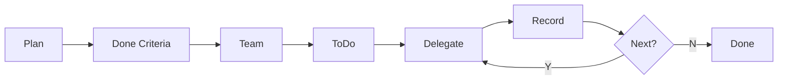

# Workflow

Main Agent acts as conductor: plan, delegate, judge, integrate. Never do hands-on work yourself.



## Conductor Pattern

Delegate all investigation and implementation to Sub Agents to preserve context for decision-making.

| Do | Do NOT |
|----|--------|
| Plan, delegate, judge, integrate | Explore files, write code, run tests |
| Record progress after each ToDo | Work on multiple ToDos simultaneously |
| Launch parallel Sub Agents for independent tasks | Hold context that Sub Agents should hold |

### Delegation criteria

| Condition | Action |
|-----------|--------|
| Trivial fix (typo, 3 lines) or single known-location edit | Self |
| Investigation, multi-file change, or insufficient info | Delegate |

When in doubt, delegate. Conductor loses sight of the goal when immersed in hands-on work.

### Sub Agent types

| Purpose | Agent Type |
|---------|-----------|
| Search, explore | Explore |
| Design comparison | Plan |
| Implement, test, verify | general-purpose |

### Coordination protocol

| Phase | Conductor action |
|-------|-----------------|
| Launch | Specify goal, input, expected output, and output path in Task prompt |
| Parallel | Call multiple Task tools in one message for independent tasks |
| Receive | Read result, compare against Done Criteria |
| Conflict | Judge manual merge when Sub Agents edit the same file |
| Failure | Re-launch with revised prompt, or launch additional Sub Agent |
| Merge | Record integrated results in progress.md |

## Rules

| # | Rule |
|---|------|
| 1 | Conductor delegates all hands-on work to Sub Agents |
| 2 | Externalize thinking to `tmp/<task>/` (plan.md, progress.md, analysis.md) |
| 3 | Complete one → record → next. No self-parallelism (Sub Agent parallelism is fine) |
| 4 | Decompose Plan into ToDos via TaskCreate |
| 5 | Team table in plan.md. First row is always Conductor. 1 role = 1 purpose |
| 6 | Delegate by type: explore=Explore / design=Plan / implement+verify=general-purpose |
| 7 | Define Done Criteria first. Incomplete until all items pass |
| 8 | Record to progress.md immediately on completion |
| 9 | Technical decisions: decide without asking. Policy decisions: present options with recommendation |
| 10 | Visualize dependencies and ToDo map in analysis.md with Mermaid |
| 11 | Delegate detailed procedures to specialized skills. When direction is unclear, use `thinking-method` skill |
| 12 | Structural code changes (module moves, renames, old path deletions) require `refactoring` skill first |

---

## tmp/ structure

```
tmp/<task>/
├── plan.md        # Goal, Done Criteria, Team, Approach, Scope
├── progress.md    # Incremental records
├── analysis.md    # Mermaid diagrams
└── investigation/ # Sub Agent results
```

## Plan template

```markdown
# Plan: <task name>
## Goal
## Done Criteria
- [ ] <checkable condition>
## Team
| Role | Purpose | Agent Type | ToDo |
|------|---------|-----------|------|
| Conductor | Plan, delegate, judge, integrate | Main Agent | Overall |
## Approach
## Scope
Do: / Do not:
```

## progress.md format

Append after each ToDo completion. Separate What/Why (rationale) from How (procedure).

```markdown
### T1: <task name>
**What/Why** - <purpose and rationale>
**How** - <procedure, tools, output path>
**Result** - [x] YYYY-MM-DD HH:MM <fact>
```

## Question template

```markdown
## Decision: <topic>
| Option | Summary | Pro | Con |
|--------|---------|-----|-----|
| A (recommended) | | | |
| B | | | |
→ Proceed with A?
```

## Reference

For agent type mapping, conflict resolution, and Task prompt structure, read `delegation-protocol.md` in this skill's directory.
