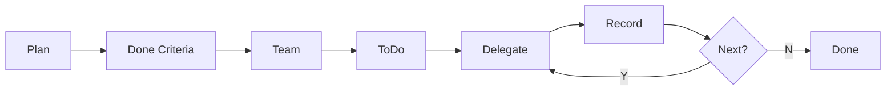

# Workflow

Main Agent acts as conductor: plan, delegate, judge, integrate. Never do hands-on work yourself.


```mermaid
flowchart LR
    A[Plan] --> B[Done Criteria] --> C[Team] --> D[ToDo]
    D --> E[Delegate] --> F[Record] --> G{Next?}
    G -->|Y| E
    G -->|N| H[Done]
```

## Conductor Pattern

Delegate all investigation and implementation to sub agents to preserve context for decision-making.

| Do | Do NOT |
|----|--------|
| Plan, delegate, judge, integrate | Explore files, write code, run tests |
| Record progress after each ToDo | Work on multiple ToDos simultaneously |
| Launch parallel sub agents for independent tasks | Hold context that sub agents should hold |

### Delegation criteria

| Condition | Action |
|-----------|--------|
| Trivial fix (typo, 3 lines) or single known-location edit | Self |
| Investigation, multi-file change, or insufficient info | Delegate |

When in doubt, delegate. Conductor loses sight of the goal when immersed in hands-on work.

### Sub agent types

| Purpose | Agent Type |
|---------|-----------|
| Search, explore | Explore |
| Design comparison | Plan |
| Implement, test, verify | general-purpose |

### Agent tool parameters

| Parameter | Values | When to use |
|-----------|--------|-------------|
| `subagent_type` | `Explore`, `Plan`, `general-purpose` | Match to task purpose |
| `run_in_background` | `true` | Independent tasks that don't block next steps |
| `isolation` | `"worktree"` | Parallel implementation agents editing files |
| `model` | `sonnet`, `haiku`, `opus` | Cost optimization (e.g., haiku for exploration) |

> Sub agents cannot spawn other sub agents. Design delegation as a flat structure: conductor -> sub agents. Never instruct a sub agent to further delegate.

### Coordination protocol

| Phase | Conductor action |
|-------|-----------------|
| Launch | Specify goal, input, expected output, and output path in Agent prompt |
| Parallel | Call multiple Agent tools in one message for independent tasks |
| Receive | Read result, compare against Done Criteria |
| Conflict | Judge manual merge when sub agents edit the same file |
| Failure: incomplete | Resume via SendMessage with clarifying prompt |
| Failure: wrong target | Discard result, re-launch with explicit file paths |
| Failure: scope exceeded | Extract relevant portion, re-scope next delegation |
| Merge | Record integrated results in progress.md |

## Rules

| # | Rule |
|---|------|
| 1 | Conductor delegates all hands-on work to sub agents. Match agent type to task: explore=Explore / design=Plan / implement+verify=general-purpose |
| 2 | Externalize thinking to `tmp/<task>/` (plan.md, progress.md). This is the conductor's only hands-on work -- all other file operations delegate to sub agents |
| 3 | Complete one -> record -> next. No self-parallelism (sub agent parallelism is fine) |
| 4 | Decompose Plan into ToDos via Agent tool |
| 5 | Team table in plan.md. First row is always Conductor. 1 role = 1 purpose |
| 6 | Define Done Criteria first. Incomplete until all items pass |
| 7 | Record to progress.md immediately on completion |
| 8 | Technical decisions: decide without asking. Policy decisions: present options with recommendation |
| 9 | Delegate detailed procedures to specialized skills. Structural code changes (module moves, renames, old path deletions) require `refactoring` skill first |

---

## tmp/ structure

```
tmp/<task>/
├── plan.md        # Goal, Done Criteria, Team, Approach, Scope
├── progress.md    # Incremental records
└── investigation/ # Sub agent results
```

## Plan template

```markdown
# Plan: <task name>
## Goal
$ARGUMENTS
## Done Criteria
- [ ] <checkable condition>
## Team
| Role | Purpose | Agent Type | ToDo |
|------|---------|-----------|------|
| Conductor | Plan, delegate, judge, integrate | Main Agent | Overall |
## Approach
## Scope
Do: / Do not:
```

## progress.md format

Append after each ToDo completion. Separate What/Why (rationale) from How (procedure).

```markdown
### T1: <task name>
**What/Why** - <purpose and rationale>
**How** - <procedure, tools, output path>
**Result** - [x] YYYY-MM-DD HH:MM <fact>
```

## Question template

```markdown
## Decision: <topic>
| Option | Summary | Pro | Con |
|--------|---------|-----|-----|
| A (recommended) | | | |
| B | | | |
> Proceed with A?
```

## Reference

For agent type mapping, conflict resolution, and Agent prompt structure, read `delegation-protocol.md` in this skill's directory.
