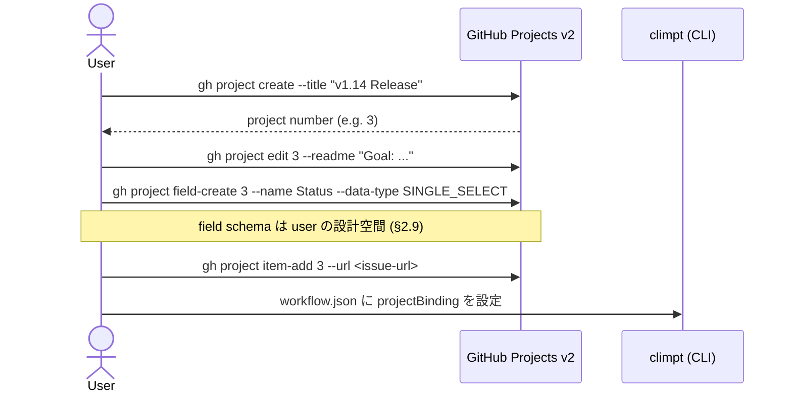
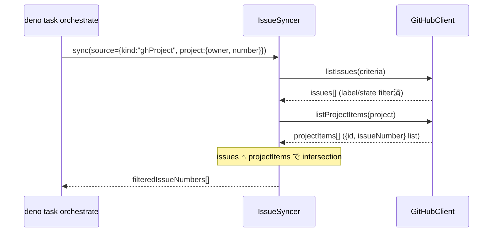
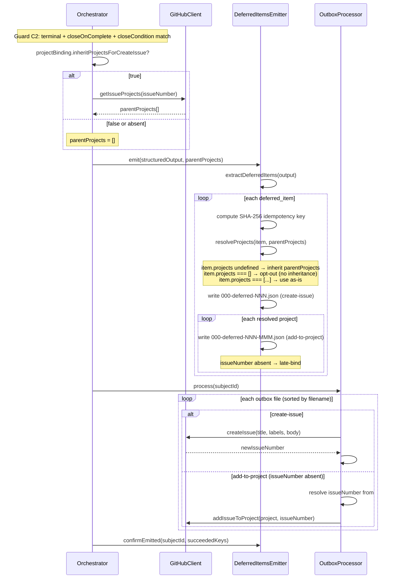
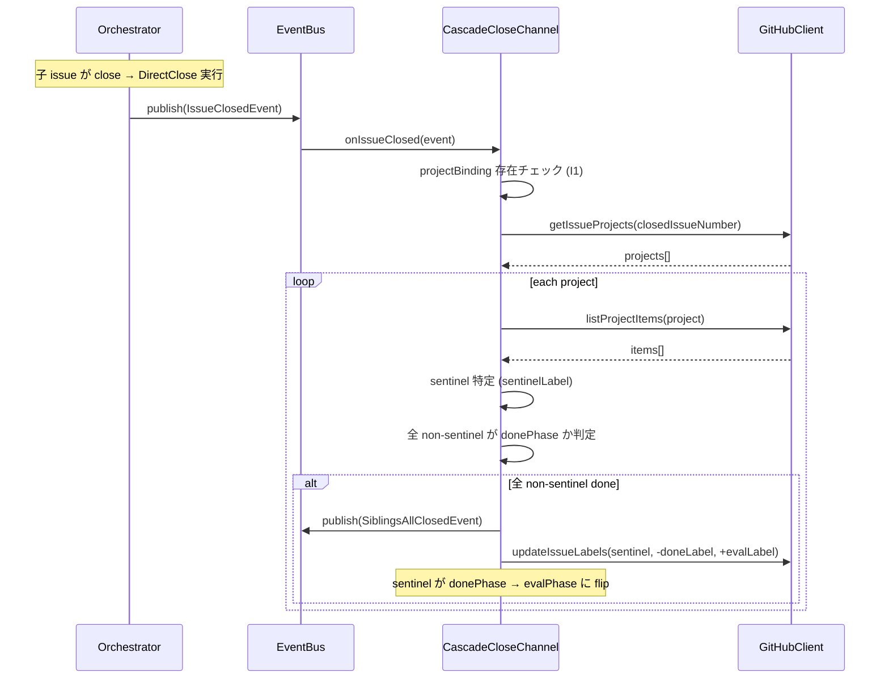
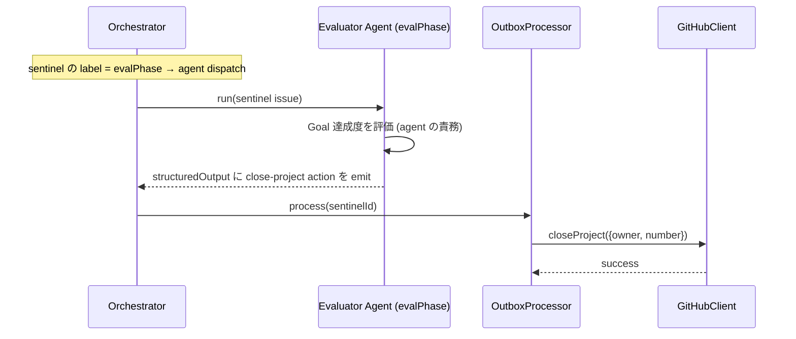

# 13-F. Project Orchestration Flow (Level 3)

> Level 3 (Flow / Process) per `/docs-writing` framework. Level 2 contracts:
> `13_project_orchestration.md`. Open design decisions:
> `13_project_orchestration.md` §6 (#500).

本文書は、GitHub Projects v2 と climpt orchestrator の具体的な連携フローを
記述する。§13 Level 2 が定義した型・契約・不変条件を、実行順序・条件分岐・
エラー処理ポリシーとして展開する。

## 1. Init: Project と Goal の準備

User が climpt 外部で project を構築し、climpt が consume する準備段階。

### 1.1 フロー



### 1.2 条件

- `workflow.json.projectBinding` が不在なら全 project 機能は no-op (I1)
- Project の作成・readme 編集・field 定義は user 責務 (P3 Consumer, §5)
- climpt は既存 project を read / bind / update のみ行う

### 1.3 workflow.json 設定

```json
{
  "projectBinding": {
    "inheritProjectsForCreateIssue": true,
    "donePhase": "impl-done",
    "evalPhase": "eval-pending",
    "planPhase": "plan-pending",
    "sentinelLabel": "project:sentinel"
  }
}
```

`projectBinding` 不在時は v1.13.x 互換 (I1)。存在時は全 5 field が required。 各
field の意味は §13 Level 2 §2.5 を参照。`injectGoalIntoPromptContext` (旧 O1) は
release/1.14.0 で削除、v1.15.0 で再導入予定 (#540)。

## 2. Bind: Project-scoped issue 取得

Orchestrator が dispatch 対象の issue を project 単位で絞り込む。旧
`IssueCriteria.project` は `IssueSource` ADT に昇格済み (§13 Level 2 §2.6)。

### 2.1 フロー



### 2.2 条件分岐

| `IssueSource.kind`       | 動作                                                         |
| ------------------------ | ------------------------------------------------------------ |
| `ghProject`              | `listProjectItems` で project member 集合取得後 intersection |
| `ghRepoIssues` (default) | project 未所属 issue のみ (unbound filter, I6 互換)          |
| `ghRepoIssues` (any)     | 全 issue (escape hatch, `--all-projects`)                    |
| `explicit`               | listing skip、指定 issue のみ sync                           |

### 2.3 CLI

```bash
deno task orchestrate --project tettuan/3
# → IssueSource { kind: "ghProject", project: { owner: "tettuan", number: 3 } }

deno task orchestrate --all-projects
# → IssueSource { kind: "ghRepoIssues", projectMembership: "any" }
```

`--project` は `<owner>/<number>` 形式。owner は常に明示 — 暗黙デフォルト owner
を持たない (#500 §6.4)。

## 3. (Removed) Hook O1: Project Goal Injection

release/1.14.0 で削除。breakdown CLI の入力サニタイザが README 内の shell
metacharacter を弾くため UV 注入境界での sanitize と consumer-prompt の syntax
統一 (`{{project_goals}}` → `{uv-project_goals}`) を含めて再設計
する。詳細・再導入は v1.15.0 (#540) で扱う。

## 4. Hook O2: Project Inheritance on Deferred Items

Agent output の `deferred_items[]` から子 issue を起票する際、parent issue の
project membership を継承する。

### 4.1 シーケンス図



### 4.2 DeferredItem.projects 三形態

| `projects` field    | 動作                       | 用途                            |
| ------------------- | -------------------------- | ------------------------------- |
| `undefined` (不在)  | parent の全 project を継承 | デフォルト — 同 project に bind |
| `[]` (空配列)       | 継承しない (opt-out)       | cross-project issue             |
| `[{owner, number}]` | 指定 list を使用           | 別 project への明示 bind        |

### 4.3 Late-binding contract

`add-to-project` の `issueNumber` が省略された場合の解決:

1. **Family mode**: outbox ファイル名 `000-deferred-NNN-MMM` の `NNN` を family
   ID とし、`#prevResultByFamily.get(NNN)` から同 family の直前 `create-issue`
   結果を取得
2. **Legacy mode** (v1.13.x 互換、family ID 不在時): `#lastCreatedIssueNumber`
   から取得
3. 両方 undefined → エラー throw

Per-family tracking により、複数 deferred_items が同一 cycle で処理されても
cross-family の late-bind 汚染が発生しない。

### 4.4 Idempotency

- SHA-256 key は `{title, body, labels (sorted)}` から計算
- `store.readEmittedKeys()` で過去に確定した key を取得
- 既出 key は skip → retry cycle での重複起票を防止
- Per-item confirmation: outbox action 成功後に個別 key を確定 (partial failure
  時に未成功分のみ再起票)

## 5. Project Completion

Project 完了は 2 段階で進む: (1) CascadeCloseChannel が sentinel label を flip、
(2) evaluator agent が project close を判断・実行。

### 5.1 T6.eval: Sentinel label flip (CascadeCloseChannel)



v1.14.0 で orchestrator.ts の inline ロジックから `CascadeCloseChannel`
(`agents/channels/cascade-close.ts`) に移行済み (PR4-3 / T4.4b cutover)。
Channel は event bus 経由で非同期に動作し、失敗は non-fatal (close は
既に完了済み)。

### 5.2 Evaluator agent dispatch

CascadeCloseChannel が sentinel を `donePhase` → `evalPhase` に flip した後、
次の orchestrator cycle で `evalPhase` に割り当てられた agent が dispatch
される。 Agent は project 全体の完了を評価し、必要に応じて `close-project`
outbox action を emit する。



### 5.3 責務境界

- **Sentinel label flip**: climpt `CascadeCloseChannel` の責務 (自動)
- **Project 完了判断**: evaluator agent の責務。climpt は project 完了を
  自動判定しない
- **実行**: climpt outbox が `close-project` action を処理
- **Status field 更新**: user agent が `update-project-item-field` で明示 emit
  (climpt は Status を自動更新しない — I5)

## 6. Failure Modes

### 6.1 GitHub API エラー

| 発生箇所                   | 影響                       | 対処                                            |
| -------------------------- | -------------------------- | ----------------------------------------------- |
| O2 `getIssueProjects`      | Inheritance skip           | warn log + deferred_items を project なしで起票 |
| Outbox `addIssueToProject` | Issue が project に未登録  | outbox file 残留 → 次 cycle で再実行            |
| Outbox `closeProject`      | Project 未 close           | outbox file 残留 → 次 cycle で再実行            |
| `listProjectItems`         | Project-scoped filter 不可 | dispatch 停止 (filter は必須入力)               |

### 6.2 Sandbox

`gh project *` コマンドは orchestrator (host process) の `Deno.Command()`
で実行される。Agent SDK sandbox は agent 内部の Bash tool にのみ適用される。
orchestrator は sandbox boundary の外にいるため、sandbox allow-list の変更は
不要 (#500 §6.2)。

agent 側から直接 `gh project` を実行するパスは設計上存在しない — project 操作は
climpt framework の責務 (§5 Boundary Summary)。

### 6.3 Late-bind miss

`add-to-project` で late-bind 解決に失敗する条件:

1. 同 family の `create-issue` が先に失敗 → family result なし
2. Outbox ファイル名に family ID が含まれない (破損)

対処: `OutboxProcessor` が error throw → 当該 action の outbox file が残留 →
operator が手動確認。create-issue が成功していれば、残留した add-to-project file
の `issueNumber` を手動設定して再実行可能。

### 6.4 Rate limit

GitHub GraphQL API 5,000 pts/hr。30 秒 TTL cache により同一 cycle 内の
重複呼び出しを排除。典型 dispatch (10-20 issues/cycle) で数十 calls、v1.15.0 で
goal injection (#540) が再導入されても数百 calls/cycle — ceiling 1% 未満 (#500
§6.1)。

Rate limit エラー発生時は GH CLI が 429 を返す → `GhCliClient` の呼び出し元で
catch → O2 は §6.1 の skip ポリシー適用、outbox は file 残留 → 次 cycle
(countdownDelay 後) で自然リトライ。

## 7. End-to-End サイクル例

Project `tettuan/3` で plan → execute → evaluate → close の完全な lifecycle
を示す。Sentinel #40 が project:sentinel label を持ち、impl issue #42 が project
に所属する。

```
CYCLE 0 (Bootstrap):
├─ [project:init] deno task project:init tettuan/3
│        → sentinel #40 created (labels: [planPhase, project:sentinel])
│        → addIssueToProject(tettuan/3, #40)
└─ Exit: sentinel bootstrapped

CYCLE 1 (Plan):
├─ [Bind] IssueSyncer: source={kind:"ghProject", project:tettuan/3} → #40 が対象
├─ [Phase] labels=[planPhase] → plan-pending → agent=project-planner
├─ [Dispatch] project-planner.run(#40)
│        → structuredOutput: {proposed_issues: [{title:"Impl task", ...}]}
├─ [O2] getIssueProjects(40) → [{owner:"tettuan", number:3}]
│        item.projects = undefined → inherit [{owner:"tettuan", number:3}]
│        write: 000-deferred-000.json (create-issue)
│        write: 000-deferred-001.json (add-to-project)
├─ [Outbox] process:
│        000-deferred-000.json → createIssue() → #42
│        000-deferred-001.json → late-bind #42 → addIssueToProject(tettuan/3, #42)
├─ [Transition] sentinel: planPhase → donePhase (planner outputPhase)
└─ Exit: sentinel は donePhase で待機

CYCLE 2 (Execute):
├─ [Bind] IssueSyncer: source={kind:"ghProject", project:tettuan/3} → #42 が対象
├─ [Phase] labels=[kind:impl] → impl-pending → agent=iterator
├─ [Dispatch] iterator.run(#42)
│        → outcome: "success"
├─ [Transition] T3: add [done], T4: remove [kind:impl]
├─ [T6] closeIssue(42)
├─ [T6.post] CascadeCloseChannel:
│        getIssueProjects(42) → [{owner:"tettuan", number:3}]
│        listProjectItems(tettuan/3) → [#40(sentinel), #42(done)]
│        全 non-sentinel done → publish(SiblingsAllClosedEvent)
│        updateIssueLabels(#40, -doneLabel, +evalLabel)
└─ Exit: #42 closed, sentinel #40 flipped to evalPhase

CYCLE 3 (Evaluate):
├─ [Bind] IssueSyncer: source={kind:"ghProject", project:tettuan/3} → #40 が対象
├─ [Phase] labels=[evalPhase] → eval-pending → evaluator agent dispatch
├─ [Dispatch] evaluator.run(#40)
│        → structuredOutput: {outbox: [{action:"close-project", project:{...}}]}
├─ [Outbox] process:
│        closeProject(tettuan/3)
├─ [T6] closeIssue(40)
└─ Exit: project tettuan/3 closed, sentinel #40 closed

結果: plan→execute→evaluate→close 完了。
      #42 impl done, #40 sentinel closed, project tettuan/3 closed
```

## 8. Plan Phase: README → Schema 変換例

Project-planner agent が README goal を読み、`planner.schema.json` の structured
output に変換する具体例。

### 8.1 入力: Project README

```markdown
# v1.14 Release

Goal: Ship project orchestration with GitHub Projects v2 integration.

- Schema design for project-planner output
- CLI support for --project flag
- E2E test coverage for bind → plan → emit cycle
```

### 8.2 出力: planner.schema.json 準拠

```json
{
  "next_action": { "action": "closing" },
  "rationale": {
    "goal_statement": "Ship project orchestration with GitHub Projects v2 integration.",
    "extraction_method": "readme_heading",
    "existing_issue_count": 2,
    "gap_summary": "Schema design (covered by #521) and CLI --project flag (covered by #500) exist, but E2E test coverage for the bind→plan→emit cycle has no issue yet."
  },
  "coverage_axes": [
    {
      "axis": "schema",
      "description": "Output schema for planner agent structured output",
      "issue_indices": [0]
    },
    {
      "axis": "e2e-test",
      "description": "End-to-end test for bind → plan → emit cycle",
      "issue_indices": [1]
    }
  ],
  "proposed_issues": [
    {
      "title": "feat(project-planner): design schema for plan-phase output",
      "body": "## 目的\n\nDefine planner.schema.json fields: proposed_issues[], rationale, coverage_axes.\n\n## 完了条件\n\n- Schema compatible with deferred_items (issue-emitter consumable)\n- Conversion example documented in 13_project_orchestration_flow.md",
      "labels": ["kind:impl", "enhancement"]
    },
    {
      "title": "test(project-planner): E2E bind→plan→emit cycle",
      "body": "## 目的\n\nVerify that orchestrator can bind a project, run planner, and emit proposed_issues through outbox.\n\n## 完了条件\n\n- Test exercises full cycle with mock project README\n- Outbox files match deferred_items format",
      "labels": ["kind:impl"]
    }
  ],
  "verdict": "done",
  "final_summary": "Identified 1 gap (E2E test) beyond existing issues. Schema issue already tracked."
}
```

### 8.3 proposed_issues → deferred_items 互換性

`proposed_issues[]` の各 item は `considerer.schema.json` の `deferred_items[]`
と同一構造 (`title`, `body`, `labels`, `projects`) を持つ。orchestrator の
`DeferredItemsEmitter` が変換なしで消費できる。

| Field      | proposed_issues | deferred_items | 備考               |
| ---------- | --------------- | -------------- | ------------------ |
| `title`    | required        | required       | 同一               |
| `body`     | required        | required       | 同一               |
| `labels`   | required        | required       | 同一               |
| `projects` | optional        | optional       | 三形態 (§4.2) 互換 |

## 9. 関連

- `13_project_orchestration.md` — Level 2 contracts (型・API・invariants)
- `13_project_orchestration.md` §2.10 — Planner / Evaluator agent 責務境界
- `13_project_orchestration.md` §6 — Level 3 open design decisions (#500)
- `12_orchestrator.md` §Project Orchestration Hooks — O2 hook summary (O1 は
  v1.15.0 #540 で再導入予定)
- `agents/channels/cascade-close.ts` — T6.eval sentinel label flip 実装
- `agents/scripts/project-init.ts` — Sentinel bootstrap
- `04_step_flow_design.md` — Step flow / structured output の汎用設計
