# Step Flow Design

Flow ループが扱う Step を「単純な図面」で表し、設計と実装を同じ姿に保つ。
ここでは **Mermaid 図** を中心に、What / Why を記述する。

## 1. 目的と原則

- **What**: Start→複数 Step→完了判定という一本の鎖で Agent を進める。
- **Why**: 単方向で連鎖させることで、暗黙ロジックや AI の過剰推論を排除する。
- **Rule**: 各 Step は structured output を返し、次に進む意図を宣言する。

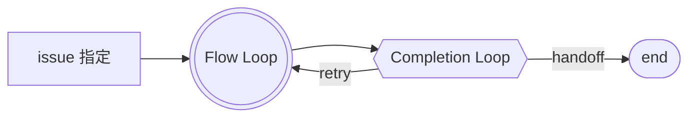

Flow Loop は Step の実行だけを担当し、検証/締め処理は Completion Loop が担う。

## 2. Flow の骨格

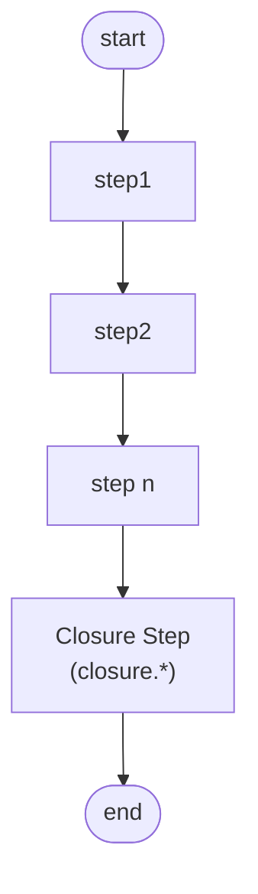

- **What**: 全ての Agent はこの骨格を基礎に Step を差し替える。
- **Why**: 汎用のランタイムを保ったままユニークな Agent を構築できる。
- **Constraint**: Entry Step は `entryStepMapping` または `entryStep`
  を必須定義。
- **Link**: `Review` ノードが `closure.<domain>`（Closure Step）と 1:1
  に対応し、サブループ図の Closure Step と同じ要素となる。

### 2.1 Step taxonomy (What / Why)

| 種別                                       | What                                                                                                                | Why                                                                |
| ------------------------------------------ | ------------------------------------------------------------------------------------------------------------------- | ------------------------------------------------------------------ |
| Work Step (`initial.*` / `continuation.*`) | 成果物を生成し、`next` / `repeat` / `jump` / `handoff` intent を返す。作業完了時は `handoff` で Closure Step へ遷移 | 生成責務を一箇所に閉じ込め、Issue 操作などの境界行為を排除する     |
| Verification Step (`verification.*`)       | 直前の Work Step 成果を自己検証し、`next` / `repeat` / `jump` / `escalate` intent を返す                            | Step ごとの完了基準を明確にし、Work Step での自己評価抜けを防ぐ    |
| Closure Step (`closure.*`)                 | Workflow 全体と外部 state を突き合わせ、`closing` / `repeat` を返す                                                 | 完了可否を一箇所で判断し、Issue close 等の副作用をここに限定する   |
| Boundary Hook (非 Step)                    | Closure Step が `closing` を宣言した瞬間だけ Issue / PR 操作を実行                                                  | 連鎖の境界をプログラムで保証し、Work/Verification からの逸脱を防ぐ |

> **Rule**: Work / Verification Step では `closing` intent を返さない。Boundary
> Hook は Closure Step を通過した run に対してのみ起動する。

## 3. Step 内部のサブループ

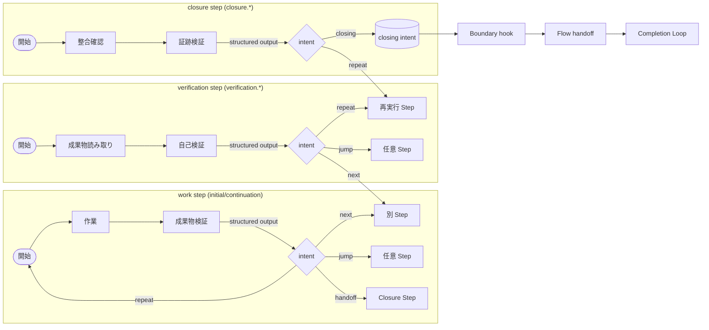

- **What**: Work Step は `next`/`repeat`/`jump`、Verification Step は
  `next`/`repeat`/`jump`/`escalate`、Closure Step は `closing`/`repeat` を
  structured output で返す。
- **Why**: Flow Router が解釈する intent を最小集合に保ち、AI
  の回答ぶれを抑える。
- **Rule**: Work / Verification Step は `closing` を返さず、`escalate` intent は
  Flow が静的に定義したサポート Step のみに遷移させる。
- **Default scaffolder**: デフォルトの scaffolder は `escalate` を
  `continuation.default` へルーティングする（`repeat` と同等）。専用のサポート
  Step が必要な場合は、`support.verification` 等を追加し `transitions.escalate`
  を カスタマイズする。
- **Loop safety**: Closure Step の `transitions` は `closing` を Flow End
  へ、`repeat` を明示的に作業 Step へ向ける。`closing → closing`
  にはならず、repeat で再検証させる場合のみ戻る。

#### formatted schema との連携

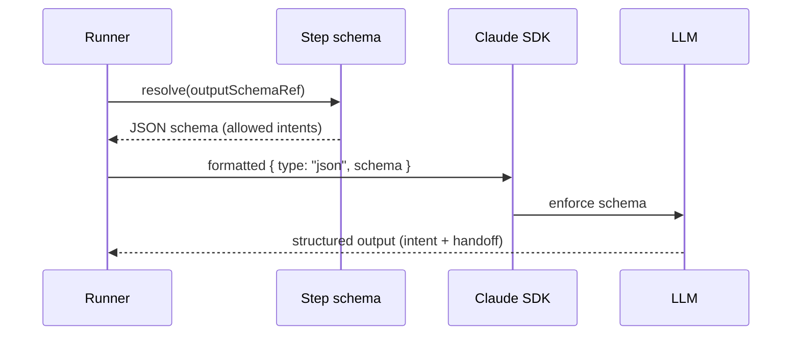

- Runner は Step schema を SDK の `formatted` オプションで渡し、intent
  選択肢（Work: `next`/`repeat`/`jump`、Verification:
  `next`/`repeat`/`jump`/`escalate`、Closure: `closing`/`repeat`）を schema の
  enum で固定する。
- プロンプトは意味付けだけに集中し、構造的制約は schema が担う。
- `intentField` は Step 定義で必須となり、Runtime が推測することはない。 pointer
  の誤りはロード時に検知され、修正されるまで Flow は動かない。

### 3.1 stepId の正規化（Runtime 権限）

- **What**: Flow が stepId の正規値を保持し、LLM が返す stepId
  と一致しない場合は 自動補正する。
- **Why**: `const` 制約は Anthropic SDK で強制されないため、LLM
  が文脈から推測した stepId を返すことがある。Runtime で補正することで routing
  の決定性を保つ。
- **Rule**: LLM は intent（`next`/`repeat`/`jump`/`closing`）と optional な
  `targetStepId` を返すだけでよい。stepId は参考情報であり、Flow
  が単一の権限を持つ。

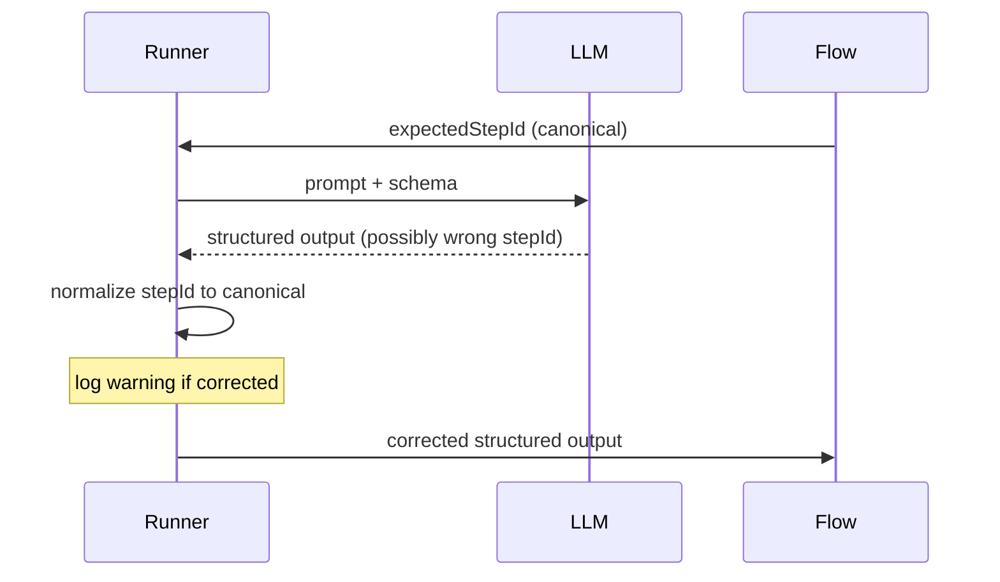

> **Telemetry**: 補正が発生した場合は `[StepFlow] stepId corrected` として
> ログに記録される。頻発する場合は schema/prompt の見直しを検討する。

## 4. Structured Gate + Router

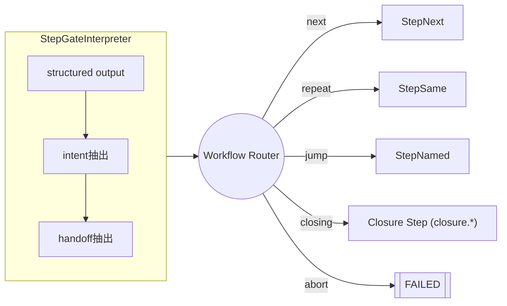

- **What**: `structuredGate` が Intent / handoff の抽出方法を宣言する。
- **Why**: Flow は Router の結果だけで次の Step
  を決めればよくなり、責務を細分化。
- **必須**: すべての Flow Step は `structuredGate` (`allowedIntents`,
  `intentField`, `intentSchemaRef`) と `transitions` を定義する。`intentField`
  は推論されず、欠落しているとロードに失敗する。
- **Pointer validation**: `intentSchemaRef` は Schema 上の intent enum へ
  のみ張ることを許容し、Runner が `allowedIntents` との一致を検証する。 enum
  に余計な値が含まれていたり pointer が壊れている場合は即時停止する。
- **Fail-fast**: Gate が intent を解釈できなかった場合は Runner が
  `FAILED_STEP_ROUTING` で停止する。`failFast` は既定で `true` であり、
  プロダクション Agent では無効化できない。検証用途で `false` にした場合は
  ログに `[StepFlow][SpecViolation]` を残し、フォールバック Intent
  (`fallbackIntent` または最初の `allowedIntents`)
  を使うが、これは例外的オプション であることをドキュメントに明記する。

### Step サブループとの結びつき

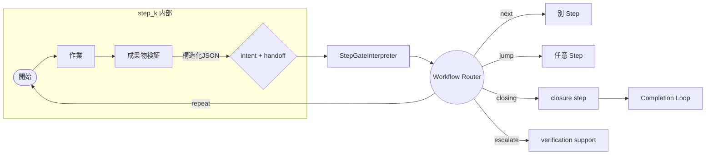

Step サブループで生成された structured output が Gate へ渡り、Router が Flow
全体の 遷移を決める。**各セクションは「Step 内部 → Gate → Router → Flow」へと
接続する一連の鎖を表している。**

## 5. Schema Fail-Fast

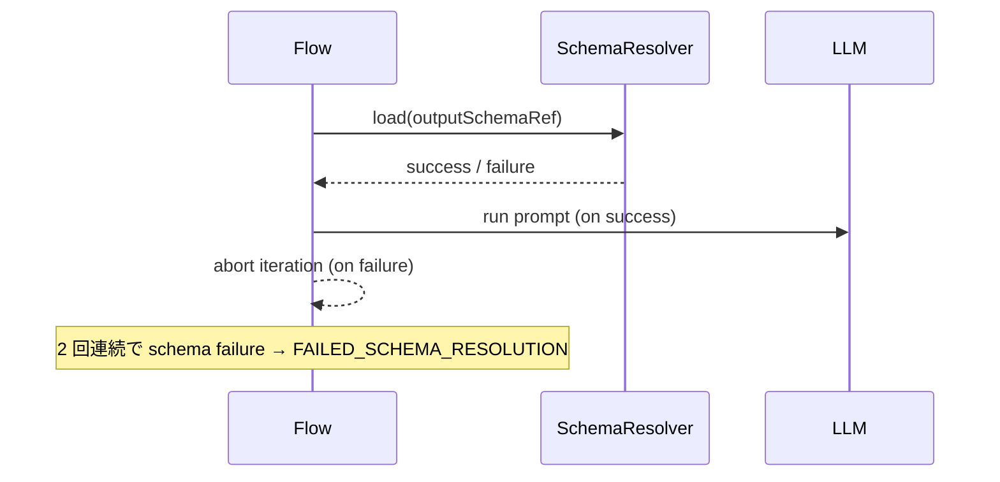

- **What**: JSON Pointer がずれた瞬間に Step を停止し、2 回連続で run も停止。
- **Why**: Structured Output が得られない状態でループすると、Step Flow
  全体が崩壊するため。
- **Link**: 下図のように、Schema Fail-Fast が Step
  サブループの「開始」前に挿入され、構造化 JSON が揃わない限り作業へ進ませない。

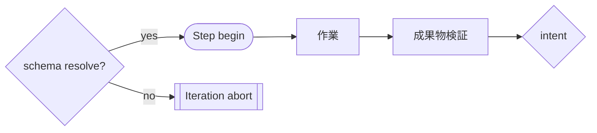

## 6. Intent 欠落時の Fail-Fast

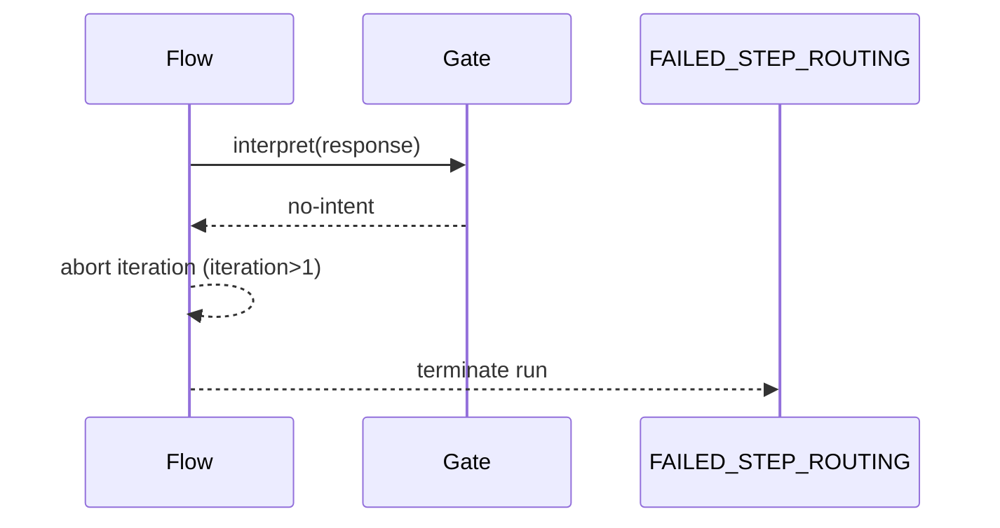

- **What**: intent が得られなければ即座に停止し、暗黙フォールバックを禁止。
- **Why**: ループし続けるよりも、設定ミスを露見させるほうが健全。
- **Policy**: `failFast` の既定値は `true` であり、Flow Agent はこの状態で
  リリースする。どうしても一時的に `false` にする場合は `fallbackIntent`
  を明示し、Runner が `[StepFlow][SpecViolation]`
  を記録することで逸脱を検知可能にする。
- **Link**: Step サブループ内の `Decide{intent}` から Gate
  に渡った結果が空のとき、即座に Flow を止める。

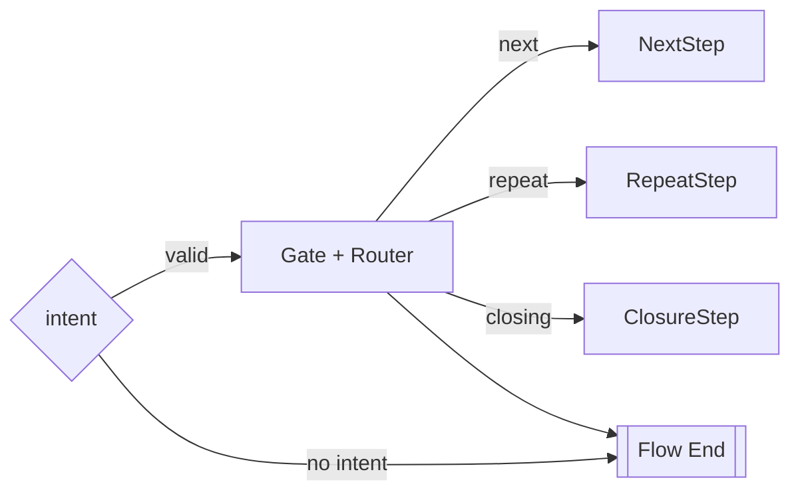

## 7. Hand-off と Completion

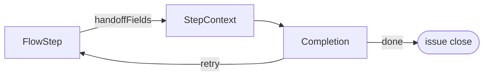

- **What**: StepContext に蓄積した handoff を Completion Loop がまとめて処理。
- **Why**: Flow と Completion の責務境界が守られ、どちらも単純化される。
- **Link**: Flow 骨格図の `Review (Closure Step / closure.*)` ノードと 1:1
  に対応し、各 Step から集まった handoff が StepContext 経由で Completion Loop
  へ渡って最終判定を行う。

### 7.1 Boundary hook

- **What**: Closure Step が `closing` intent を返した瞬間にだけ起動し、Issue
  close や Release 作成などの副作用を実行するシンプルな関数。
- **Why**: Work / Verification Step が誤って Issue
  操作を行うことを物理的に防ぎ、Flow の鎖を壊さない。
- **Implication**: Schema / Gate が `closing` intent
  を禁止している限り、Boundary Hook
  は決して呼び出されないため、設定ミスが外部副作用へ波及しない。

### 7.2 Step kind とツール許可

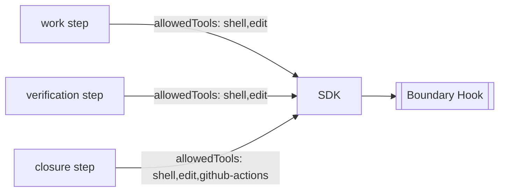

- **What**: Runner は `stepKind` ごとに許可ツールを再構成し、Work / Verification
  では GitHub などの副作用ツールを自動的に無効化する。Closure Step に遷移した
  時だけ Issue close 等の権限が注入され、boundary hook が単一の出口となる。
- **Why**: 「手順中に Issue を閉じないで」とプロンプトで言う代わりに、物理的に
  呼び出せない状態にすることで AI 複雑性を排除する。Flow の実装は stepKind を
  見るだけで十分で、追加の条件分岐を必要としない。
- **Implication**: ユーザーが `.agent/<agent>/steps_registry.json` で stepKind
  を 定義すれば、それだけで安全な許可セットが適用される。設定忘れは loader が
  エラーにするため、ワークフロー全体で一貫した境界管理が維持される。

### 7.3 Sequential Step Enforcement

**Rule**: Work steps MUST NOT emit `handoff` unless they have completed
meaningful work.

| Step type        | handoff availability                         |
| ---------------- | -------------------------------------------- |
| `initial.*`      | **Not available** - must use `next`/`repeat` |
| `continuation.*` | Available after work cycle                   |
| `closure.*`      | N/A - uses `closing` instead                 |

- **What**: Default scaffolder templates do NOT expose `handoff` on initial
  steps. Builders must explicitly add `handoff` to
  `structuredGate.allowedIntents` and `transitions` after confirming that the
  step represents final work.
- **Why**: Premature handoff bypasses the work cycle and defeats multi-step
  execution. The sports-condition-manager and trip-planner regressions both
  stemmed from initial steps emitting `handoff` before any continuation work
  occurred.
- **Implication**: If a builder adds `handoff` to an initial step, they accept
  responsibility for ensuring the step genuinely completes the workflow. Runtime
  logs will warn when `handoff` is emitted from an `initial.*` step.

## 8. 設定の型と要件（要約）

| 要素                             | What                                                                   | Why                                              |
| -------------------------------- | ---------------------------------------------------------------------- | ------------------------------------------------ |
| `outputSchemaRef`                | JSON Pointer (`#/definitions/<stepId>`) を必須                         | schema 失敗を即時検知                            |
| `structuredGate.allowedIntents`  | 許可 intent 配列 (必須)                                                | Runtime が intent 検証                           |
| `structuredGate.intentField`     | AI 出力から intent を抽出するパス (必須・推測禁止)                     | Runtime が deterministic に intent 抽出          |
| `structuredGate.intentSchemaRef` | `#/properties/next_action/properties/action` 形式の内部ポインタ (必須) | schema enum と allowedIntents の齟齬を失敗で露見 |
| `transitions[target]`            | intent → Step を列挙し `closing` は `closure.<domain>` 固定            | 完了=Closure Step という秩序を維持               |
| `handoffFields`                  | StepContext に積むキーを配列で宣言                                     | 暗黙共有を防止                                   |

> **Fail-fast policy**: `structuredGate.failFast` の既定値は `true`。
> プロダクション Agent では変更禁止とし、デバッグ目的で `false` にする場合は
> ログ/テレメトリで逸脱を残すこと。

図と表をそのまま仕様書にし、Flow の構造を改変しない限り Run-time
と完全に一致させる。
