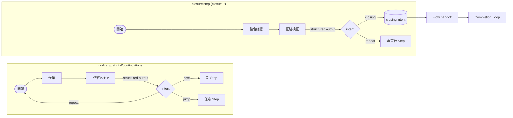
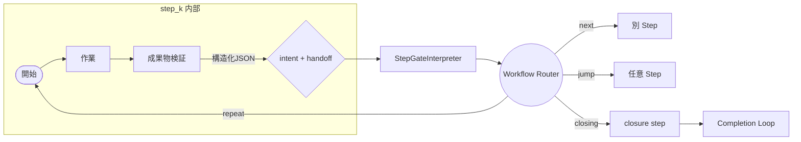

# Step Flow Design

Flow ループが扱う Step を「単純な図面」で表し、設計と実装を同じ姿に保つ。
ここでは **Mermaid 図** を中心に、What / Why を記述する。

## 1. 目的と原則

- **What**: Start→複数 Step→完了判定という一本の鎖で Agent を進める。
- **Why**: 単方向で連鎖させることで、暗黙ロジックや AI の過剰推論を排除する。
- **Rule**: 各 Step は structured output を返し、次に進む意図を宣言する。

Flow Loop は Step の実行だけを担当し、検証/締め処理は Completion Loop が担う。

## 2. Flow の骨格

- **What**: 全ての Agent はこの骨格を基礎に Step を差し替える。
- **Why**: 汎用のランタイムを保ったままユニークな Agent を構築できる。
- **Constraint**: Entry Step は `entryStepMapping` または `entryStep`
  を必須定義。
- **Link**: `Review` ノードが `closure.<domain>`（Closure Step）と 1:1
  に対応し、サブループ図の Closure Step と同じ要素となる。

## 3. Step 内部のサブループ

- **What**: work step は `next`/`repeat`/`jump` を、closure step は
  `closing`/`repeat` を structured output で返す。
- **Why**: Flow Router が解釈する intent を最小集合に保ち、AI
  の回答ぶれを抑える。
- **Rule**: work step は `closing` を返さない。Closure Step（`closure.*`) のみ
  `closing` を宣言して Flow を閉じる。
- **Loop safety**: Closure Step の `transitions` は `closing` を Flow End
  へ、`repeat` を明示的に作業 Step へ向ける。`closing → closing`
  にはならず、repeat で再検証させる場合のみ戻る。

#### formatted schema との連携

- Runner は Step schema を SDK の `formatted` オプションで渡し、intent
  選択肢（`next`/`repeat`/`jump`/`closing`）を schema の enum で固定する。
- プロンプトは意味付けだけに集中し、構造的制約は schema が担う。

## 4. Structured Gate + Router

- **What**: `structuredGate` が Intent / handoff の抽出方法を宣言する。
- **Why**: Flow は Router の結果だけで次の Step
  を決めればよくなり、責務を細分化。
- **必須**: すべての Flow Step に `structuredGate` と `transitions`
  を定義しないとロードで失敗する。

### Step サブループとの結びつき

Step サブループで生成された structured output が Gate へ渡り、Router が Flow
全体の 遷移を決める。**各セクションは「Step 内部 → Gate → Router → Flow」へと
接続する一連の鎖を表している。**

## 5. Schema Fail-Fast

- **What**: JSON Pointer がずれた瞬間に Step を停止し、2 回連続で run も停止。
- **Why**: Structured Output が得られない状態でループすると、Step Flow
  全体が崩壊するため。
- **Link**: 下図のように、Schema Fail-Fast が Step
  サブループの「開始」前に挿入され、構造化 JSON が揃わない限り作業へ進ませない。

## 6. Intent 欠落時の Fail-Fast

- **What**: intent が得られなければ即座に停止し、暗黙フォールバックを禁止。
- **Why**: ループし続けるよりも、設定ミスを露見させるほうが健全。
- **Link**: Step サブループ内の `Decide{intent}` から Gate
  に渡った結果が空のとき、即座に Flow を止める。

## 7. Hand-off と Completion

- **What**: StepContext に蓄積した handoff を Completion Loop がまとめて処理。
- **Why**: Flow と Completion の責務境界が守られ、どちらも単純化される。
- **Link**: Flow 骨格図の `Review (Closure Step / closure.*)` ノードと 1:1
  に対応し、各 Step から集まった handoff が StepContext 経由で Completion Loop
  へ渡って最終判定を行う。

## 8. 設定の型と要件（要約）

| 要素                            | What                                                        | Why                                |
| ------------------------------- | ----------------------------------------------------------- | ---------------------------------- |
| `outputSchemaRef`               | JSON Pointer (`#/definitions/<stepId>`) を必須              | schema 失敗を即時検知              |
| `structuredGate.allowedIntents` | `next/repeat/jump/closing/abort` を列挙                     | Router が明示的に判断              |
| `transitions[target]`           | intent → Step を列挙し `closing` は `closure.<domain>` 固定 | 完了=Closure Step という秩序を維持 |
| `handoffFields`                 | StepContext に積むキーを配列で宣言                          | 暗黙共有を防止                     |

図と表をそのまま仕様書にし、Flow の構造を改変しない限り Run-time
と完全に一致させる。
