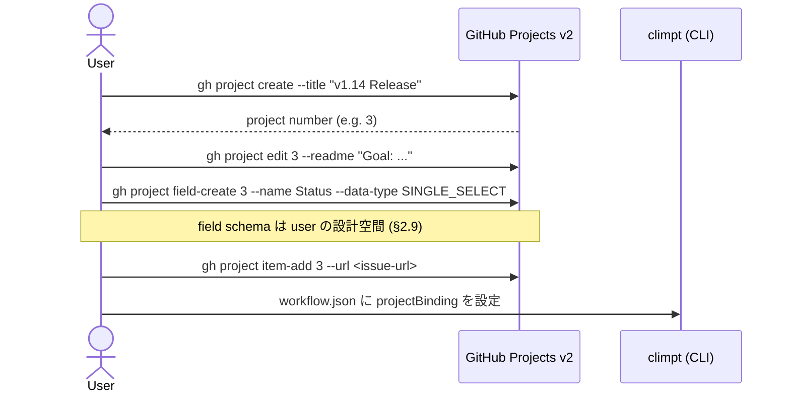
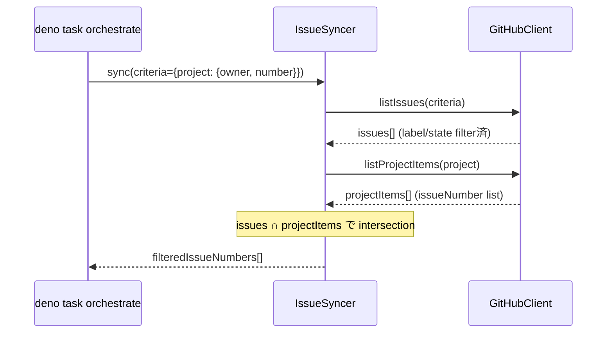
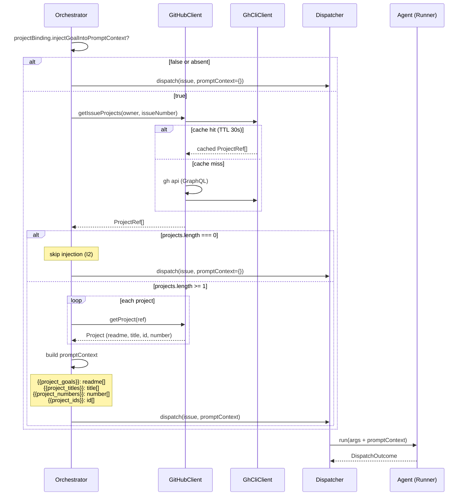
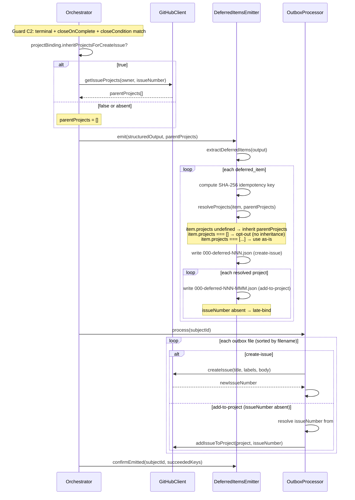
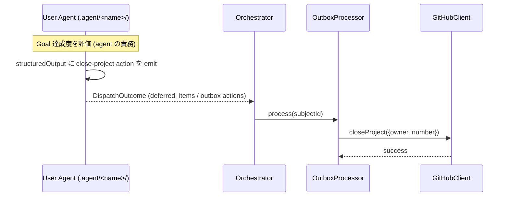

# 13-F. Project Orchestration Flow (Level 3)

> Level 3 (Flow / Process) per `/docs-writing` framework. Level 2 contracts:
> `13_project_orchestration.md`. Open design decisions:
> `13_project_orchestration.md` §6 (#500).

本文書は、GitHub Projects v2 と climpt orchestrator の具体的な連携フローを
記述する。§13 Level 2 が定義した型・契約・不変条件を、実行順序・条件分岐・
エラー処理ポリシーとして展開する。

## 1. Init: Project と Goal の準備

User が climpt 外部で project を構築し、climpt が consume する準備段階。

### 1.1 フロー



### 1.2 条件

- `workflow.json.projectBinding` が不在なら全 project 機能は no-op (I1)
- Project の作成・readme 編集・field 定義は user 責務 (P3 Consumer, §5)
- climpt は既存 project を read / bind / update のみ行う

### 1.3 workflow.json 設定

```json
{
  "projectBinding": {
    "injectGoalIntoPromptContext": true,
    "inheritProjectsForCreateIssue": true
  }
}
```

両フラグの意味は §2.4 O1 / O2 で定義。不在時は v1.13.x 互換 (I1)。

## 2. Bind: Project-scoped issue 取得

Orchestrator が dispatch 対象の issue を project 単位で絞り込む。

### 2.1 フロー



### 2.2 条件分岐

| `IssueCriteria.project` | 動作                                               |
| ----------------------- | -------------------------------------------------- |
| 未指定                  | 従来通り全 repo issue から label/state filter (I6) |
| 指定                    | `listProjectItems` で集合取得後に intersection     |

### 2.3 CLI

```bash
deno task orchestrate --project tettuan/3
# → IssueCriteria.project = { owner: "tettuan", number: 3 }
```

`--project` は `<owner>/<number>` 形式。owner は常に明示 — 暗黙デフォルト owner
を持たない (#500 §6.4)。

## 3. Hook O1: Project Goal Injection

Agent dispatch 前に、issue が所属する project の goal (readme) を agent prompt
context に注入する。

### 3.1 シーケンス図



### 3.2 エラー処理

`getIssueProjects` 失敗時は dispatch を block せず skip する (#500 §6.3)。

```typescript
try {
  const projects = await this.#github.getIssueProjects(owner, issueNumber);
  // inject {{project_goals}} etc.
} catch (err) {
  await log.warn(
    `Project goal injection skipped for #${issueNumber}: ${err.message}`,
    { event: "project_injection_skipped", subjectId: issueNumber },
  );
  // continue dispatch without project context
}
```

**理由**: Goal injection は supplementary context であり agent の必須入力
ではない。`{{project_goals}}` が空でも agent は label-based workflow で正常
動作する。dispatch cycle 全体を block すると transient error で全 issue
の進行が停止し不均衡。warning log で operator 検知、次 cycle で自然リトライ。

### 3.3 キャッシュ

Process-lifetime `Map<string, {data, expiry}>` cache、TTL 30 秒 (#500 §6.1)。

- `GhCliClient` 内 `#cache` フィールドに保持
- 各 read メソッド先頭で `#cacheGet(key)` → hit なら即 return
- Miss 時は GH API fetch + `#cacheSet(key, data, 30_000)`
- P1 (Stateless) 整合: in-memory のみ、永続化しない
- GitHub GraphQL API 5,000 pts/hr に対し典型 dispatch cycle は数十 calls
  (ceiling 1% 未満)。O1 込みでも数百 calls/cycle で上限到達しない

## 4. Hook O2: Project Inheritance on Deferred Items

Agent output の `deferred_items[]` から子 issue を起票する際、parent issue の
project membership を継承する。

### 4.1 シーケンス図



### 4.2 DeferredItem.projects 三形態

| `projects` field    | 動作                       | 用途                            |
| ------------------- | -------------------------- | ------------------------------- |
| `undefined` (不在)  | parent の全 project を継承 | デフォルト — 同 project に bind |
| `[]` (空配列)       | 継承しない (opt-out)       | cross-project issue             |
| `[{owner, number}]` | 指定 list を使用           | 別 project への明示 bind        |

### 4.3 Late-binding contract

`add-to-project` の `issueNumber` が省略された場合の解決:

1. **Family mode**: outbox ファイル名 `000-deferred-NNN-MMM` の `NNN` を family
   ID とし、`#prevResultByFamily.get(NNN)` から同 family の直前 `create-issue`
   結果を取得
2. **Legacy mode** (v1.13.x 互換、family ID 不在時): `#lastCreatedIssueNumber`
   から取得
3. 両方 undefined → エラー throw

Per-family tracking により、複数 deferred_items が同一 cycle で処理されても
cross-family の late-bind 汚染が発生しない。

### 4.4 Idempotency

- SHA-256 key は `{title, body, labels (sorted)}` から計算
- `store.readEmittedKeys()` で過去に確定した key を取得
- 既出 key は skip → retry cycle での重複起票を防止
- Per-item confirmation: outbox action 成功後に個別 key を確定 (partial failure
  時に未成功分のみ再起票)

## 5. Project Completion

User agent が project の完了を判断し、outbox action で close する。

### 5.1 フロー



### 5.2 責務境界

- **判断**: user agent の責務。climpt は project 完了を自動判定しない
- **実行**: climpt outbox が `close-project` action を処理
- **Status field 更新**: user agent が `update-project-item-field` で明示 emit
  (climpt は Status を自動更新しない — I5)

## 6. Failure Modes

### 6.1 GitHub API エラー

| 発生箇所                   | 影響                       | 対処                                            |
| -------------------------- | -------------------------- | ----------------------------------------------- |
| O1 `getIssueProjects`      | Goal 注入 skip             | warn log + dispatch 継続 (§3.2)                 |
| O1 `getProject`            | 当該 project の goal 欠落  | warn log + 他 project の goal のみ注入          |
| O2 `getIssueProjects`      | Inheritance skip           | warn log + deferred_items を project なしで起票 |
| Outbox `addIssueToProject` | Issue が project に未登録  | outbox file 残留 → 次 cycle で再実行            |
| Outbox `closeProject`      | Project 未 close           | outbox file 残留 → 次 cycle で再実行            |
| `listProjectItems`         | Project-scoped filter 不可 | dispatch 停止 (filter は必須入力)               |

### 6.2 Sandbox

`gh project *` コマンドは orchestrator (host process) の `Deno.Command()`
で実行される。Agent SDK sandbox は agent 内部の Bash tool にのみ適用される。
orchestrator は sandbox boundary の外にいるため、sandbox allow-list の変更は
不要 (#500 §6.2)。

agent 側から直接 `gh project` を実行するパスは設計上存在しない — project 操作は
climpt framework の責務 (§5 Boundary Summary)。

### 6.3 Late-bind miss

`add-to-project` で late-bind 解決に失敗する条件:

1. 同 family の `create-issue` が先に失敗 → family result なし
2. Outbox ファイル名に family ID が含まれない (破損)

対処: `OutboxProcessor` が error throw → 当該 action の outbox file が残留 →
operator が手動確認。create-issue が成功していれば、残留した add-to-project file
の `issueNumber` を手動設定して再実行可能。

### 6.4 Rate limit

GitHub GraphQL API 5,000 pts/hr。30 秒 TTL cache により同一 cycle 内の
重複呼び出しを排除。典型 dispatch (10-20 issues/cycle) で数十 calls、 O1
込みでも数百 calls/cycle — ceiling 1% 未満 (#500 §6.1)。

Rate limit エラー発生時は GH CLI が 429 を返す → `GhCliClient` の呼び出し 元で
catch → O1/O2 は §6.1 の skip ポリシー適用、outbox は file 残留 → 次 cycle
(countdownDelay 後) で自然リトライ。

## 7. End-to-End サイクル例

Issue #42 が project `tettuan/3` に所属、agent が deferred_items を 1 件 emit
する場合の完全な実行フロー:

```
CYCLE 1:
├─ [Bind] IssueSyncer: --project tettuan/3 → #42 が対象
├─ [Phase] labels=[kind:impl] → impl-pending → agent=iterator
├─ [O1] getIssueProjects(42) → [{owner:"tettuan", number:3}]
│        getProject({owner:"tettuan",number:3}) → {readme:"Goal: ..."}
│        promptContext: {project_goals: '["Goal: ..."]', ...}
├─ [Dispatch] iterator.run(#42, promptContext)
│        → outcome: "success"
│        → structuredOutput: {deferred_items: [{title:"Follow-up", ...}]}
├─ [Guard C2] terminal + closeOnComplete → emit deferred_items
├─ [O2] getIssueProjects(42) → [{owner:"tettuan", number:3}]
│        item.projects = undefined → inherit [{owner:"tettuan", number:3}]
│        write: 000-deferred-000.json (create-issue)
│        write: 000-deferred-000-000.json (add-to-project, issueNumber absent)
├─ [Outbox] process:
│        000-deferred-000.json → createIssue() → #43
│        000-deferred-000-000.json → late-bind #43 → addIssueToProject(tettuan/3, #43)
├─ [Confirm] confirmEmitted(42, [key-of-follow-up])
├─ [Transition] T3: add [done], T4: remove [kind:impl]
├─ [T6] closeIssue(42)
├─ [T6.post] processPostClose → (none)
└─ Exit: terminal → completed

結果: #42 closed, #43 created & project tettuan/3 に登録
```

## 8. Plan Phase: README → Schema 変換例

Project-planner agent が README goal を読み、`planner.schema.json` の structured
output に変換する具体例。

### 8.1 入力: Project README

```markdown
# v1.14 Release

Goal: Ship project orchestration with GitHub Projects v2 integration.

- Schema design for project-planner output
- CLI support for --project flag
- E2E test coverage for bind → plan → emit cycle
```

### 8.2 出力: planner.schema.json 準拠

```json
{
  "next_action": { "action": "closing" },
  "rationale": {
    "goal_statement": "Ship project orchestration with GitHub Projects v2 integration.",
    "extraction_method": "readme_heading",
    "existing_issue_count": 2,
    "gap_summary": "Schema design (covered by #521) and CLI --project flag (covered by #500) exist, but E2E test coverage for the bind→plan→emit cycle has no issue yet."
  },
  "coverage_axes": [
    {
      "axis": "schema",
      "description": "Output schema for planner agent structured output",
      "issue_indices": [0]
    },
    {
      "axis": "e2e-test",
      "description": "End-to-end test for bind → plan → emit cycle",
      "issue_indices": [1]
    }
  ],
  "proposed_issues": [
    {
      "title": "feat(project-planner): design schema for plan-phase output",
      "body": "## 目的\n\nDefine planner.schema.json fields: proposed_issues[], rationale, coverage_axes.\n\n## 完了条件\n\n- Schema compatible with deferred_items (issue-emitter consumable)\n- Conversion example documented in 13_project_orchestration_flow.md",
      "labels": ["kind:impl", "enhancement"]
    },
    {
      "title": "test(project-planner): E2E bind→plan→emit cycle",
      "body": "## 目的\n\nVerify that orchestrator can bind a project, run planner, and emit proposed_issues through outbox.\n\n## 完了条件\n\n- Test exercises full cycle with mock project README\n- Outbox files match deferred_items format",
      "labels": ["kind:impl"]
    }
  ],
  "verdict": "done",
  "final_summary": "Identified 1 gap (E2E test) beyond existing issues. Schema issue already tracked."
}
```

### 8.3 proposed_issues → deferred_items 互換性

`proposed_issues[]` の各 item は `considerer.schema.json` の `deferred_items[]`
と同一構造 (`title`, `body`, `labels`, `projects`) を持つ。orchestrator の
`DeferredItemsEmitter` が変換なしで消費できる。

| Field      | proposed_issues | deferred_items | 備考               |
| ---------- | --------------- | -------------- | ------------------ |
| `title`    | required        | required       | 同一               |
| `body`     | required        | required       | 同一               |
| `labels`   | required        | required       | 同一               |
| `projects` | optional        | optional       | 三形態 (§4.2) 互換 |

## 9. 関連

- `13_project_orchestration.md` — Level 2 contracts (型・API・invariants)
- `13_project_orchestration.md` §6 — Level 3 open design decisions (#500)
- `12_orchestrator.md` §Project Orchestration Hooks — O1/O2 hook summary
- `04_step_flow_design.md` — Step flow / structured output の汎用設計
