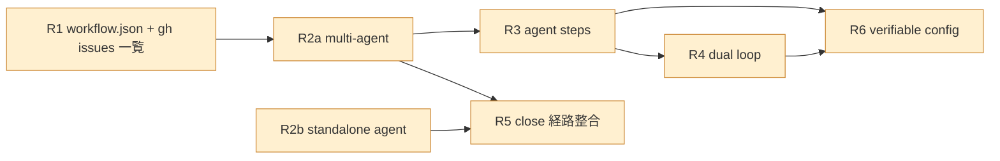
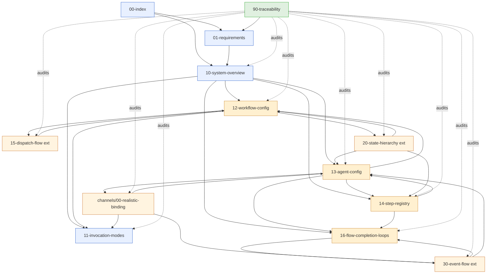

# 00 — Realistic Charts Index

To-Be (`tobe/`) を **不可侵で継承** しながら、user input から確定された **7 MUST
要件 (R1〜R6)** を満たす設計集。To-Be 5 原則を破らずに workflow.json +
multi-agent dispatch + agent standalone + steps + dual loop + close 経路整合 +
verifiable config を物理化する。

## 設計の根本構造

```mermaid
flowchart TD
    P[To-Be 5 原則 (不可侵継承)<br/>P1 Uniform Channel / P2 Single Transport / P3 CloseEventBus<br/>P4 Fail-fast Factory / P5 Typed Outbox]

    M[7 MUST 要件 (Realistic 凍結)<br/>R1 workflow.json + gh issues / R2a multi-agent / R2b standalone<br/>R3 steps / R4 dual loop / R5 close 経路整合 / R6 verifiable config]

    A[Realistic 設計 (本 directory)]

    P --> A
    M --> A
    A --> Result[7 MUST 全充足 ∧ 5 原則全保持]

    classDef principle fill:#e8f0ff,stroke:#3366cc;
    classDef must fill:#fff0d0,stroke:#cc8833;
    classDef out fill:#e0f0e0,stroke:#33aa33;
    class P principle
    class M must
    class Result out
```

## ファイル構成

```
realistic-charts/
├── 00-index.md                         ← この文書 (TOC + 5 原則 + 7 MUST + 依存マップ)
├── 01-requirements.md                  ← 7 MUST 凍結 (確定文 + 検証点)
├── 10-system-overview.md               ← Boot/Run 全体図 (To-Be 継承 + 5 input + 2 sub-driver)
├── 11-invocation-modes.md              ← run-workflow / run-agent / merge-pr (R5 close 経路整合の 5 段証明)
├── 12-workflow-config.md               ← workflow.json schema (IssueSource / AgentInvocation / IssueQueryTransport)
├── 13-agent-config.md                  ← AgentBundle ADT (3 file 分散 → 1 bundle)
├── 14-step-registry.md                 ← Step ADT + C3LAddress + SO + Intent + RetryPolicy
├── 15-dispatch-flow.md                 ← (拡張) SubjectPicker 入力契約 + multi-agent fanout
├── 16-flow-completion-loops.md         ← Flow / Completion dual loop (C3L + SO single hinge)
├── 20-state-hierarchy.md               ← (拡張) Layer 4 を 5 input で物理化 + Verdict 配置
├── 30-event-flow.md                    ← (拡張) publish source 精緻化 + handoff 連鎖
├── 90-traceability.md                  ← 7 MUST × 設計要素 双方向マトリクス
├── channels/
│   └── 00-realistic-binding.md         ← To-Be 6 channel を AgentBundle.closeBinding と再 link
└── _meta/
    ├── plan.md                         ← work-process plan
    ├── progress.md                     ← work-process progress
    ├── tobe-inventory.md               ← To-Be 7 MUST 軸 inventory
    └── climpt-inventory.md             ← climpt 既存 inheritable concepts inventory
```

## 5 原則 (To-Be 継承) と 7 MUST (Realistic 凍結) の関係

| 軸               | To-Be 5 原則                              | Realistic 7 MUST                   | 整合点                                                                          |
| ---------------- | ----------------------------------------- | ---------------------------------- | ------------------------------------------------------------------------------- |
| 責務             | P1 Uniform Channel / P4 Fail-fast Factory | R6 verifiable config               | 13 §G + 14 §G + 12 §F の 25 validation rule で Boot Fail-fast                   |
| 疎結合           | P3 CloseEventBus                          | R2 multi-agent + R5 close 経路整合 | 15 §C handoff 連鎖が OutboxAction event 経由のみ                                |
| Interface 明瞭性 | P5 Typed Outbox                           | R3 steps + R4 SO single hinge      | 14 §B Step ADT + §D SO StructuredGate で declarative gate                       |
| 副作用境界       | P2 Single Transport                       | R1 gh issues 一覧取得              | 12 §C `IssueQueryTransport` を CloseTransport から独立 (read vs write polarity) |

> **Realistic は 5 原則を一切破らない**。R1 の listing 機能を CloseTransport
> に相乗りさせず独立 seam にした (12 §C) ことが象徴的。

## 7 MUST 一覧 (詳細は [01-requirements.md](./01-requirements.md))



## 依存マップ



## 読む順 (推奨)

1. **01-requirements** — 7 MUST 凍結文 (本 design の不可侵 input)
2. **10-system-overview** — Boot/Run 全体像と継承境界
3. **11-invocation-modes** — R5 close 経路整合の 5 段証明
4. **12-workflow-config / 13-agent-config / 14-step-registry** — 3 input ADT
   (config schema 三本柱)
5. **16-flow-completion-loops** — R4 dual loop の AgentRuntime 内部分解
6. **15 / 20 / 30 拡張** — To-Be 同名 doc に対する差分追記
7. **channels/00-realistic-binding** — 6 channel の Realistic 文脈再 link
8. **90-traceability** — 7 MUST × 設計要素 全埋め確認 (Done Criteria hard gate)

## 表記ルール

| 表記              | 意味                                                          |
| ----------------- | ------------------------------------------------------------- |
| `[*]`             | 初期 / 終端 (Mermaid stateDiagram-v2 標準)                    |
| `state X { ... }` | 複合状態                                                      |
| **Why** 注記      | どの MUST / 哲学 / 弱点修復に紐付くかを 1〜数行で示す         |
| ADT               | Algebraic Data Type (kind discriminator 付き)                 |
| 「不可侵継承」    | To-Be doc の §section をそのまま使い、本 doc では再記述しない |

## To-Be との関係

- **継承元**: `tobe/00-index.md` 〜 `30-event-flow.md`, `channels/41-46`
- **継承境界**: realistic は **新 file の追加** と **既存名 doc の §拡張**
  のみ。To-Be doc の **書き換えは行わない**。
- **継承先 (climpt 実装)**: 本 design は実装ではない。実装側の修正は別 task。

## Realistic 設計の根本姿勢 (legacy 01_philosophy 由来)

- **Agent 三項式**: `Agent = 設定 + ループ + 判定`。AgentBundle は `parameters`
  (設定) / `flow` + `completion` (ループ) / `closeBinding` + `verdictKind`
  (判定) の 3 項に物理対応する (詳細 → 13 §B)。
- **Planet model (複雑性は外へ逃がす)**: Agent
  を太らせて多責務化するのではなく、**分割 / 委譲 / 設定切替**
  で外側に押し出す。本 design の 6 channel + 2 sub-driver (FlowLoop /
  CompletionLoop) + AgentInvocation list 化 (12 §D)
  は全てこの原則の物理化。Anti-list (§下) はこの方針の構造的禁則。

## Realistic に **書かないもの** (anti-list 横断)

| 項目                                                                | 出典                                         |
| ------------------------------------------------------------------- | -------------------------------------------- |
| backwards-compat with As-Is / climpt 既存                           | 01 §D / climpt CLAUDE.md                     |
| dryRun / dry-run flag                                               | To-Be 00 P2                                  |
| As-Is 用語の再導入 (`verdictAdapter`, `closeIntent`, etc.)          | 01 §D                                        |
| 新 channel 追加 (7 番目)                                            | 10 §F / 30 §E                                |
| direct call between channels / agents                               | To-Be P3                                     |
| Boot 後の動的 reconfig                                              | 20 §E                                        |
| dispatch.sh 等 user-territory shell                                 | climpt feedback `feedback_no_dispatch_sh.md` |
| CLI `--edition` / `--adaptation` flag                               | climpt C5 (address before content)           |
| AgentBundle inline schema / inline prompt                           | 13 §I / 14 §I                                |
| 7 MUST 範囲外の機能拡張 (例: 並列 channel pool / 動的 verdict 追加) | 01 §A scope                                  |
