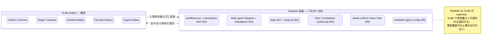

# 01 — Frozen Requirements (7 MUST)

本ディレクトリ全 doc が満たすべき **不可侵要件** を凍結する。各要件は user input
由来、To-Be (`tobe/`) を起点に拡張する形で実現される。

**Up:** [00-index](./00-index.md) **Refs:**
[10-system-overview](./10-system-overview.md),
[90-traceability](./90-traceability.md)

---

## A. 凍結された 7 MUST

```mermaid
flowchart TD
    R1[R1: workflow.json + gh issue listing<br/>orchestrator が workflow.json を使い<br/>gh project の issues / 非 project issues を一覧取得]
    R2[R2: multi-agent dispatch + standalone<br/>orchestrator から複数 agent 起動<br/>(異種 / 同 agent 異タイミング)<br/>agent 単独起動も可能]
    R3[R3: agent steps<br/>1 agent は steps を定義する]
    R4[R4: dual loop<br/>Flow loop + Completion loop<br/>境界 / C3L / Structured Output 哲学を継承]
    R5[R5: close 経路整合<br/>orchestrator 起動と<br/>agent 単独起動で close 経路が一致]
    R6[R6: agent config<br/>自明性 / 制御性 / 命名 / 依存構造 / 検証可能性]

    R1 --> R2
    R2 --> R3
    R3 --> R4
    R2 --> R5
    R3 --> R6
    R4 --> R6

    classDef must fill:#fff0d0,stroke:#cc8833;
    class R1,R2,R3,R4,R5,R6 must
```

> **MUST** = この 7 個のいずれか 1 つでも満たさない設計案は **構造的に
> rejected**。trade-off 軸ではなく hard gate。

---

## B. 各要件の確定文 (rewording 禁止)

| ID      | 要件文 (確定)                                                                                                                                                   | 出典          |
| ------- | --------------------------------------------------------------------------------------------------------------------------------------------------------------- | ------------- |
| **R1**  | orchestrator は workflow.json を読み、(a) gh project に紐づく issues 一覧、(b) project 指定なしの gh issues 一覧、の両方を取得できる                            | user input §2 |
| **R2a** | orchestrator は **複数 agent** を呼び出せる (異種 agent 同時、同 agent 異タイミング含む)                                                                        | user input §3 |
| **R2b** | agent は orchestrator を介さず **単独起動** できる                                                                                                              | user input §3 |
| **R3**  | 1 agent は **steps を定義** する。steps は宣言的 schema に従う                                                                                                  | user input §4 |
| **R4**  | agent は **実行ループ (Flow) + 完了ループ (Completion)** のデュアル構造を持つ。Flow / Completion の哲学・境界・C3L (5 段階抽象) ・ Structured Output を継承する | user input §5 |
| **R5**  | orchestrator 起動経由でも agent 単独起動経由でも、issue close 経路が **同一の Channel / Transport / EventBus** を経由する                                       | user input §6 |
| **R6**  | agent は **設定 (config) で構築** される。config は自明 (self-evident) / 制御容易 / 命名明瞭 / 依存構造明確 / 検証可能 (verifiable) を満たす                    | user input §7 |

> R2 は a / b で 2 文に分けて凍結する。R2a と R2b の **両立** が hard gate (R5
> はこの両立から派生する)。

---

## C. To-Be との関係 (継承 / 拡張)



**Why**:

- To-Be の 5 原則は Realistic でも **不可侵**。R1〜R6
  のどれかを満たすために原則を破る案は採用しない (例: R1 のために gh CLI を
  Channel から直接呼ぶ案 → P2 違反 → reject)。
- 各 R の実現は新 file または既存 file の §拡張で行う。To-Be 既存記述の
  **書き換え** は行わない。

---

## D. Anti-requirement (明示的に排除)

| 排除項目                                                 | 理由                                                                   |
| -------------------------------------------------------- | ---------------------------------------------------------------------- |
| backwards-compat with As-Is                              | climpt 全体方針 (`CLAUDE.md`: 後方互換性不要)                          |
| dryRun / dry-run flag                                    | To-Be で Transport=File に吸収済 (00-index P2 / 10 §C)                 |
| As-Is 用語の再導入 (例: "verdictAdapter", "closeIntent") | To-Be で名前が再設計済                                                 |
| 新 channel 追加                                          | 6 channel (D / C / E / M / Cascade / U) で R5 が満たされるため拡張不要 |
| direct call between channels                             | P3 (CloseEventBus) 違反                                                |
| Boot 後の動的 reconfig                                   | 20 §E (Layer 4 process 寿命 immutable) 違反                            |

---

## E. R1〜R6 の検証点 (90-traceability の根拠)

| ID  | 検証点 (該当 file §section が存在し、§A の確定文を満たしているか)                                                                                                    |
| --- | -------------------------------------------------------------------------------------------------------------------------------------------------------------------- |
| R1  | `12-workflow-config.md` §IssueSource ADT に `GhProject` / `GhRepoIssues` の 2 variant を含む                                                                         |
| R2a | `15-dispatch-flow.md` §SubjectPicker が `AgentInvocation list` を返し、CycleLoop が複数 dispatch を発火する                                                          |
| R2b | `11-invocation-modes.md` §run-agent mode が SubjectPicker を **同 instance で経由しつつ** input source を argv に切替える path を持つ (= bypass ではなく input 切替) |
| R3  | `13-agent-config.md` §AgentDefinition が `steps: StepList` field を持ち、`14-step-registry.md` で Step ADT が定義される                                              |
| R4  | `16-flow-completion-loops.md` §A に Flow loop / Completion loop の 2 sub-loop が示され、Step が両方の hook を持つ                                                    |
| R5  | `11-invocation-modes.md` §C に「全 mode が同一 Channel + Transport + Bus を共有する」証明図がある                                                                    |
| R6  | `13-agent-config.md` §Validation に Boot 時 schema validation の Decision (Accept / Reject) が示される                                                               |

> この検証点が **未充足** の場合、Done Criteria を満たさない (90-traceability の
> hard gate)。

---

## F. 1 行サマリ

> **「workflow.json で多 agent を起動しつつ、各 agent が steps + Flow/Completion
> dual loop で動き、起動経路にかかわらず close 経路は uniform である。」**

- workflow.json (R1) → multi-agent (R2a) → standalone agent (R2b) → steps (R3) →
  dual loop (R4) → uniform close (R5) は依存関係を持つ chain。
- agent config (R6) は R3 / R4 を成立させる schema-level の前提。
