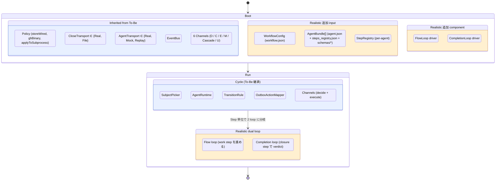
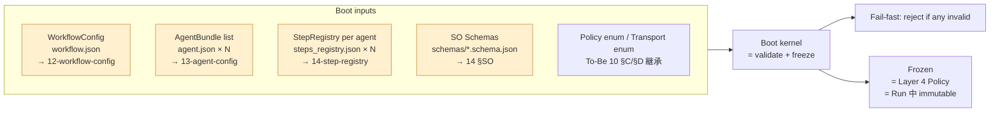
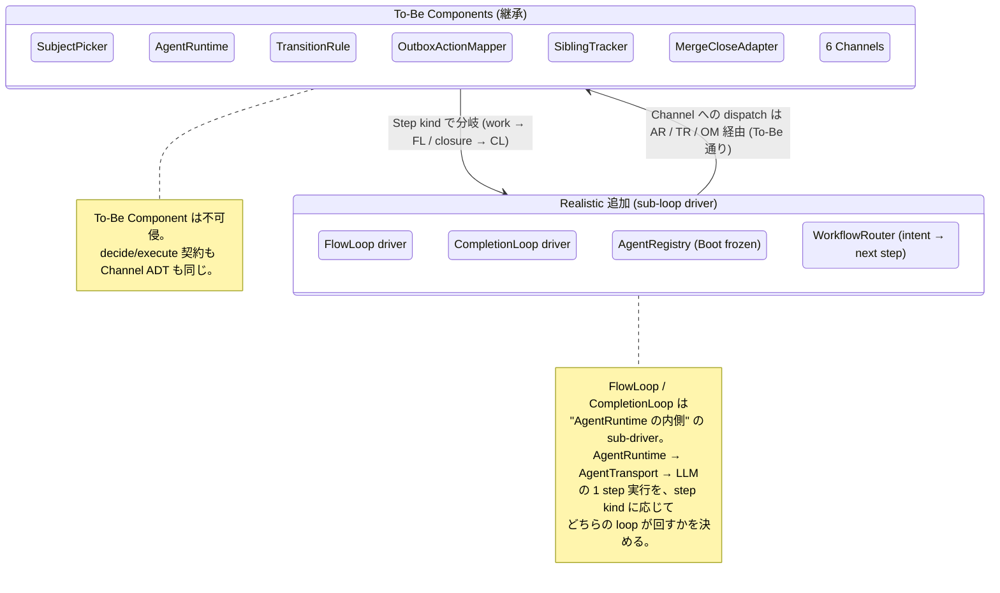
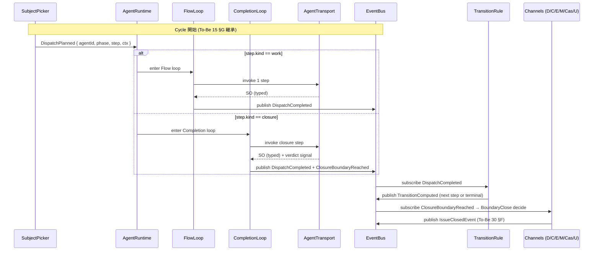

# 10 — System Overview (To-Be 継承 + 7 MUST 拡張)

Realistic 設計は **To-Be (`tobe/10-system-overview.md`) の Boot/Run
構造を不可侵で継承** し、7 MUST 要件 (R1〜R6) を満たすために **3 種類の追加
input** と **2 つの sub-loop** を加える。Channel / Transport / Policy / EventBus
はそのまま。

**Up:** [00-index](./00-index.md), [01-requirements](./01-requirements.md)
**Inherits:** [tobe/10-system-overview](./tobe/10-system-overview.md),
[tobe/15-dispatch-flow](./tobe/15-dispatch-flow.md) **Down:**
[11-invocation-modes](./11-invocation-modes.md),
[12-workflow-config](./12-workflow-config.md),
[13-agent-config](./13-agent-config.md),
[14-step-registry](./14-step-registry.md),
[16-flow-completion-loops](./16-flow-completion-loops.md)

---

## A. Realistic を 1 図で



> **継承境界**: 青箱 (To-Be) は変更しない。橙箱 (Realistic 追加) のみ新規 doc
> で詳細を書く。

**Why**:

- 7 MUST のうち R1 (workflow.json + gh issues) / R3 (steps) / R4 (dual loop) は
  Boot/Run の **input と driver** の追加で実現する。Channel / Transport / Policy
  は触らない。
- これにより To-Be の 5 原則 (Uniform Channel / Single Transport / CloseEventBus
  / Fail-fast Factory / Typed Outbox) を破らずに済む。

---

## B. Boot inputs (3 種類の追加 + 既存)



**Why**:

- R1 (workflow.json) / R3 (steps) / R6 (verifiable config) を Boot 入力として
  **schema validation で拒絶** できるよう統合。To-Be P4 (Fail-fast Factory)
  を継承。
- 全 input は **layer 4 (Policy)** に格上げされ、Run 中は immutable。step
  registry が「動的にロードされる」ことは無い。

**5 input の責務 1 行**:

| input              | 責務                                                            |
| ------------------ | --------------------------------------------------------------- |
| WorkflowConfig     | 「どの subject 群を、どの順で、どの agent に dispatch するか」  |
| AgentBundle        | 「1 agent が何者で、どの step を持ち、どう完了判定するか」      |
| StepRegistry       | 「1 agent の step graph + transition + retry pattern」          |
| SO Schemas         | 「1 step の structured output が満たすべき型」                  |
| Policy / Transport | 「環境前提 (gh / store / process) と 副作用の有無」(To-Be 継承) |

---

## C. Realistic Components (To-Be Components + 2 driver)



**Why**:

- R4 (dual loop) を、AgentRuntime の **内側** に sub-driver
  として置く。AgentRuntime 自体の To-Be 契約 (1 step 実行) は変えない。
- AgentRegistry / WorkflowRouter は Boot frozen な lookup table。R3 (step graph
  定義) と R6 (検証可能な config) を物理化する。

---

## D. Run flow (Step kind が dual loop を分岐)



**Why**:

- step.kind (work | verification | closure) が **dual loop の分岐 key**。To-Be
  15 §D の `ClosureBoundaryReached { stepKind: "closure" }` を契約のまま使う。
- Flow と Completion の境界は「closure step に入った瞬間」で 1 か所に固定
  (climpt 既存哲学 C4 を継承)。多義に逃げない。

---

## E. 3 invocation mode (To-Be 10 §F 継承拡張)

| mode           | SubjectPicker 入力                                                    | 主用途                              | 独立 doc                                           |
| -------------- | --------------------------------------------------------------------- | ----------------------------------- | -------------------------------------------------- |
| `run-workflow` | WorkflowConfig (`issueSource: GhProject \| GhRepoIssues \| Explicit`) | orchestrator 起動 (R1 / R2a)        | [11-invocation-modes §A](./11-invocation-modes.md) |
| `run-agent`    | CLI argv (subject 1 つ)                                               | agent 単独起動 (R2b)                | [11-invocation-modes §B](./11-invocation-modes.md) |
| `merge-pr`     | CLI argv (PR 1 つ)                                                    | PR merge subprocess (To-Be 44 継承) | [11-invocation-modes §D](./11-invocation-modes.md) |

```mermaid
flowchart LR
    subgraph CLI[CLI entries]
        E1[deno task workflow]
        E2[deno task agent]
        E3[deno task merge-pr]
    end

    subgraph Boot[Shared Boot]
        Inputs[WorkflowConfig + AgentBundle[] + Policy + Transport]
    end

    subgraph Run[Run]
        SP[SubjectPicker mode]
        AR[AgentRuntime + Channels<br/>= mode 不問]
    end

    E1 --> Boot
    E2 --> Boot
    E3 --> Boot
    Boot --> Run
    SP --> AR

    classDef m fill:#fff0d0,stroke:#cc8833;
    class E1,E2,E3 m
```

**Why**:

- R5 (close 経路整合) を構造的に保証: Boot input が同じ → AgentRuntime /
  Channels が同じ → close 経路が同じ。
- mode は **SubjectPicker の入力ソース** だけに局在。Channels が mode
  を知る経路は無い (To-Be 継承)。

---

## F. Realistic で **追加しない** もの (anti-list)

| 項目                                   | 理由                                                          |
| -------------------------------------- | ------------------------------------------------------------- |
| Run 中の AgentBundle ロード            | Layer 4 immutable 違反 (20 §E)                                |
| dispatch.sh shell scripts              | climpt feedback `feedback_no_dispatch_sh.md` (user territory) |
| CLI `--edition` / `--adaptation` flags | C5 (address before content) 違反。step registry のみが選択    |
| Channel から gh CLI 直叩き             | To-Be P2 (Single Transport) 違反                              |
| Run 中の dryRun flag                   | To-Be P2 で消滅 (Transport=File が代替)                       |
| 7 番目の Channel                       | 6 Channel で R5 が満たされる (To-Be 30 §F)                    |
| Agent 間直接呼び出し                   | To-Be P3 (CloseEventBus) 違反。連携は OutboxAction + Bus      |

---

## G. 1 行サマリ

> **「Realistic = To-Be の Boot/Run kernel に、WorkflowConfig + AgentBundle +
> StepRegistry の 3 input と Flow/Completion の 2 sub-driver
> を追加するだけ。Channel / Transport / Policy / EventBus は一切触らない。」**

- R1 / R3 / R6 → Boot input の追加で実現
- R4 → AgentRuntime 内側の sub-driver で実現
- R2 / R5 → 3 invocation mode が同じ Boot を共有することで実現
- 全 R は To-Be 5 原則と整合 (§01 §C 参照)
