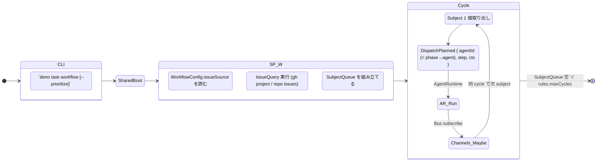
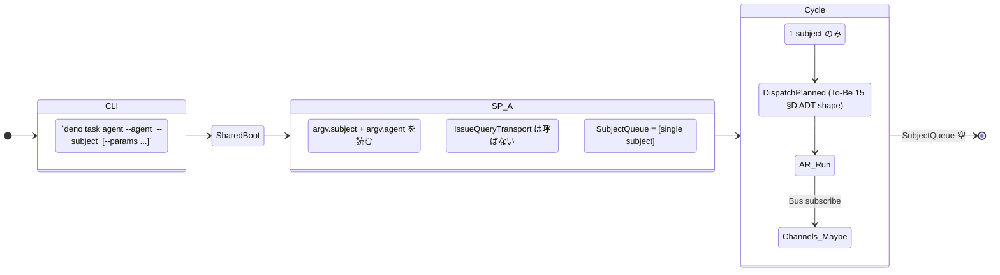

# 11 — Invocation Modes (R2 / R5 整合の証明)

3 つの CLI entry (`run-workflow` / `run-agent` / `merge-pr`) が **同じ Boot**
を共有し、**同じ Channel / Transport / EventBus を経由** することで close
経路が一致することを示す。R2 (multi-agent + standalone) と R5 (close 経路整合)
の hard gate を構造で保証する章。

**Up:** [10-system-overview](./10-system-overview.md) **Refs:**
[12-workflow-config](./12-workflow-config.md),
[tobe/10-system-overview §F](./tobe/10-system-overview.md),
[tobe/44-channel-M](./tobe/channels/44-channel-M.md)

---

## A. `run-workflow` mode (orchestrator 起動)



**Why**:

- R1 + R2a を実装する mode。`WorkflowConfig.issueSource` (`GhProject` |
  `GhRepoIssues` | `Explicit`) が SubjectPicker の入力源。詳細 → 12 §B。
- `SP_W` のみが mode 固有。`AR_Run` 以降は他 mode と同一。

---

## B. `run-agent` mode (agent 単独起動)



**Why**:

- R2b を実装する mode。SubjectPicker は **同 instance を経由する**が、入力源を
  IssueQueryTransport ではなく argv に切替。`gh API は呼ばない`。
- queue 長 1、cycle 1 回。だが
  `SP_A → SubjectPicker.tick() → DispatchPlanned → AgentRuntime` の event chain
  は run-workflow と **完全に同じ instance / 同じ contract** を辿る (= R5 の
  structural guarantee)。
- 「SubjectPicker bypass」ではなく「SubjectPicker の input source
  切替」と表現する (B11 統一)。これにより 11 §C R5 5 段証明の前提 (SubjectPicker
  出力 event 型同一) が崩れない。

---

## C. Close 経路の uniform 性 (R5 hard gate)

```mermaid
flowchart TD
    subgraph Modes
        W[run-workflow]
        A[run-agent]
        M[merge-pr]
    end

    subgraph SharedRun[Shared by all modes]
        AR[AgentRuntime]
        Bus[CloseEventBus]
        Tx[CloseTransport (Real / File)]
        D[DirectClose channel]
        E[BoundaryClose channel]
        Cpre[OutboxClose pre]
        Cpost[OutboxClose post]
        Cas[CascadeClose channel]
        U[CustomClose channel]
        MCh[MergeClose channel]
        Oracle[MergeCloseAdapter]
    end

    W --> AR
    A --> AR
    M --> MCh

    AR --> Bus : DispatchCompleted / ClosureBoundaryReached
    Bus --> D
    Bus --> E
    Bus --> Cpre
    Bus --> Cpost
    Bus --> Cas
    Bus --> U
    MCh --> Oracle
    Oracle --> Bus : IssueClosedEvent (M)

    D --> Tx
    E --> Tx
    Cpre --> Tx
    Cpost --> Tx
    Cas --> Tx
    U --> Tx
    Tx --> L1[Layer 1 / Layer 2 mirror]

    Bus --> ICE[IssueClosedEvent<br/>channel ∈ {D, C, E, M, Cascade, U} (6 値、C は OutboxClose 単一 ChannelId)]

    classDef mode fill:#fff0d0,stroke:#cc8833;
    classDef shared fill:#e8f0ff,stroke:#3366cc;
    class W,A,M mode
    class AR,Bus,Tx,D,E,Cpre,Cpost,Cas,U,MCh,Oracle,L1,ICE shared
```

**Why (R5 証明)**:

1. **同じ Boot を共有** → 同じ Policy / Transport / EventBus / Channel instance
   を使う (10 §B)。
2. **AgentRuntime は mode 不問** (10 §E) → publish される event の型
   (DispatchCompleted / ClosureBoundaryReached) が同じ。
3. **Channel.subscribesTo は固定** (To-Be 30 §C) → 同じ event を同じ Channel
   が拾う。
4. **Channel.execute → Transport** は唯一 (P1 + P2) → Layer 1 への書込は
   uniform。
5. **IssueClosedEvent の channel id 値域は 6 値で閉じる** (To-Be 30 §F / 46 §F:
   D / C / E / M / Cascade / U) → mode によって event
   形式が変わる余地が無い。`C` は OutboxClose の単一 ChannelId で Cpre / Cpost
   component が同値を共有。

> **構造的に**: run-workflow から close されようと、run-agent から close
> されようと、merge-pr 経由で server-auto-close されようと、`IssueClosedEvent`
> を受ける subscriber は **発火元の mode を区別できない** (channel id
> しか持たない)。これが R5 の hard gate。

---

## D. `merge-pr` mode (subprocess, To-Be 44 継承)

```mermaid
stateDiagram-v2
    direction LR
    [*] --> CLI

    state CLI {
        Argv : `deno task merge-pr --pr <ref>`
    }

    CLI --> SharedBoot : 親 process (orchestrator) の Transport / Policy を継承
    SharedBoot --> MCh

    state MCh {
        Decide : Transport=Real ∧ PR.body に Closes #N がある
        Execute : gh pr merge
    }

    MCh --> Server : merge → 後続 auto-close
    Server -.eventual.-> L1[Layer 1 Issue.state=Closed]
    L1 --> Oracle[MergeCloseAdapter.refresh]
    Oracle --> Bus : publish IssueClosedEvent(M)
```

**Why**:

- merge-pr は **CloseTransport を持たない** (44 §C) — close は server が行う。
- それでも `IssueClosedEvent(M)` で他 channel と同じ event 型に集約される
  (Oracle 経由)。R5 の継承。

---

## E. Mode × Channel reachability matrix

| Channel                   |    run-workflow    |            run-agent            | merge-pr |
| ------------------------- | :----------------: | :-----------------------------: | :------: |
| DirectClose (D)           |         ✓          |                ✓                |    —     |
| OutboxClose-pre (C-pre)   |         ✓          |                ✓                |    —     |
| OutboxClose-post (C-post) |         ✓          |                ✓                |    —     |
| BoundaryClose (E)         |         ✓          |                ✓                |    —     |
| CascadeClose              |         ✓          | ✓ (single subject 内で多段は稀) |    —     |
| CustomClose (U)           | ✓ (declare あれば) |       ✓ (declare あれば)        |    —     |
| MergeClose (M)            |         —          |                —                |    ✓     |

**読み方**:

- `run-workflow` と `run-agent` は **同じ 6 channel が reachable**。R5 の hard
  gate。
- `run-agent` で Cascade が稀なのは「単一 subject なので sibling
  集計が成り立つ機会が減る」ため。**reachable 自体は同じ**。
- `merge-pr` は MergeClose のみ。これは **subprocess の役割を 1 channel に絞る**
  設計上の意図 (To-Be 44 §F)。

> このマトリクスが「✓ / —」で gradient を持たない (例えば `△`) のは、**mode で
> Channel を有効化/無効化しない** 原則の表現。Channel は constructor の時点で全
> mode に対し同じ behavior を持つ。

---

## F. Mode 共通の Boot 入力 (改めて)

| input                           |  run-workflow   |       run-agent       |                  merge-pr                  |
| ------------------------------- | :-------------: | :-------------------: | :----------------------------------------: |
| Policy / CloseTransport (To-Be) |       同        |          同           |            同 (subprocess 継承)            |
| AgentTransport (To-Be 15 §C)    |       同        |          同           |                — (使わない)                |
| WorkflowConfig                  |        ○        | △ (読まない agent も) |                     —                      |
| AgentBundle list                |  ○ (全 agent)   |      ○ (1 agent)      |                     —                      |
| StepRegistry                    | ○ (全 agent 分) |    ○ (1 agent 分)     |                     —                      |
| EventBus                        |   同 instance   |      同 instance      | 同 instance (subprocess も Bus に publish) |

**Why**:

- merge-pr は WorkflowConfig / Agent / Step を読まないが **EventBus は共有する**
  (Oracle.refresh の publish 先)。これが「subprocess を mode の 1
  つとして扱える」根拠。
- run-agent が WorkflowConfig を **読み得る** (`△`) のは「同 agent が workflow
  からも standalone からも呼ばれる」整合性のため。詳細 → 13 §C。

---

## G. R5 違反検出 (anti-test)

以下のいずれかが成立すれば設計違反:

| 違反パタン                                               | 検出方法                                                                                    |
| -------------------------------------------------------- | ------------------------------------------------------------------------------------------- |
| run-agent でしか走らない Channel が出現                  | E §matrix で run-agent 列のみ ✓ の Channel が無いことを示す                                 |
| `IssueClosedEvent` の payload に mode 情報が混入         | To-Be 30 §F / 46 §F で channel id ∈ 6 値 (D / C / E / M / Cascade / U) の閉じた enum を確認 |
| run-workflow が SubjectPicker 以外の場所で gh CLI を呼ぶ | To-Be P2 で全 Channel が CloseTransport 経由のみ                                            |
| merge-pr が独自 Transport を持つ                         | 10 §F (subprocess は親 Transport 継承) で禁止                                               |
| run-agent から Channel を bypass して直接 close          | To-Be P1 (Uniform Channel = decide → execute) で禁止                                        |

---

## H. 1 行サマリ

> **「3 invocation mode は SubjectPicker の入力源だけが違う。AgentRuntime / Bus
> / Transport / Channel は完全に同一 instance を共有するため、close
> 経路は構造的に一致する。」**

- mode による分岐は **SubjectPicker の入力ソース** に閉じる (10 §F 継承)
- AgentRuntime 以降は全 mode で同じ event を流す
- IssueClosedEvent の channel id 値域は閉じた 6 値 (To-Be 30 §F / 46 §F: D / C /
  E / M / Cascade / U)
