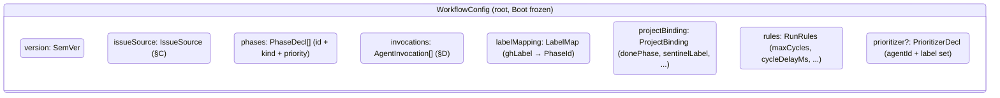
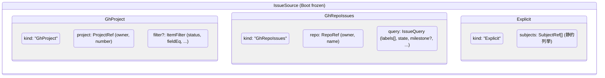
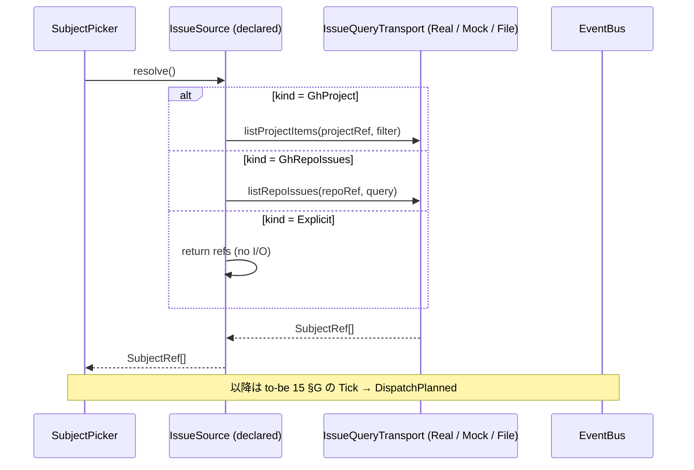
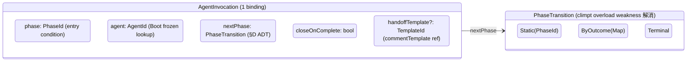
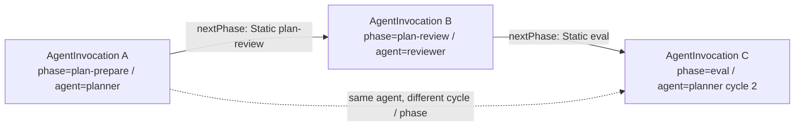
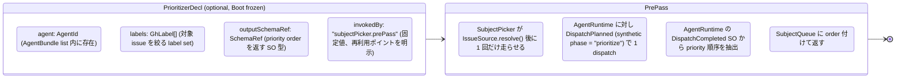
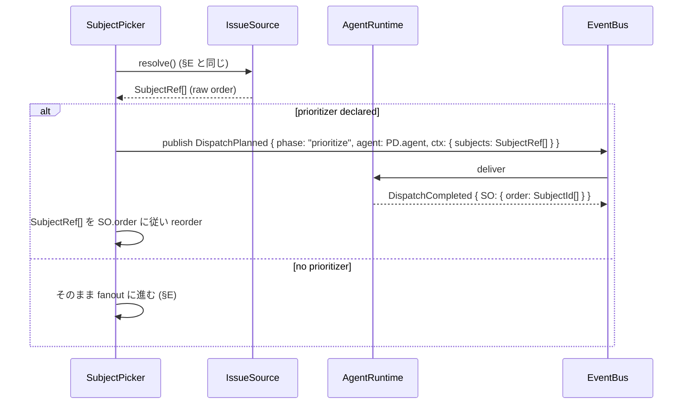
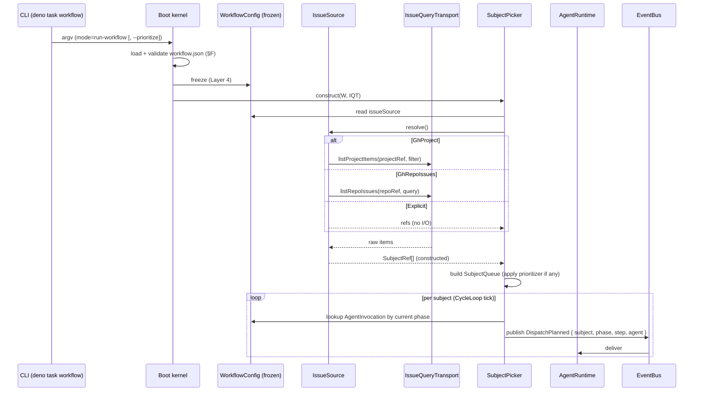

# 12 — WorkflowConfig (R1 + R2a を schema 凍結する)

`workflow.json` を Realistic schema として ADT で凍結し、SubjectPicker
の入力経路 (`IssueQuery` ADT + `IssueQueryTransport`) と多 agent dispatch 構造
(`AgentInvocation` list) を確定する。R1 (workflow.json + gh project / gh issues
一覧) と R2a (multi-agent dispatch) の hard gate をここで物理化する章。

**Up:** [10-system-overview](./10-system-overview.md),
[01-requirements](./01-requirements.md) **Inherits:**
[tobe/15-dispatch-flow](./tobe/15-dispatch-flow.md) (SubjectPicker 契約),
[tobe/20-state-hierarchy §E](./tobe/20-state-hierarchy.md) (Layer 4 Policy)
**Refs:** [11-invocation-modes](./11-invocation-modes.md),
[13-agent-config](./13-agent-config.md),
[_meta/climpt-inventory C1/C7](./_meta/climpt-inventory.md),
[_meta/tobe-inventory R1/R2](./_meta/tobe-inventory.md)

---

## A. 役割 (workflow.json は何を declare するか / しないか)

`workflow.json` は **Boot 入力 artifact の 1 つ** (10 §B) として、「どの subject
群を、どの順で、どの agent に dispatch するか」を **declare する**。Run
中に解釈されるロジック・Channel の挙動・Transport 選択・close 経路は **declare
しない** (それぞれ AgentBundle / Channel ADT / Policy / 6 Channel
構造に局在)。本章では To-Be で未定義だった `WorkflowConfig` / `IssueSource` /
`AgentInvocation` の 3 ADT を導入し、climpt 既存 `workflow.json` schema (C1) を
**後方互換性無視で再設計** する。To-Be 既存記述は再掲しない (§E で SubjectPicker
pipeline のみ参照)。

---

## B. WorkflowConfig (root ADT)



| field            | 型                         | 役割                                                                                | climpt 既存 (C1) との対応                                                 |
| ---------------- | -------------------------- | ----------------------------------------------------------------------------------- | ------------------------------------------------------------------------- |
| `version`        | `SemVer`                   | schema バージョン (Boot validator が major 一致を要求)                              | 同 (継承)                                                                 |
| `issueSource`    | `IssueSource` ADT (§C)     | **SubjectPicker の入力源** (`run-workflow` mode のみ)                               | `projectBinding` から分離・昇格                                           |
| `phases`         | `PhaseDecl[]`              | phase id とその kind (`actionable / terminal / blocking / prePass`) + priority      | `phases.{id}` を list 化、prePass 値は B(R2)3 修復で追加 (prioritizer 用) |
| `invocations`    | `AgentInvocation[]` (§D)   | 「どの phase で どの agent を呼ぶか」の **複数 binding** (R2a)                      | `phases.{id}.agent` + `agents.{id}.outputPhase(s)` を統合                 |
| `labelMapping`   | `Record<GhLabel, PhaseId>` | gh label → phase の Boot frozen lookup                                              | 同 (継承)                                                                 |
| `projectBinding` | `ProjectBinding`           | `donePhase / evalPhase / planPhase / sentinelLabel / inheritProjectsForCreateIssue` | 同 (継承、ただし `issueSource` と独立)                                    |
| `rules`          | `RunRules`                 | `maxCycles, cycleDelayMs, maxConsecutivePhases`                                     | 同 (継承)                                                                 |
| `prioritizer`    | `PrioritizerDecl?`         | classification と独立した **pre-pass** (詳細 §D2)                                   | `prioritizer.{agent,labels}` (継承、phase 外発火を §D2 で物理化)          |

**Why**:

- R6 (verifiable / self-evident config) を満たすため、`agents.{id}` と
  `phases.{id}.agent` の **2 場所に散らばっていた agent binding** (climpt の
  self-evidence weakness) を `invocations[]` に一元化。1 phase に何 agent
  呼ぶかが 1 か所で読める。
- R1 を schema レベルで満たすため、`issueSource` を **top-level field** に昇格
  (climpt では `projectBinding` 内の sentinel 付き label に隠れていた)。
- climpt の `agents.{id}.outputPhase` (transformer) / `outputPhases` (validator)
  の **role-coupling 命名 weakness** は §D の `PhaseTransition` に統合して解消。

---

## C. IssueSource ADT (R1: gh project / gh repo issues / explicit)



| variant        | 入力 (env + query)                                         | 出力                                     | 用途                                    |
| -------------- | ---------------------------------------------------------- | ---------------------------------------- | --------------------------------------- |
| `GhProject`    | `ghBinary=Present` (Policy) + `ProjectRef` + `ItemFilter?` | `SubjectRef[]` (project に紐づく issues) | gh project から多 issue を取得 (R1.a)   |
| `GhRepoIssues` | `ghBinary=Present` + `RepoRef` + `IssueQuery`              | `SubjectRef[]` (project 指定なし issues) | repo 横断の label / state filter (R1.b) |
| `Explicit`     | (なし)                                                     | `SubjectRef[]` (config に静的記載)       | test / replay / 単発 batch              |



**設計判断: なぜ `IssueQueryTransport` を CloseTransport から独立させるか**

- To-Be P2 (Single Transport) は **close 副作用 (Issue 状態書込) に閉じた
  seam**。`CloseTransport ∈ {Real, File}` の `Real` は `gh issue close` 等の
  **writer**。
- gh project / gh issues の **読み取り** は副作用ゼロで、close path の
  uniformity (R5) と無関係。CloseTransport に listing
  を相乗りすると以下が破綻する。
  - Channel の `decide → execute` 契約 (P1 Uniform Channel) に「listing
    query」という第 3 オペレーションが混入 → P1 違反
  - `transport=File` 時の close 抑止 (To-Be 10 §C) と「読み取りは常に gh
    API」の独立性が壊れる
  - run-agent mode (Subject 1 つを argv で受ける) で listing を呼ばないのに
    CloseTransport に listing API が露出する → R5 の構造保証 (mode 不問)
    を弱める
- したがって **新 seam: `IssueQueryTransport ∈ {Real, Mock, File}`**
  を導入する。Boot 入力に独立 field として現れ、Layer 4 Policy として Run 中
  immutable (20 §E)。
- `Real` は gh CLI を listing に使う。`Mock` は test fixtures を返す。`File`
  は事前 dump の `issue-list.json` 等を読む (climpt の
  `agents/orchestrator/issue-syncer.ts` 系の責務をここに局在)。

**Why**:

- R1 を **2 variant 必須** で凍結 (`GhProject` + `GhRepoIssues`)。`Explicit` は
  test 用かつ R1 文面外 (確定文 §B)。Done Criteria §E の検証点は前者 2 variant
  のみで成立。
- climpt では gh project listing が `agents/scripts/project-list.ts` /
  `project-items.ts` に分散していた。これを `IssueQueryTransport.Real` の単一
  seam に統一し、self-evidence (R6) を取り戻す。
- IssueQueryTransport は `read-only`、CloseTransport は `write-only` という
  **責務の polarity 分離**で、To-Be P1/P2 と新 seam が共存する。

---

## D. AgentInvocation ADT (R2a: 1 phase × 1 agent の binding を list 化)



| field             | 型                    | 役割                                                                                                                                                |
| ----------------- | --------------------- | --------------------------------------------------------------------------------------------------------------------------------------------------- |
| `phase`           | `PhaseId`             | この invocation が発火する phase (key)                                                                                                              |
| `agent`           | `AgentId`             | 13 章 AgentBundle の Boot frozen lookup key。**role は AgentBundle.role の single source** で AgentInvocation 側に重複 declare しない (B(R2)1 修復) |
| `nextPhase`       | `PhaseTransition` ADT | climpt `outputPhase / outputPhases` を **統一 ADT** に折り畳む (§Why)                                                                               |
| `closeOnComplete` | `bool`                | closure step 後に DirectClose を希望するかの declare                                                                                                |
| `handoffTemplate` | `TemplateId?`         | OutboxAction 経由 handoff 時の comment template 参照                                                                                                |

**Multi-agent dispatch (R2a) の表現**:



- **異種 agent 同 logical phase (phase versioning)**: 1 logical phase `plan`
  を複数 phase に分割して declare (`plan-prepare` / `plan-review` / ...)。各
  phase に **1 invocation のみ** bind (W11)。15 §C 参照。
- **同 agent 異 cycle**: invocation list に同 `agent` を異 `phase`
  で複数置く。Run 中の cycle 進行で別タイミングに発火する
  (`PhaseTransition.ByOutcome` 経由)。
- **handoff (OutboxAction との関係)**: `handoffTemplate` で declare された
  template が、closure step の SO `handoffFields[]`
  を埋め、`OutboxAction.CreateIssue` / `Comment` として外に出る。**agent → agent
  の直接呼び出しは無い** (To-Be P3 CloseEventBus 継承)。

**Why**:

- R2a を schema レベルで満たすため、「agent は phase に紐づく」を **list
  (`AgentInvocation[]`)** で表現。climpt の `phases.{id}.agent` は 1:1 制約で
  multi-agent を表現できなかった。
- climpt の `outputPhase` / `outputPhases` (transformer は単数、validator
  は複数) という **role-coupling 命名 weakness** を `PhaseTransition` ADT
  に統合。`Static / ByOutcome / Terminal` の 3 variant で role に依存しない。
- **role の single source は AgentBundle (13 §C `AgentRoleHint` ADT、3 variant:
  transformer / validator / custom)** (B(R2)1 修復)。AgentInvocation には `role`
  field を持たせず、role lookup が必要な場面 (PhaseTransition 解決時等) は agent
  field 経由で AgentRegistry を引く。これにより transformer / validator の 2
  variant に閉じる 12 §D 旧 `AgentRole` と、custom を含む 13 §C `AgentRoleHint`
  の double-declare 問題を解消。
- agent 間連携は OutboxAction (P5 Typed Outbox) 経由のみ。`handoffTemplate` は
  **declare** で、Run の連携 path は EventBus → OutboxActionMapper →
  C-pre/C-post に集約 (15 §B)。

---

## D2. PrioritizerDecl (phase-外 pre-pass, B9 修復)



| field             | 役割                                          | 制約                                        |
| ----------------- | --------------------------------------------- | ------------------------------------------- |
| `agent`           | prioritizer として走る AgentId                | Boot W8 で AgentBundle list に存在検証      |
| `labels`          | 対象 issue を filter する gh label 集合       | invocation list の phase key とは独立       |
| `outputSchemaRef` | prioritizer の SO schema (priority order ADT) | Boot で schema 存在検証                     |
| `invokedBy`       | 固定値 `"subjectPicker.prePass"`              | phase invocation の発火経路と区別する識別子 |

**呼び出し経路 (発火 1 回 / Run の冒頭)**:



**Why (B9 修復)**:

- prioritizer は climpt 既存の **「issue 一覧を priority 順に並び替える」専用
  agent**。phase invocation list (§D) には出てこない (phase key を持たない)
  が、その挙動は通常の dispatch と同じく
  `DispatchPlanned → AgentRuntime → DispatchCompleted` の event chain
  に集約させる。
- `invokedBy: "subjectPicker.prePass"` という固定値で「phase 経路ではなく
  SubjectPicker pre-pass 経路」と区別。これにより orchestrator-opaque な shell
  script (climpt `script/dispatch.sh` weakness) を **declarative
  に置き換え**できる (R6: controllability)。
- prioritizer の SO schema は AgentBundle の outputSchemaRef と同じ仕組みで Boot
  validate される。silent failure / parse error は P4 Fail-fast で reject。

**B(R2)3 修復: synthetic phase の Boot declare 経路 + subscriber filter**:

PrioritizerDecl が宣言された場合、Boot kernel は以下を **auto-declare** する:

1. `WorkflowConfig.phases["prioritize"]` を追加 (kind: `"prePass"` —
   `PhaseDecl.kind` ADT に新 variant、4 値: actionable / terminal / blocking /
   prePass)。
2. labelMapping への登録は不要 (prePass phase は外部 gh label
   と紐付かない、SubjectPicker 内部経路)。
3. nextPhase は強制 `Terminal` (prePass の DispatchCompleted は次 phase
   に遷移しない、SubjectQueue reorder のみが副作用)。

これにより W1 (PhaseId 重複なし) / W4 (nextPhase 参照) / W7 (issueSource ×
Policy 整合) の Boot validation の対象に prePass phase が含まれ、silent accept
経路が消える。

**subscriber filter** (TransitionRule / OutboxActionMapper の挙動 doc 化):

| component                   | phase.kind == "prePass" の挙動                                                                                                                                     |
| --------------------------- | ------------------------------------------------------------------------------------------------------------------------------------------------------------------ |
| TransitionRule              | DispatchCompleted を **subscribe するが TransitionComputed を publish しない** (nextPhase = Terminal で SubjectPicker は次 cycle 引かない)                         |
| OutboxActionMapper          | DispatchCompleted を subscribe するが、prePass 由来 SO は handoffFields を持たない契約 (PrioritizerDecl.outputSchemaRef で enforce) → OutboxActionDecided 発火なし |
| Channels (D / E / Cpre / U) | ClosureBoundaryReached / TransitionComputed を subscribe するが、prePass phase は ClosureBoundaryReached を publish しない (Closure step 不在) → 発火しない        |

これにより `ctx.prePass==true` flag (15 §B) は subscriber filter
の補助情報であり、phase.kind == "prePass" が **正規の filter key**。silent
failure 経路は構造的に消える (P4 整合)。

---

## E. SubjectPicker pipeline (CLI argv → SubjectRef[])



**SubjectRef field 案** (To-Be で「未定義」だった構造をここで提示):

| field            | 型                | 由来                                            | 用途                                          |
| ---------------- | ----------------- | ----------------------------------------------- | --------------------------------------------- |
| `id`             | `string`          | `IssueRef.number` を string 化                  | SubjectQueue 内の identity                    |
| `issue`          | `IssueRef`        | IssueQueryTransport が一次返す                  | Layer 1/2 lookup の key (15 §D の `issue` 用) |
| `phase`          | `PhaseId`         | labelMapping から推論                           | invocation lookup の key                      |
| `handoffPayload` | `HandoffPayload?` | Outbox 由来 (前 cycle の SO の `handoffFields`) | 異 cycle dispatch の context 受け渡し         |
| `meta`           | `SubjectMeta`     | gh API response の subset                       | logging / SO context                          |

> **境界**: `SubjectRef` は **dispatch 文脈の identity** (15 §D
> 継承)。`IssueRef` は **close 文脈の identity** (Layer 1/2 の primary
> key)。`SubjectRef.issue: IssueRef` の **包含関係**で表現し、両者を string
> で混同させない。Outbox 経由の handoff も `handoffPayload` field に局在し
> `IssueRef` 自体は変えない。

**Why**:

- R1 を実 pipeline で satisfy。CLI → Boot → SubjectPicker → IssueSource →
  IssueQueryTransport → SubjectRef[] が 1 本の単方向 sequence。To-Be 15 §G の
  Tick→Drain Lifecycle の **前段** にこの pipeline を接続。
- `SubjectRef` の field を提示することで、To-Be で「未定義」だった seam を
  Realistic で確定 (R6: verifiable)。

---

## F. Boot validation (Fail-fast, To-Be P4 継承)

```mermaid
flowchart TD
    Load[Load workflow.json + agent.json[] + steps_registry.json[]]
    W1[W1: phases に同名 PhaseId が無い<br/>kind ∈ actionable / terminal / blocking]
    W2[W2: invocations[*].phase が phases に存在]
    W3[W3: invocations[*].agent が AgentBundle list に存在]
    W4[W4: invocations[*].nextPhase の参照 PhaseId が全て phases に存在]
    W5[W5: labelMapping の値 PhaseId が phases に存在]
    W6[W6: projectBinding.donePhase / evalPhase / planPhase が phases に存在]
    W7[W7: issueSource.kind ∈ GhProject / GhRepoIssues / Explicit かつ ghBinary 整合<br/>GhProject ∨ GhRepoIssues ⇒ Policy.ghBinary=Present]
    W8[W8: prioritizer.agent が AgentBundle list に存在]
    W9[W9: handoffTemplate ID が handoff.commentTemplates に存在]
    W10[W10: Transport pair 整合<br/>RR / RF / FF / Mock×File のみ accept<br/>Mock×Real / File×Real は reject]
    W11[W11: invocations[] 内 phase, agent 対が unique<br/>同 logical phase 多 agent は phase versioning で declare]
    Decide{All pass?}

    Load --> W1 --> W2 --> W3 --> W4 --> W5 --> W6 --> W7 --> W8 --> W9 --> W10 --> W11 --> Decide
    Decide -->|yes| Freeze[Boot frozen → Layer 4 immutable]
    Decide -->|no| Reject[Reject with typed BootError<br/>process exit non-zero]
```

__11 rule (file-prefix 付き、W_ = Workflow 系。B(R2)2 修復で W11 追加、B(R2)4
修復で W10 整合)_*:

| rule                                                 | 失敗時の error type                                                                                                 |
| ---------------------------------------------------- | ------------------------------------------------------------------------------------------------------------------- |
| W1 PhaseDecl 整合                                    | `BootError.PhaseGraphInvalid(reason)`                                                                               |
| W2 invocation.phase 参照                             | `BootError.UnknownPhaseRef(invocationIndex, phaseId)`                                                               |
| W3 invocation.agent 参照                             | `BootError.UnknownAgentRef(invocationIndex, agentId)`                                                               |
| W4 nextPhase 参照                                    | `BootError.UnknownPhaseRef(...)`                                                                                    |
| W5 labelMapping 参照                                 | `BootError.UnknownPhaseRef(...)`                                                                                    |
| W6 projectBinding 参照                               | `BootError.ProjectBindingInvalid(field)`                                                                            |
| W7 issueSource × Policy 整合                         | `BootError.PolicyMismatch("ghBinary required for kind=Gh*")`                                                        |
| W8 prioritizer.agent 参照                            | `BootError.UnknownAgentRef(...)`                                                                                    |
| W9 handoffTemplate 参照                              | `BootError.UnknownTemplateRef(...)`                                                                                 |
| W10 Transport pair 整合 (B6 修復)                    | `BootError.TransportPairMismatch(issueQuery, close, reason)`                                                        |
| W11 invocation `(phase, agent)` unique (B(R2)2 修復) | `BootError.DuplicateInvocationPair(phase, agent)` — 同 logical phase 多 agent は phase versioning で declare させる |

**W10 詳細 (Transport pair 4 組合せ)**:

| `IssueQueryTransport` | `CloseTransport` | accept / reject | 理由                                                                          |
| --------------------- | ---------------- | --------------- | ----------------------------------------------------------------------------- |
| Real                  | Real             | accept          | production: 実 listing + 実 close                                             |
| Real                  | File             | accept          | dryrun-like: 実 listing + Mirror only close (verification 用)                 |
| File                  | File             | accept          | full offline test: dump fixture + Mirror only                                 |
| Mock                  | File             | accept          | unit test: fixture + Mirror only                                              |
| Mock                  | Real             | **reject**      | mock fixture を使いながら本物 close は危険 (silent fixture 由来 close を防ぐ) |
| File                  | Real             | **reject**      | 同上 (read-only mock vs real write は polarity 矛盾)                          |

**Why**:

- To-Be P4 (Fail-fast Factory) を継承。invalid な workflow.json は **Run
  に到達させない**。dryRun も partial accept も無い。
- R6 (verifiable) を **9 rule の列挙** で物理化。各 rule に対応する `BootError`
  variant を持たせ、validator のテストは入出力 table。

---

## G. Anti-list (workflow.json に書かない / 書かせない)

| 項目                                      | 理由                                                                                                 |
| ----------------------------------------- | ---------------------------------------------------------------------------------------------------- |
| Run 中の動的 reload                       | Layer 4 process 寿命 immutable (20 §E) 違反                                                          |
| Channel 設定 (Channel の有効/無効)        | Channel は constructor 時点で全 mode に対し同 behavior (11 §E matrix)                                |
| `dryRun` flag                             | To-Be P2 で消滅 (Transport=File が代替, 01 §D)                                                       |
| `dispatch.sh` ref / shell path            | climpt feedback `feedback_no_dispatch_sh.md` (user territory)、orchestrator-opaque (10 §F anti-list) |
| `transport` 選択                          | Layer 4 Policy 専管 (20 §D)。workflow.json は副作用方針を declare しない                             |
| `--edition / --adaptation` flag mapping   | C5 (address before content) 違反。step registry のみが選択 (climpt 既定)                             |
| agent 内 step 列の inline 定義            | R3 専管 (13 / 14 章)。workflow.json は **agent を呼ぶか** だけ宣言、何 step かは AgentBundle 側      |
| `IssueRef` を直接列挙 (`SubjectRef` 抜き) | dispatch 文脈と close 文脈の境界破壊 (To-Be 用語境界, _meta/tobe-inventory §横断)                    |

**Why**:

- R6 (self-evidence) を保つには「workflow.json に書ける範囲」を **狭く凍結**
  することが必要。書ける項目 = §B 表、書けない項目 = §G 表、で全体が完結する
  (RC1: closure overload を避けるための列挙統制)。

---

## H. 1 行サマリ

> **「workflow.json は IssueSource ADT で多 issue を gh project / gh repo /
> explicit から取り、AgentInvocation list で多 agent を phase ごとに binding
> する。listing は CloseTransport から独立した IssueQueryTransport seam
> を経由する。」**

- R1 → §C `IssueSource` ADT + `IssueQueryTransport` seam で実現
- R2a → §D `AgentInvocation[]` で同 phase 多 agent / 同 agent 異 cycle を表現
- R6 → §F の 11 rule (W1〜W11) で Boot Fail-fast
- To-Be 用語境界 (`SubjectRef` vs `IssueRef`) は §E で **包含関係** として確定
- B9 修復: prioritizer は §D2 で「SubjectPicker pre-pass + 通常 dispatch
  chain」として物理化
- B6 修復: Transport pair (IssueQueryTransport × CloseTransport) の組合せ整合を
  §F W10 で Boot validate
