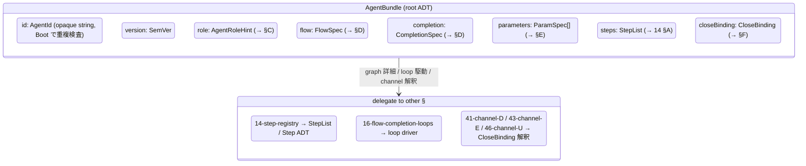
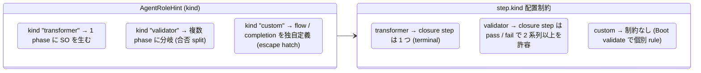
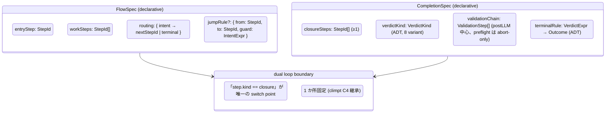
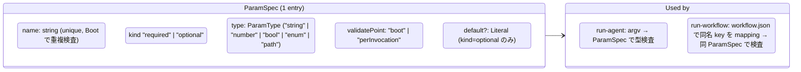
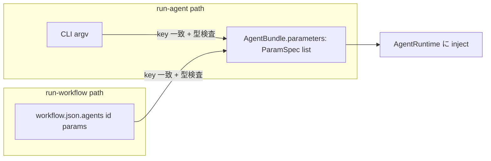
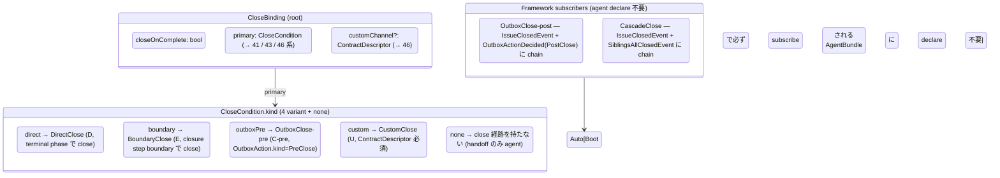
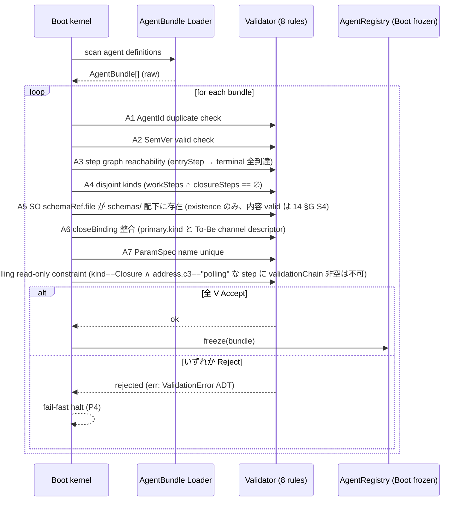
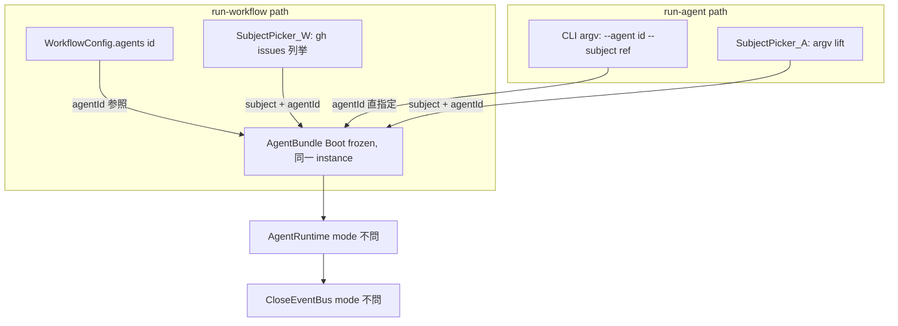

# 13 — Agent Config (AgentBundle ADT / Boot validation / R3 R4 R6 凍結)

R3 (agent が steps を定義) / R4 (Flow + Completion の dual loop) / R6 (config
の自明性 / 検証可能性) を **schema レベルで凍結** する章。climpt の現行
`agent.json` + `steps_registry.json` + 部分的 `workflow.json` の **3 file 分散**
という self-evidence の弱点を、Realistic では **AgentBundle** という単一の
declarative ADT に統合する。step graph 詳細は 14 へ delegate、loop 駆動詳細は 16
へ delegate する。

**Up:** [10-system-overview](./10-system-overview.md),
[01-requirements](./01-requirements.md) **Refs:**
[11-invocation-modes](./11-invocation-modes.md),
[14-step-registry](./14-step-registry.md),
[16-flow-completion-loops](./16-flow-completion-loops.md),
[tobe/15-dispatch-flow](./tobe/15-dispatch-flow.md),
[tobe/channels/46-channel-U](./tobe/channels/46-channel-U.md) **Inherits:**
[tobe/10-system-overview §B](./tobe/10-system-overview.md),
[tobe/20-state-hierarchy §E](./tobe/20-state-hierarchy.md)

---

## §A 役割

AgentBundle は「1 agent が何者で、どの step を持ち、どう完了判定し、どの Channel
と結びつくか」を **Boot 入力として 1 つの declarative artifact** で declare する
root ADT。Boot kernel が schema validate し、合格したものだけが Layer 4 (Policy)
に格上げされ Run 中は immutable になる。AgentRegistry は AgentId をキーにした
Boot frozen な lookup table を持ち、`run-workflow` / `run-agent` どちらの mode
からも同じ AgentBundle が引かれる (R5 整合)。climpt の `agent.json` (verdict /
IO surface) + `steps_registry.json` (graph + retry) + `workflow.json` の
`agents.{id}` セクション (role / closeOnComplete / closeCondition) という **3
file 分散** を、Realistic では **1 bundle 1 概念** に集約する (climpt-inventory
§self-evidence weakness の修復)。

---

## §B AgentBundle (root ADT)



| field          | 型                        | 必須 | 役割                                                                                     |
| -------------- | ------------------------- | :--: | ---------------------------------------------------------------------------------------- |
| `id`           | `AgentId` (opaque string) |  ○   | agent の unique identity。Boot validation で重複検査 (§G)。閉じた enum ではない          |
| `version`      | `SemVer`                  |  ○   | bundle の version。breaking change を Boot で検出する基準                                |
| `role`         | `AgentRoleHint` (§C ADT)  |  ○   | agent の役割分類 (Transformer / Validator / Custom)。step kind 配置の制約源              |
| `flow`         | `FlowSpec` (§D)           |  ○   | Flow loop が回す entry / work / routing rule の declarative shape                        |
| `completion`   | `CompletionSpec` (§D)     |  ○   | Completion loop の closure step set / verdict kind / validation chain shape              |
| `parameters`   | `ParamSpec[]` (§E)        |  ○   | run-agent 時に CLI argv から受ける parameter の宣言。run-workflow でも同 spec が読まれる |
| `steps`        | `StepList` (14 §A)        |  ○   | step graph 本体。R3 の物理化点。詳細は 14                                                |
| `closeBinding` | `CloseBinding` (§F)       |  ○   | どの Channel と結びつき、何条件で close するかの宣言                                     |

**統合範囲 (climpt → Realistic)**:

| climpt 配置                                                                              | Realistic 内訳                                                                                        |
| ---------------------------------------------------------------------------------------- | ----------------------------------------------------------------------------------------------------- |
| `.agent/<a>/agent.json` (verdict / role / closeOnComplete / closeCondition / parameters) | `role` + `completion` + `closeBinding` + `parameters`                                                 |
| `.agent/<a>/steps_registry.json` (graph + retry + entryStepMapping)                      | `flow` + `steps` + `completion.validationChain`                                                       |
| `.agent/workflow.json` の `agents.{id}` (role / outputPhase / outputPhases)              | `role` (= AgentRoleHint) — workflow.json 側からは agentId 参照のみで behavior は AgentBundle 側にある |

> **設計上の境界**: physical な file 配置 (1 file / 複数 file / json / yaml) は
> **実装詳細**。design 上は AgentBundle を 1 単位として扱う。Boot は file system
> 経由で集めて 1 ADT に lift する責務だけ持つ。

**Why**:

- climpt の「behavior が 3 file に分散」という self-evidence weakness を、design
  上 1 ADT に集約することで修復する (R6: 自明性)。
- AgentBundle が `steps: StepList` を直接所有することで R3 (agent が steps
  を定義) を schema-level で保証する。
- `role` / `flow` / `completion` / `closeBinding` の 4 軸が直交し、verdict と
  closure と handoff の churn (climpt-inventory §naming clarity) を消す。
- `role` field 名は climpt 既存 `agent.json.role` を継承。**Transport
  語は使わない** — Transport 系列 (CloseTransport / AgentTransport /
  IssueQueryTransport) は Run-time seam に専有させ、AgentBundle の declarative
  role 分類とは命名空間を分離する (B2 修復)。

---

## §C AgentRoleHint ADT



| kind          | climpt 由来                      | output 多重度            | 主な closure 形                                     |
| ------------- | -------------------------------- | ------------------------ | --------------------------------------------------- |
| `transformer` | `agent.json.role: "transformer"` | 1 (single outputPhase)   | `verdictKind: poll:state` / `count:iteration`       |
| `validator`   | `agent.json.role: "validator"`   | 多 (outputPhases plural) | `verdictKind: detect:structured` / `meta:composite` |
| `custom`      | (climpt に対応無し / 拡張枠)     | 任意                     | `verdictKind: meta:custom`                          |

**Why**:

- climpt の `outputPhase` (transformer は単数) vs `outputPhases` (validator
  のみ複数) という **silent role coupling** を ADT の `kind` discriminator
  で明示分離する。field name の "s" 1 文字差で role を推測する設計を排除する。
- field 名は `role` (climpt 既存継承)。Transport 語と衝突しない (B2 修復)。

---

## §D FlowSpec / CompletionSpec



**FlowSpec — 1 表**:

| field       | 役割                                                                                                                                                            |
| ----------- | --------------------------------------------------------------------------------------------------------------------------------------------------------------- |
| `entryStep` | Flow loop の最初に invoke する StepId。`agentRoleHint` が validator なら `entryStepMapping` として複数 entry を許容 (climpt v3)                                 |
| `workSteps` | Flow loop が回し得る work step の StepId 集合。closure step は **含まない**                                                                                     |
| `routing`   | step が返す intent ADT (`next` / `repeat` / `handoff` / `closing` / `jump` / `escalate`) → 次 StepId or terminal の declarative map (climpt `transitions` 継承) |
| `jumpRule?` | (任意) intent expression による guarded jump。Boot で reachability 検査 (§G)                                                                                    |

**CompletionSpec — 1 表**:

| field             | 役割                                                                                                                                                                                                               |
| ----------------- | ------------------------------------------------------------------------------------------------------------------------------------------------------------------------------------------------------------------ |
| `closureSteps`    | Completion loop が起動する `step.kind == "closure"` な StepId 集合。≥1 必須                                                                                                                                        |
| `verdictKind`     | `VerdictKind` ADT — 8 variant: `poll:state` / `count:iteration` / `count:check` / `detect:keyword` / `detect:structured` / `detect:graph` / `meta:composite` / `meta:custom` (climpt `agent.schema.json` 完全継承) |
| `validationChain` | postLLM validator の順列。`postLLMConditions` は retry 可、`preflightConditions` は abort のみ (climpt RC1 lesson 継承)                                                                                            |
| `terminalRule`    | verdict expression → Outcome ADT (Pass / Fail / Defer) の declarative mapping                                                                                                                                      |

**Dual loop boundary (R4 hard freeze)**:

> **boundary は「step.kind == "closure"」が唯一の switch point**。
>
> - `step.kind == "work"` (or `verification`) → FlowLoop driver が処理
> - `step.kind == "closure"` → CompletionLoop driver が処理
> - 1 か所固定。stepId / agentId / phaseId / SO 内容で boundary を分岐させない
>   (climpt C4 継承、To-Be 10 §D 継承)。

**Why**:

- R4 (dual loop) は FlowSpec / CompletionSpec の **物理的分離** で表現される。両
  spec は同じ AgentBundle 内に共存するが、参照する step の `kind` が disjoint
  (FlowSpec.workSteps と CompletionSpec.closureSteps は intersection 空)。これを
  Boot validate (§G) で強制する。
- climpt の `verdict` / `completion` / `closure` の用語 churn を **「Completion
  loop が closure step で verdict を作る」** と一貫した語彙に固定する
  (climpt-inventory §naming clarity 修復)。
- `closure.polling` (read-only) に validator を書かない原則 (climpt RC1) は
  `validationChain` field の Boot validate (closure.polling kind と判別)
  で強制する (詳細は 16 §)。

---

## §E ParamSpec (CLI parameter contract)



| field           | 役割                                                                                |
| --------------- | ----------------------------------------------------------------------------------- |
| `name`          | parameter 名 (CLI flag / workflow.json key と 1 対 1 対応)。AgentBundle 内 unique   |
| `kind`          | `required` (供給されないと dispatch 拒絶) / `optional` (default あり)               |
| `type`          | 型。enum literal は閉じた集合で declare                                             |
| `validatePoint` | `boot` = AgentBundle 自身の default 値検査 / `perInvocation` = subject ごとの値検査 |
| `default?`      | optional 時のみ                                                                     |

**run-workflow / run-agent invariance (R5 への必要条件)**:



> 同一 AgentBundle.parameters が 2 mode 共通の単一窓口になることが、§H で示す
> mode invariance の前提。`run-agent.ts` が argv を `definition.parameters` で
> declare されたものだけ forward する climpt の挙動 (C7) を継承する。

**Why**:

- R5 (close 経路整合) は「同 agent が 2 mode から呼ばれても同
  behavior」を要求する。ParamSpec が 2 mode
  共通の唯一の入力窓口であることが、その必要条件。
- climpt で `run-agent.ts` が argv を `definition.parameters` 経由で forward
  している実装 (C7) を schema-level に lift し、Boot で「workflow.json の params
  key が AgentBundle.parameters に存在しない」を Reject に格上げする (R6:
  検証可能性)。

---

## §F CloseBinding ADT (primary 1 kind 宣言 + framework chain)



| field             | 型                                                                          | 必須条件                              | 役割                                                                                             |
| ----------------- | --------------------------------------------------------------------------- | ------------------------------------- | ------------------------------------------------------------------------------------------------ |
| `closeOnComplete` | `bool`                                                                      | ○                                     | true なら closure step 到達で close 候補。false なら primary は `none` 必須 (handoff のみ agent) |
| `primary`         | `CloseCondition` ADT (kind ∈ direct / boundary / outboxPre / custom / none) | ○                                     | agent の **primary close 経路** を 1 つに固定                                                    |
| `customChannel?`  | `ContractDescriptor` (46 §B)                                                | `primary.kind == "custom"` のとき必須 | Custom channel 用 descriptor (channelId / decide / subscribesTo / schemaVersion)                 |

**To-Be 41 / 43 / 46 との整合**:

- `primary.kind: "direct"` → 41-channel-D が `TransitionComputed` を subscribe
  して decide。
- `primary.kind: "boundary"` → 43-channel-E が `ClosureBoundaryReached` を
  subscribe して decide。
- `primary.kind: "outboxPre"` → 42-channel-C が `OutboxActionDecided` (filter
  `action.kind == PreClose`) を subscribe。
- `primary.kind: "custom"` → 46-channel-U が ContractDescriptor.decide を Boot
  時 inject。
- `primary.kind: "none"` → agent は close 経路を declare しない (handoff
  のみ流す agent)。

**framework subscribers (agent declare 不要)**:

- **OutboxClose-post (C-post)**: `OutboxActionDecided` (filter
  `action.kind == PostClose`) + `IssueClosedEvent` を Boot で subscribe。primary
  channel の close 完了に chain して動く。
- **CascadeClose**: `IssueClosedEvent` + `SiblingsAllClosedEvent` を Boot で
  subscribe。primary channel が close した issue に対し、sibling
  集計の結果として sentinel close を起こす。

> **設計判断 (B12 修復)**: AgentBundle は agent の **primary close path 1 個**
> のみ declare する。To-Be 30 §C canonical 流れ「D の close → Cpost が
> IssueClosedEvent を subscribe → 連鎖」のような multi-channel
> 連鎖は、`primary: { kind: direct }` 1 entry + framework subscribers の自動
> chain で表現される。AgentBundle が N channel を declare するのではない。

> AgentBundle は **どの primary Channel が走るかを宣言する** だけで、Channel の
> `execute()` を持たない (P1 Uniform Channel 不可侵)。close の副作用は
> CloseTransport 経由で framework が独占。

**Why**:

- climpt の `closeOnComplete` / `closeCondition` を ADT に格上げし、To-Be 41-46
  channel と 1 対 1 mapping (primary のみ) で、AgentBundle declare → Channel
  起動の連鎖を schema-level で追跡可能にする (R6: 依存構造明確)。
- **primary 1 kind に絞る**ことで、agent が「自分が能動的に発火させる close
  channel」と「framework が他者の close から chain する
  subscriber」を分離。これにより 11 §E reachability matrix (1 agent → N channel
  reachable) と AgentBundle 1 declare の整合が成立 (B12 修復)。
- `customChannel?` は To-Be 46 §B `ContractDescriptor` の prototype
  をそのまま踏襲。AgentBundle 経由で Custom channel を declare する経路を 1
  つに固定し、user 領域のため orchestrator-opaque だった climpt
  `script/dispatch.sh` (climpt-inventory §controllability) を排除する。

---

## §G Boot validation rule (Decision: Accept / Reject)



__8 Boot validation rule (rule ID は file-prefix 付き、A_ = AgentBundle 系)_*:

| ID     | Rule                                | Reject 条件                                                                                                                                                                                                                                                                                    | 由来                                                                                   |
| ------ | ----------------------------------- | ---------------------------------------------------------------------------------------------------------------------------------------------------------------------------------------------------------------------------------------------------------------------------------------------- | -------------------------------------------------------------------------------------- |
| **A1** | `AgentId` 重複なし                  | 2 つ以上の bundle が同 id を declare                                                                                                                                                                                                                                                           | R6 (依存構造明確)                                                                      |
| **A2** | `version` SemVer valid + major 一致 | semver parse fail / 関連 file 間 major drift                                                                                                                                                                                                                                                   | R6 (検証可能性)                                                                        |
| **A3** | step graph reachability             | `entryStep` から到達できない step が `workSteps ∪ closureSteps` に存在 / terminal 到達不能                                                                                                                                                                                                     | R3 (graph 物理化)                                                                      |
| **A4** | disjoint kinds                      | `flow.workSteps ∩ completion.closureSteps ≠ ∅` (= dual loop boundary 多重化)                                                                                                                                                                                                                   | R4 (dual loop hard freeze)                                                             |
| **A5** | SO schemaRef file 存在              | step.outputSchemaRef.file が `.agent/<id>/schemas/` 下に **存在しない**                                                                                                                                                                                                                        | R6 + P5 (file 存在のみ。schema 内容 valid は 14 §G S4 が担当)                          |
| **A6** | closeBinding 整合                   | `closeOnComplete=true` ∧ (`primary` 欠落 ∨ `primary.kind == "none"`) (B(R2)7 修復: close したいのに primary 経路を持たない矛盾を reject) / `primary.kind != "none"` ∧ `closeOnComplete=false` / `primary.kind=="custom"` ∧ `customChannel` 欠落 / `customChannel.channelId` が他 bundle と重複 | R6 (自明性) + To-Be 46 §B                                                              |
| **A7** | ParamSpec name unique               | 同 bundle 内で `name` 重複                                                                                                                                                                                                                                                                     | R6 (命名明瞭)                                                                          |
| **A8** | polling read-only                   | `kind == Closure` ∧ `address.c3 == "polling"` の step に対し `validationChain` 非空                                                                                                                                                                                                            | climpt RC1 lesson (`closure.polling validator empty` を ADT field 経由で表現、B8 修復) |

> **A5 と 14 §G S4 の責任分界 (B7 修復)**: A5 は「file 存在のみ」を Boot kernel
> 側で確認。S4 は「JSON Schema draft-07 として valid + schemaId 一致」を
> registry loader 側で確認。同じ file を 2 種の check が見るが、責任は disjoint
> (existence vs content validity)。

**Decision ADT**:

```
Decision = Accept(AgentBundle frozen)
         | Reject(ValidationError)

ValidationError = A1Duplicate(AgentId)
                | A2BadVersion(rawString) | A2VersionDrift(file, expectedMajor, foundMajor)
                | A3UnreachableStep(StepId) | A3NoTerminal
                | A4KindOverlap(StepId)
                | A5SchemaFileMissing(StepId, file)
                | A6CloseBindingInvalid(reason)
                | A7ParamDup(name)
                | A8PollingValidatorPresent(StepId)
```

**Why**:

- R6 (検証可能性) は「Boot で何を Reject できるか」が ADT
  で列挙されることで物理化される。8 rule は climpt の implicit な検査 (loader.ts
  / builder.ts) を **schema-level に lift** したもの。
- 「Run 中に reload して再 validate」という escape hatch は Anti-list (§I)
  で禁止する。Layer 4 immutable 原則 (To-Be 20 §E) を Boot validation
  の前提にする。

---

## §H run-workflow vs run-agent での AgentBundle 利用差



| 観点                      |                run-workflow                 |                     run-agent                     |
| ------------------------- | :-----------------------------------------: | :-----------------------------------------------: |
| AgentBundle source        |          AgentRegistry (全 agent)           | AgentRegistry (全 agent — argv の id で 1 つ選択) |
| `id` resolve 経路         | `WorkflowConfig.phases.{p}.agent` → AgentId |           argv `--agent <id>` → AgentId           |
| `parameters` 入力源       |     `workflow.json.agents.{id}.params`      |      CLI argv (ParamSpec の name と 1 対 1)       |
| `flow.entryStep` 選択     |  phase / verdict 由来の `entryStepMapping`  |       直接 entryStep (argv 指定 or default)       |
| `completion.terminalRule` |                     同                      |                        同                         |
| `closeBinding`            |                     同                      |                        同                         |
| `steps` graph             |                     同                      |                        同                         |
| AgentRuntime 以降         |              完全に同 instance              |                 完全に同 instance                 |

**読み方**:

- 上 4 行 (id 解決 / parameters 入力源 / entryStep 選択) のみが 2 mode
  間で異なる。
- 下 4 行 (terminalRule / closeBinding / steps / AgentRuntime 以降) は **同
  AgentBundle が読まれる**。close 経路を構成する全 field が mode
  間で同一であることが、R5 (close 経路整合) の schema-level 証明。

**Why**:

- R5 hard gate を「Channel 側」(11 §C) と「AgentBundle 側」の 2
  角度から閉じる。AgentBundle が mode に依存しない field
  構造を持つことが、Channel 側の uniform 性の前提条件。
- climpt で `run-agent.ts` と `orchestrator.ts → dispatcher.ts` が同じ
  AgentRunner を再利用している事実 (C7) を schema-level に投影し、「behavior が
  mode で割れる」可能性を AgentBundle field の階層で構造的に排除する。

---

## §I Anti-list (AgentBundle に書かない / 書けない)

| 項目                                                                                    | 理由                                                                                                                                               |
| --------------------------------------------------------------------------------------- | -------------------------------------------------------------------------------------------------------------------------------------------------- |
| `dispatch.sh` 等 shell script ref                                                       | climpt feedback `feedback_no_dispatch_sh.md` (user territory)。orchestrator-opaque な経路を AgentBundle 経由で declare する余地を作らない          |
| 動的 prompt (Run 中に template 変形)                                                    | C5 (address before content) 違反。prompt は C3L address (`c1/c2/c3/edition/adaptation`) で steps 側に固定                                          |
| inline JSON Schema (`outputSchema` を bundle 内に直書き)                                | P5 (Typed Outbox) は schema を別 file (`schemas/*.schema.json`) で管理する原則。bundle に inline すると Boot V5 検査が schema content 整合まで負う |
| Run 中の AgentBundle reload / hot-swap                                                  | Layer 4 immutable (To-Be 20 §E) 違反                                                                                                               |
| `--edition` / `--adaptation` を ParamSpec として declare                                | C5 違反。edition / adaptation は `failurePatterns` 経由で steps_registry が選ぶ (climpt-inventory C5)                                              |
| Channel.execute の override / channel 実装の bundle 内記述                              | P1 (Uniform Channel) 違反。bundle は **declare** のみ、execute は framework の Transport 独占                                                      |
| Bus.publish の bundle 内呼出                                                            | P3 (CloseEventBus) 違反。bundle は event を発火する権限を持たない                                                                                  |
| 他 AgentBundle への direct ref (`dependsOn: [otherAgentId]`)                            | agent 間連携は OutboxAction + Bus 経由 (To-Be P3)。直接依存は禁止                                                                                  |
| backwards-compat な field alias (`outputPhase` を残しつつ `transformerOutput` も受ける) | 01 §D anti-requirement (climpt 後方互換性不要)                                                                                                     |

---

## §J 1 行サマリ

> **「AgentBundle = id + version + role + flow + completion + parameters +
> steps + closeBinding。Boot で 8 rule validate されて frozen し、run-workflow /
> run-agent 両 mode から同 instance が引かれる。step graph 詳細は 14、loop
> 駆動は 16、Channel 解釈は 41-46 へ delegate。」**

- R3 (steps 定義) → AgentBundle.steps: StepList が schema-level に存在 (§B)
- R4 (dual loop) → FlowSpec / CompletionSpec の disjoint kinds で boundary 1
  か所固定 (§D + A4)
- R5 (mode invariance) → §H 表で id / params / entryStep の 3 軸以外は同 bundle
  共有
- R6 (検証可能性) → §G の 8 Boot validation rule (A1〜A8) + Decision ADT で
  Reject 経路を列挙
- closeBinding は primary 1 kind 固定 (§F)。Cpost / Cascade は framework
  subscriber で agent declare 不要 (B12 修復)
- climpt weakness 修復: 3 file 分散 → 1 bundle / `outputPhase` 役割暗黙 →
  AgentRoleHint ADT / verdict 用語 churn → 「Completion loop が closure step で
  verdict」一語に固定 / `script/dispatch.sh` orchestrator-opaque → CloseBinding
  ADT で declare 必須化 / Transport 語の 3 重 overload → field 名 `role` で回避
  (B2 修復)
