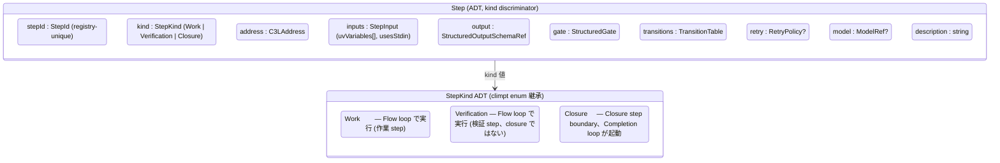
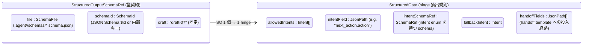
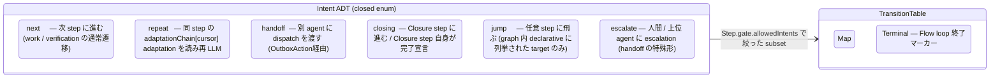

# 14 — StepRegistry (per-agent step graph schema)

Realistic 設計の **R3 (steps 定義)** と **R4 (dual loop / C3L / Structured
Output)** を **step 単位 schema** に凍結する。1 agent あたり 1 つの
`steps_registry.json` が、`Step ADT` × `C3LAddress` ×
`StructuredOutputSchemaRef` × `StructuredGate` × `TransitionTable` ×
`RetryPolicy` を declarative に記述する。registry 全体は **Boot frozen Layer 4**
の input として validate され、Run 中は immutable。

**Up:** [00-index](./00-index.md), [10-system-overview](./10-system-overview.md)
**Refs:** [01-requirements §R3 / §R4](./01-requirements.md),
[13-agent-config](./13-agent-config.md),
[15-dispatch-flow (To-Be)](./tobe/15-dispatch-flow.md),
[16-flow-completion-loops](./16-flow-completion-loops.md),
[20-state-hierarchy (To-Be) §A Layer 4](./tobe/20-state-hierarchy.md),
[_meta/climpt-inventory C3 / C5 / C6](./_meta/climpt-inventory.md)

---

## §A StepRegistry の役割

StepRegistry は「1 agent が **どの step graph を持ち、各 step がどの prompt
address を解決し、どの structured output を生み、どの intent でどの step
に遷移するか**」を **Boot input として一括宣言** する frozen artifact
である。Run 中の step graph 動的変更は禁止 (To-Be 20 §E Layer 4
immutable)。Channel / Transport / EventBus / 他 agent のいずれもが registry
の中身を **直接読まない** — registry は AgentRuntime 内側の FlowLoop /
CompletionLoop driver にだけ供給される (10 §C)。

**Why**: R3 (1 agent は steps を定義する) と R6 (config は verifiable / 自明)
を、Boot validation で reject 可能な 1 file に凝縮するため。climpt 既存では
agent.json + steps_registry.json + workflow.json の 3 file に責務が分散して
self-evidence が崩れていた (climpt-inventory weakness §self-evidence)。Realistic
では「step graph は steps_registry.json **だけ**」に局在させる (anti-list §I)。

---

## §B Step ADT



| field         | 型                                                    | 役割                                 | 出典           |
| ------------- | ----------------------------------------------------- | ------------------------------------ | -------------- |
| `stepId`      | `StepId` (registry-unique string)                     | step graph の node 識別子            | climpt C3      |
| `kind`        | `StepKind = Work \| Verification \| Closure`          | dual loop の分岐 key (R4)            | climpt C3 / C4 |
| `address`     | `C3LAddress`                                          | prompt 解決 5-tuple (§C)             | climpt C5      |
| `inputs`      | `StepInput { uvVariables: UvKey[], usesStdin: bool }` | UV 置換 / stdin 入力宣言             | climpt C3      |
| `output`      | `StructuredOutputSchemaRef`                           | LLM SO の型契約 (§D)                 | climpt C6      |
| `gate`        | `StructuredGate`                                      | SO の hinge field 抽出規則 (§D)      | climpt C3 / C6 |
| `transitions` | `TransitionTable = Map<Intent, StepId \| Terminal>`   | intent 別の next step (§E)           | climpt C3      |
| `retry`       | `RetryPolicy?`                                        | 失敗時の C3L overlay (§F)            | climpt C3      |
| `model`       | `ModelRef?`                                           | step 別 LLM model 指定 (任意)        | climpt C3      |
| `description` | `string`                                              | 人間向け 1 行説明 (R6 self-evidence) | —              |

**StepKind ADT (3 variant)**:

- `Work` — 作業 step。Flow loop が回す。intent によって next Work / Verification
  / Closure に遷移。
- `Verification` — 検証 step。Flow loop が回す。SO に「再 Work
  が必要か」「Closure に進めるか」の intent を要求。validator group ではない (§H
  で剥がす)。
- `Closure` — closure boundary step。AgentRuntime が `ClosureBoundaryReached` を
  publish し (To-Be 15 §D)、Completion loop driver が起動する (10 §D)。

**Why**: climpt 既存の `stepKind: "work" | "verification" | "closure"` enum
をそのまま ADT に昇格 (C3)。R3 が要求する「step は宣言的 schema」を、kind
discriminator + 必須 8 field の sum type で表現する。`Closure` 値こそが R4 dual
loop の **唯一の境界** (climpt 哲学 #1 を継承)。

**StepInput.uvVariables 解決 rule (legacy 09_contracts §StepContext より移植)**:

- 参照形式は `uv-<stepId>_<key>` (UV 名前空間)。同 Agent 内の他 step output を
  Flow loop が `StepContext.toUV` で展開し、prompt 解決時に置換する。
- `required` field の default は **true** (Step ParameterDefinition 側 default =
  true)。値欠落時は Flow loop を `ConfigurationError` として Boot reject
  せず、Run 時に `ExecutionError` で停止 (`postLLMConditions` での retry
  は不可、上位伝搬)。
- これが無いと §G S2-S3 の Boot validation だけでは UV
  名前空間衝突を検出しきれない。S 系 rule の前提条文として §B に置く。

---

## §C C3LAddress ADT

```mermaid
stateDiagram-v2
    direction LR

    state "C3LAddress (5-tuple, address-before-content)" as A {
        A_c1   : c1 : RegistryConstant (registry top-level、step 不問)
        A_c2   : c2 : Category (e.g. initial / continuation / closure / retry / section)
        A_c3   : c3 : Classification (e.g. issue / project / polling / iteration)
        A_ed   : edition : Edition (default / preparation / processing / review / closure / failed / precheck-* / remediate-*)
        A_ad   : adaptation? : Adaptation (failure overlay; 任意)
    }

    state "Resolution (two-tier)" as R {
        R_w : with adaptation → pathTemplate(c1,c2,c3,edition,adaptation)
        R_n : fallback        → pathTemplateNoAdaptation(c1,c2,c3,edition)
    }

    A --> R : c3l-prompt-loader
```



| level         | 値の例                                                                   | 役割                                      |
| ------------- | ------------------------------------------------------------------------ | ----------------------------------------- |
| `c1`          | `steps`, `dev`                                                           | registry 全体の固定 namespace (top-level) |
| `c2`          | `initial`, `continuation`, `closure`, `retry`, `section`                 | Category — step が属する大分類            |
| `c3`          | `issue`, `project`, `polling`, `iteration`                               | Classification — Category 内の細分        |
| `edition`     | `default`, `processing`, `review`, `failed`, `precheck-*`, `remediate-*` | step variant                              |
| `adaptation?` | `git-dirty`, `empty`, `done`, `test-failed`, `kind-boundary-breach`      | failure-specific overlay (任意)           |

**解決 rule (two-tier)**:

1. `adaptation` が非空なら `pathTemplate` (5-level) で interpolation を試みる。
2. file 不在なら `pathTemplateNoAdaptation` (4-level) に fallback。
3. それも不在なら `TemplateNotFound` (PR-C3L-004) として fail-fast。silent
   embedded fallback は禁止 (climpt C5)。

**Why (address before content の哲学)**: prompt 選択は **常に address
(c1/c2/c3/edition/adaptation) という 5-tuple の解決** であり、CLI flag や
runtime 条件分岐で edition / adaptation を上書きする経路は
**構造的に存在しない** (climpt 哲学 #3 / Anti-list §I)。失敗パターンも
first-class な address (`edition: "failed", adaptation: "<failure-pattern>"`)
として表現される。これにより「prompt の中身は address が決まれば file system
が決定する」という参照透過性が保たれ、step graph の検証は **address
の解決可能性チェック** に還元できる (§G)。

---

## §D StructuredOutputSchemaRef + StructuredGate



| field                  | 役割                                                                  |
| ---------------------- | --------------------------------------------------------------------- |
| `output.file`          | `.agent/<agentId>/schemas/<file>.schema.json` 相対参照                |
| `output.schemaId`      | schema 内部 ID (`$id` か named key)                                   |
| `gate.allowedIntents`  | この step が出してよい intent 集合 (subset of `Intent` ADT、§E)       |
| `gate.intentField`     | SO 中の **唯一の hinge field** の JsonPath (例: `next_action.action`) |
| `gate.intentSchemaRef` | hinge field が enum で守られている schema 参照                        |
| `gate.fallbackIntent`  | hinge field が未充足 / unknown 値の時の安全 fallback intent           |
| `gate.handoffFields`   | handoff comment template と SubjectStore に渡す SO subpath 列         |

**Why (single hinge at structured output の哲学)**: LLM ↔ orchestrator 間の
**state transition は必ず「1 つの JSON Schema の 1 つの宣言済み field」を経由**
する (climpt 哲学 #2)。hidden text-pattern routing / 自由文 parsing
は禁止。`gate.intentField` は 1 step 1 hinge であり、ここで発生する `intent` 値
(§E) だけが TransitionRule の入力になる (To-Be 15 §A)。`handoffFields[]` は
intent と独立した「次 agent への引数 channel」で、SO subtree
を構造的に再利用する (climpt C6)。fallback path は `fallbackIntent` 1
つに集約され、silent default で `closing` などに倒す経路を構造的に消す (To-Be P5
Typed Outbox 整合)。

---

## §E TransitionTable + Intent ADT



**Intent ADT (climpt enum 継承)**:
`next | repeat | handoff | closing | jump | escalate` の 6 値固定 (climpt
C3)。Realistic で variant 追加・削除は行わない。

**TransitionTable の declarative shape**:

- 型: `Map<Intent, StepId | Terminal>`
- 値が `StepId` なら同 agent の next step、`Terminal` なら **Flow loop
  の終了マーカー**。
- `Step.gate.allowedIntents` ⊆ `keys(transitions)` を Boot 検証で要求 (§G)。
- `Terminal` の意味は **Flow loop の終了** (= AgentRuntime が次 step
  を持たない状態に到達) であり、**「closure step
  に到達した」とは別概念**。Closure step に到達しても TransitionTable 自体は別途
  evaluate される (Completion loop が走った後の最終 intent も transitions
  を引く)。

**Why**: intent ベース routing は climpt の核 (C3) で、自由文ではなく enum で
next step を選ぶことで TransitionRule (To-Be 15) を pure function
に保てる。`Terminal` を `closure` と区別する点は §H の re-anchoring と対応 —
「step.kind == Closure」と「transition target == Terminal」は **直交** する 2
軸で、Closure step 内部にも `repeat` (次 adaptation で再 LLM) や `handoff` (別
agent 起動) が定義され得る。

### §E.1 `repeat` semantics 拡張 (adaptation chain)

GateIntent ADT は **6 値 frozen**
(`next | repeat | jump | closing | escalate
| handoff`) のまま不変。新 intent
は追加しない。`repeat` 値の **semantics だけ** を以下のとおり拡張する (§B
`Step.adaptationChain` field がこの semantics の declarative surface)。

**runtime contract**:

- `intent === "repeat"` は **同 prompt
  の再実行ではない**。`Step.adaptationChain` (型 `string[]`) の `chain[cursor]`
  adaptation を読み、prompt-resolver の `overrides.adaptation` に渡して別 prompt
  を解決する。
- cursor の状態遷移 (stepId 単位、intent は key に含めない):

  | 事象                                            | cursor                   |
  | ----------------------------------------------- | ------------------------ |
  | `intent === "repeat"` 発生                      | +1                       |
  | 異 step に遷移 (`next` / `jump` / `handoff` 等) | reset to 0 (該当 stepId) |
  | 同 step だが異 intent (`repeat` → `next` 等)    | reset to 0               |
  | 新 run (新 dispatch)                            | 全 reset                 |

- cursor が `chain.length` に到達した状態で更に `intent === "repeat"` が
  来た場合、framework は `AgentAdaptationChainExhaustedError`
  (`agents/shared/errors/flow-errors.ts`、`ClimptError` 直系) を throw する。
  egress は design 16 §C の `ExecutionError` channel。
- `adaptationChain` 未指定時の framework default は **`["default"]`** (1 要素
  chain)。意味: cursor=0 で `default` adaptation を 1 回読み、次の
  `intent === "repeat"` で即 exhaust。**unbounded `repeat` を構造的に許さない**
  safe-by-default。registry author が明示的に長い chain を declare した場合 だけ
  recovery が伸びる (opt-in)。
- 明示的な `adaptationChain: []` (空配列) も **構造的に有効**。type は
  `string[]` であり length=0 を排除しない。意味: 最初の `intent === "repeat"` で
  **adaptation を 1 つも読まずに即 exhaust** — 「self-route を一切許さない
  step」を declare できる
  (`AgentAdaptationChainExhaustedError.chainLength === 0`,
  `lastAdaptation === "default"` placeholder)。`未指定 (default ["default"])`
  との違いは「default adaptation を 1 度試すか / 0 度試すか」のみで、 exhaust
  後の egress (`AgentAdaptationChainExhaustedError`) は同一。

**§F (RetryPolicy) との関係**: §F の `RetryPolicy.maxAttempts` は
`postLLMConditions` validator retry **専用** であり、本拡張とは
**直交した別概念**。trigger / reset / egress いずれも別 channel で動き、
混同しない。

| 観点       | §F `RetryPolicy.maxAttempts`     | §E.1 `adaptationChain`               |
| ---------- | -------------------------------- | ------------------------------------ |
| trigger    | postLLMConditions validator 失敗 | LLM が `intent === "repeat"` を emit |
| reset 条件 | validator pass                   | 異 step / 異 intent 遷移             |
| egress     | `AgentValidationAbortError`      | `AgentAdaptationChainExhaustedError` |

**詳細 mechanism** (cursor 所有者 `AgentRunner`, `AdaptationCursor` 実装, Boot
validation S9/S10, `failurePatterns` channel との合流規則 K1, logging event
形式) は
`tmp/audit-precheck-kind-loop/framework-design/01-self-route-termination.md`
を参照。

---

## §F RetryPolicy + FailurePattern

```mermaid
stateDiagram-v2
    direction LR

    state "FailurePattern (registry top-level)" as FP {
        FP_name : name : FailurePatternId
        FP_desc : description : string
        FP_ed   : edition : Edition (overlay 投入先)
        FP_ad   : adaptation : Adaptation (overlay 投入先)
        FP_par  : params : ParamKey[] (validator から拾う named param)
    }

    state "RetryPolicy (per step)" as RP {
        RP_max  : maxAttempts : int
        RP_post : postLLMConditions : Validator[] (retry-able)
        RP_pre  : preflightConditions : Validator[] (abort-only)
        RP_on   : onFailure : { action: "retry", patternRef: FailurePatternId }
    }

    FP --> RP : patternRef で参照
    RP --> C3LAddress : retry 起動時、step.address に edition/adaptation を overlay
```



| concept                               | 役割                                    | 1 行記述                                                         |
| ------------------------------------- | --------------------------------------- | ---------------------------------------------------------------- |
| `failurePatterns.{name}`              | 失敗パターンの **C3L overlay 定義**     | 「edition / adaptation / params をどう書き換えるか」のみ宣言     |
| `validators.{id}.postLLMConditions`   | LLM 応答後の検証 (失敗 → retry)         | 失敗時 `failurePatterns` を引いて step.address を overlay        |
| `validators.{id}.preflightConditions` | LLM 呼出前の検証 (失敗 → abort)         | retry せず Closure / escalate に強制遷移                         |
| `validators.{id}.extractParams`       | named parser (e.g. `parseChangedFiles`) | params を SO / file から抽出して overlay の interpolation に供給 |
| `retry.onFailure.patternRef`          | step ↔ pattern の binding               | step は **直接 edition を書かず**、pattern 名だけを指す          |

**Retry が C3L address overlay として表現される意味**: retry 時に走るのは「**別
prompt の再実行**」であり、同じ prompt を再叩きするものではない。step は元々
`address = (c1, c2, c3, edition, adaptation)` を持つが、retry 発動時は
`failurePatterns[name]` の `edition` / `adaptation` でこれを **overlay** し、別
file の prompt を resolve する (§C two-tier resolution)。

**禁則**:

- CLI flag (`--edition`, `--adaptation`) による retry 制御は **構造的に禁止**
  (climpt C5 哲学 #3, §I anti-list)。
- step 内に edition / adaptation を hard-code した retry も禁止 (named key
  coupling を `failurePatterns` に集約)。
- retry 回数は `maxAttempts` のみ。指数バックオフ等の dynamic 制御は持たない
  (Boot frozen)。

**Why**: climpt 既存では `failurePatterns` が implicit に named-key 結合していた
weakness (climpt-inventory §controllability) を、registry 内で「step →
patternRef → overlay」の 3 段宣言に直す。retry は **address 変更** であり、Run
中の動的 reconfig ではない (Layer 4 immutable 整合)。

---

## §G Boot validation rule (StepRegistry が valid でない場合の Reject)

```mermaid
flowchart TD
    Load[Load steps_registry.json] --> S1
    S1[S1: stepId 重複なし] --> S2
    S2[S2: transitions target ∈ steps ∪ Terminal] --> S3
    S3[S3: gate.allowedIntents ⊆ keys transitions] --> S4
    S4[S4: output.schemaRef → JSON Schema draft-07 valid + schemaId 一致<br/>(file 存在は 13 §G A5 が担当)] --> S5
    S5[S5: closure step が ≥1 存在] --> S6
    S6[S6: address c1/c2/c3/edition/adaptation → prompt file 解決可能 two-tier] --> S7
    S7[S7: retry.patternRef → failurePatterns.name に存在] --> S8
    S8[S8: entryStepMapping → 全 stepId が steps に存在] --> Accept

    S1 -.fail.-> Reject[Boot reject<br/>Fail-fast Factory, To-Be P4]
    S2 -.fail.-> Reject
    S3 -.fail.-> Reject
    S4 -.fail.-> Reject
    S5 -.fail.-> Reject
    S6 -.fail.-> Reject
    S7 -.fail.-> Reject
    S8 -.fail.-> Reject

    classDef ok fill:#e8f0ff,stroke:#3366cc;
    classDef bad fill:#ffe0e0,stroke:#cc3333;
    class S1,S2,S3,S4,S5,S6,S7,S8,Accept ok
    class Reject bad
```

__8 rule (file-prefix 付き、S_ = StepRegistry 系)_*:

| rule | 内容                                                                                                                                            | 失敗時                                              |
| ---- | ----------------------------------------------------------------------------------------------------------------------------------------------- | --------------------------------------------------- |
| S1   | `stepId` が registry 内で unique                                                                                                                | Reject `DuplicateStepId(id)`                        |
| S2   | 全 `transitions[*].target` は別 stepId か `Terminal` のいずれか                                                                                 | Reject `DanglingTransition(stepId, intent, target)` |
| S3   | `gate.allowedIntents ⊆ keys(transitions)`                                                                                                       | Reject `IntentNotInTransition(stepId, intent)`      |
| S4   | `output.schemaRef.file` の **内容** が JSON Schema draft-07 として valid + `schemaId` が schema 内に存在 (file 存在は 13 §G A5 が担当, B7 修復) | Reject `SchemaInvalid \| SchemaIdMissing`           |
| S5   | `kind == Closure` の step が **少なくとも 1 つ存在**                                                                                            | Reject `NoClosureStep(agentId)`                     |
| S6   | 全 step の `address` が prompt file に解決できる (two-tier の少なくとも片方)                                                                    | Reject `TemplateNotFound(address)` (= PR-C3L-004)   |
| S7   | `retry.patternRef` が `failurePatterns` に存在                                                                                                  | Reject `UnknownFailurePattern(stepId, name)`        |
| S8   | `entryStepMapping` が指す stepId が全て存在                                                                                                     | Reject `UnknownEntryStep(verdictType, kind)`        |

**Why**: To-Be P4 (Fail-fast Factory) を継承し、Boot 時点で構造不整合な registry
は Run 開始させない。R6 (verifiable config) の hard gate。Run 中に「step
が見つからない」「intent が転送先を持たない」等の dynamic failure
を構造的に排除する (Layer 4 immutable と整合)。

---

## §H StepKind 用語の re-anchoring (climpt の `closure` 多義を整理)

climpt 既存では `closure` が 4 つの異なる文脈で再利用されており、self-evidence
を破っていた (climpt-inventory §naming clarity)。Realistic では **StepKind の
`Closure` 値だけがこの単語を使う** という単一規約に pin する。

| climpt 旧用法                                | Realistic での再アンカー先                             | 用語                                    |
| -------------------------------------------- | ------------------------------------------------------ | --------------------------------------- |
| `step.stepKind == "closure"` (1 step の属性) | **Step.kind == Closure** (本 §B)                       | `Closure` (StepKind variant)            |
| phase 名 `done` (orchestrator workflow)      | workflow.json の phase id (12 §B)                      | `phase: "done"`                         |
| validator group `closure.issue.precheck-*`   | StepKind ではなく **C3L address の adaptation prefix** | `address.adaptation: "precheck-*"` (§C) |
| MCP-cli `closeOnComplete`                    | AgentBundle の close binding (13 §F)                   | `AgentBundle.closeBinding`              |

**用語の単一規約**:

- 「**Closure**」 = StepKind の値 1 つだけを指す。Step が `kind == Closure`
  であることが Completion loop 起動の **唯一の条件** (R4 dual loop 境界)。
- 「**closing**」 = Intent ADT の値 1 つだけを指す (§E)。「次の closure step
  に進め」または「closure step が完了したことを宣言する」intent。
- 「**done**」 = workflow 側の phase id (12)。step とは独立。
- 「__precheck-_ / remediate-_**」 = C3L address の adaptation 値
  (§C)。validator の出力ではなく prompt の選択点。

**Why**: 1 単語が 4 文脈に拡散すると Boot validation rule (§G) が「どの closure
か」で複雑化する。Realistic は **StepKind = Closure の 1 用法に固定**し、残り 3
つを別語彙へ pin することで、図上の `Closure` がいつでも「Completion loop が走る
step」を意味するという参照透過性を取り戻す。R4 (dual loop 境界の哲学継承) と R6
(命名明瞭) の同時達成。

---

## §I Anti-list (StepRegistry に **書かない** もの)

| 項目                                                       | 書かない理由                                                | どこに書くか                         |
| ---------------------------------------------------------- | ----------------------------------------------------------- | ------------------------------------ |
| agent root config (parameters / IO surface / verdict 定義) | 責務分離 — registry は step graph 限定                      | `agent.json` (13-agent-config)       |
| workflow phase / labelMapping / agents.{id} bindings       | 責務分離 — phase は orchestrator の関心事                   | `workflow.json` (12-workflow-config) |
| Channel binding (どの channel で close するか)             | 責務分離 — Channel は EventBus 経由で subscribe する (P3)   | `13-agent-config §F closeBinding`    |
| dispatch script / shell hook (`script/dispatch.sh` 等)     | climpt feedback `feedback_no_dispatch_sh.md` user territory | (記述なし。Realistic では持たない)   |
| CLI `--edition` / `--adaptation` flag                      | climpt C5 (address before content) 違反                     | (構造的に存在しない)                 |
| Run 中の registry リロード / 動的 step 追加                | Layer 4 immutable 違反 (To-Be 20 §E)                        | (Boot のみ)                          |
| Boot 後の `failurePatterns` 動的追加                       | Layer 4 immutable 違反                                      | (Boot のみ)                          |
| validator の I/O 詳細 (gh CLI 呼出 / file 書込)            | To-Be P2 (Single Transport) 違反、validator は read-only    | Channel 経由 (Transport 抽象)        |

**Why**: registry の責務を「step graph + address + SO contract + transitions +
retry overlay」だけに局在させる。phase / channel / transport は **別 file**
に書くことで、To-Be 5 原則 (Uniform Channel / Single Transport / CloseEventBus /
Fail-fast Factory / Typed Outbox) を破らない。

---

## §J 1 行サマリ

> **「StepRegistry =
> `Step ADT (kind, C3LAddress, SO schemaRef, StructuredGate, TransitionTable, RetryPolicy)`
> を Boot frozen Layer 4 として宣言する 1 file。`Closure` step が dual loop
> の唯一の境界、`gate.intentField` が SO の唯一の hinge、`address` が prompt
> の唯一の selector。」**

- R3 → §B Step ADT 8 field + §C C3LAddress + §D SO schemaRef で凍結
- R4 → §B `kind == Closure` が dual loop boundary、§E `Intent` ADT が transition
  driver
- R6 → §G Boot validation 8 rule (S1〜S8) で verifiable, §H 用語 re-anchoring で
  命名明瞭, §I anti-list で 依存構造明確
- climpt 弱点 (self-evidence / controllability / naming churn) は §A / §F / §H
  で各々修復
- To-Be 5 原則とは **§I anti-list** で構造的整合 (Channel / Transport / Bus /
  Layer 4 / Outbox にいずれも触れない)
- B7 修復: rule ID は file-prefix (S*) 付き。13 §G A5 (file 存在) と 14 §G S4
  (schema 内容 valid) で責任分界
