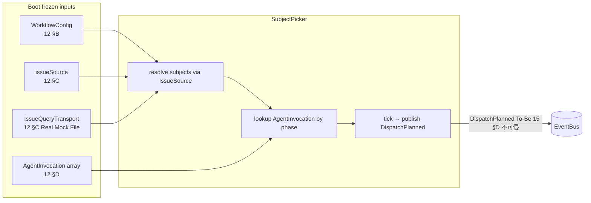
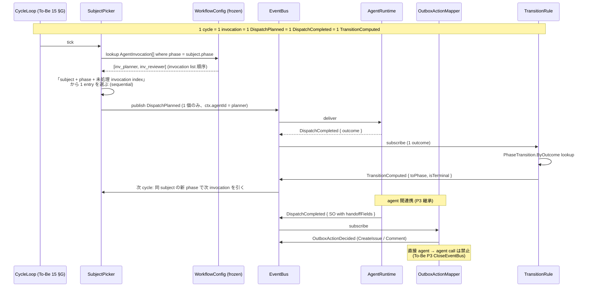
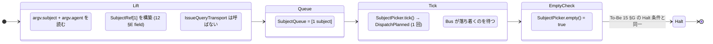

# 15 — Dispatch Flow (Realistic 拡張: SubjectPicker 入力契約 + multi-agent dispatch)

To-Be `15-dispatch-flow.md` の 4 component 構造 (SubjectPicker / AgentRuntime /
TransitionRule / OutboxActionMapper) と event ADT (DispatchPlanned /
DispatchCompleted / ClosureBoundaryReached / TransitionComputed) を
**不可侵で継承** し、Realistic で導入された Boot input
(`WorkflowConfig.issueSource` / `AgentInvocation[]` / `IssueQueryTransport`)
に応じた **SubjectPicker の入力契約** と **multi-agent dispatch (R2a)**
の挙動だけを追記する extension doc。

**Up:** [00-index](./00-index.md), [10-system-overview](./10-system-overview.md)
**Inherits (不可侵):**
[tobe/15-dispatch-flow §A〜§H](./tobe/15-dispatch-flow.md) — 4 component /
Pipeline / AgentTransport / 4 event ADT / 独立性 / As-Is 対比 / Lifecycle / 1
行表 **Refs:** [11-invocation-modes](./11-invocation-modes.md),
[12-workflow-config](./12-workflow-config.md),
[13-agent-config](./13-agent-config.md)

---

## A. 拡張範囲

To-Be 15 の §A 4 component 図 / §B Pipeline / §C AgentTransport / §D event ADT /
§E component 独立性 / §F As-Is 対比 / §G CycleLoop Lifecycle / §H 1 行責務表 は
**そのまま継承** し、本章では **再記述しない**。Realistic
で追加されるのは「SubjectPicker が何を入力に取り、何回 DispatchPlanned
を発火するか」の契約のみ。AgentRuntime / TransitionRule / OutboxActionMapper /
Channel 群の挙動は To-Be のまま。

**Why**: Realistic 拡張は Boot input の追加 (10 §B) と 2 sub-driver (10 §C)
に局在し、Run kernel の event 流路は To-Be 不可侵 (10 §A 継承境界)。本章は
SubjectPicker の入力側 seam だけを Realistic で確定する。

---

## B. SubjectPicker の入力契約 (Realistic 拡張)



| 入力                         | 出所  | 用途                                           | mode                     |
| ---------------------------- | ----- | ---------------------------------------------- | ------------------------ |
| `WorkflowConfig.issueSource` | 12 §C | SubjectQueue 構築の入力源                      | run-workflow             |
| `IssueQueryTransport`        | 12 §C | gh project / repo issues 読取の seam           | run-workflow             |
| `AgentInvocation[]`          | 12 §D | `phase → agent` lookup table                   | run-workflow / run-agent |
| `argv.subject` (lift)        | 11 §B | 単一 SubjectRef を直接構築                     | run-agent                |
| `argv.agent`                 | 11 §B | invocation lookup を bypass、直接 agentId 指定 | run-agent                |

**mode 別の入力経路**:

| mode           | subject 取得                            | invocation 解決                                                                                                      |
| -------------- | --------------------------------------- | -------------------------------------------------------------------------------------------------------------------- |
| `run-workflow` | `IssueQueryTransport.list*` 経由で N 件 | `phase` を key に AgentInvocation list lookup                                                                        |
| `run-agent`    | argv → SubjectRef[1] (gh API 不使用)    | argv の `agentId` を直接 `ctx.agentId` に lift (invocation lookup を skip するが SubjectPicker は経由する、B11 修復) |

**出力 (publish)**: To-Be 15 §D の
`DispatchPlanned { subject, phase, step, ctx }` ADT の **top-level shape**
はそのまま発火する。Realistic で `ctx: AgentContext` の field set に
`agentId: AgentId` を追加 — To-Be §D は `ctx` を opaque な「immutable
snapshot」と宣言しており field 列挙していなかったので、これは
**拡張ではなく確定** (B4 修復)。

```
Realistic 確定の DispatchPlanned.ctx field set:
  agentId: AgentId        (Boot frozen AgentRegistry の lookup key)
  subjectPhase: PhaseId   (subject の現 phase 状態)
  prePass?: bool          (prioritizer pre-pass の発火か通常 dispatch かの discriminator)
  invocationIndex?: int   (invocation list 内 position)
  ... (AgentBundle / Step が必要とする UV variables 等)
```

**Why**: SubjectPicker の出力 event は To-Be §D の **ADT shape (4 event
種、top-level field {subject, phase, step, ctx})** を改変しない。`ctx` field
内部の field set は To-Be で未定義だったので Realistic 確定は wart
ではない。Realistic 拡張は **入力側の seam (IssueSource / IssueQueryTransport /
AgentInvocation lookup)** と **`ctx.agentId` field** だけに局在し、AgentRuntime
以降は mode 不問の同一 path (11 §C R5 hard gate)。

---

## C. Multi-agent dispatch (R2a, sequential model — B5 修復)



**核心: 1 phase = 1 invocation = 1 cycle = 1 dispatch (B5 + B(R2)2 修復: phase
versioning)**:

To-Be 15 §A の
`TransitionRule pure (currentPhase, outcome) → (nextPhase, isTerminal)` は
**outcome 1 つを入力に 1 nextPhase を返す pure 関数**。Realistic
はこれを保つため、**WorkflowConfig.invocations は (phase, agent) の対で unique**
(= 1 phase に 1 invocation) を要求する。fanout (1 subject → N DispatchPlanned
並列) も sequential cursor (SubjectPicker が invocationIndex を持つ) も
**行わない**。R2a の「複数 agent」は **phase versioning** で実現:

| パターン                                         | 表現                                                                                                                                          | 発火経路                                                                                                                              |
| ------------------------------------------------ | --------------------------------------------------------------------------------------------------------------------------------------------- | ------------------------------------------------------------------------------------------------------------------------------------- |
| **同 logical phase 多 agent (phase versioning)** | logical phase `plan` を `plan-prepare`, `plan-review`, `plan-finalize` の N phase に declare 分割。各 phase は 1 invocation (1 agent) を bind | 各 invocation の `nextPhase: Static(nextSubPhase)` で次 phase に進む。SubjectPicker は phase だけ見て invocation lookup (cursor 不要) |
| **同 agent 異 cycle / 異 phase**                 | invocation の `nextPhase: PhaseTransition.ByOutcome / Static(otherPhase)` で次 phase 決定                                                     | TransitionComputed → 次 cycle で新 phase の invocation を引く                                                                         |
| **agent 間 handoff**                             | `handoffTemplate` (12 §D) + OutboxAction 経由                                                                                                 | OutboxActionMapper → C-pre Channel (To-Be 15 §B Pipeline)                                                                             |

> **phase versioning による「同 logical phase 多 agent」の表現** (B(R2)2 修復):
>
> - WorkflowConfig.phases に `plan-prepare` / `plan-review` / `plan-finalize` の
>   3 phase を declare。
> - WorkflowConfig.invocations に 3 entry: `(plan-prepare, planner-A)`,
>   `(plan-review, reviewer)`, `(plan-finalize, planner-A)`。各 entry の
>   `nextPhase: Static(...)` で chain。
> - labelMapping は 3 phase すべてが gh label `kind:plan` に backed (1 label →
>   多 phase mapping は WorkflowConfig.labelMapping の許容範囲、12
>   §B)。**外部から見えるのは 1 logical phase**。
> - SubjectPicker は cursor を持たない: subject の phase が `plan-prepare` なら
>   1 invocation lookup で fire、TransitionComputed で `plan-review` に移行、次
>   cycle で 1 invocation lookup。**god-object 化しない**。
> - これにより N outcome aggregation 問題は構造的に発生しない (各 cycle 1
>   outcome、phase が unique)。

**Boot validation 補強 (B(R2)2 修復)**:

- 12 §F W11 (新 rule、要 12 §F 反映): `invocations[]` 内 `(phase, agent)` 対が
  **unique**。同 phase に複数 invocation を許さない。同 logical phase の多 agent
  は phase versioning で declare させる。

**禁止事項** (To-Be 原則の継承):

- agent A の AgentRuntime が agent B を直接呼ぶ → **To-Be P3 違反**
  (CloseEventBus)
- 1 cycle 内で N DispatchPlanned 並列発火 → TransitionRule pure 性違反
- SubjectPicker が AgentRuntime の中身を読む → **To-Be 15 §E 独立性違反**
- SubjectPicker が cursor / invocationIndex / outcome 依存の内部 state を持つ →
  **god-object 復活** (B(R2)2)
- multi-agent 結果の集約を SubjectPicker / TransitionRule が行う → To-Be 15 §F
  god object 排除原則違反

**Why**: phase versioning は invocation の `(phase, agent)` ペアを unique
にすることで、SubjectPicker を pure な phase lookup に保てる。TransitionRule の
pure 1-outcome 契約 (To-Be 15 §A) を破らず、AgentRuntime の契約 (1
DispatchPlanned in / 1 DispatchCompleted out) も保てる。「同 logical
phase」概念は外向き (gh label / 人間視点) で、内部は phase 列。B(R2)2
で指摘された cursor god-object 化を構造的に排除。

---

## D. AgentInvocation lookup table

| lookup key                          | 経路                                                 | 結果                          |
| ----------------------------------- | ---------------------------------------------------- | ----------------------------- |
| `phase` (現 SubjectRef.phase)       | `WorkflowConfig.invocations[]` を filter             | `AgentInvocation[]` (0..N 件) |
| `outcome` (DispatchCompleted から)  | invocation.nextPhase が `ByOutcome` の場合           | 次 `PhaseId` (12 §D ADT)      |
| `agentId` (run-agent argv 直指定)   | invocation lookup 省略、argv 値を直使用              | `agentId` 単独                |
| `handoffTemplate` (closure SO 由来) | invocation.handoffTemplate → 13 章 template registry | OutboxAction の comment body  |

> 各 field の **定義** は 12 §D に局在 (本章は **lookup 経路のみ**
> を示す)。Realistic は invocation を「`phase → agent` の declarative
> binding」として扱い、SubjectPicker は **lookup の consumer** に徹する。

**Why**: AgentInvocation の field 仕様は 12 §D の single source of
truth。本章で再記述すると 12 / 15 の両方に書く必要が出て R6 (verifiable)
を弱める。lookup 経路だけを示すことで責務の境界を保つ。

---

## E. run-agent mode の SubjectQueue (R2b)



**To-Be 15 §G Lifecycle との関係**:

| To-Be §G ステップ     | run-agent での挙動                                           |
| --------------------- | ------------------------------------------------------------ |
| Boot.ConstructAll     | 共通 (11 §F: WorkflowConfig は読まなくて可)                  |
| Boot.InjectTransports | 共通 (CloseTransport / AgentTransport / IssueQueryTransport) |
| Run.Tick              | argv lift で SubjectQueue 長 1                               |
| Run.WaitDrain         | DispatchPlanned 1 回 → AgentRuntime → Bus drain              |
| Run.Halt              | `SubjectPicker.empty() = true` で停止 (queue が 1 で消費済)  |

> **重要**: To-Be 15 §G の Lifecycle は **改変なしでそのまま動く**。Halt 条件
> (`SubjectPicker.empty()`) も同じ。run-agent は SubjectQueue が 1
> 件ですぐ枯れるだけで、CycleLoop の制御フローは run-workflow と区別不能 (11 §C
> R5 hard gate)。

**Why**: R2b の standalone agent invocation は SubjectQueue の長さが 1
になるだけで、CycleLoop / SubjectPicker / AgentRuntime
の契約は何も変わらない。R5 (close 経路整合) は「mode
によって制御フローを分岐させない」ことで成立し、Lifecycle の
**不可侵継承**がその構造的根拠。

---

## F. To-Be 15 との差分まとめ

- **追加**: SubjectPicker の入力 seam (`IssueSource` / `IssueQueryTransport` /
  `AgentInvocation[]` lookup)、`ctx` field set の Realistic 確定 (B4 修復:
  agentId, subjectPhase, prePass?, invocationIndex?)、sequential dispatch model
  (1 cycle = 1 invocation, B5 修復)。
- **不変**: 4 component / Pipeline / AgentTransport / **4 event ADT shape
  (top-level field 列)** / 独立性 / As-Is 対比 / CycleLoop Lifecycle / 責務表
  (To-Be 15 §A〜§H)。`ctx` 内部 field は To-Be で opaque だったので Realistic
  確定 = 拡張ではない。
- **禁止維持**: agent 間直接呼出 (P3) / SubjectPicker による result 集約 / mode
  による Channel 分岐 (R5) / 1 cycle 内 fanout (B5 root cause)。

---

## G. 1 行サマリ

> **「Realistic 15 は To-Be 15 の 4 event ADT shape と CycleLoop Lifecycle
> を不可侵継承し、SubjectPicker の入力契約 (IssueSource + IssueQueryTransport +
> AgentInvocation lookup) と sequential dispatch model (1 cycle = 1 invocation)
> を追記する。`ctx.agentId` 確定はあるが top-level shape は不変。」**

- R1 → §B IssueSource + IssueQueryTransport が SubjectPicker の入力源
- R2a → §C 同 phase 多 agent は **sequential** (1 cycle 1 dispatch) +
  PhaseTransition.ByOutcome の合成
- R2b → §E argv lift で SubjectQueue 長 1 / To-Be Lifecycle 不可侵 / 11 §B
  「SubjectPicker は経由するが入力源は argv」と統一 (B11 修復)
- 不変式 → §F: 4 event ADT shape / 4 component / Lifecycle / 独立性 を改変しない
  (ctx 内部 field 確定は wart ではない、B4 修復)
