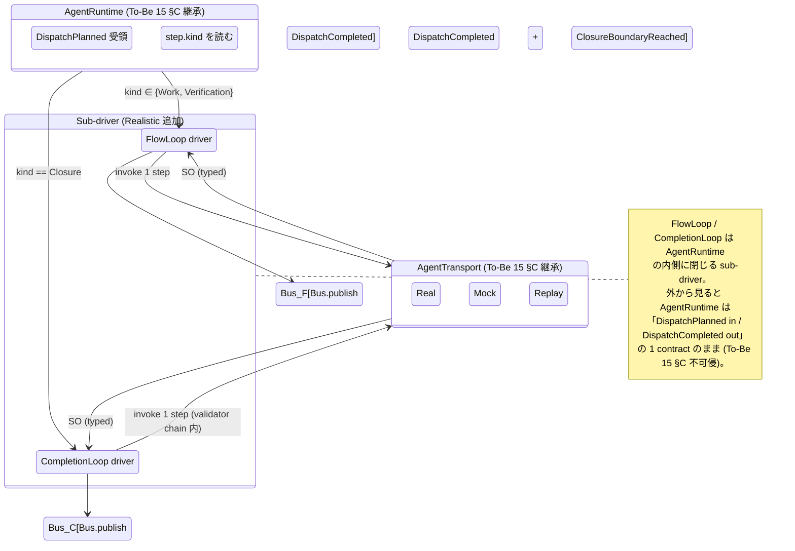
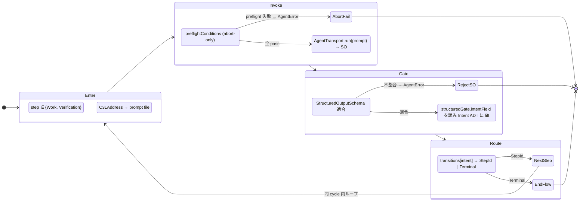
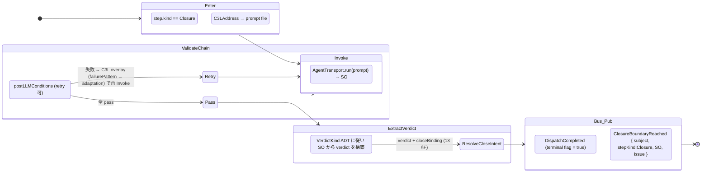
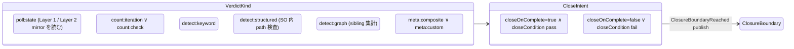
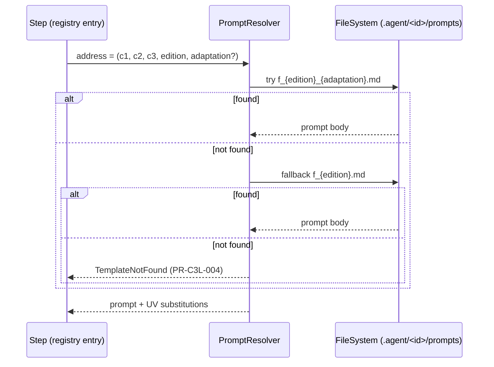
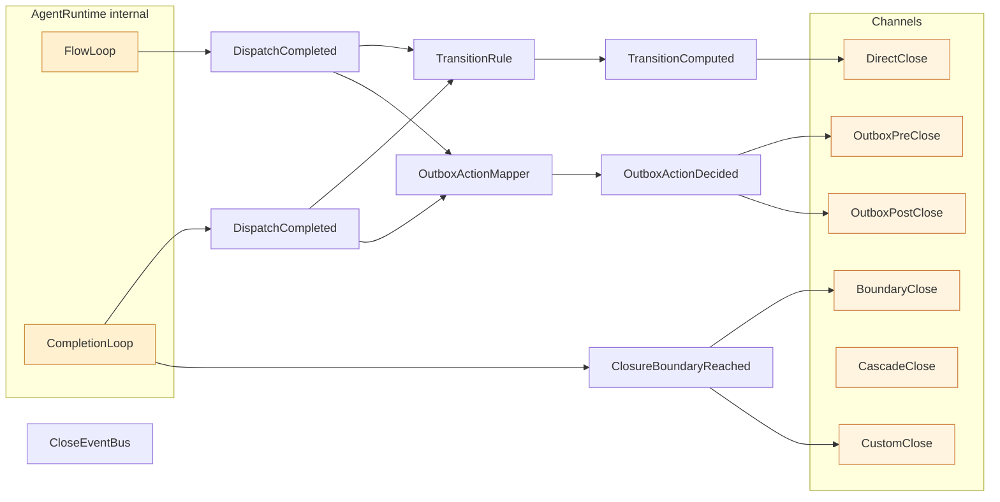

# 16 — Flow / Completion Dual Loop (R4 の核)

R4 (実行ループ + 完了ループ) を AgentRuntime の **内側に分割** する。Flow loop
が `step.kind ∈ {Work, Verification}` を進め、Completion loop が
`step.kind == Closure` で verdict を作る。境界は **step.kind の 1 値** で 1
か所に固定し、climpt 既存哲学 (two-loop separation / SO single hinge / C3L
address before content) を継承する。

**Up:** [10-system-overview](./10-system-overview.md),
[01-requirements](./01-requirements.md) **Refs:**
[13-agent-config](./13-agent-config.md),
[14-step-registry](./14-step-registry.md),
[tobe/15-dispatch-flow §C](./tobe/15-dispatch-flow.md)

---

## A. AgentRuntime の内部構造



**Why**:

- R4 を **AgentRuntime の責務追加なしで** 実現する。To-Be 15 §C の Transport
  seam 契約は変わらない。
- step.kind が dual loop 分岐の **唯一の key**。To-Be 15 §D の
  `ClosureBoundaryReached { stepKind: "closure" }` event を契約のまま使う。
- climpt の `closure-loop-processor.ts` の `isClosureStep` 判定哲学 (climpt
  inventory C4) を継承。

---

## B. FlowLoop (Work / Verification step driver)



**Why**:

- FlowLoop は **address resolve → invoke → SO gate → intent route** の 4
  段。各段は ADT 入出力で pure に近い。
- intent → next step は climpt 既存 router (`workflow-router.ts`)
  の哲学を継承。Realistic では transition は declarative table (StepRegistry §E)
  のみが決定する (CLI flag による override 禁止 = climpt 哲学 #3)。
- preflightConditions は **abort-only** (retry なし)。retry は postLLMConditions
  が担う (Completion 側)。Flow と Completion で retry の責務を分ける。

---

## C. CompletionLoop (Closure step + verdict)



**Why**:

- CompletionLoop の **責務は 4 段**: invoke → validator chain (retry 含) →
  verdict 抽出 → boundary publish。
- retry は **C3L overlay** として表現される (failurePattern → adaptation の
  addressing)。これにより「どの retry も別 prompt 解決」という統一視点になる
  (climpt 哲学 #3 継承)。
- `ClosureBoundaryReached` を Bus に publish するのは Completion loop
  **だけ**。Flow loop からは publish しない。これにより BoundaryClose channel
  (43) は「Completion loop 由来の event」のみを subscribe する単純化が成立。

**Run 時 error 3 分類 (legacy 09_contracts §エラー分類 より移植)**:

- `ConfigurationError` — Boot 段階で reject。`A* / W* / S*` の 3 set Boot
  validation rule (12 §F / 13 §G / 14 §G) で検出され、`AgentRuntime`
  は起動しない。
- `ExecutionError` — Run 中の SO/Verdict 失敗。`postLLMConditions` の C3L
  overlay (failurePattern → adaptation) で **retry 可**。retry 上限超過時は
  `IssueCloseFailedEvent` として上位伝搬。
- `ConnectionError` — `AgentTransport.Real` (LLM/外部 I/O) の通信失敗。Transport
  自体が再試行を持つ。3 分類は tobe `Result.Failed` ADT を Run
  時に展開した実用視点で、retry の責務分界 (postLLMConditions vs Transport)
  を明確にする。

---

## D. VerdictKind ADT (Completion loop の出力)



**Why**:

- VerdictKind は climpt 既存 8 enum (C4) を継承。新規 verdict 追加は閉じた 8
  値のみ (Fail-fast)。
- closeIntent (Yes/No) は **Decision ADT そのものではない**。Channel
  (BoundaryClose §43) が後段で `Decision = ShouldClose | Skip`
  に変換する。Completion loop は **verdict までしか作らない**。
- これにより Completion loop と BoundaryClose の責務が **完全に分かれる**
  (climpt overload 修復: completion-loop-processor が closeIntent
  を直接出していた癖を断つ)。

---

## E. C3L address resolution (Flow / Completion 共通)



**Why**:

- 解決は **two-tier** (climpt 哲学 #3 継承)。with-adaptation → no-adaptation
  の順。silent embedded fallback は無い。
- Flow loop の Work / Verification も Completion loop の Closure も **同じ
  resolver** を使う。step.kind は resolution に影響しない (kind は driver 分岐の
  key であって prompt selection の key ではない)。
- adaptation は **failurePattern が決定する**。CLI flag による上書きはない
  (Realistic 10 §F anti-list)。

---

## F. SO single hinge (Flow / Completion 共通)

```mermaid
flowchart TD
    SO[Structured Output<br/>= 1 step の戻り値<br/>= JSON Schema 適合 record]

    subgraph FlowSide[Flow side hinge]
        F_intent[gate.intentField<br/>= next_action.action 等]
        F_route[transitions intent → StepId]
    end

    subgraph CompletionSide[Completion side hinge]
        C_verdict[VerdictKind に従い<br/>SO 内の path を読む]
        C_handoff[handoffFields → Outbox]
    end

    SO --> F_intent
    SO --> C_verdict
    F_intent --> F_route
    C_verdict --> CloseIntent[CloseIntent (verdict)]

    classDef hinge fill:#fff0d0,stroke:#cc8833;
    class F_intent,C_verdict hinge
```

**Why**:

- LLM ↔ Orchestration 間の hinge は **1 step あたり 1 SO 1 schema** (climpt 哲学
  #2 継承)。隠れた text-pattern routing は禁止。
- Flow side は `gate.intentField` を読む。Completion side は `VerdictKind`
  に従って SO 内 path を読む。**両方とも declarative gate**。
- `handoffFields` は Closure step だけが持つ (R4 dual loop の completion
  責務範囲)。

---

## G. Loop と Channel の接続 (close 経路への橋)



**Why**:

- Flow loop は **DispatchCompleted のみ** publish。Completion loop は
  **DispatchCompleted + ClosureBoundaryReached** の 2 種を publish。
- `BoundaryClose` (43) と `CustomClose` (46) は `ClosureBoundaryReached` を
  subscribe する。Flow loop しか走らない step (Work / Verification) では
  BoundaryClose / CustomClose は動かない。
- `DirectClose` (41) は `TransitionComputed` を待つので、Flow loop の terminal
  でも Completion loop の terminal でも同じ Decision pipeline を経由する。**R5
  整合の Flow/Completion 側の根拠**。

---

## H. Anti-list (Realistic dual loop で **やらない** こと)

| 項目                                                           | 理由                                                                      |
| -------------------------------------------------------------- | ------------------------------------------------------------------------- |
| Flow loop が `ClosureBoundaryReached` を publish する          | Completion loop の境界が崩れる (R4 違反)                                  |
| Completion loop が `closeOnComplete=false` でも close を試みる | Decision を作るのは Channel 側 (P1 Uniform Channel 違反)                  |
| Flow loop での retry                                           | retry は postLLMConditions 経由のみ。preflight は abort-only              |
| CLI flag による prompt edition / adaptation 上書き             | C3L address before content 違反 (climpt 哲学 #3)                          |
| SO を text として parse する fallback                          | SO single hinge 違反 (climpt 哲学 #2)                                     |
| `closure.polling` step に validator chain を書く               | RC1 lesson: polling は read-only (memory `project_rc1_resolved.md`)       |
| AgentRuntime の外から FlowLoop / CompletionLoop に直接アクセス | AgentRuntime contract (DispatchPlanned in / DispatchCompleted out) を破る |

---

## I. 1 行サマリ

> **「Flow loop は `step.kind ∈ {Work, Verification}` を intent route
> で進め、Completion loop は `step.kind == Closure` で validator + verdict
> を作る。境界は step.kind の 1 値で固定、両 loop は同じ C3L resolver と同じ SO
> single hinge を使う。」**

- 境界 = step.kind == Closure (1 か所固定)
- C3L two-tier resolution (with-adaptation → no-adaptation)
- SO single hinge (gate.intentField for Flow, VerdictKind path for Completion)
- ClosureBoundaryReached publish は CompletionLoop のみ
- retry は failurePattern → adaptation の C3L overlay (CLI flag 不可)
