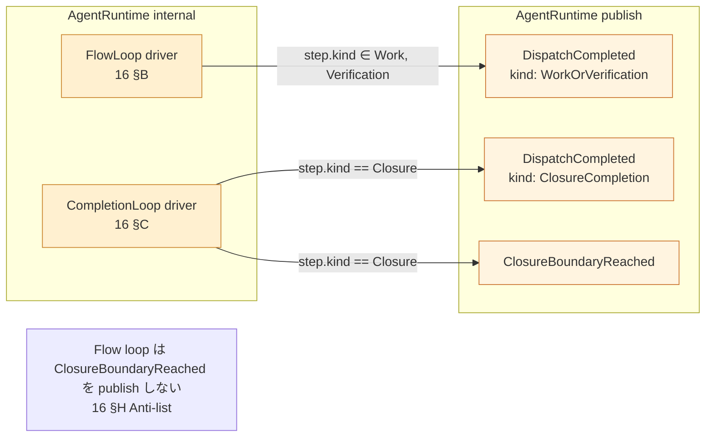
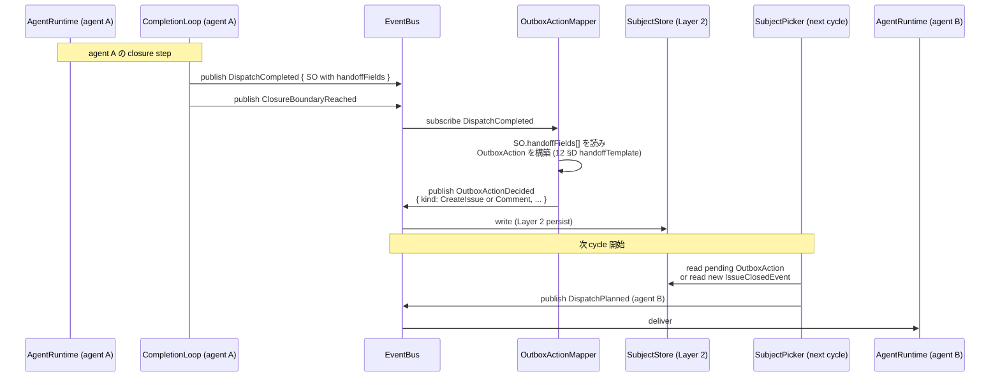

# 30 — Event Flow (Realistic 拡張: publish source 精緻化 + handoff 連鎖)

To-Be `30-event-flow.md` の **8 event 集合** (DispatchPlanned /
DispatchCompleted / ClosureBoundaryReached / TransitionComputed /
IssueClosedEvent / IssueCloseFailedEvent / SiblingsAllClosedEvent /
OutboxActionDecided) と各 event の payload ADT、publish/subscribe
map、Compensation 規約は **不可侵で継承** する。Realistic は **同じ event
集合の中で** publish source を dual loop 内に精緻化し、subscriber を
AgentBundle.closeBinding に紐付けるだけ。

**Up:** [00-index](./00-index.md), [10-system-overview](./10-system-overview.md)
**Inherits (不可侵):** [tobe/30-event-flow §A〜§F](./tobe/30-event-flow.md) — 8
event ADT / Publish-Subscribe map / DirectClose canonical 流れ / Compensation /
Transport=File / terminal events **Refs:**
[13-agent-config](./13-agent-config.md),
[16-flow-completion-loops](./16-flow-completion-loops.md),
[12-workflow-config](./12-workflow-config.md)

---

## A. 拡張範囲

To-Be 30 §A 8 event 図 / §B publish-subscribe map / §C DirectClose canonical
流れ / §D Failure / §E Transport=File / §F terminal events は **そのまま継承**
し、本章では **再記述しない**。Realistic で追加するのは:

1. publish source の精緻化 (DispatchCompleted / ClosureBoundaryReached
   の発火点を FlowLoop / CompletionLoop に局在化)
2. subscriber の AgentBundle.closeBinding 由来の active 化 mapping
3. handoff 連鎖の event 表現 (R2a multi-agent / 同 agent 異 cycle を
   OutboxActionDecided 経由で表現)
4. IssueClosedEvent channel id 値域の **閉じ性** 再確認 (R5 hard gate)

> **重要**: event 集合は **8 個から増えない**。`IssueClosedEvent.channel`
> の値域は **D / C / E / M / Cascade / U の 6 値で固定** (To-Be 30 §F / 46
> §F)。`C` は OutboxClose の単一 ChannelId で、Cpre / Cpost は **同じ ChannelId
> "C"** を共有する 2 つの Channel component (publisher
> 側内部実装の区別であり、event payload 上は単一値)。Realistic で event /
> ChannelId 増設は構造的に禁止 (10 §F anti-list)。

**Why**: event 集合と channel id を凍結することで、IssueClosedEvent の
subscriber は **mode を区別できない** (発火元 channel 以上の情報を payload
に持たない)。これが R5 (close 経路整合) の event 側 hard gate (11 §C 5 段証明
step 5)。

---

## B. Publish source の精緻化 (Realistic)



**Publish source 表 (8 event すべて)**:

| event                    | publisher                                    | 精緻化 (Realistic 追記)                                     |
| ------------------------ | -------------------------------------------- | ----------------------------------------------------------- |
| `DispatchPlanned`        | SubjectPicker                                | 追加なし — fanout 数のみ拡張 (15 §C)                        |
| `DispatchCompleted`      | AgentRuntime                                 | **FlowLoop または CompletionLoop** が発火 (16 §B / §C)      |
| `ClosureBoundaryReached` | AgentRuntime                                 | **CompletionLoop のみ** が発火 (16 §C)                      |
| `TransitionComputed`     | TransitionRule                               | 追加なし (To-Be 15 §A 不変)                                 |
| `OutboxActionDecided`    | OutboxActionMapper                           | 追加なし (To-Be 15 §A 不変) — handoff 経路で多用される (§D) |
| `IssueClosedEvent`       | Channel.execute → publish                    | 追加なし (To-Be 30 §B 不変) — channel id 値域 7 値固定      |
| `IssueCloseFailedEvent`  | Channel.execute (Transport.Failed) → publish | 追加なし                                                    |
| `SiblingsAllClosedEvent` | SiblingTracker (To-Be 45 §B service)         | 追加なし                                                    |

**Why**: 8 event の **payload と publisher の責務は不変**。Realistic は
`DispatchCompleted` / `ClosureBoundaryReached` の **発火 location** を
AgentRuntime 内で sub-driver level に局在化させただけ。これにより
`BoundaryClose` (43) と `CustomClose` (46) が `ClosureBoundaryReached` を
subscribe する時、source は **必ず CompletionLoop**
であることが構造的に保証される (16 §G)。

---

## C. Subscriber と AgentBundle.closeBinding の関係 (primary vs framework)

```mermaid
flowchart TD
    subgraph BootFrozen[Boot frozen]
        AB[AgentBundle.closeBinding.primary<br/>13 §F]
    end

    subgraph PrimarySubs[Agent-declared primary channels]
        D[DirectClose subscribes TransitionComputed]
        E[BoundaryClose subscribes ClosureBoundaryReached]
        Cpre[OutboxClose-pre subscribes OutboxActionDecided where action.kind ∈ PreClose]
        U[CustomClose subscribes ClosureBoundaryReached + ContractDescriptor.subscribesTo]
    end

    subgraph FrameworkSubs[Framework-driven subscribers (agent declare 不要)]
        Cpost[OutboxClose-post subscribes OutboxActionDecided where action.kind ∈ PostClose<br/>+ IssueClosedEvent]
        Cas[CascadeClose subscribes IssueClosedEvent + SiblingsAllClosedEvent]
    end

    AB -->|primary.kind: direct| D
    AB -->|primary.kind: boundary| E
    AB -->|primary.kind: outboxPre| Cpre
    AB -->|primary.kind: custom + ContractDescriptor| U

    Note2[Cpost / Cascade は他 channel の publish に chain する framework subscriber<br/>AgentBundle で declare しなくても Boot で必ず subscribe する]
    PrimarySubs -.publish.-> FrameworkSubs

    classDef prim fill:#fff0d0,stroke:#cc8833;
    classDef fw fill:#e0f0e0,stroke:#33aa33;
    class D,E,Cpre,U prim
    class Cpost,Cas fw
```

**`OutboxAction.kind` による subscriber 分岐**:

To-Be 30 §A の `OutboxActionDecided : { action: OutboxAction }` は **単一 event
型**。Realistic では subscriber の分岐 key を **`action.kind` (PreClose /
PostClose / Comment / CreateIssue ...)** に固定する (To-Be 30 §A / 42 §B
継承)。`OutboxActionDecided.Pre` / `.Post` のような event 弁別子は
**存在しない**。

| Channel          | subscribe event       | filter                                                                              |
| ---------------- | --------------------- | ----------------------------------------------------------------------------------- |
| OutboxClose-pre  | `OutboxActionDecided` | `action.kind == PreClose`                                                           |
| OutboxClose-post | `OutboxActionDecided` | `action.kind == PostClose` (+ `IssueClosedEvent` for completion of partner channel) |

**Channel の挙動不変式 (R5 整合の event 側根拠)**:

| 観点                            | 不変                                                                                      |
| ------------------------------- | ----------------------------------------------------------------------------------------- |
| `Channel.subscribesTo` 集合     | To-Be 30 §B のまま (Realistic で増減なし)                                                 |
| event ADT の数                  | To-Be 30 §A の 8 個 (Realistic で増設なし)                                                |
| Channel 構築タイミング          | Boot 1 回のみ (To-Be 10 §B `ConstructChannels`)                                           |
| mode による Channel 分岐        | **無し** (11 §E matrix が ✓ / — 二値)                                                     |
| AgentBundle.closeBinding の役割 | 「agent の **primary** channel を 1 つ宣言」。Cpost / Cascade は framework 自動 subscribe |

> **境界**: AgentBundle.closeBinding は agent の **primary close channel** を 1
> つ declare する。Cpost / Cascade のような **派生 channel** (他 channel の
> publish に chain して動く) は **framework 自動 subscribe** で agent declare
> に出てこない。したがって 1 agent から D + Cpost (連鎖) や U + Cascade (連鎖)
> のような multi-channel 経路は、primary 1 + framework
> 自動の組合せで自然に発火する (B12 修復)。

**Why**: Channel が agent を知ると、Channel.subscribesTo が agent ごとに変わり
R5 (close 経路整合) が崩れる。AgentBundle.closeBinding は **Boot 時の primary 1
channel の active 化 declare** に閉じ、Run 中は Channel が普通に subscribe
する。Cpost / Cascade を agent declare 不要にすることで、To-Be 30 §C canonical
流れ (D の close → Cpost が IssueClosedEvent を subscribe → 連鎖) が AgentBundle
1 entry で自然に表現できる。

---

## D. Handoff 連鎖の event 表現 (R2a multi-agent / 同 agent 異 cycle)



**handoff の event chain (1 本化)**:

| step | event                                | 通過点                               |
| ---- | ------------------------------------ | ------------------------------------ |
| 1    | DispatchCompleted (handoffFields 込) | AgentRuntime → Bus                   |
| 2    | OutboxActionDecided                  | OutboxActionMapper → Bus             |
| 3    | (Layer 2 persist)                    | OutboxAction が SubjectStore に書込  |
| 4    | (次 cycle 開始)                      | SubjectPicker が SubjectStore を読み |
| 5    | DispatchPlanned (next agent)         | SubjectPicker → Bus                  |

**禁則 (P3 継承)**:

- agent A の AgentRuntime が agent B を直接呼ぶ → **To-Be P3 違反**
- handoffFields を SO 経由でなく自由文で渡す → **single hinge 違反** (climpt
  哲学 #2 / 14 §D)
- OutboxAction を Bus に publish せず file に直書き → **P5 (Typed Outbox) + P3
  (CloseEventBus) 違反**

**Why**: agent → agent 連携は必ず **OutboxActionDecided event** を経由 (5 step
chain)。これにより agent 間に直接 coupling が生まれない (P3)、かつ handoff
内容は SO の typed payload に制約される (P5)。To-Be 30 §A の 8 event
集合の中で、`OutboxActionDecided` が agent 間連携の唯一のチャネルとして機能する
(Realistic 拡張点)。

---

## E. IssueClosedEvent channel id の閉じ性 (R5 hard gate 再確認)

```mermaid
stateDiagram-v2
    direction LR

    state "IssueClosedEvent.channel ∈ closed enum (6 値)" as CV {
        ID_D : DirectClose (D)
        ID_C : OutboxClose (C) — Cpre / Cpost 共通の単一 ChannelId
        ID_E : BoundaryClose (E)
        ID_M : MergeClose (M)
        ID_Cas : CascadeClose
        ID_U : CustomClose (U)
    }

    CV --> Inv[Realistic で増設禁止<br/>10 §F anti-list]

    note right of CV
        手動 close は framework 管轄外。
        IssueClosedEvent には現れない。
        OutboxClose の Cpre / Cpost は publisher
        component としては別だが ChannelId 値は \"C\" 共通
        (To-Be 30 §F / 46 §F: 6 つで完結)。
    end note
```

**閉じ性が R5 hard gate である理由**:

- IssueClosedEvent の subscriber (C-post / Cascade / SiblingTracker /
  90-traceability の audit) は **発火元 channel id 以上の情報を持たない**。
- mode (run-workflow / run-agent / merge-pr) は IssueClosedEvent の payload
  に乗らない。
- したがって **mode によって subscriber の挙動が変わる経路が構造的に存在しない**
  (= R5 整合の event 側根拠)。

**Why**: 11 §C R5 hard gate 5 段証明の **step 5** がこの閉じ性。channel id
を増やすと subscriber が「どの channel
から来たか」で分岐する余地が出て、最終的に mode
由来の分岐が紛れ込み得る。Realistic で channel 増設禁止 (10 §F)
はこの構造を守るため。

---

## F. To-Be 30 との差分まとめ

- **追加**: publish source の精緻化 (DispatchCompleted / ClosureBoundaryReached
  が FlowLoop / CompletionLoop の sub-driver から発火する
  mapping、§B)。subscriber active 化が AgentBundle.closeBinding 経由
  (§C)。handoff 連鎖を 5 step event chain で表現 (§D)。
- **不変**: 8 event 集合 / 各 event の payload ADT / Channel.subscribesTo /
  DirectClose canonical 流れ / Compensation / Transport=File / terminal events /
  channel id 値域 7 値 (To-Be 30 §A〜§F)。
- **禁止維持**: event 増設 / channel id 増設 / agent 間直接呼出 / mode 情報の
  event payload 混入。

---

## G. 1 行サマリ

> **「Realistic 30 は To-Be 8 event を 1 個も増やさず、publish source を
> Flow/Completion sub-driver に局在化し、subscriber を AgentBundle.closeBinding
> で active 化するだけ。channel id 7 値の閉じ性が R5 hard gate の event
> 側根拠。handoff 連鎖は OutboxActionDecided を経由する 5 step chain。」**

- 8 event 不変 → R5 hard gate の event 側根拠 (§E)
- publish source 精緻化 → §B FlowLoop / CompletionLoop の sub-driver 局在
- subscriber binding → §C AgentBundle.closeBinding declare (primary 1 kind
  のみ)、Cpost / Cascade は **framework 自動 subscribe** で agent declare 不要
- handoff 連鎖 → §D
  `DispatchCompleted → OutboxActionDecided → DispatchPlanned (next cycle)` の 5
  step
- channel id 値域 → 6 値 (D / C / E / M / Cascade / U)。`C` は OutboxClose
  の単一 ChannelId (Cpre / Cpost component が共有、subscribe filter は
  `OutboxAction.kind`、To-Be 30 §F / 46 §F)
