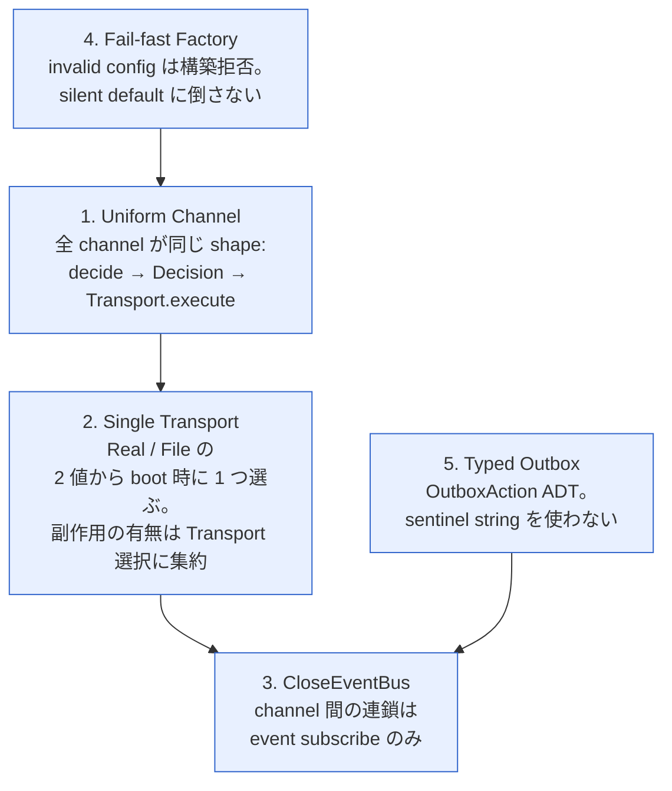
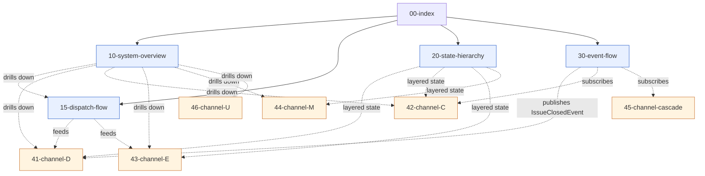

# 00 — To-Be Statecharts Index

issue close 経路の **To-Be** 設計図。As-Is の確定済み歪み (`statecharts/`,
`critique.md` Round 2) を 3 軸で整理して直す。

## 設計の 3 軸

| 軸                   | 主張                                                                                                |
| -------------------- | --------------------------------------------------------------------------------------------------- |
| **責務**             | 1 channel = 1 close decision authority。factory は valid config しか受けない。Transport は 1 つだけ |
| **疎結合**           | channel 間の連鎖は CloseEventBus 経由。直接呼び出し / state polling を持たない                      |
| **Interface 明瞭性** | enum / ADT を必ず付ける。silent fallback / sentinel string / hard-default 禁止                      |

## 5 つの設計原則



> 旧 P6 (Single Policy + dryRun) は P2 に吸収された。dryRun は **Transport=File
> を選ぶ** ことで等価以上に表現できるため、独立 flag を持たない。詳細 → 10 §C。

## ファイル構成

```
tobe-charts/
├── 00-index.md                    ← この文書 (原則 + 対比)
├── 10-system-overview.md          ← Uniform Channel shape
├── 15-dispatch-flow.md            ← SubjectPicker / AgentRuntime / TransitionRule 分解
├── 20-state-hierarchy.md          ← 4 層分離 (External / Mirror / Decision / Policy)
├── 30-event-flow.md               ← EventBus + Subscription 型
└── channels/
    ├── 41-channel-D.md            ← DirectClose channel (D)
    ├── 42-channel-C.md            ← OutboxClose channel (C-pre / C-post)
    ├── 43-channel-E.md            ← BoundaryClose channel (E)
    ├── 44-channel-M.md            ← MergeClose channel (M)
    ├── 45-channel-cascade.md      ← CascadeClose channel
    └── 46-channel-U.md            ← CustomClose channel (U)
```

## 依存マップ



## As-Is wart との対比 (どの歪みをどこで直すか)

| As-Is wart                                                                                                                                  | 出典            | To-Be 修復場所  | 修復方針                                                                                                                                        |
| ------------------------------------------------------------------------------------------------------------------------------------------- | --------------- | --------------- | ----------------------------------------------------------------------------------------------------------------------------------------------- |
| **W1**: factory が `github.enabled=false` でも adapter 構築 + closure_action hard-default `"close"` (factory.ts:117-127)                    | critique B1, B5 | 10 §C / 41 / 43 | **Fail-fast Factory**: invalid config は construct 拒否。Channel 不在                                                                           |
| **W2**: V2 ExternalStateVerdictAdapter が `Deno.Command("gh"...)` を直叩き (GitHubClient I/F bypass)                                        | As-Is 43 §E     | 10 §B / 43 / 20 | **Single Transport**: 全 channel は単一 Transport interface 経由                                                                                |
| **W3**: closure_action 解決の hard-default が `"close"` (factory.ts:127)                                                                    | As-Is 43 §B     | 43 §B           | hard-default を `"no-op"` に。silent close を起こさない                                                                                         |
| **W4**: C-pre / C-post が同じ OutboxProcessor 内で trigger string で分岐                                                                    | critique B3     | 42 / 30         | **Typed Outbox**: ADT の `kind` で discrimination。Pre/Post は別 subscriber                                                                     |
| **W5**: D-cascade が「次 cycle の D 再発火」を待つ implicit 連鎖 (state polling)                                                            | As-Is 45 §A     | 45 / 30         | **CloseEventBus**: D.success event を cascade subscriber が受け取る                                                                             |
| **W6**: dryRun が orchestrator (P5) と merge-pr (P6) で別 flag                                                                              | As-Is 10 §C     | 10 §C / 44 §B   | **dryRun ごと削除**: Transport=File が代替。subprocess は Transport を継承するだけ。flag 二重化の問題自体が消滅                                 |
| **W7**: Custom handler V10 の close が framework から observable 不可                                                                       | As-Is 46 §B/C   | 46              | Custom は `decide()` のみ user 実装。execute は framework 側で Transport 経由 (gh 直叩き不可)                                                   |
| **W8**: closeIntent guard 連鎖 (isTerminal ∧ closeOnComplete ∧ closeCondition)                                                              | As-Is 41 §A     | 41 §A           | 各 channel が単一の `Decision` ADT を返す。guard 連鎖は decide 内に閉じる                                                                       |
| **W9**: gh binary 不在で silent no-op (try/catch swallow)                                                                                   | As-Is 43 §C     | 43 §D / 30 §D   | Transport error は `Result.Failed` ADT で必ず上位伝搬                                                                                           |
| **W10**: S0.1 (server) と S1.1 (local mirror) が conflated                                                                                  | critique B4     | 20 §A / 41 §C   | MergeCloseAdapter interface で「single read source」を明示                                                                                      |
| **W11**: github.enabled flag が 2 役 (kill switch / 副作用 switch)                                                                          | critique B1     | 10 §C / 43 §C   | flag を `transport: "real" \| "file"` 単一 enum に                                                                                              |
| **W12**: outbox file `action: "close-issue"` が string sentinel                                                                             | As-Is 42 §B     | 42 §A / 30 §B   | OutboxAction ADT                                                                                                                                |
| **W13**: rollback 範囲が「saga 全体」と過剰記述 (実体は idempotent comment 投稿)                                                            | critique B2     | 41 §D           | rollback を `Compensation: PostFailureComment` という単一型に縮約                                                                               |
| **W14**: `Orchestrator.cycle()` が scheduling + dispatch + transition + close を 1 メソッドに抱える god object (`orchestrator.ts:723, 844`) | As-Is 30 §A     | 15 §A/F         | **Component 分解**: SubjectPicker / AgentRuntime / TransitionRule / OutboxActionMapper / DirectClose に分離。直接呼び出しゼロ、event のみで連携 |

## 読む順

1. **10-system-overview** — Uniform Channel と Boot 時の単一 Transport / Policy
   注入
2. **15-dispatch-flow** — SubjectPicker / AgentRuntime / TransitionRule の
   component 分解
3. **20-state-hierarchy** — 4 層に整理した state 空間
4. **30-event-flow** — EventBus による疎結合 (close + dispatch event 統合)
5. **channels/41-46** — 各 channel の
   `decide / execute / Transport / Effect / Why`

## 表記ルール

| 表記              | 意味                                                             |
| ----------------- | ---------------------------------------------------------------- |
| `[*]`             | 初期 / 終端 (Mermaid stateDiagram-v2 標準)                       |
| `state X { ... }` | 複合状態                                                         |
| **Why** 注記      | どの As-Is wart (W*) を直したかを 1 行で示す                     |
| ADT               | Algebraic Data Type (discriminated union)。enum 拡張版として扱う |

## To-Be 限定の原則

- 本ディレクトリは **目標形** のみ記述する。As-Is の観察 / 再描写は出さない
  (As-Is は `statecharts/` を参照)
- 各 channel の §Why に「どの W* を直したか」を 1 行記す。これが As-Is
  との接続点
- 実装存在判定 (factory.ts L*, etc.) は書かない。To-Be は契約レベルで描く
