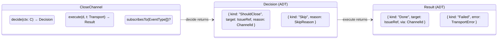
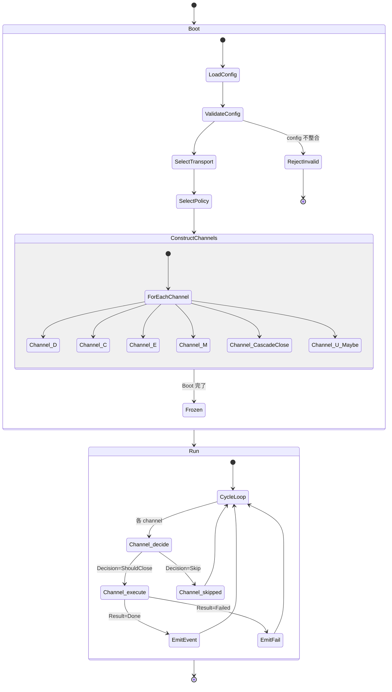
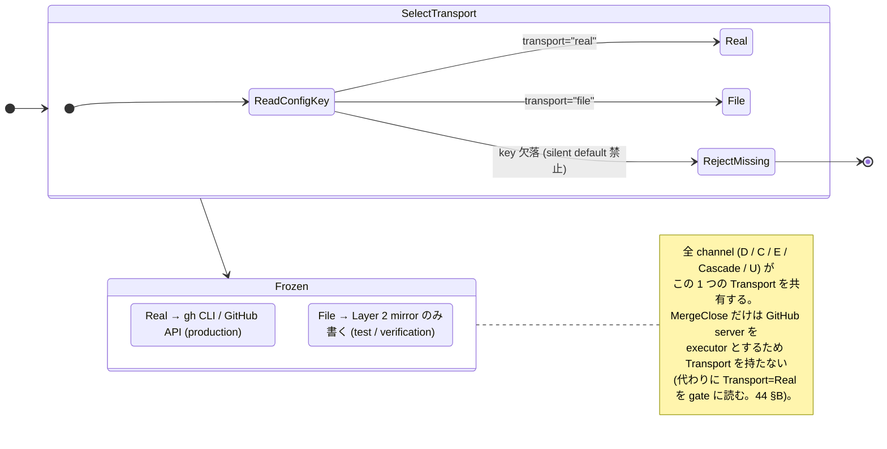
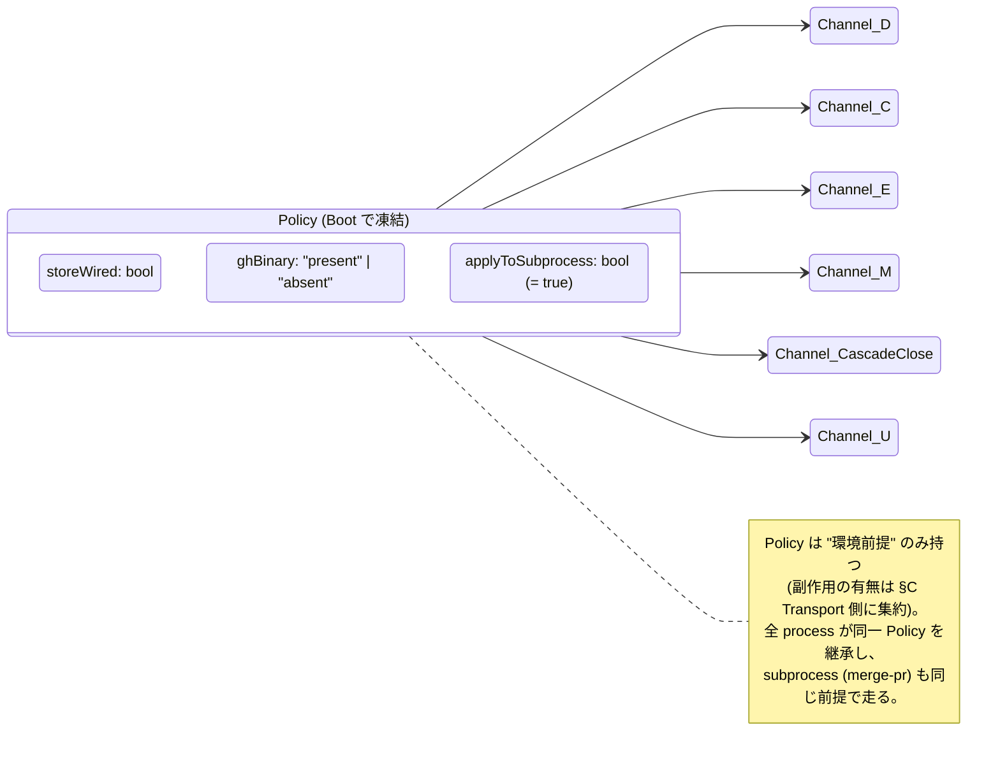
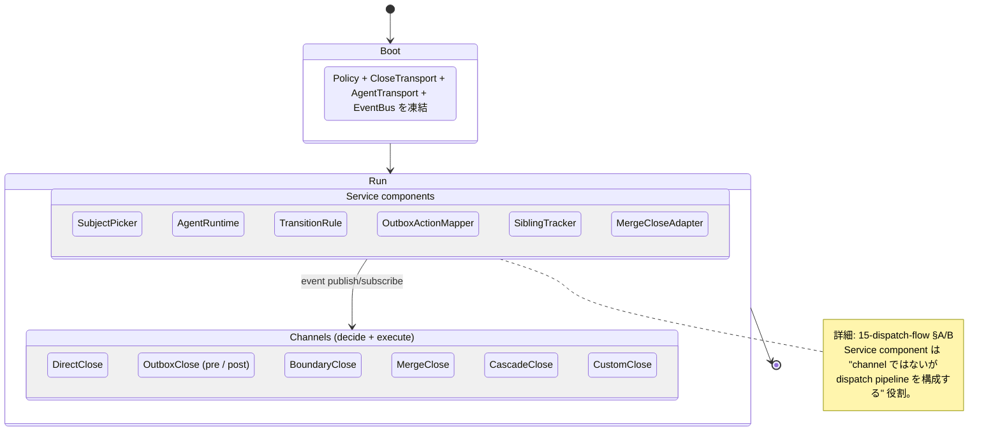
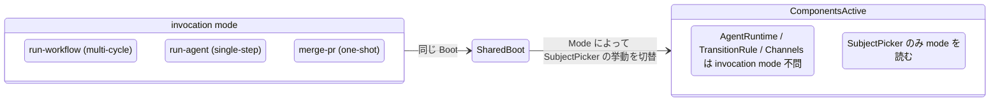

# 10 — System Overview (Uniform Channel shape)

To-Be では **6 channel が同じ shape** を持つ。Boot で Policy / Transport
を一度凍結し、Run では channel が `decide → execute(Transport)` だけを行う。

**Up:** [00-index](./00-index.md) **Down:** [41-D](./channels/41-channel-D.md),
[42-C](./channels/42-channel-C.md), [43-E](./channels/43-channel-E.md),
[44-M](./channels/44-channel-M.md),
[45-cascade](./channels/45-channel-cascade.md),
[46-U](./channels/46-channel-U.md) **Refs:**
[20-state-hierarchy](./20-state-hierarchy.md),
[30-event-flow](./30-event-flow.md)

---

## A. Uniform Channel interface

**Why**: As-Is の guard 連鎖は channel ごとに散在 (W8) し、`closure_action` が
hard-default で `"close"` に倒れる (W3) など silent fallback
が混ざっていた。To-Be では各 channel が **明示的に** `Decision` ADT
を返し、`Skip` の場合も理由を持つ。silent な分岐は許さない。

---

## B. Boot vs Run の責務分離

**Why**:

- Boot で **invalid config を拒否** することで W1 (factory が enabled=false でも
  adapter 構築) を排除。silent fallback の余地が消える。
- Boot で Transport を 1 つに確定することで W2 (V2 が gh 直叩き) を排除。Run
  中に transport 切替不可。
- `Channel_U_Maybe` は user が contract を declare した場合のみ Frozen に入る
  (W7 の修復)。

---

## C. Transport 単一化 (副作用 switch を 1 enum に集約)

**Why**:

- W2 (V2 が GitHubClient bypass で gh 直叩き) を直す。BoundaryClose も同じ
  Transport を経由する。
- W11 (github.enabled flag が 2 役) を直す。flag を **transport 選択**
  という単一 enum に置き換え、kill switch との混同を断つ。
- W10 (S0.1/S1.1 conflation) を直す。File Transport は明示的に「Layer 2 mirror
  only」と契約する。
- **W6 (dryRun 二重 flag) も同時に消滅**。Run 時の dryRun flag を持たず、Boot
  時の Transport 選択 1 つで「副作用の有無」を決める。「dryRun したい」=
  `Transport=File` を選べば、cascade event 流路まで完走する **より強いテスト**
  になる。

---

## D. Policy (Boot で凍結する 3 値)

**Why**:

- W9 (gh binary 不在 silent no-op) を直す。`ghBinary: "absent"` ∧
  `Transport=Real` を Boot で検出したら Reject。Run 中の silent failure
  を起こさない。
- Policy は **環境前提** (gh 存在 / store 配線) のみを保持し、**何をするか** は
  Transport / Channel ADT に閉じる。「環境前提」と「副作用方針」の責務分離。

---

## E. Components (god object 排除)

To-Be は **process 単位ではなく component 単位** で責務を捉える。As-Is
`Orchestrator.cycle()` が抱えていた scheduling / dispatch / transition / close
を独立 component に分け、event のみで連携する。

**Why (W14)**:

- As-Is は host process (OrchestratorProc / RunnerProc / MergePrProc)
  を単位にしていたため、scheduling + dispatch + transition + close が **1
  process = 1 god object** に同居していた。
- To-Be は **component 単位**。1 process に何個 component が同居しても良いし、1
  component を別 process に分離しても良い (deployment 詳細)。Boot で凍結された
  EventBus が境界を担う。
- MergeClose (merge-pr) も component として扱う。subprocess かどうかは
  deployment 詳細であり、Channel 契約には現れない。

---

## F. Invocation modes (CLI entry point — 既存 As-Is との接合)

**Why**:

- invocation mode は **SubjectPicker の入力** (= subject queue の作り方)
  に閉じ込める。Channel 側は mode を知らない。
- これにより DirectClose は run-workflow / run-agent のどちらの起動でも同じ
  contract で動く。As-Is は run-workflow と run-agent で別 path
  を持っていた箇所を 1 path に集約する。
