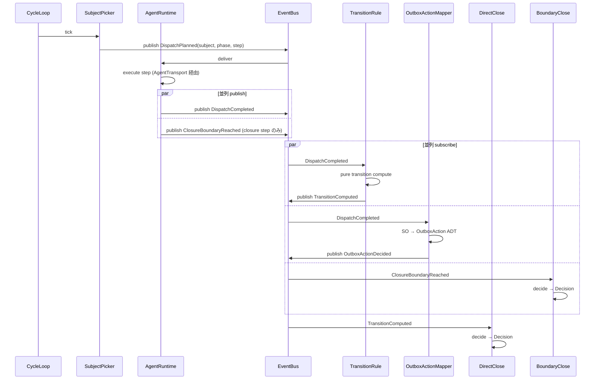
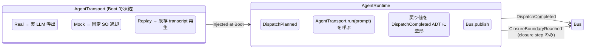
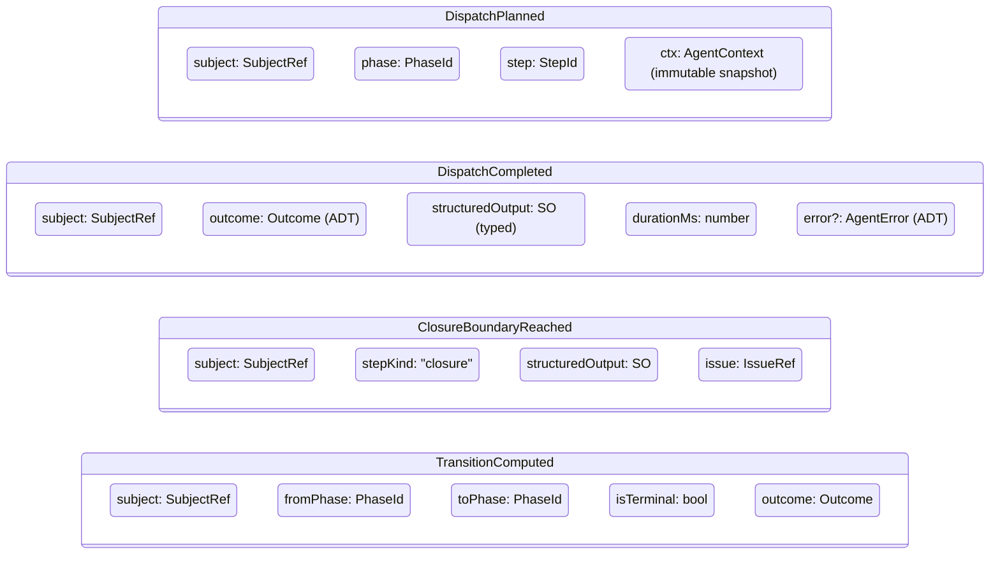
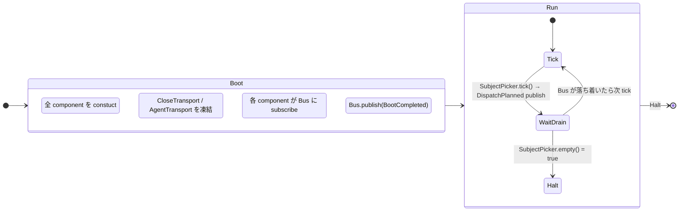

# 15 — Dispatch Flow (SubjectPicker → AgentRuntime → TransitionRule → Channel)

To-Be では As-Is の `Orchestrator.cycle()` god object を **4 component に解体**
し、すべて event 経由で繋ぐ。各 component は 1 input event 型 + 1 output event
型しか持たない。

**Up:** [00-index](./00-index.md), [10-system-overview](./10-system-overview.md)
**Refs:** [30-event-flow](./30-event-flow.md),
[20-state-hierarchy](./20-state-hierarchy.md) **Down:**
[41-D](./channels/41-channel-D.md), [43-E](./channels/43-channel-E.md)

---

## A. 4 component の責務分解

```mermaid
stateDiagram-v2
    direction LR

    state "SubjectPicker" as Sch {
        Pick : 次の subject + step を決める
        Tick : DispatchPlanned を publish
    }

    state "AgentRuntime" as AR {
        Recv : DispatchPlanned を受領
        Exec : 1 step を実行 (Real LLM / Mock / Replay)
        Pub  : DispatchCompleted + (closure step なら) ClosureBoundaryReached
    }

    state "TransitionRule (pure)" as TE {
        Pure : (currentPhase, outcome) → (nextPhase, isTerminal)
        PubT : TransitionComputed を publish
    }

    state "DirectClose / E ..." as Ch {
        Sub : 該当 event を subscribe
        Dec : decide → Decision
        Exe : execute → Transport
    }

    Sch --> AR : DispatchPlanned
    AR --> TE : DispatchCompleted
    TE --> Ch : TransitionComputed
    AR --> Ch : ClosureBoundaryReached (BoundaryClose)
```



**Why (W14)**:

- As-Is の `Orchestrator` class は scheduling + dispatch + transition + close を
  1 メソッドに抱える **god object** だった (`orchestrator.ts:723, 844`)。To-Be
  では 4 component に分解し、互いに直接呼び出さない。
- 各 component は **1 入力 event + 1 出力 event** に責務が固定されるため、単独で
  test / 差替 / 観測ができる。

---

## B. Pipeline (1 cycle = 1 step)



**Why**:

- Pipeline 全段が **同じ shape** (input event → 内部処理 → output event)。As-Is
  の procedural な `cycle()` 関数を event-driven に置き換える。
- 並列 subscribe は CycleLoop が順序を強制しない。BoundaryClose と DirectClose
  は独立して decide できる (As-Is の「同 cycle で D と E
  が同時発火可」が自然に表現される)。

---

## C. AgentRuntime is a Transport seam



**Why**:

- AgentTransport は **CloseTransport (10 §C) と同じ構造**。Boot で 1 つ選んで
  Run 中は immutable。test 時は Mock / Replay に差替。
- AgentRuntime は contract (DispatchPlanned in / DispatchCompleted out)
  のみ提供。LLM 呼出の詳細は Transport が独占。
- これにより AgentRuntime と Channel は **直接の依存ゼロ**。Channel は
  AgentRuntime の中身を知らない。

---

## D. DispatchPlanned / DispatchCompleted ADT



**Why**:

- 各 event が **immutable record + ADT 値**。Run 中の variable mutation / 共有
  mutable state を持たない。
- TransitionRule は `(fromPhase, outcome) → (toPhase, isTerminal)` の pure
  function。テストは入出力 table のみ。

---

## E. Component の独立性 (誰が誰を読むか)

```mermaid
flowchart TD
    Sch[SubjectPicker]
    AR[AgentRuntime]
    TE[TransitionRule]
    OE[OutboxActionMapper]
    ST[SiblingTracker]
    Oracle[MergeCloseAdapter]

    D[DirectClose]
    E[BoundaryClose]
    Cpre[OutboxPreClose]
    Cpost[OutboxPostClose]
    Cas[CascadeClose]
    U[CustomClose]

    Sch -.->|DispatchPlanned| AR
    AR -.->|DispatchCompleted| TE
    AR -.->|DispatchCompleted| OE
    AR -.->|ClosureBoundaryReached| E
    AR -.->|ClosureBoundaryReached| U
    TE -.->|TransitionComputed| D
    OE -.->|OutboxActionDecided| Cpre
    OE -.->|OutboxActionDecided| Cpost

    D -.->|IssueClosedEvent| Cpost
    D -.->|IssueClosedEvent| ST
    E -.->|IssueClosedEvent| ST
    Cpre -.->|IssueClosedEvent| ST
    Cpost -.->|IssueClosedEvent| ST
    Cas -.->|IssueClosedEvent| ST
    U -.->|IssueClosedEvent| ST

    ST -.->|SiblingsAllClosedEvent| Cas
    Oracle -.->|IssueClosedEvent (M 由来)| ST

    classDef comp fill:#e8f0ff,stroke:#3366cc;
    classDef ch fill:#fff4e0,stroke:#cc7733;
    class Sch,AR,TE,OE,ST,Oracle comp
    class D,E,Cpre,Cpost,Cas,U ch
```

**Why**:

- 全矢印が **event 経由** (実線無し = direct call ゼロ)。
- Component / Channel が他者の internal state を一切読まない。
- 図の下流 (Channels) は上流 (components) の存在を知る必要がない。subscribe する
  event 型だけ知れば良い。

---

## F. As-Is `Orchestrator.cycle()` との対比

| As-Is `Orchestrator.cycle()` の処理 | To-Be 担当 component                                    |
| ----------------------------------- | ------------------------------------------------------- |
| `prioritizer.pick()`                | **SubjectPicker**                                       |
| `R1.dispatch(agent)`                | **AgentRuntime** (via AgentTransport)                   |
| `computeTransition(phase, outcome)` | **TransitionRule** (pure)                               |
| `O7.emitDeferredItems(SO)`          | **OutboxActionMapper**                                  |
| boundary hook 起動                  | **AgentRuntime** が `ClosureBoundaryReached` を publish |
| `evalCloseIntent()`                 | **DirectClose.decide**                                  |
| `G1.closeIssue()`                   | **Transport** (DirectClose が呼ぶ)                      |
| `O5.rollback()` (失敗時)            | **DirectClose の Compensation** (`Comment` 1 個)        |
| sentinel sweep                      | **SiblingTracker** + **CascadeClose**                   |

**Why**:

- 1 メソッドが 9 責務を抱えていた状態を、9 component (うち 6 channel + 3
  service) に分配。
- 各 component は 1 責務 = 1 event 型ペア。**god object 排除**は単なる class
  分割ではなく、**event 型を design hub に据えた契約分割**。

---

## G. Lifecycle (CycleLoop は何をするか)



**Why**:

- CycleLoop は「SubjectPicker に tick を打って Bus が drain したら次
  tick」だけ。
- As-Is の cycle 関数のように複数責務をまたぐ procedural コードは存在しない。
- Halt 条件は SubjectPicker が「もう dispatch すべき subject
  が無い」と返した時のみ。DirectClose の close 成功で halt しない (cascade
  subscribe があるため subject が増える可能性)。

---

## H. Component の責務 (1 行ずつ)

| Component              | 責務                                                                                  |
| ---------------------- | ------------------------------------------------------------------------------------- |
| **SubjectPicker**      | 「次の subject + step を決める」                                                      |
| **AgentRuntime**       | 「1 step を実行して outcome を返す」                                                  |
| **TransitionRule**     | 「(currentPhase, outcome) → (nextPhase, isTerminal) を計算する」 (pure)               |
| **OutboxActionMapper** | 「SO から OutboxAction ADT を作って publish する」                                    |
| **SiblingTracker**     | 「IssueClosedEvent を集計して binding ごとに SiblingsAllClosedEvent を出す」          |
| **MergeCloseAdapter**  | 「Layer 1 / Layer 2 の bridge。MergeClose の close を `IssueClosedEvent` に翻訳する」 |
| **DirectClose**        | 「terminal phase なら close decision」                                                |
| **BoundaryClose**      | 「closure step boundary の Decision」                                                 |
| **OutboxPreClose**     | 「OutboxActionDecided (PreClose) を Decision に変換」                                 |
| **OutboxPostClose**    | 「OutboxActionDecided (PostClose) + IssueClosed の合流で Decision」                   |
| **CascadeClose**       | 「IssueClosed + SiblingsAllClosed 合流で sentinel close Decision」                    |
| **MergeClose**         | 「PR を merge し server-side auto-close を起こす」                                    |
| **CustomClose**        | 「Custom decide のみ。execute は framework 側」                                       |
