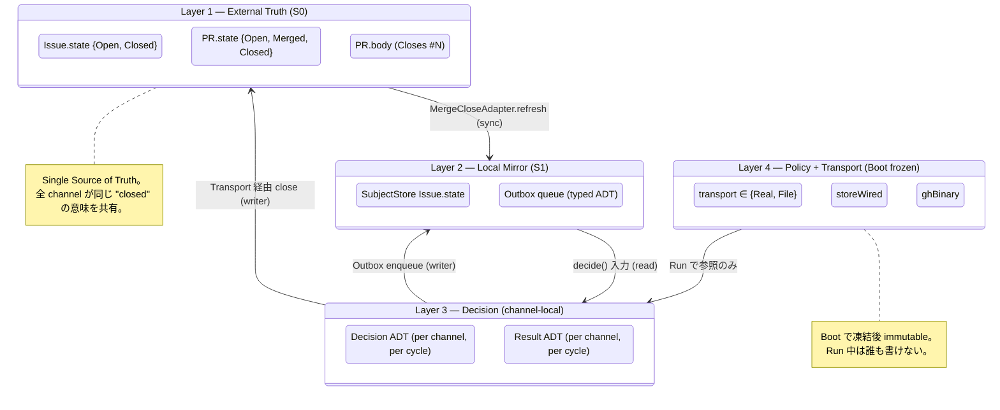
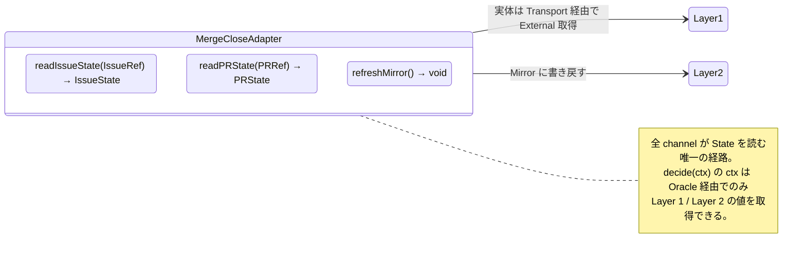
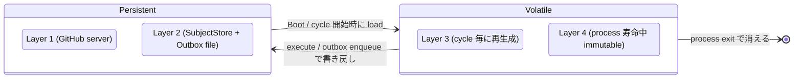

# 20 — State Hierarchy (4 層分離)

To-Be では state 空間を **4 層** に分ける。各層の責務 / persistence /
読者を明示する。As-Is で 21 軸あった state を、層ごとの owner と read-only /
writable で切り分ける。

**Up:** [00-index](./00-index.md) **Refs:**
[10-system-overview](./10-system-overview.md),
[30-event-flow](./30-event-flow.md), channels/41-46

---

## A. 4 層モデル

**Why**:

- W10 (S0.1 / S1.1 が conflated) を直す。Layer 1 (External Truth) と Layer 2
  (Local Mirror) を別層として明示。Mirror は External の **read-only
  cache**。Mirror から close は起こせない。
- W8 (closeIntent guard 連鎖が散在) を直す。Decision を Layer 3 に隔離し、各
  channel が自分の Decision だけ持つ。

---

## B. 層ごとの責務 / 書き手 / 読み手

```mermaid
flowchart LR
    subgraph L1[Layer 1: External Truth]
        L1_Owner[owner: GitHub server]
        L1_W[writer: Transport のみ]
        L1_R[reader: MergeCloseAdapter]
    end

    subgraph L2[Layer 2: Local Mirror]
        L2_Owner[owner: 自 process]
        L2_W[writer: MergeCloseAdapter.refresh / Channel.execute]
        L2_R[reader: 全 channel の decide]
    end

    subgraph L3[Layer 3: Decision]
        L3_Owner[owner: 各 Channel]
        L3_W[writer: Channel.decide]
        L3_R[reader: Channel.execute / EventBus.publish]
    end

    subgraph L4[Layer 4: Policy]
        L4_Owner[owner: Boot]
        L4_W[writer: Boot のみ Run 中は frozen]
        L4_R[reader: 全 channel]
    end

    L4 --> L3
    L2 --> L3
    L3 --> L1
    L1 --> L2
```

**Why**:

- 各層に **1 writer / N readers** の単純な所有関係を敷く。As-Is で 21
  軸が混在していた状況を解消。
- Channel は他 channel の Layer 3 (Decision) を **読まない**。Layer 2 / Layer 1
  を経由する。これが疎結合の核。

---

## C. MergeCloseAdapter interface (Layer 1 ↔ Layer 2 の唯一の橋)

**Why**:

- W2 (V2 が gh 直叩きで GitHubClient I/F bypass) を直す。State 読みは
  MergeCloseAdapter 経由のみ。
- W10 (Site A は両方更新 / Site B は S1 のみ) を直す。File Transport の場合
  Oracle は「Layer 1 を空 (=Closed と解釈) に倒す」のではなく **Layer 2 mirror
  を Layer 1 の代理として返す** という単一の振る舞い。Transport の差異は Oracle
  の中に隠蔽。

---

## D. 値域 (各層が持つ ADT)

| 層          | type                | 値域                                                                                                    |
| ----------- | ------------------- | ------------------------------------------------------------------------------------------------------- |
| L1 External | `IssueState`        | `Open` \| `Closed`                                                                                      |
| L1 External | `PRState`           | `Open` \| `Merged` \| `Closed`                                                                          |
| L2 Mirror   | `OutboxAction`      | `PreClose(IssueRef)` \| `PostClose(IssueRef)` \| `Comment(IssueRef, body)` \| `CreateIssue(...)` \| ... |
| L3 Decision | `Decision`          | `ShouldClose(IssueRef, ChannelId)` \| `Skip(SkipReason)`                                                |
| L3 Decision | `SkipReason`        | `Policy.NoStore` \| `Transport.NotReal` \| `GuardFailed(name)` \| `Subscriber.NoEvent`                  |
| L3 Result   | `Result`            | `Done(IssueRef, ChannelId)` \| `Failed(TransportError)`                                                 |
| L4 Policy   | `Transport`         | `Real` \| `File`                                                                                        |
| L4 Policy   | `Policy.storeWired` | `bool`                                                                                                  |
| L4 Policy   | `Policy.ghBinary`   | `Present` \| `Absent`                                                                                   |

**Why**:

- W12 (outbox file の `action: "close-issue"` が string sentinel)
  を直す。`OutboxAction` は ADT。string parse の余地を消す。
- W3 (closure_action hard-default `"close"`) を直す。`Decision` は明示的な
  ADT。silent default で `ShouldClose` に倒す経路は無い。

---

## E. Persistence と寿命

**Why**:

- Layer 4 (Policy + Transport) を **process 寿命** に固定。Run 中の動的 reconfig
  は禁止。これにより subprocess (MergeClose の merge-pr.ts) も Transport
  を起動引数として継承し、Run 中の整合が保たれる (W6 wart は Transport
  一元化で消滅。10 §C 参照)。
- Layer 3 (Decision) を **cycle 寿命** に閉じ込めることで、過去 cycle の
  Decision が次 cycle に漏れない。As-Is の S2.13 saga step が process crash
  で消失する問題は、Layer 2 の Outbox に書き戻すことで「next cycle に持ち越せる
  close intent は Outbox だけ」という単一規則になる。
