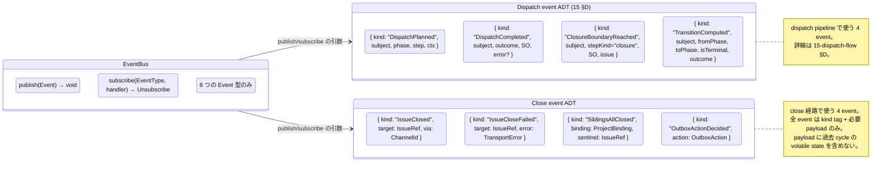
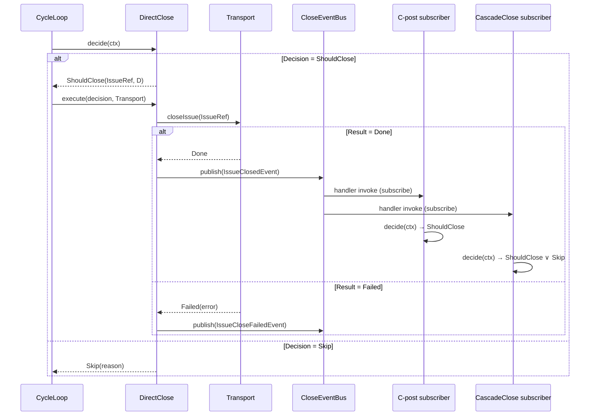
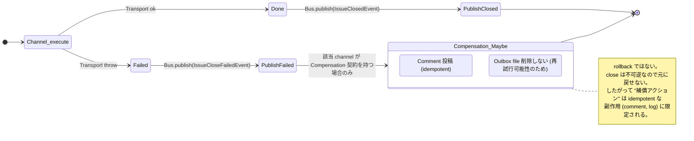
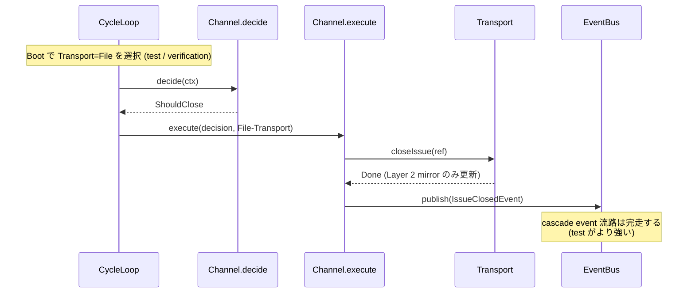

# 30 — Event Flow (EventBus による疎結合)

To-Be では channel 間の連鎖、および dispatch pipeline 全段が **EventBus**
経由のみ。直接呼び出し / state polling / serial composite を持たない。

> dispatch event の詳細仕様は [15-dispatch-flow](./15-dispatch-flow.md) §D
> を参照。

**Up:** [00-index](./00-index.md) **Refs:**
[10-system-overview](./10-system-overview.md),
[20-state-hierarchy](./20-state-hierarchy.md) **Down:** channels/41-46

---

## A. EventBus interface



**Why**:

- W5 (D-cascade が次 cycle まで polling) を直す。CascadeClose は
  `IssueClosedEvent` を subscribe して即座に decide できる。
- W4 (C-pre / C-post が同じ OutboxProcessor 内 trigger string で分岐)
  を直す。Outbox 全ては `OutboxActionDecided` として publish され、C 配下の
  subscriber が `OutboxAction.kind` で分岐する。
- W14 (Orchestrator god object) を直す。Bus 上で **dispatch event と close event
  が対等** に並ぶ。`Orchestrator.cycle()` 内に隠れていた procedural
  な順序が、event 型の publish/subscribe で表面化する。

---

## B. Publish / Subscribe マップ

```mermaid
flowchart LR
    D[DirectClose]
    Cpre[OutboxPreClose subscriber]
    Cpost[OutboxPostClose subscriber]
    E[BoundaryClose]
    M[MergeClose]
    Cas[CascadeClose]
    U[CustomClose]

    D       -->|publish| IC[IssueClosedEvent]
    E       -->|publish| IC
    Cpost   -->|publish| IC
    Cas     -->|publish| IC
    U       -->|publish via Transport| IC
    M       -.->|publish (via MergeCloseAdapter refresh)| IC

    D       -->|publish failure| ICF[IssueCloseFailedEvent]
    E       -->|publish failure| ICF
    Cpost   -->|publish failure| ICF
    Cas     -->|publish failure| ICF
    U       -->|publish failure| ICF

    Cpre    -->|publish| OA[OutboxActionDecided]
    Cpost   -->|publish| OA

    SentinelSweeper[Sentinel Sweeper task] -->|publish| SAD[SiblingsAllClosedEvent]

    IC -->|subscribe| Cpost
    IC -->|subscribe| Cas
    SAD -->|subscribe| Cas
    OA -->|subscribe| Cpre
    OA -->|subscribe| Cpost

    classDef ev fill:#fff4e0,stroke:#cc7733;
    classDef ch fill:#e8f0ff,stroke:#3366cc;
    class IC,ICF,SAD,OA ev
    class D,Cpre,Cpost,E,M,Cas,U,SentinelSweeper ch
```

**Why**:

- W5 (cascade の implicit 連鎖) を直す。CascadeClose は `IssueClosedEvent` ∧
  `SiblingsAllClosedEvent` の **両方** を subscribe する。両 event 揃った時点で
  fire。次 cycle 待ちは不要。
- C-post は `IssueClosedEvent` を subscribe する。As-Is の `S2.11=T`
  直接読みを排除。

---

## C. DirectClose の canonical 流れ (Run 1 cycle)



**Why**:

- W8 (closeIntent guard 連鎖) を直す。`decide` 1 回で Decision
  が確定する。guards は decide 内に閉じる。
- W9 (silent no-op) を直す。Transport が `Failed` を返したら必ず
  `IssueCloseFailedEvent` が publish される。catch swallow しない。
- C-post / CascadeClose は **同 cycle 内で** event を受け取り decide する。As-Is
  の「次 cycle 待ち」を排除。

---

## D. Failure と Compensation



**Why**:

- W13 (rollback 範囲が saga 全体と過剰記述) を直す。Compensation を **idempotent
  な副作用のみ** と契約レベルで明示。close 自体の取り消しは不可能と認める。
- Compensation は channel ごとの opt-in。全 channel が持つわけではない。

---

## E. Transport=File が「副作用無し」の唯一の手段



**Why**:

- W6 (dryRun 二重 flag) は Transport を Real / File の 2 値に縮約することで wart
  自体が消滅。Run 時の "止める" flag を持たない。
- MergeClose (44 §B) は `Transport=Real` を gate に読む。`Transport=File` なら
  `Skip(Transport.NotReal)`。subprocess も Boot で同じ Transport
  を継承するため、独立した dry-run flag は無い。

---

## F. terminal events (To-Be で `Issue.state=Closed` を起こすもの)

```mermaid
flowchart LR
    A[DirectClose \"execute\"] --> T[Transport.closeIssue]
    B[OutboxClose \"execute\"] --> T
    C[BoundaryClose \"execute\"] --> T
    D[CascadeClose \"execute\"] --> T
    E[CustomClose \"execute\"]   --> T
    F[MergeClose] --> GH[GitHub server: PR merge auto-close]

    T --> S0[Layer 1 Issue.state = Closed]
    GH --> S0

    S0 --> Bus[CloseEventBus.publish<br/>IssueClosedEvent]

    classDef term fill:#e0f0e0,stroke:#33aa33;
    class S0,Bus term
```

**Why**:

- W2 (V2 gh 直叩き bypass) を直す。BoundaryClose も他と同じ Transport
  を経由する。
- MergeClose は Transport を経由しない (GitHub server 側 auto-close)
  が、MergeCloseAdapter.refresh が後続 cycle で Layer 1 closed を観測した時点で
  `IssueClosedEvent` を publish する責務を持つ。これにより全 close 経路が 1 つの
  Event で表現される。
