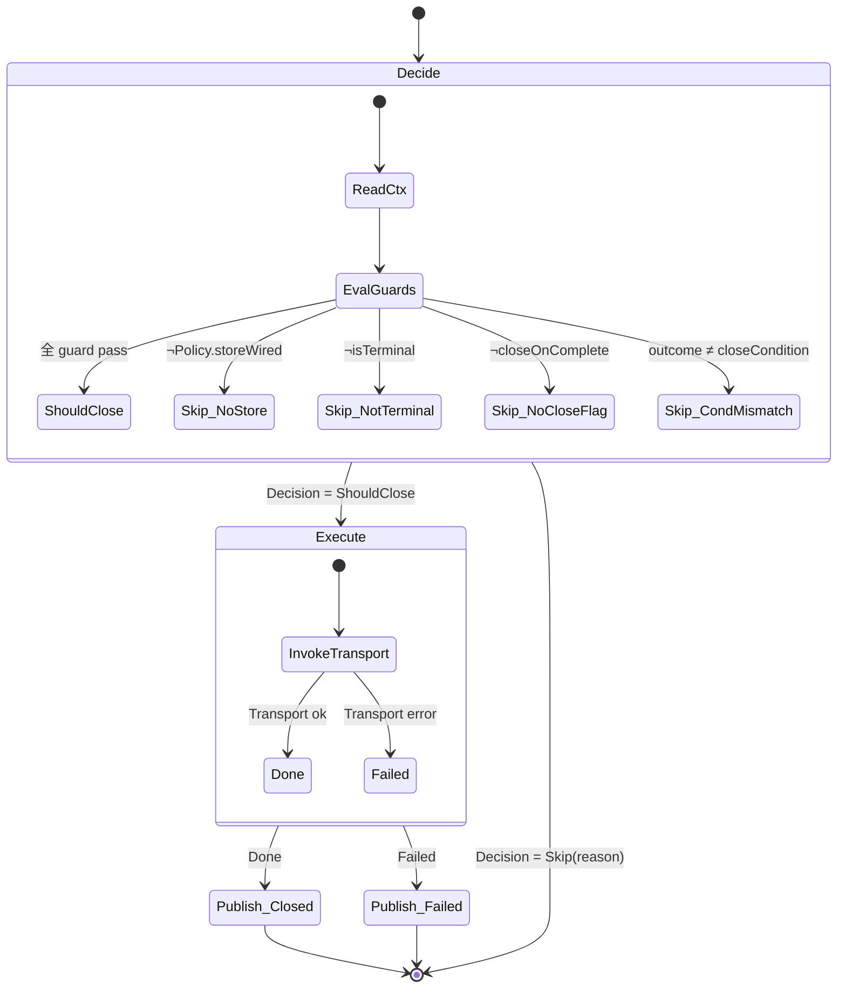
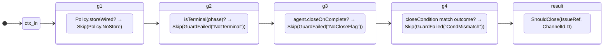
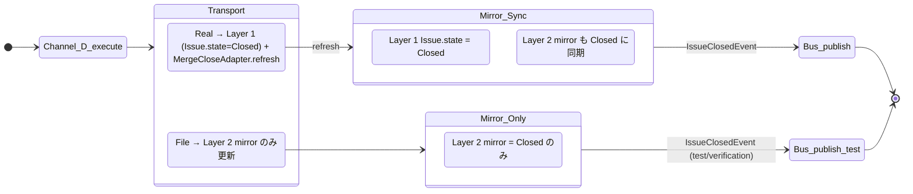
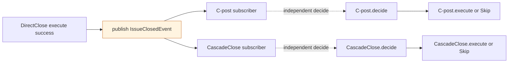

# 41 — DirectClose channel (D) — Workflow terminal close

Workflow の terminal phase に到達した primary subject の issue を、単一
Transport 経由で close する経路。

**Up:** [10-system-overview](../10-system-overview.md),
[30-event-flow](../30-event-flow.md) **Refs:**
[20-state-hierarchy](../20-state-hierarchy.md) **Publishes:** `IssueClosedEvent`
/ `IssueCloseFailedEvent` **Sibling:** [42-C](./42-channel-C.md),
[43-E](./43-channel-E.md) **Triggers:** [45-cascade](./45-channel-cascade.md)
(event subscriber)

---

## A. State machine (decide → execute)

**Why**:

- W8 (closeIntent guard 連鎖が散在) を直す。**guard は `decide`
  の内部に閉じ**、外側からは `Decision` ADT 1 つしか見えない。
- W9 (silent no-op) を直す。`Failed` が出たら必ず `IssueCloseFailedEvent` が
  publish される。

---

## B. Decision 構築 (guard の閉じ込め)

**Why**:

- 各 guard が **同じ shape** (check → Skip(reason) もしくは next) を持つ。As-Is
  の implicit 連鎖を順序付き ADT 構築に置き換える。
- Skip の理由が `SkipReason` ADT で型保証される。silent fallback 不可。

---

## C. Effect (Transport を介して何が変わるか)

**Why**:

- W10 (Site A 両方更新 / Site B mirror のみ) を直す。Transport が
  **どの層を書くか** を契約で明示。File Transport は明示的に「Layer 2 mirror
  only」と宣言する。
- W2 (V2 gh 直叩き) を直す。DirectClose も BoundaryClose も同じ Transport
  を使うため、Transport 切替で全 channel が一斉に対象を切り替えられる。

---

## D. trigger / Decision / Transport / Effect 全表

| 観点                    | 内容                                                                                   |
| ----------------------- | -------------------------------------------------------------------------------------- |
| **trigger (subscribe)** | `TransitionComputed` (TransitionRule 由来。15-dispatch-flow §B)                        |
| **Decision 入力**       | `{ tc: TransitionComputed, agent.closeOnComplete, closeCondition, IssueRef, Policy }`  |
| **Decision 出力**       | `ShouldClose(IssueRef, D)` ∨ `Skip(SkipReason)`                                        |
| **Transport**           | Boot で凍結された 1 つ (Real / File)                                                   |
| **Effect**              | Transport.closeIssue → Layer 1 (Real) ∨ Layer 2 mirror (File)                          |
| **Publish**             | 成功: `IssueClosedEvent(IssueRef, D)` / 失敗: `IssueCloseFailedEvent(IssueRef, error)` |
| **Compensation**        | 失敗時のみ `Comment(IssueRef, body)` を Outbox に enqueue (idempotent)                 |

**Why**:

- W13 (rollback が saga 全体と過剰記述) を直す。Compensation を `Comment` 1
  種に縮約。「何が undo されるか」が型で明示される。

---

## E. 後続 channel への接続 (Event subscribe)

**Why**:

- W5 (cascade の next-cycle polling) を直す。CascadeClose は `IssueClosedEvent`
  を subscribe して **同 cycle 内で** decide する。
- C-post も `S2.11=T` を直接読まず、event subscribe で D 成功を知る。As-Is の「D
  の成果物 (volatile state) を C-post が直接読む」という暗黙結合を排除。

---

## F. DirectClose の責務 (1 行)

> **「terminal phase の close decision を 1 つ作って Transport
> に渡す。それだけ。」**

- 他 channel の state を読まない
- 他 channel の execute を直接呼ばない
- Transport の中身を知らない
- Transport が Failed を返したら Compensation を 1 つ enqueue するだけ
