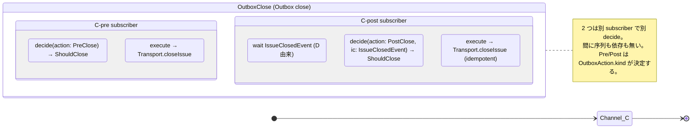
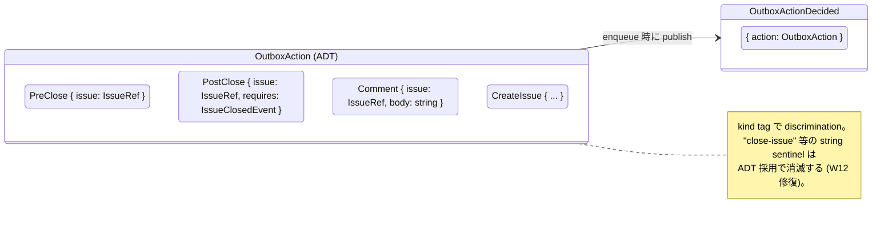
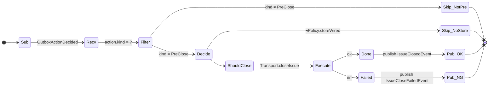
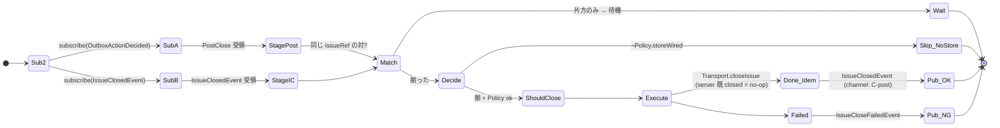
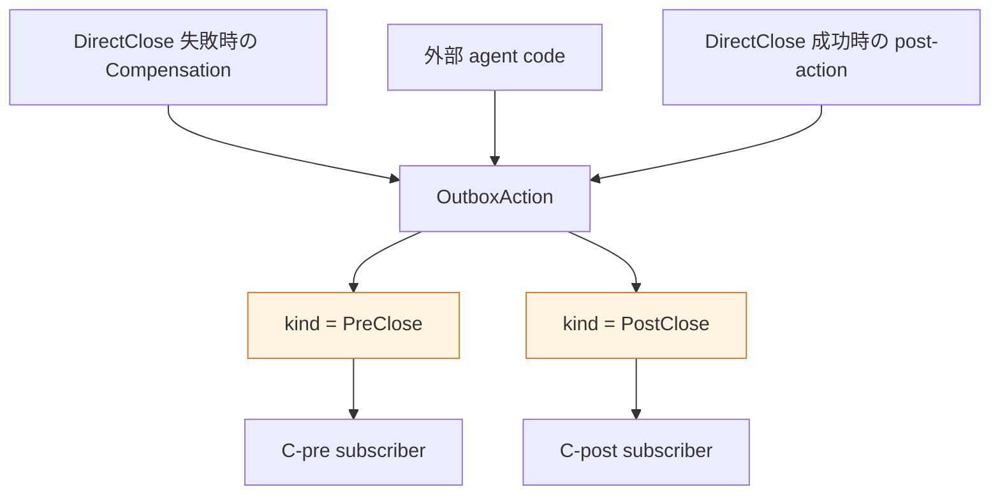

# 42 — OutboxClose channel (C-pre / C-post) — Outbox-driven close

Outbox に enqueue された `OutboxAction.PreClose` / `PostClose` を Outbox
subscriber が拾って close する経路。**Pre / Post は 2 つの独立 sub-channel**
として並列に存在し、互いに序列を持たない。

**Up:** [10-system-overview](../10-system-overview.md),
[30-event-flow](../30-event-flow.md) **Refs:**
[20-state-hierarchy](../20-state-hierarchy.md) (Layer 2 Outbox) **Subscribes:**
`OutboxActionDecided` (Pre, Post)、`IssueClosedEvent` (Post のみ) **Publishes:**
`IssueClosedEvent` / `IssueCloseFailedEvent`

---

## A. Pre / Post の独立性

**Why**:

- W4 (As-Is で C-pre→C-post が serial composite に見えた; critique B3)
  を直す。Pre と Post は **同じ channel の 2 つの subscriber**
  であり、互いに直接の依存は無い。
- Post が Pre を待つことは無い。Post は **`IssueClosedEvent` (D 由来)** を待つ。

---

## B. OutboxAction ADT

**Why**:

- W12 (outbox `action: "close-issue"` が string sentinel) を直す。`OutboxAction`
  ADT に置き換え。`kind` tag で型保証。
- C-pre / C-post の責務分離が **payload の型** で表現される: PreClose は
  requires 不要 / PostClose は `requires: IssueClosedEvent` を payload
  内に保持。

---

## C. C-pre subscriber

**Why**:

- 起動契機が **Outbox の append** であり「workflow phase
  の到達」ではない。DirectClose の internal state を読まない (疎結合)。

---

## D. C-post subscriber

**Why**:

- W5 (As-Is は `S2.11=T` を直接読む) を直す。Post は **2 つの event の合流**
  で発火する。状態 polling を持たない。
- C-pre / D-success の発生順は **どちらでもよい**。subscriber
  が両方を待ち、揃った時点で decide する。

---

## E. trigger / Decision / Transport / Effect 全表

| 観点                    | C-pre                                               | C-post                                                                      |
| ----------------------- | --------------------------------------------------- | --------------------------------------------------------------------------- |
| **trigger (subscribe)** | `OutboxActionDecided`（kind=PreClose）              | `OutboxActionDecided`（kind=PostClose） + `IssueClosedEvent`（同 IssueRef） |
| **Decision 入力**       | `{ action: PreClose, Policy }`                      | `{ action: PostClose, ic: IssueClosedEvent, Policy }`                       |
| **Decision 出力**       | `ShouldClose(IssueRef, C-pre)` ∨ `Skip(reason)`     | `ShouldClose(IssueRef, C-post)` ∨ `Skip(reason)`                            |
| **Transport**           | Boot で凍結された 1 つ                              | 同左                                                                        |
| **Effect**              | Transport 経由で Issue.state=Closed                 | 同左 (server 側既 closed なら冪等)                                          |
| **Publish**             | `IssueClosedEvent(C-pre)` / `IssueCloseFailedEvent` | `IssueClosedEvent(C-post)` / `IssueCloseFailedEvent`                        |
| **Compensation**        | 失敗時 outbox file を保持 (再試行可能性)            | 同左                                                                        |

---

## F. C-pre と C-post の発火対象 (誰が enqueue するか)

**Why**:

- enqueue 側 (Producer) と consume 側 (subscriber) を分離。Producer は consumer
  の存在を知らない。As-Is の「OutboxProcessor が trigger string
  で内部分岐」を、ADT による型分離 + subscriber 分離に置き換え。

---

## G. OutboxClose の責務 (1 行)

> **「Outbox から `PreClose` / `PostClose` を拾って Transport に渡す。Pre と
> Post は別 subscriber。」**

- Pre は Outbox 単独で発火
- Post は Outbox + `IssueClosedEvent` の合流で発火
- どちらも DirectClose の internal state を読まない
- Transport の中身を知らない
