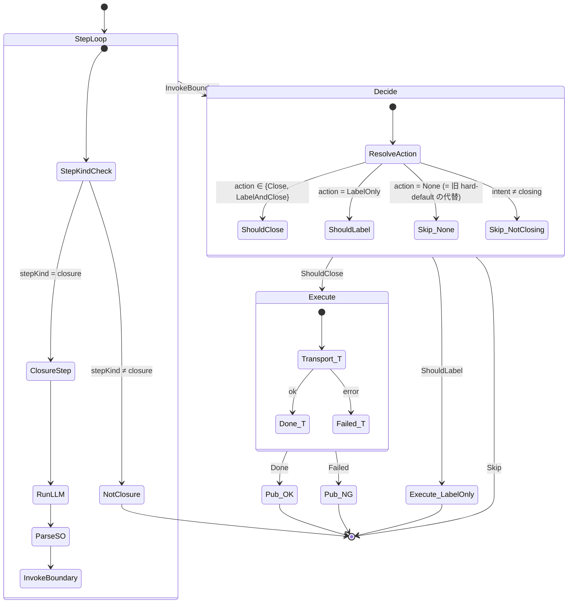
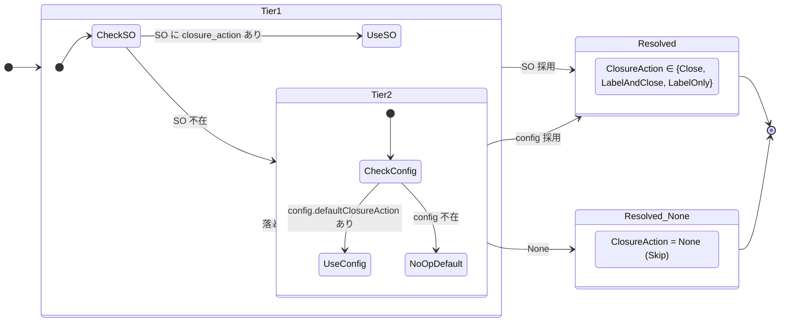
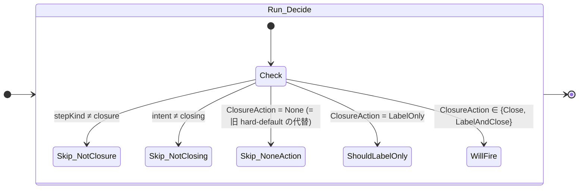

# 43 — BoundaryClose channel (E) — Closure step boundary close

Runner の closure step で boundary hook が発火し、verdict adapter が `Decision`
を返す。execute は **単一 Transport 経由**。`Deno.Command` 直叩きは存在しない。

**Up:** [10-system-overview](../10-system-overview.md),
[30-event-flow](../30-event-flow.md) **Refs:**
[20-state-hierarchy](../20-state-hierarchy.md) **Sibling:**
[41-D](./41-channel-D.md), [42-C](./42-channel-C.md) **Publishes:**
`IssueClosedEvent` / `IssueCloseFailedEvent`

---

## A. State machine



**Why**:

- W2 (V2 が gh 直叩き) を直す。BoundaryClose も DirectClose と同じ Transport
  を経由。Site B (File Transport) では **必ず** Layer 2 mirror のみ書く。
- W3 (hard-default `"close"`) を直す。SO / config 不在時のデフォルトは `None` (=
  Skip_None)。silent close を起こさない。

---

## B. ClosureAction の 2-tier resolve (hard-default を排除)



**Why**:

- W3 (hard-default が `"close"`) を直す。SO / config 両方欠落の場合は **None**
  に倒す (boundary 不発)。「設定が無いなら何もしない」が原則。
- 解決順は SO > config > None の **2-tier + 終端**。「3 tier 目に hard-coded
  close」を排除。

> 注: ここでの `ClosureAction` の `None` は boundary action の値域 (=
> "label/close を起こさない") であり、削除された Transport の `NoOp`
> とは別概念。

---

## C. Skip 条件の整理



**Why**:

- W11 (`github.enabled=false` が 2 役) を直す。**Boot 時の transport 選択 1
  つ**で副作用の有無が決まり、Run 中の switch は持たない。
- W1 (factory が invalid config でも construct) を直す。BoundaryClose は Boot で
  valid config の場合のみ構築される (Transport が `Real`/`File` のいずれか +
  closure step が registry に存在)。silent な hard-close 経路は無くなる。

---

## D. trigger / Decision / Transport / Effect 全表

| 観点                    | 内容                                                                                         |
| ----------------------- | -------------------------------------------------------------------------------------------- |
| **trigger (subscribe)** | `ClosureBoundaryReached` (AgentRuntime 由来。closure step のみ publish。15-dispatch-flow §B) |
| **Decision 入力**       | `{ bnd: ClosureBoundaryReached, intent, closureAction (2-tier resolved), IssueRef, Policy }` |
| **Decision 出力**       | `ShouldClose(IssueRef, E)` ∨ `ShouldLabel` ∨ `Skip(reason)`                                  |
| **Transport**           | Boot で凍結された 1 つ (DirectClose と共通)                                                  |
| **Effect**              | Transport.closeIssue → Layer 1 (Real) ∨ Layer 2 mirror (File)                                |
| **Publish**             | 成功: `IssueClosedEvent(E)` / 失敗: `IssueCloseFailedEvent`                                  |
| **Compensation**        | 失敗時 `Comment(IssueRef, body)` を Outbox に enqueue (idempotent)                           |

**Why**:

- W9 (silent no-op) を直す。Transport が `Failed` を返したら必ず
  `IssueCloseFailedEvent` を publish。catch swallow 不可。
- W10 (Site B で BoundaryClose が実 gh を起動) を直す。BoundaryClose は
  Transport 経由なので File Transport では mirror のみ。

---

## E. BoundaryClose と DirectClose の共通化

```mermaid
flowchart LR
    D[DirectClose]
    E[BoundaryClose]
    T[Transport]

    D -->|execute| T
    E -->|execute| T
    T --> L1[Layer 1 (Real) or Layer 2 mirror (File)]

    D -. publish .-> Bus[CloseEventBus]
    E -. publish .-> Bus

    classDef shared fill:#e0f0e0,stroke:#33aa33;
    class T,Bus shared
```

**Why**:

- DirectClose / E / C は **Transport / Bus を共有** する。Channel ごとに別の
  executor を持たない。
- 同 cycle で D と E が両方 Decision=ShouldClose を返した場合、Transport
  の冪等性 (Issue 既 closed → no-op) でも、両 channel が `IssueClosedEvent` を
  publish する。subscriber は idempotent に書く責務 (重複 publish を 1
  回に丸める必要は無い)。

---

## F. BoundaryClose の責務 (1 行)

> **「closure step で boundary hook の Decision を作って Transport に渡す。直 gh
> 叩きは無い。」**

- DirectClose の Decision を読まない / 干渉しない
- Transport が File なら Layer 2 mirror のみ書く (Site B 整合)
- ClosureAction が None なら何もしない (silent close 不可)
