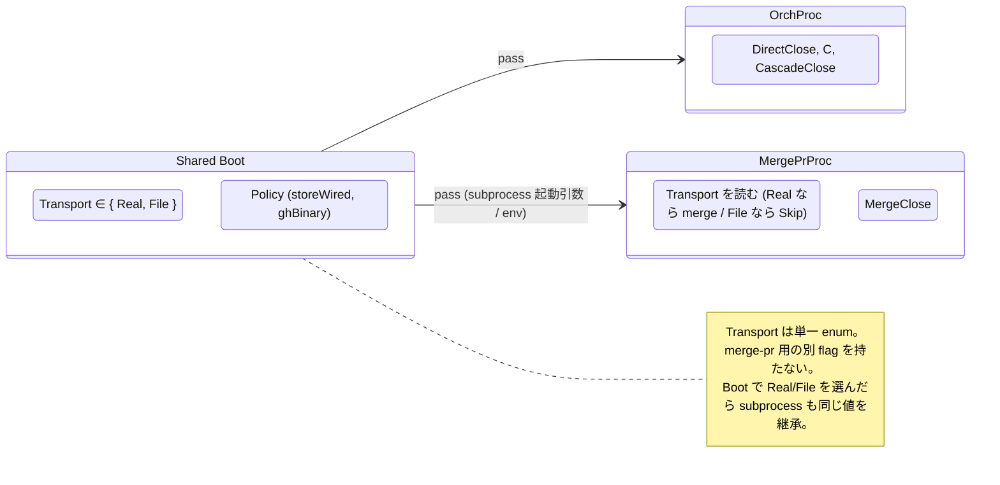
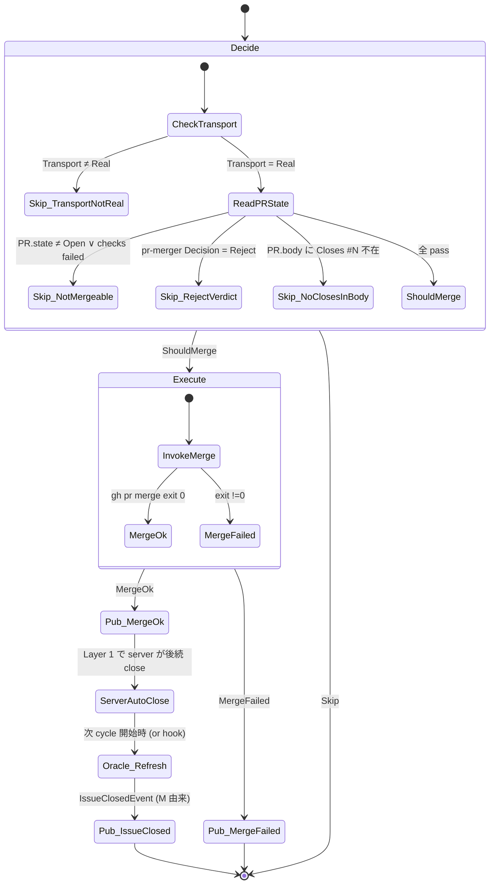

# 44 — MergeClose channel (M) — PR merge → server-side auto-close

`merge-pr` subprocess が `gh pr merge` を実行し、GitHub server が PR body の
`Closes #N` から issue を auto-close する経路。**framework は close
を呼ばない**。Policy は orchestrator と共有。

**Up:** [10-system-overview](../10-system-overview.md),
[30-event-flow](../30-event-flow.md) **Refs:**
[20-state-hierarchy](../20-state-hierarchy.md) (Layer 1 PR.state, PR.body)
**Publishes:** `IssueClosedEvent` (MergeCloseAdapter.refresh で Layer 1 closed
を観測した時点)

---

## A. Boot で共有する Transport



**Why**:

- W6 (orchestrator dryRun と merge-pr `--dry-run` が別 flag) は Transport
  一元化で **wart 自体が消滅**。Run 時の dryRun flag 無し、Boot 時の Transport
  選択のみ。
- merge-pr の起動側 (orchestrator) と被起動側 (merge-pr.ts) の両方が **同じ
  Transport 値** を boot 時に継承する。

---

## B. State machine



**Why**:

- 最初の guard が `Transport = Real` 判定。Transport=File なら **merge
  も発火しない** (test mode の整合性)。これが旧 dryRun の代替で、独立 flag
  は不要。
- Decision 段階で `Skip_NoClosesInBody` を明示。As-Is は「PR は merge されるが
  issue は open」という silent な分岐があった。To-Be は **PR body に Closes #N
  が無いなら MergeClose は Skip** と decide で表現する。
- MergeCloseAdapter.refresh が Layer 1 の closed を観測した時点で
  `IssueClosedEvent(M)` を publish。これにより MergeClose の close も他 channel
  と同じ event 型で扱える (30 §F)。

---

## C. Transport との関係

```mermaid
flowchart LR
    M[MergeClose]
    PRMerge[gh pr merge subprocess]
    Server[GitHub server]
    Oracle[MergeCloseAdapter.refresh]
    Bus[CloseEventBus]

    M --> PRMerge
    PRMerge --> Server : merge
    Server -.auto-close (eventual).-> L1[Layer 1 Issue.state=Closed]
    Oracle --> L1 : 次 read で観測
    Oracle --> Bus : publish IssueClosedEvent(M)

    classDef ext fill:#f0f0f0,stroke:#666;
    class Server,L1 ext
```

**Why**:

- W2 の同類問題: MergeClose は Transport を持たない (executor は GitHub
  server)。代わりに **MergeCloseAdapter.refresh が Bus への bridge** を担う。
- これで全 close 経路が `IssueClosedEvent` で統一される (close source が
  `D / C / E / CascadeClose / U / M` のいずれであっても event 型は 1 つ)。

---

## D. trigger / Decision / Executor / Effect 全表

| 観点                        | 内容                                                                                                |
| --------------------------- | --------------------------------------------------------------------------------------------------- |
| **trigger (decide invoke)** | merge-pr subprocess が CLI 起動した直後                                                             |
| **Decision 入力**           | `{ Transport, PR.state, checks, pr-mergerVerdict, PR.body, Policy }`                                |
| **Decision 出力**           | `ShouldMerge(PRRef)` ∨ `Skip(Transport.NotReal \| NotMergeable \| RejectVerdict \| NoClosesInBody)` |
| **Executor**                | **GitHub server** (`gh pr merge` で merge → server 側 auto-close)                                   |
| **Effect**                  | Layer 1: PR.state=Merged → Issue.state=Closed (eventual)                                            |
| **Publish**                 | merge: 直接 publish しない / close: MergeCloseAdapter.refresh が `IssueClosedEvent(M)` を publish   |
| **Compensation**            | 失敗時 retry は CI に委ねる。MergeClose は 1 回 try のみ                                            |

**Why**:

- 1 つの subprocess は 1 回の Decision を作る
  (再試行は外側のスケジューラ)。Channel が retry loop
  を内側に持たないことで責務を狭める。

---

## E. 他 channel との独立性

```mermaid
flowchart LR
    M[MergeClose]
    DCE[DirectClose / C / E / CascadeClose / U]
    Bus[CloseEventBus]

    M -.no direct call.-> DCE
    M --> Bus : publish via Oracle
    DCE --> Bus

    Bus -.no cascade backwards.-> M

    note1[MergeClose は Bus を読み書きするが<br/>他 channel の Decision を一切読まない]
    note2[他 channel が MergeClose を起動することは無い<br/>(merge-pr は CLI から起動)]

    M --> note1
    DCE --> note2

    classDef sep fill:#f0f0f0,stroke:#666;
    class note1,note2 sep
```

**Why**:

- MergeClose は **読み専用に CloseEventBus を流す** (publish のみ、subscribe
  無し)。他 channel が M を trigger することも無い。
- この独立性により、M の Policy が orchestrator から独立して走っても、Bus
  上では同じ `IssueClosedEvent` で同期できる。

---

## F. MergeClose の責務 (1 行)

> **「PR が merge 可能なら 1 回だけ merge し、後続の Layer 1 closed を Oracle
> 経由で event 化する。framework は close を呼ばない。」**

- 1 subprocess = 1 Decision
- close は server が行う (framework は merge までしか責任を持たない)
- Transport=Real のみ発火 (File なら Skip)。orchestrator と同一の Transport
  を継承
