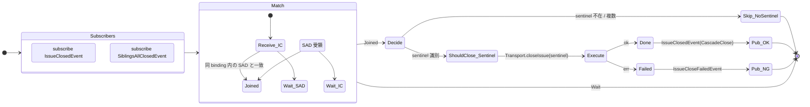
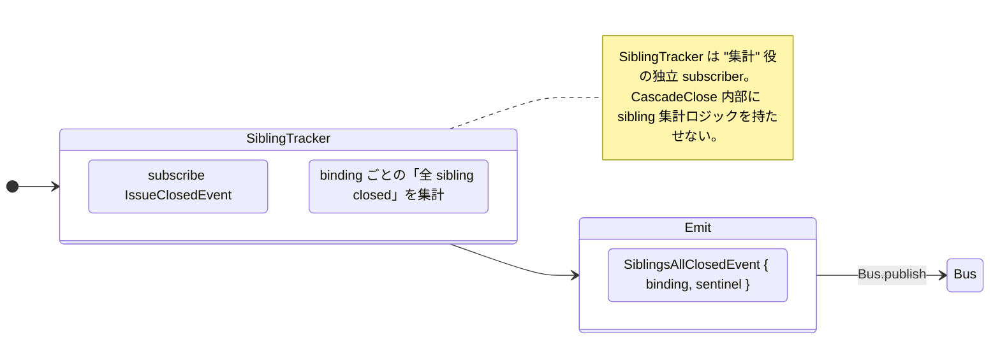
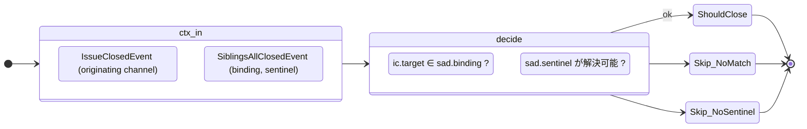
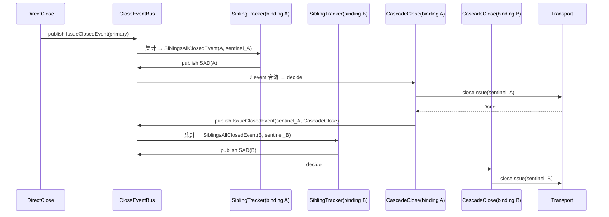

# 45 — CascadeClose channel — Sentinel close (event-driven)

`IssueClosedEvent` と `SiblingsAllClosedEvent` の 2 つの event を subscribe
し、同 cycle 内で sentinel issue の close decision を作る。**次 cycle
待ちは無い**。

**Up:** [10-system-overview](../10-system-overview.md),
[30-event-flow](../30-event-flow.md) **Refs:**
[20-state-hierarchy](../20-state-hierarchy.md) **Subscribes:**
`IssueClosedEvent`, `SiblingsAllClosedEvent` **Publishes:** `IssueClosedEvent`
(channel: CascadeClose)

---

## A. Event-driven 構造 (As-Is の polling 撤廃)

**Why**:

- W5 (As-Is は次 cycle で D を再発火) を直す。CascadeClose は **2 event の合流**
  で同 cycle 内に decide / execute する。
- As-Is の「label 書換 → 次 cycle で sentinel が terminal phase に到達 →
  DirectClose 再発火」という間接連鎖を、**直接の Decision** に置き換える。

---

## B. SiblingsAllClosedEvent の生成

**Why**:

- 集計 (sibling 全 done) と decide (sentinel close) を 2 つの subscriber
  に分割。As-Is で 1 つの `orchestrator.ts` 内に集約していたロジックを 2
  component に分ける。
- これにより CascadeClose は **「2 event 合流時の decide」** 1
  個に責務を絞れる。

---

## C. Decision 入力 / 出力

**Why**:

- 入力は **2 つの event payload** だけ。channel-internal volatile state
  を読まない。
- Skip 理由が ADT で網羅されており、silent に「何も起きない」経路は存在しない。
- 副作用の有無は execute 時の Transport 選択に閉じ込められるため、decide は環境
  flag を読まない。

---

## D. trigger / Decision / Transport / Effect 全表

| 観点                        | 内容                                                                    |
| --------------------------- | ----------------------------------------------------------------------- |
| **trigger (decide invoke)** | `IssueClosedEvent` ∧ `SiblingsAllClosedEvent` の合流                    |
| **Decision 入力**           | `{ ic: IssueClosedEvent, sad: SiblingsAllClosedEvent }`                 |
| **Decision 出力**           | `ShouldClose(sentinel, CascadeClose)` ∨ `Skip(reason)`                  |
| **Transport**               | Boot で凍結された 1 つ                                                  |
| **Effect**                  | Transport.closeIssue(sentinel) → Layer 1 (Real) ∨ Layer 2 mirror (File) |
| **Publish**                 | `IssueClosedEvent(CascadeClose)` ∨ `IssueCloseFailedEvent`              |
| **Compensation**            | 失敗時 `Comment(sentinel, body)` を Outbox に enqueue                   |

**Why**:

- CascadeClose は他 channel と **同じ Transport** を使う。専用 path を持たない。
- `IssueClosedEvent(CascadeClose)` を再 publish するため、**多段 cascade**
  (sentinel A の close で sentinel B が trigger) も同じ仕組みで自然に成立。

---

## E. 多段 cascade

**Why**:

- 多段 cascade を **同じ event の連鎖** で表現。As-Is の「次 cycle で D
  再発火」が 1 cycle 内で完結する。
- 無限ループは `IssueClosedEvent` の重複 publish を SiblingTracker
  が冪等に処理することで防がれる (同じ IssueRef を 2 度集計しない)。

---

## F. CascadeClose の責務 (1 行)

> **「IssueClosedEvent と SiblingsAllClosedEvent の合流で sentinel close
> decision を 1 つ作る。集計は SiblingTracker、close は Transport。」**

- 集計ロジックを内側に持たない (SiblingTracker に分離)
- 次 cycle 待ちなし
- Transport は他 channel と共通
