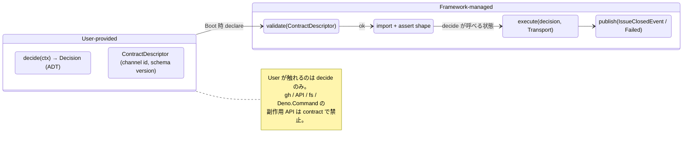
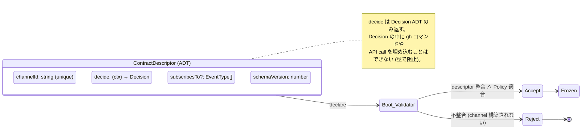
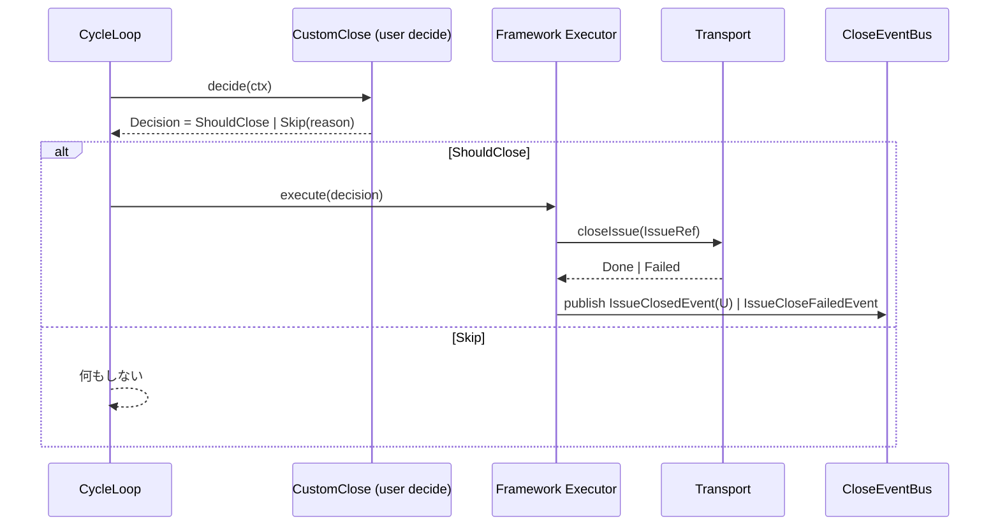
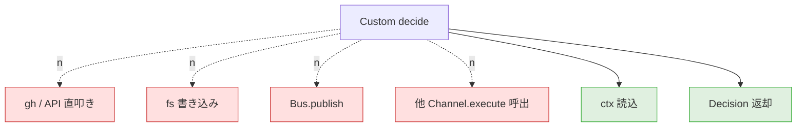
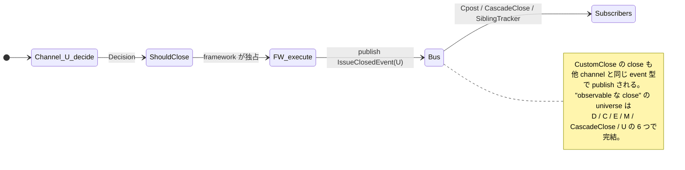

# 46 — CustomClose channel (U) — Custom handler with declared contract

User が `decide()` のみ実装し、`execute()` は framework が **必ず** Transport
で行う。Custom code が gh / API を直叩きする経路は存在しない。副作用の有無は
Boot 時の Transport 選択 (Real / File) に従う。

**Up:** [10-system-overview](../10-system-overview.md),
[30-event-flow](../30-event-flow.md) **Refs:**
[20-state-hierarchy](../20-state-hierarchy.md) **Publishes:** `IssueClosedEvent`
(channel: U) / `IssueCloseFailedEvent`

---

## A. Custom contract の境界

**Why**:

- W7 (Custom が gh 直叩き / framework から observable 不可) を直す。User code は
  **Decision を返すだけ** の純粋関数として扱う。副作用は framework 側で
  Transport を経由する。
- Custom が Transport を bypass する余地が無くなる。

---

## B. ContractDescriptor (Boot 時 declare)

**Why**:

- W1 (factory が invalid config でも構築) と同型の問題を Custom にも適用。**Boot
  で contract が満たされなければ channel 不在**。
- `schemaVersion` で将来の breaking change を Boot 時に検出可能。

---

## C. Run 時の decide / execute 分離

**Why**:

- W7 (Custom が gh / API を直叩きできてしまう) を直す。User code は Decision
  を返すのみで、execute は framework が独占する Transport を経由する。test 環境
  (Transport=File) では User 実装に依存せず副作用が無い。

---

## D. trigger / Decision / Transport / Effect 全表

| 観点                        | 内容                                                                       |
| --------------------------- | -------------------------------------------------------------------------- |
| **trigger (decide invoke)** | CycleLoop が ContractDescriptor.subscribesTo に従って呼ぶ                  |
| **Decision 入力**           | `{ ctx (channel-defined) }`                                                |
| **Decision 出力**           | `ShouldClose(IssueRef, U)` ∨ `Skip(reason)` (ADT)                          |
| **Transport**               | Boot で凍結された 1 つ (DirectClose / BoundaryClose と共通)                |
| **Effect**                  | Transport.closeIssue → Layer 1 (Real) ∨ Layer 2 mirror (File)              |
| **Publish**                 | `IssueClosedEvent(U)` ∨ `IssueCloseFailedEvent`                            |
| **Compensation**            | 失敗時 `Comment(IssueRef, body)` を Outbox に enqueue (framework 側で実行) |

**Why**:

- 全列が他 channel と同じ shape。Custom も
  `Decision → Transport → Result → Event` の uniform interface に従う。
- W2 (V2 直叩き) と同型の問題を Custom にも適用。Custom が gh を呼ぶことは
  **構造的に不可能** になる。

---

## E. Custom が「できないこと」(契約による禁止)

**Why**:

- W7 (Custom が framework から observable 不可)
  を直す。「**できないこと**」を契約レベルで明示し、副作用は framework
  が独占する。
- これにより Custom 経由の close も `IssueClosedEvent` として観測可能になる
  (As-Is で「framework が観測できる close = D / C / E / cascade」「観測できない
  = U / 手動」だった境界を、U を観測側に移す)。

---

## F. 観測可能性の担保

**Why**:

- 全 close 経路が `IssueClosedEvent` を publish する単一規約により、「framework
  が観測できない close」 (As-Is U の特徴) が無くなる。手動 close (`E_HUMAN.3`)
  は依然 framework 管轄外だが、MergeCloseAdapter.refresh が次 read 時に Layer 1
  closed を検出すれば bridge event として扱える。

---

## G. CustomClose の責務 (1 行)

> **「ContractDescriptor.decide で Decision を返すだけ。Transport / publish は
> framework が独占する。」**

- decide は pure function (副作用なし)
- gh / API / fs / Bus / 他 Channel への副作用は契約で禁止
- 副作用の有無は Boot 時の Transport 選択に従う (User 実装に依存しない)
