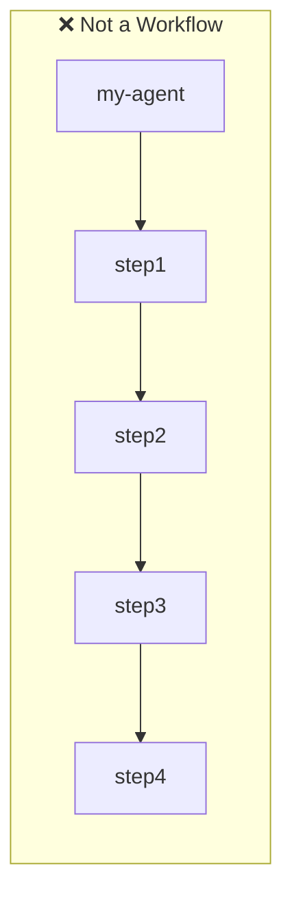
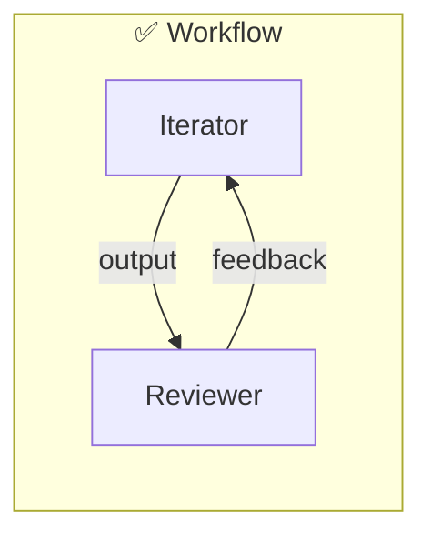

[English](../en/00-1-concepts.md) | [日本語](../ja/00-1-concepts.md)

# Agent Configuration Concepts

Before setting up an Agent, understand **what** you are configuring and **why**.

## What is an Agent?

An Agent is a combination of **configuration (JSON)** and **prompts
(Markdown)**.

```
Agent = Configuration + Prompts
        (what to do)   (how to instruct)
```

No code is required to define an Agent. Configuration files control behavior,
and prompts guide the AI.

## What is a Workflow?

**Define Agents based on the roles and processes your project needs.** An Agent
represents a distinct responsibility — not a step in a sequence. A Workflow
emerges when multiple Agents with different roles collaborate.





The Iterator does the work. The Reviewer checks the work. The **loop between
independent roles** is what creates quality — just as a writer cannot
effectively proofread their own text.

### Minimum Viable Workflow

At least **two Agents** with complementary roles:

```json
{
  "registries": {
    "iterator": ".agent/iterator/registry.json",
    "reviewer": ".agent/reviewer/registry.json"
  }
}
```

## File Structure Overview

```
.agent/{agent-name}/
├── agent.json              ← What kind of Agent is this?
├── steps_registry.json     ← How does it transition between steps?
├── schemas/                ← What output format is expected?
│   └── step_outputs.schema.json
└── prompts/                ← What instructions are given?
    ├── system.md
    └── steps/{c2}/{c3}/f_default.md
```

### Why This Structure?

| File                  | Purpose                     | Why Separate?                             |
| --------------------- | --------------------------- | ----------------------------------------- |
| `agent.json`          | Agent identity and behavior | Change behavior without touching prompts  |
| `steps_registry.json` | Step flow and transitions   | Modify flow logic independently           |
| `schemas/`            | Output validation           | Ensure AI responses match expected format |
| `prompts/`            | AI instructions             | Iterate on prompts without config changes |

## Core Concepts

### 1. completionType: When Does the Agent Stop?

The most important decision when creating an Agent.

| Type              | Use When...                                                             | Example                                                                               |
| ----------------- | ----------------------------------------------------------------------- | ------------------------------------------------------------------------------------- |
| `externalState`   | Agent should stop when external state changes (Issue closed, PR merged) | Issue-driven development (`github.defaultClosureAction` controls close vs label-only) |
| `iterationBudget` | Agent should stop after N iterations                                    | Fixed-scope tasks                                                                     |
| `keywordSignal`   | Agent should stop when it says a specific word                          | Simple completion detection                                                           |
| `stepMachine`     | Agent follows a state machine with explicit transitions                 | Complex multi-phase workflows                                                         |

**Decision Guide:** Does completion depend on external state? ->
`externalState`. Fixed iteration count? -> `iterationBudget`. Simple keyword
signal? -> `keywordSignal`. Otherwise -> `stepMachine`.

### 2. C3L Path Structure: Why Three Levels?

Prompts are organized in a 3-level hierarchy called C3L:

```
prompts/{c1}/{c2}/{c3}/f_{edition}.md
         │     │    │
         │     │    └─ Target (what object)
         │     └─ Action (what verb)
         └─ Domain (what area)
```

| Level       | Purpose                   | Example                   | Benefit               |
| ----------- | ------------------------- | ------------------------- | --------------------- |
| c1 (Domain) | Group related actions     | `git`, `code`, `test`     | Organize by concern   |
| c2 (Action) | What operation to perform | `create`, `review`, `fix` | Reuse across targets  |
| c3 (Target) | What to act upon          | `issue`, `branch`, `file` | Specific instructions |

**Example resolution:**

```
Command: climpt-git create issue
Path:    prompts/git/create/issue/f_default.md
```

### 3. Step Kinds: Why Three Types?

Agents use three types of steps, each with a specific responsibility:

| Kind             | Steps                         | Responsibility    | Allowed Intents                      |
| ---------------- | ----------------------------- | ----------------- | ------------------------------------ |
| **Work**         | `initial.*`, `continuation.*` | Produce output    | `next`, `repeat`, `jump`, `handoff`  |
| **Verification** | `verification.*`              | Validate output   | `next`, `repeat`, `jump`, `escalate` |
| **Closure**      | `closure.*`                   | Decide completion | `closing`, `repeat`                  |

**Why separate them?**

- **Work steps** cannot say "I'm done" -- prevents premature completion
- **Verification steps** validate before closing -- ensures quality
- **Closure steps** are the only ones that can end the flow -- clear completion
  authority

### 4. Structured Output: Why Schema Validation?

Every step must define an output schema. The AI's response is validated against
this schema.

| Without Schema                    | With Schema                            |
| --------------------------------- | -------------------------------------- |
| AI might return unexpected format | Format is guaranteed                   |
| Intent extraction is unreliable   | `next_action.action` is always present |
| Flow breaks on malformed output   | Invalid output is caught immediately   |

**Minimum required structure:**

```json
{
  "next_action": {
    "action": "next",    ← Required: tells Agent what to do next
    "reason": "..."      ← Required: explains the decision
  }
}
```

## Configuration Files Explained

### app.yml: Application-Level Settings

Defines where prompts and schemas are located.

```yaml
working_dir: ".agent/climpt"
app_prompt:
  base_dir: "prompts" # Where to find prompt files
app_schema:
  base_dir: "schema" # Where to find schema files
```

**When to customize:**

- Different projects need different prompt locations
- Team shares prompts via a common directory

### user.yml: User-Level Settings

Customizes behavior per user or environment.

```yaml
options:
  destination:
    prefix: "output/git" # Prepend to all output paths
params:
  two:
    directiveType:
      pattern: "^(create|update)$" # Validate c2 values
```

**When to customize:**

- Enforce naming conventions
- Restrict available commands per domain

### registry_config.json: Multi-Agent Management

Maps agent names to their registry files.

```json
{
  "registries": {
    "climpt": ".agent/climpt/registry.json",
    "iterator": ".agent/iterator/registry.json"
  }
}
```

**When to customize:**

- Managing multiple agents in one project
- Sharing agents across projects

## Next Steps

| Goal                      | Document                                                          |
| ------------------------- | ----------------------------------------------------------------- |
| Set up Climpt             | [02-climpt-setup.md](./02-climpt-setup.md)                        |
| Create an Agent           | [Agent Quickstart](../../../agents/docs/builder/01_quickstart.md) |
| Understand config details | [06-config-files.md](./06-config-files.md)                        |
| Learn prompt structure    | [08-prompt-structure.md](./08-prompt-structure.md)                |
