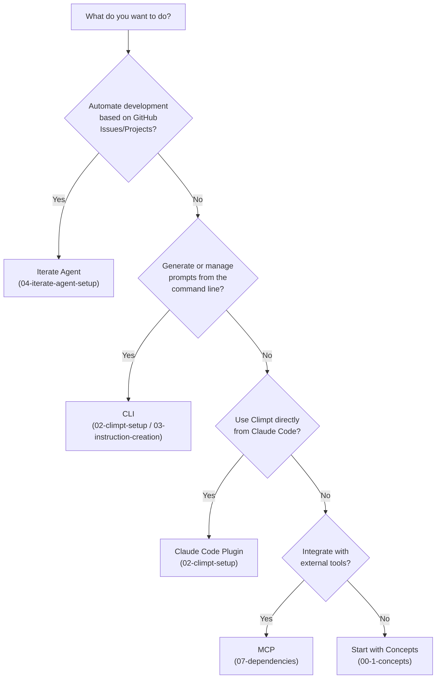

[English](../en/10-getting-started-guide.md) |
[日本語](../ja/10-getting-started-guide.md)

# 10. Getting Started Guide

This guide helps you choose the right approach for your use case and get your
first execution running in minutes.

---

## 10.1 What Do You Want to Do?

Use the decision tree below to find the best starting point for your goals.



| Goal                                            | Approach                                                                                             | Guide                                                                                            |
| ----------------------------------------------- | ---------------------------------------------------------------------------------------------------- | ------------------------------------------------------------------------------------------------ |
| Automated development driven by Issues/Projects | **Iterate Agent** -- autonomous loop that fetches requirements, delegates work, and verifies results | [04-iterate-agent-setup](./04-iterate-agent-setup.md)                                            |
| Generate and manage prompts via CLI             | **CLI** -- run `climpt` commands to create, build, and output prompts                                | [02-climpt-setup](./02-climpt-setup.md), [03-instruction-creation](./03-instruction-creation.md) |
| Use Climpt inside Claude Code                   | **Claude Code Plugin** -- install the `climpt-agent` plugin for in-editor prompt access              | [02-climpt-setup](./02-climpt-setup.md)                                                          |
| Connect to external tools                       | **MCP** -- Model Context Protocol integration for tool interoperability                              | [07-dependencies](./07-dependencies.md)                                                          |

---

## 10.2 Quick Start by Use Case

Three scenarios to get your first execution in about 5 minutes each.

### Scenario A: Generate a Prompt with the CLI

Install, initialize, and generate your first prompt.

```bash
# 1. Initialize Climpt in your project
deno run -A jsr:@aidevtool/climpt init

# 2. Verify initialization
ls .agent/climpt/config/

# 3. Display help to see available commands
deno run -A jsr:@aidevtool/climpt --help

# 4. Generate a prompt (example: create an issue prompt)
deno run -A jsr:@aidevtool/climpt to project
```

**Expected output**: A Markdown prompt is printed to stdout, ready to be piped
or copied.

### Scenario B: Use the Claude Code Plugin

Install the plugin and use Climpt commands directly in Claude Code.

```bash
# 1. Initialize Climpt in your project (if not done)
deno run -A jsr:@aidevtool/climpt init
```

Then in Claude Code:

```
# 2. Add the Climpt marketplace
/plugin marketplace add tettuan/climpt

# 3. Install the plugin
/plugin install climpt-agent

# 4. Verify installation
/plugin list
```

**Expected result**: `climpt-agent` appears in the plugin list and the
`delegate-climpt-agent` Skill becomes available.

### Scenario C: Automate an Issue with Iterate Agent

Set up Iterate Agent and let it process a GitHub Issue autonomously.

```bash
# 1. Prerequisites: ensure gh is authenticated
gh auth status

# 2. Initialize Climpt (if not done)
deno run -A jsr:@aidevtool/climpt init

# 3. Install the Claude Code plugin (required for Iterate Agent)
# In Claude Code: /plugin marketplace add tettuan/climpt
# In Claude Code: /plugin install climpt-agent

# 4. Initialize Iterate Agent
deno run -A jsr:@aidevtool/climpt/agents/iterator --init

# 5. Run against a specific Issue (replace 123 with your Issue number)
deno run -A jsr:@aidevtool/climpt/agents/iterator --issue 123
```

**Expected result**: The agent fetches the Issue, delegates tasks, and iterates
until the Issue is resolved. A performance report is displayed on completion.

---

## 10.3 Setup Verification Checklist

Confirm each item before proceeding to your chosen workflow.

### Required for All Workflows

- [ ] **Deno installed**

  ```bash
  deno --version
  ```

  Expected: `deno 2.x.x` (2.5 or later)

- [ ] **Climpt initialized**

  ```bash
  ls .agent/climpt/config/
  ```

  Expected: `default-app.yml`, `registry_config.json`

### Required for Iterate Agent

- [ ] **GitHub CLI installed and authenticated**

  ```bash
  gh auth status
  ```

  Expected: `Logged in to github.com as <your-username>`

- [ ] **Git repository with GitHub remote**

  ```bash
  git remote -v
  ```

  Expected: an `origin` remote pointing to `github.com`

- [ ] **Iterate Agent initialized**

  ```bash
  ls agents/iterator/config.json
  ```

  Expected: `config.json` exists

- [ ] **Claude Code plugin installed**

  In Claude Code:

  ```
  /plugin list
  ```

  Expected: output contains `climpt-agent`

### Required for MCP Integration

- [ ] **MCP configuration present**

  ```bash
  ls .agent/climpt/config/
  ```

  Expected: MCP-related configuration files exist

---

## 10.4 Next Steps Map

After completing your first execution, choose your next learning path based on
your goals.

| Your Goal                            | Next Guide                                                    |
| ------------------------------------ | ------------------------------------------------------------- |
| Create custom instructions (prompts) | [03-instruction-creation](./03-instruction-creation.md)       |
| Set up and run Iterate Agent         | [04-iterate-agent-setup](./04-iterate-agent-setup.md)         |
| Understand the architecture          | [05-architecture](./05-architecture.md)                       |
| Deep dive into configuration files   | [06-config-files](./06-config-files.md)                       |
| Learn about dependencies and MCP     | [07-dependencies](./07-dependencies.md)                       |
| Understand prompt structure and C3L  | [08-prompt-structure](./08-prompt-structure.md)               |
| Create your own custom Agent         | [13-agent-creation-tutorial](./13-agent-creation-tutorial.md) |

---

## Related Documentation

- [Overview](./00-overview.md) -- Guide structure and full table of contents
- [Concepts](./00-1-concepts.md) -- Agent, Runner, Workflow fundamentals
- [Prerequisites](./01-prerequisites.md) -- Deno and gh CLI installation

---

## Support

If you encounter issues, please create an Issue:
https://github.com/tettuan/climpt/issues
