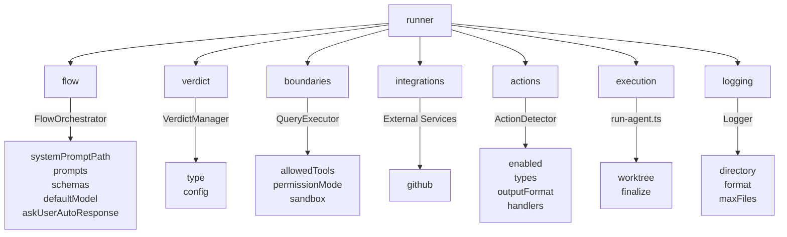
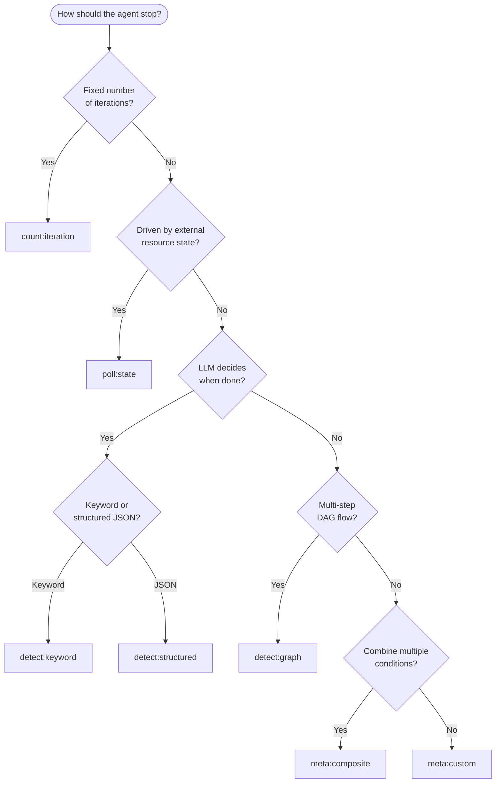

[English](../en/11-runner-reference.md) | [日本語](../ja/11-runner-reference.md)

# 11. Runner Configuration Reference

Complete reference for the `runner.*` namespace in `agent.json`. All fields,
types, defaults, and validation rules are derived from the schema
(`agents/schemas/agent.schema.json`), defaults (`agents/config/defaults.ts`),
and validator (`agents/config/validator.ts`).

---

## 11.1 Overview

The `runner` object is a required top-level key in every `agent.json`. It
controls how the Agent Runner executes an agent. The namespace is divided into
seven sub-groups, each owned by a distinct runtime module:



| Sub-group    | Required | Runtime Owner     | Purpose                          |
| ------------ | -------- | ----------------- | -------------------------------- |
| flow         | Yes      | FlowOrchestrator  | Prompt resolution, model, schema |
| verdict      | Yes      | VerdictManager    | Run completion logic             |
| boundaries   | Yes      | QueryExecutor     | Tool/permission constraints      |
| integrations | No       | External services | GitHub integration               |
| actions      | No       | ActionDetector    | Action block detection           |
| execution    | No       | run-agent.ts      | Worktree and finalize settings   |
| logging      | No       | Logger            | Log output configuration         |

---

## 11.2 runner.flow

Controls prompt loading, model selection, and schema inspection.

| Field               | Type    | Required | Default                 | Description                                                                                                                     |
| ------------------- | ------- | -------- | ----------------------- | ------------------------------------------------------------------------------------------------------------------------------- |
| systemPromptPath    | string  | Yes      | --                      | Path to system prompt file, relative to `.agent/{name}/`.                                                                       |
| prompts.registry    | string  | Yes      | `"steps_registry.json"` | Path to the steps registry JSON file.                                                                                           |
| prompts.fallbackDir | string  | Yes      | `"prompts"`             | Fallback directory for prompt files when registry lookup fails.                                                                 |
| schemas.base        | string  | No       | --                      | Base directory for JSON schemas used in schema inspection.                                                                      |
| schemas.inspection  | boolean | No       | --                      | Enable schema inspection mode.                                                                                                  |
| defaultModel        | string  | No       | --                      | Default LLM model for all steps. Enum: `"sonnet"`, `"opus"`, `"haiku"`. Resolution order: step.model > defaultModel > `"opus"`. |
| askUserAutoResponse | string  | No       | --                      | Auto-response for AskUserQuestion tool. When set, the agent responds automatically instead of waiting for user input.           |

**Note:** `prompts.registry` and `prompts.fallbackDir` are marked required in
the schema. If omitted from your `agent.json`, `applyDefaults()` fills them with
the values shown above.

---

## 11.3 runner.verdict

Determines how and when the agent run ends.

### 11.3.1 verdict.type

Eight verdict types, following a `category:variant` naming convention:

| Type                | Category | Purpose                         | Required config             | Description                                                   |
| ------------------- | -------- | ------------------------------- | --------------------------- | ------------------------------------------------------------- |
| `count:iteration`   | count    | Simple iteration limit          | `maxIterations`             | Completes after N iterations.                                 |
| `count:check`       | count    | Check-count limit               | `maxChecks`                 | Completes after N status checks.                              |
| `poll:state`        | poll     | External state polling          | _(runtime parameters)_      | Polls an external resource (e.g., GitHub Issue) for state.    |
| `detect:keyword`    | detect   | Keyword detection in LLM output | `verdictKeyword`            | Completes when the LLM outputs a specific keyword.            |
| `detect:structured` | detect   | Structured output detection     | `signalType`                | Completes when the LLM outputs a specific JSON action block.  |
| `detect:graph`      | detect   | DAG-based step transitions      | _(registryPath, entryStep)_ | Completes when the step state machine reaches a terminal.     |
| `meta:composite`    | meta     | Multiple conditions combined    | `operator`, `conditions`    | Combines multiple verdict conditions with and/or/first logic. |
| `meta:custom`       | meta     | Custom handler                  | `handlerPath`               | Delegates to an external ESM module.                          |

**Default:** If `verdict.type` is omitted, `applyDefaults()` sets it to
`"count:iteration"` with `maxIterations: 10`.

### 11.3.2 verdict.type Selection Flowchart



### 11.3.3 verdict.config

Configuration fields for each verdict type. Fields are validated at load time by
`validateVerdictConfig()` in `validator.ts`.

| Field          | Type                    | Used by             | Required | Description                                                                                                                                                   |
| -------------- | ----------------------- | ------------------- | -------- | ------------------------------------------------------------------------------------------------------------------------------------------------------------- |
| maxIterations  | number (min: 1)         | `count:iteration`   | Yes      | **Meaning depends on verdict type.** For `count:iteration`: completion threshold. For all others: safety limit (see [11.3.4](#1134-maxiterations-semantics)). |
| maxChecks      | number (min: 1)         | `count:check`       | Yes      | Number of status checks to perform.                                                                                                                           |
| verdictKeyword | string                  | `detect:keyword`    | Yes      | Keyword that signals completion when found in LLM output.                                                                                                     |
| signalType     | string                  | `detect:structured` | Yes      | Action block type to detect in LLM output.                                                                                                                    |
| requiredFields | object \| array         | `detect:structured` | No       | Fields that must exist in the detected signal. Object: key-value match. Array: field name existence.                                                          |
| resourceType   | enum                    | `poll:state`        | No       | Resource being monitored: `"github-issue"`, `"github-project"`, `"file"`, `"api"`.                                                                            |
| targetState    | string \| object        | `poll:state`        | No       | Target state to match for completion.                                                                                                                         |
| registryPath   | string                  | `detect:graph`      | No       | Path to steps registry for the state machine.                                                                                                                 |
| entryStep      | string                  | `detect:graph`      | No       | Entry step ID for the state machine.                                                                                                                          |
| operator       | enum                    | `meta:composite`    | Yes      | Logical operator: `"and"`, `"or"`, `"first"`.                                                                                                                 |
| conditions     | array of {type, config} | `meta:composite`    | Yes      | Array of sub-verdict conditions. Each element has its own `type` and `config`.                                                                                |
| handlerPath    | string                  | `meta:custom`       | Yes      | Path to an ESM module exporting a custom verdict handler.                                                                                                     |

### 11.3.4 maxIterations Semantics

> **Warning:** The meaning of `maxIterations` depends on the verdict type.

| Context                        | Meaning                                                                                    |
| ------------------------------ | ------------------------------------------------------------------------------------------ |
| `count:iteration` verdict type | **Completion threshold.** The run completes when this count is reached.                    |
| All other verdict types        | **Safety ceiling.** If the verdict never fires, the run is forcibly stopped at this count. |

Default value from `AGENT_LIMITS.DEFAULT_MAX_ITERATIONS`: **10**.

When `maxIterations` is not specified in the verdict config and the type is not
`count:iteration`, the runner uses `AGENT_LIMITS.FALLBACK_MAX_ITERATIONS`
(**20**) as the safety ceiling. Verdict handlers internally use
`AGENT_LIMITS.VERDICT_FALLBACK_MAX_ITERATIONS` (**100**) as the absolute
maximum.

### 11.3.5 Prompt Resolution Priority

The Runner tries two resolution paths in order. The first non-null result is
used.

- **Path A** -- C3L file resolution via `stepPromptResolver` / `closureAdapter`
- **Path B** -- Verdict handler resolution, then `fallbackKey` lookup

```
Iteration 1:
  +-- Path A: stepPromptResolver.resolve()
  |   +-- Success -> use content
  +-- Path B: verdictHandler.buildInitialPrompt()
      +-- C3L resolve -> fallbackKey lookup

Iteration > 1:
  +-- Path A: closureAdapter.tryClosureAdaptation()
  |   +-- Success -> use content
  +-- Path A: stepPromptResolver.resolve()
  |   +-- Success -> use content
  +-- Path B: verdictHandler.buildContinuationPrompt()
      +-- C3L resolve -> fallbackKey lookup
```

#### `poll:state` Considerations

Path B injects UV variables automatically for `poll:state`:

| Variable           | Value             | Notes                          |
| ------------------ | ----------------- | ------------------------------ |
| `issue`            | Issue number      | From `--issue` CLI argument    |
| `repository`       | Repository path   | Empty string if not configured |
| `iteration`        | Current iteration | Continuation only              |
| `previous_summary` | Formatted summary | Continuation only              |

Empty UV values (e.g., `--uv-repository=`) cause `breakdown` to reject C3L
resolution. The `fallbackKey` must be correctly configured as the final safety
net.

> This is why `poll:state` agents fail when `fallbackKey` is wrong, while
> `count:iteration` agents (Path A only, no UV injection) are unaffected.

> **Validation**: The `--validate` flag only checks UV variables sourced from
> CLI parameters (agent.json `parameters`). Runtime-injected variables like
> `iteration` and `previous_summary` are not validated -- they are guaranteed by
> the runner at execution time.

### 11.3.6 Step ID Prefix Substitution

When using `count:iteration` verdict type, the runner automatically substitutes
step ID prefixes:

- `initial.*` steps are used for the first iteration
- For subsequent iterations, `initial.X` is automatically routed to
  `continuation.X`

This substitution occurs in two places:

1. **Default transition** (workflow-router): When no explicit transition is
   configured, `initial.X` defaults to `continuation.X`
2. **Verdict handler** (iteration-budget): The verdict handler resolves
   `initial.X` entry steps to `continuation.X` for re-entry

**Important implications:**

- Both `initial.X` and `continuation.X` must exist in `steps_registry.json`
- Both steps should declare the same `uvVariables` (CLI parameters are available
  to both)
- Renaming or deleting `continuation.X` will cause runtime errors
- The `--validate` flag checks for UV variable consistency between paired steps

---

## 11.4 runner.boundaries

Controls tool access and permission behavior.

| Field          | Type     | Required | Default  | Description                                     |
| -------------- | -------- | -------- | -------- | ----------------------------------------------- |
| allowedTools   | string[] | Yes      | `["*"]`  | Tools the agent is allowed to use. `"*"` = all. |
| permissionMode | enum     | Yes      | `"plan"` | Claude permission mode (see below).             |
| sandbox        | object   | No       | --       | Fine-grained sandbox configuration.             |

### 11.4.1 permissionMode

| Value               | Description                                                                 |
| ------------------- | --------------------------------------------------------------------------- |
| `default`           | Normal mode with default permissions. User is prompted for each action.     |
| `plan`              | Plan mode (read-only exploration). The agent can read but not write.        |
| `acceptEdits`       | Auto-accept file edits. Write operations proceed without user confirmation. |
| `bypassPermissions` | Bypass all permission checks. Full autonomy, no confirmation prompts.       |

### 11.4.2 sandbox

| Field                   | Type     | Default     | Description                                                               |
| ----------------------- | -------- | ----------- | ------------------------------------------------------------------------- |
| enabled                 | boolean  | `true`      | Enable sandbox mode.                                                      |
| network.mode            | enum     | `"trusted"` | Network access: `"trusted"` (pre-approved domains), `"none"`, `"custom"`. |
| network.trustedDomains  | string[] | --          | Allowed domains (supports wildcards like `*.github.com`).                 |
| filesystem.allowedPaths | string[] | --          | Additional paths to allow write access.                                   |

---

## 11.5 runner.integrations

External service integration settings. Currently supports GitHub only.

### 11.5.1 integrations.github

| Field                | Type    | Required | Default   | Description                                     |
| -------------------- | ------- | -------- | --------- | ----------------------------------------------- |
| enabled              | boolean | Yes      | `false`   | Enable GitHub integration.                      |
| labels               | object  | No       | --        | Label mappings for workflow states (see below). |
| defaultClosureAction | enum    | No       | `"close"` | Action when completing an issue.                |

**labels sub-fields:**

| Field             | Type     | Description                           |
| ----------------- | -------- | ------------------------------------- |
| requirements      | string   | Label for requirements documentation. |
| inProgress        | string   | Label for in-progress state.          |
| blocked           | string   | Label for blocked state.              |
| completion.add    | string[] | Labels to add on completion.          |
| completion.remove | string[] | Labels to remove on completion.       |

**defaultClosureAction values:**

| Value             | Behavior                                   |
| ----------------- | ------------------------------------------ |
| `close`           | Close the issue.                           |
| `label-only`      | Change labels only; keep the issue open.   |
| `label-and-close` | Apply label changes, then close the issue. |

---

## 11.6 runner.actions

Controls action block detection and execution within LLM output.

| Field        | Type     | Required | Default | Description                                          |
| ------------ | -------- | -------- | ------- | ---------------------------------------------------- |
| enabled      | boolean  | Yes      | --      | Enable action detection and execution.               |
| types        | string[] | No       | --      | Allowed action types (e.g., `"issue-action"`).       |
| outputFormat | string   | No       | --      | Markdown code block marker format (e.g., `"json"`).  |
| handlers     | object   | No       | --      | Handler mapping: action type to handler spec string. |

---

## 11.7 runner.execution

Controls worktree isolation and post-run finalization.

### 11.7.1 execution.worktree

| Field   | Type    | Required            | Default | Description                    |
| ------- | ------- | ------------------- | ------- | ------------------------------ |
| enabled | boolean | Yes (within object) | `false` | Enable git worktree isolation. |
| root    | string  | No                  | --      | Worktree root directory.       |

### 11.7.2 execution.finalize

| Field     | Type    | Default    | Description                                             |
| --------- | ------- | ---------- | ------------------------------------------------------- |
| autoMerge | boolean | `true`     | Automatically merge worktree branch to base on success. |
| push      | boolean | `false`    | Push to remote after merge.                             |
| remote    | string  | `"origin"` | Remote to push to.                                      |
| createPr  | boolean | `false`    | Create a PR instead of direct merge.                    |
| prTarget  | string  | --         | Target branch for the PR.                               |

---

## 11.8 runner.logging

Controls log output configuration.

| Field     | Type           | Required | Default   | Description                            |
| --------- | -------------- | -------- | --------- | -------------------------------------- |
| directory | string         | Yes      | `"logs"`  | Log directory path.                    |
| format    | enum           | Yes      | `"jsonl"` | Log format: `"jsonl"` or `"text"`.     |
| maxFiles  | number (min:1) | No       | --        | Maximum number of log files to retain. |

---

## 11.9 Default Values Summary

All defaults applied by `applyDefaults()` in `agents/config/defaults.ts`:

| Path                                | Default Value           | Source Constant                       |
| ----------------------------------- | ----------------------- | ------------------------------------- |
| runner.flow.prompts.registry        | `"steps_registry.json"` | `PATHS.STEPS_REGISTRY`                |
| runner.flow.prompts.fallbackDir     | `"prompts"`             | `PATHS.PROMPTS_DIR`                   |
| runner.verdict.type                 | `"count:iteration"`     | hardcoded in `defaults.ts`            |
| runner.verdict.config.maxIterations | `10`                    | `AGENT_LIMITS.DEFAULT_MAX_ITERATIONS` |
| runner.boundaries.permissionMode    | `"plan"`                | hardcoded in `defaults.ts`            |
| runner.boundaries.allowedTools      | `["*"]`                 | hardcoded in `defaults.ts`            |
| runner.integrations.github.enabled  | `false`                 | hardcoded in `defaults.ts`            |
| runner.execution.worktree.enabled   | `false`                 | hardcoded in `defaults.ts`            |
| runner.logging.directory            | `"logs"`                | `PATHS.LOGS_DIR`                      |
| runner.logging.format               | `"jsonl"`               | hardcoded in `defaults.ts`            |

**Iteration limit constants** (from `agents/shared/constants.ts`):

| Constant                          | Value | Used by                                         |
| --------------------------------- | ----- | ----------------------------------------------- |
| `DEFAULT_MAX_ITERATIONS`          | 10    | Default for `verdict.config.maxIterations`.     |
| `FALLBACK_MAX_ITERATIONS`         | 20    | Safety ceiling when config omits maxIterations. |
| `VERDICT_FALLBACK_MAX_ITERATIONS` | 100   | Absolute max used inside verdict handlers.      |

---

## 11.10 Complete agent.json Example

A fully configured `agent.json` based on the iterator agent
(`.agent/iterator/agent.json`), with each section explained.

**Top-level fields** -- Agent identity and parameter declarations:

```json
{
  "$schema": "../../agents/schemas/agent.schema.json",
  "version": "1.12.0",
  "name": "iterator",
  "displayName": "Iterator Agent",
  "description": "Autonomous development agent that works on GitHub Issues",
  "parameters": {
    "issue": {
      "type": "number",
      "description": "GitHub Issue number to work on",
      "required": true,
      "cli": "--issue"
    },
    "iterateMax": {
      "type": "number",
      "description": "Maximum number of iterations (fallback)",
      "required": false,
      "default": 500,
      "cli": "--iterate-max"
    },
    "resume": {
      "type": "boolean",
      "description": "Resume previous session",
      "required": false,
      "default": false,
      "cli": "--resume"
    }
  },
```

**runner.flow** -- System prompt path, prompt resolution, and model selection:

```json
"runner": {
  "flow": {
    "systemPromptPath": "prompts/system.md",
    "prompts": {
      "registry": "steps_registry.json",
      "fallbackDir": "prompts/"
    }
  },
```

**runner.verdict** -- How the agent decides it is done. This example uses
`poll:state` to monitor a GitHub Issue, with `maxIterations: 500` as the safety
ceiling:

```json
"verdict": {
  "type": "poll:state",
  "config": {
    "maxIterations": 500
  }
},
```

**runner.boundaries** -- Tool access and permission mode. `acceptEdits`
auto-accepts file write operations:

```json
"boundaries": {
  "allowedTools": [
    "Skill", "Read", "Write", "Edit",
    "Bash", "Glob", "Grep", "Task", "TodoWrite"
  ],
  "permissionMode": "acceptEdits"
},
```

**runner.integrations** -- GitHub integration with label management.
`defaultClosureAction: "label-only"` keeps the issue open and only changes
labels:

```json
"integrations": {
  "github": {
    "enabled": true,
    "labels": {
      "requirements": "docs",
      "inProgress": "in-progress",
      "blocked": "need clearance",
      "completion": {
        "add": ["done"],
        "remove": ["in-progress"]
      }
    },
    "defaultClosureAction": "label-only"
  }
},
```

**runner.actions** -- Action block detection in LLM output:

```json
"actions": {
  "enabled": true,
  "types": ["issue-action", "project-plan", "review-result"],
  "outputFormat": "json"
},
```

**runner.execution** -- Worktree isolation. The agent works in a separate git
worktree to avoid polluting the main working tree:

```json
"execution": {
  "worktree": {
    "enabled": true,
    "root": "../worktree"
  }
},
```

**runner.logging** -- Log output configuration:

```json
    "logging": {
      "directory": "tmp/logs/agents/iterator",
      "format": "jsonl",
      "maxFiles": 100
    }
  }
}
```

---

## See Also

- [09-migration-guide.md](./09-migration-guide.md) -- Migration from v1.11.x and
  v1.12.0 to the current format.
- [05-architecture.md](./05-architecture.md) -- Runtime architecture overview.
- [06-config-files.md](./06-config-files.md) -- Other configuration files
  (`app.yml`, `user.yml`).
