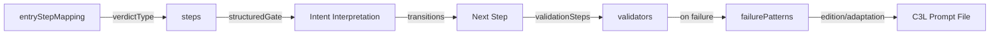
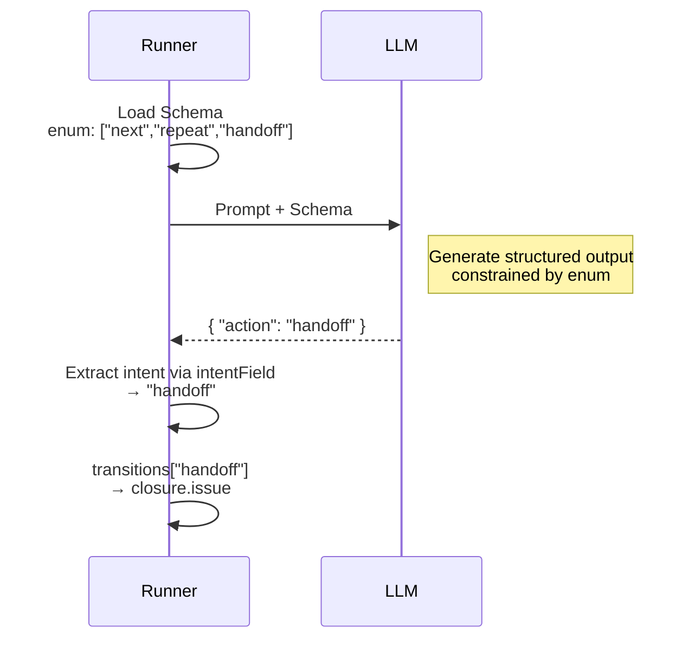
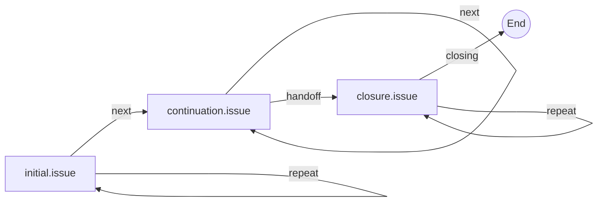
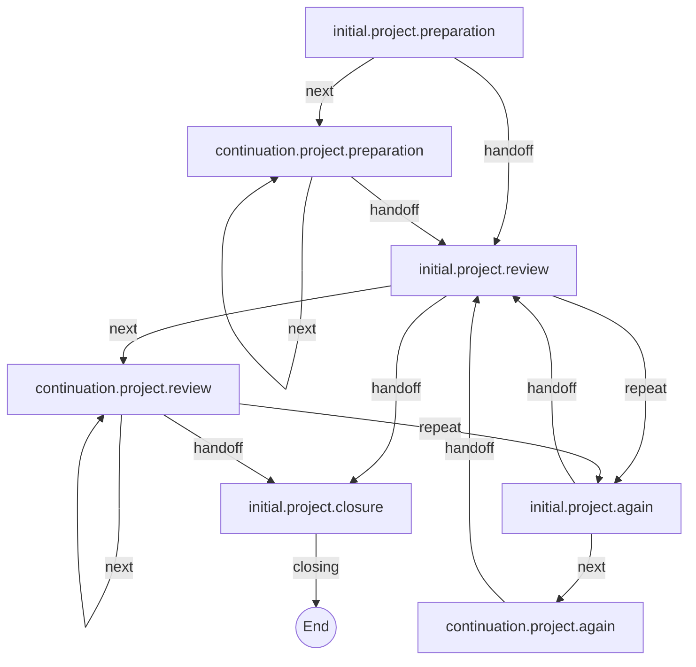
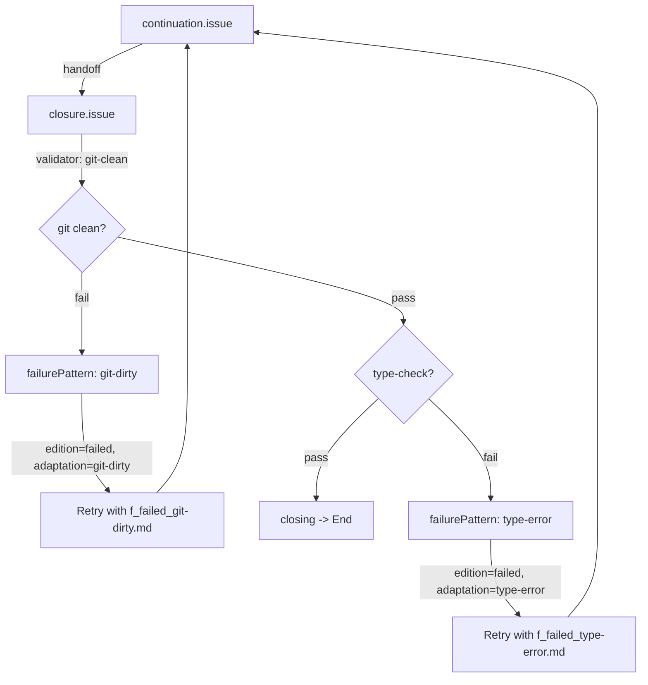

[English](../en/14-steps-registry-guide.md) |
[日本語](../ja/14-steps-registry-guide.md)

# 14. Steps Registry Guide

The `steps_registry.json` file is the central configuration for agent step flow
control. It defines step transitions, structured gate routing, validation, and
failure recovery patterns.

## 14.1 What is steps_registry.json?

The steps registry is the declarative control plane for agent execution flow. It
determines:

- **Step transitions**: Which step executes next based on AI output intent
- **Structured gate routing**: How AI structured output maps to flow decisions
- **Validation**: Pre-completion checks (git clean, tests pass, etc.)
- **Failure recovery**: Edition/adaptation selection for retry prompts

The registry is referenced via `runner.flow.prompts.registry` in the agent
definition (default: `"steps_registry.json"`).

### Architecture Overview



### Design Model: Runner-LLM Contract via JSON

Three configuration fields — `outputSchemaRef`, `structuredGate`, and
`transitions` — form a single send/receive contract between Runner and LLM.



- **Send (JSON Schema)**: `outputSchemaRef` points to a schema file. The `enum`
  in the schema constrains which values the LLM can return.
- **Receive (transitions)**: `transitions` uses those same constrained values as
  keys to declare the next step.
- **Link (structuredGate)**: `intentSchemaRef` points to the exact `enum`
  location in the schema, and `intentField` specifies where to extract the value
  from the LLM response.

The available intents are a fixed set of 7 defined by the Runner:

| Intent     | Meaning                        | Allowed in stepKind  |
| ---------- | ------------------------------ | -------------------- |
| `next`     | Proceed to the next step       | work, verification   |
| `repeat`   | Retry the current step         | all                  |
| `jump`     | Go to a specific step by ID    | work, verification   |
| `handoff`  | Delegate to closure/other flow | work                 |
| `closing`  | Signal workflow completion     | closure              |
| `escalate` | Route to verification support  | verification         |
| `abort`    | Terminate with error           | all (always allowed) |

You customize by choosing **which subset** of these 7 intents each step allows,
and **where each intent transitions to**. Custom intent values cannot be added —
the `StepGateInterpreter` rejects unknown values.

Because send and receive share the same JSON vocabulary, you can verify
consistency by comparing the schema `enum` and `transitions` keys side by side:

| Step                 | Schema enum (send)          | transitions keys (receive)  |
| -------------------- | --------------------------- | --------------------------- |
| `initial.issue`      | `next`, `repeat`            | `next`, `repeat`            |
| `continuation.issue` | `next`, `repeat`, `handoff` | `next`, `repeat`, `handoff` |
| `closure.issue`      | `closing`, `repeat`         | `closing`, `repeat`         |

**Rule**: When you select intents for a step's schema `enum`, add corresponding
keys to `transitions`. The `enum` and `transitions` keys must match — this keeps
the contract consistent.

## 14.2 Overall Structure

| Key                        | Required | Description                                        |
| -------------------------- | -------- | -------------------------------------------------- |
| `agentId`                  | Yes      | Agent identifier (e.g., `"iterator"`)              |
| `version`                  | Yes      | Schema version in semver format                    |
| `c1`                       | Yes      | C3L top-level path component (e.g., `"steps"`)     |
| `userPromptsBase`          | No       | Base directory for user prompts                    |
| `schemasBase`              | No       | Base directory for schema files                    |
| `pathTemplate`             | No       | C3L path template with adaptation                  |
| `pathTemplateNoAdaptation` | No       | C3L path template without adaptation               |
| `entryStep`                | No       | Default entry step ID                              |
| `entryStepMapping`         | No       | Mode-based entry step mapping                      |
| `failurePatterns`          | No       | Named failure pattern definitions                  |
| `validators`               | No       | Named validator definitions                        |
| `validationSteps`          | No       | Validation step definitions for pre-closure checks |
| `steps`                    | Yes      | Map of step ID to step definition                  |

## 14.3 entryStepMapping

Maps the agent's verdict type to the initial step. The verdict type is derived
from `runner.verdict.type` in the agent definition.

```json
{
  "entryStepMapping": {
    "poll:state": "initial.polling",
    "count:iteration": "initial.iteration"
  }
}
```

When the agent starts, `FlowOrchestrator.getStepIdForIteration(1)` resolves the
entry step in this order:

1. `entryStepMapping[verdictType]` -- mode-specific entry
2. `entryStep` -- generic fallback
3. Error if neither is configured

Example from the iterator agent:

| Verdict Type      | Entry Step          | Use Case                   |
| ----------------- | ------------------- | -------------------------- |
| `poll:state`      | `initial.polling`   | GitHub Issue state polling |
| `count:iteration` | `initial.iteration` | Fixed iteration count      |

## 14.4 Steps

### 14.4.1 Step Definition

Each step is a keyed entry in the `steps` object. The key must match `stepId`.

```json
{
  "initial.issue": {
    "stepId": "initial.issue",
    "name": "Issue Initial Prompt",
    "stepKind": "work",
    "c2": "initial", "c3": "issue", "edition": "default",
    "fallbackKey": "issue_initial_default",
    "uvVariables": ["issue_number"],
    "usesStdin": false,
    "outputSchemaRef": { "file": "issue.schema.json", "schema": "initial.issue" },
    "structuredGate": { ... },
    "transitions": { ... }
  }
}
```

**stepId naming conventions:**

| Prefix           | Phase        | stepKind | Description                        |
| ---------------- | ------------ | -------- | ---------------------------------- |
| `initial.*`      | initial      | work     | First step for a given flow        |
| `continuation.*` | continuation | work     | Subsequent iteration steps         |
| `closure.*`      | closure      | closure  | Terminal / completion steps        |
| `section.*`      | section      | (none)   | Injected prompt sections (no flow) |

**stepKind and allowed intents:**

| stepKind       | Allowed Intents                      | Purpose                     | Why restricted                                        |
| -------------- | ------------------------------------ | --------------------------- | ----------------------------------------------------- |
| `work`         | `next`, `repeat`, `jump`, `handoff`  | Generates artifacts         | Cannot `closing` — only closure may end the flow      |
| `verification` | `next`, `repeat`, `jump`, `escalate` | Validates work output       | Cannot `handoff` — verification must not skip closure |
| `closure`      | `closing`, `repeat`                  | Final validation/completion | Minimal set — either complete or retry                |

Intent is limited to a fixed set of 7 to minimize AI output variance and ensure
flow safety. For the full design rationale and the Runner-LLM contract model,
see [Design Model](#design-model-runner-llm-contract-via-json) above.

If `stepKind` is omitted, it is inferred from `c2`:

- `"initial"`, `"continuation"` -> `work`
- `"verification"` -> `verification`
- `"closure"` -> `closure`

**model selection:**

Each step can specify a `model` field (`"sonnet"`, `"opus"`, `"haiku"`).
Resolution order: `step.model` > `runner.flow.defaultModel` > `"opus"` (system
default). Use `"haiku"` for cost optimization on routine steps.

#### fallbackKey Naming Convention

`fallbackKey` must use **underscore-separated** format matching a key in the
default template registry.

| Field       | Format               | Example         |
| ----------- | -------------------- | --------------- |
| stepId      | dot-separated        | `initial.issue` |
| fallbackKey | underscore-separated | `initial_issue` |

Using a dot-separated key (e.g., `"initial.issue"`) as a `fallbackKey` will
result in:

```
No fallback prompt found for key: "initial.issue" (step: initial.issue)
```

#### Available fallbackKey Values

**Initial / Continuation pairs:**

| fallbackKey                                                    | Description                                     |
| -------------------------------------------------------------- | ----------------------------------------------- |
| `initial_iterate` / `continuation_iterate`                     | Iteration-based verdict (`count:iteration`)     |
| `initial_issue` / `continuation_issue`                         | Issue polling verdict (`poll:state`)            |
| `initial_issue_label_only` / `continuation_issue_label_only`   | Issue label-only variant (`poll:state`)         |
| `initial_project` / `continuation_project`                     | Project-based verdict                           |
| `initial_keyword` / `continuation_keyword`                     | Keyword detection verdict (`detect:keyword`)    |
| `initial_manual` / `continuation_manual`                       | Manual mode (alias for keyword)                 |
| `initial_structured_signal` / `continuation_structured_signal` | Structured signal verdict (`detect:structured`) |

**Project phase variants:**

| fallbackKey                        | Description               |
| ---------------------------------- | ------------------------- |
| `continuation_project_preparation` | Project preparation phase |
| `continuation_project_processing`  | Project processing phase  |
| `continuation_project_review`      | Project review phase      |

**Closure and other prompts:**

| fallbackKey                            | Description                     |
| -------------------------------------- | ------------------------------- |
| `issue_closure_default`                | Issue completion                |
| `project_closure_default`              | Project completion              |
| `polling_closure_default`              | Generic polling completion      |
| `review_closure_default`               | Review completion               |
| `iteration_closure_default`            | Iteration budget exhausted      |
| `facilitation_closure_default`         | Facilitation completion         |
| `project_continuation_closure_default` | Project continuation completion |
| `statuscheck_continuation_default`     | Status check continuation       |
| `system`                               | Default system prompt           |

#### UV Variable Constraints

- breakdown rejects empty-value UV variables (e.g., `--uv-repository=` produces
  `Empty value not allowed` error)
- Some verdict types automatically inject UV variables that may be empty (e.g.,
  `poll:state` injects `repository` which defaults to empty string when not
  configured)
- When C3L resolution fails due to empty UV variables, the runner falls back to
  `fallbackKey`
- Ensure `fallbackKey` is correctly set to handle this fallback gracefully

> **Validator scope**: The `--validate` flag checks UV variable reachability
> only for Channel 1 (CLI parameters declared in `agent.parameters`).
> Runtime-injected variables (Channels 2, 3) such as `iteration` or
> `previous_summary` are silently skipped -- the runner guarantees their
> availability at execution time.

#### Step Naming Convention: initial.\* and continuation.\*

Steps using the `initial.*` prefix have special behavior in `count:iteration`
flows:

| Step ID               | Used when                                                      |
| --------------------- | -------------------------------------------------------------- |
| `initial.assess`      | First iteration only                                           |
| `continuation.assess` | All subsequent iterations (auto-derived from `initial.assess`) |

When you define an `initial.X` step, you should also define a matching
`continuation.X` step with:

- The same `uvVariables` declarations
- Appropriate prompt templates for the continuation context
- A `fallbackKey` if using fallback prompts

Example:

```json
{
  "steps": {
    "initial.assess": {
      "stepId": "initial.assess",
      "c2": "initial",
      "c3": "assess",
      "edition": "default",
      "uvVariables": ["issue"],
      "fallbackKey": "initial_assess"
    },
    "continuation.assess": {
      "stepId": "continuation.assess",
      "c2": "continuation",
      "c3": "assess",
      "edition": "default",
      "uvVariables": ["issue"],
      "fallbackKey": "continuation_assess"
    }
  }
}
```

**Common mistake:** Declaring `uvVariables: ["issue_number"]` when the CLI
parameter is named `issue`. UV variable names must match the parameter names in
`agent.json`.

### 14.4.2 Structured Gate

The `structuredGate` configuration controls how AI structured output is
interpreted to determine the next action.

```json
{
  "structuredGate": {
    "allowedIntents": ["next", "repeat", "handoff"],
    "intentSchemaRef": "#/properties/next_action/properties/action",
    "intentField": "next_action.action",
    "targetField": "next_action.details.target",
    "handoffFields": ["analysis.understanding", "analysis.approach"],
    "failFast": true,
    "fallbackIntent": "next"
  }
}
```

| Field             | Required | Description                                         |
| ----------------- | -------- | --------------------------------------------------- |
| `allowedIntents`  | Yes      | Intents this step can emit                          |
| `intentSchemaRef` | Yes      | JSON Pointer to intent enum in schema (`#/` prefix) |
| `intentField`     | Yes      | Dot-notation path to extract intent from output     |
| `targetField`     | No       | Dot-notation path for jump target step ID           |
| `handoffFields`   | No       | Dot-notation paths for data passed to next step     |
| `targetMode`      | No       | `"explicit"` / `"dynamic"` / `"conditional"`        |
| `failFast`        | No       | Throw on unresolvable intent (default: `true`)      |
| `fallbackIntent`  | No       | Fallback intent when `failFast` is `false`          |

**GateIntent values** (from `step-gate-interpreter.ts`):

| Intent     | Description                            | Emitted By           |
| ---------- | -------------------------------------- | -------------------- |
| `next`     | Proceed to the next step               | work, verification   |
| `repeat`   | Retry the current step                 | all                  |
| `jump`     | Go to a specific step by ID            | work, verification   |
| `closing`  | Signal workflow completion             | closure only         |
| `abort`    | Terminate workflow with error          | all (always allowed) |
| `escalate` | Route to verification support step     | verification only    |
| `handoff`  | Hand off to closure / another workflow | work only            |

**Action aliases** recognized by `StepGateInterpreter`:

| AI Response Value  | Maps To   |
| ------------------ | --------- |
| `continue`         | `next`    |
| `retry`, `wait`    | `repeat`  |
| `done`, `finished` | `closing` |
| `pass`             | `next`    |
| `fail`             | `repeat`  |

### 14.4.3 Transitions

The `transitions` object maps intents to target steps.

**Simple target:**

```json
{
  "transitions": {
    "next": { "target": "continuation.issue" },
    "repeat": { "target": "initial.issue" },
    "handoff": { "target": "closure.issue" }
  }
}
```

**Terminal transition** (`target: null` signals completion):

```json
{
  "transitions": {
    "closing": { "target": null },
    "repeat": { "target": "closure.issue" }
  }
}
```

**Conditional transition:**

```json
{
  "transitions": {
    "next": {
      "condition": "status",
      "targets": {
        "ready": "continuation.process",
        "blocked": "continuation.wait",
        "default": "continuation.fallback"
      }
    }
  }
}
```

The `condition` field names a key in the handoff data. Its value is matched
against the `targets` map. If no match, `"default"` is used.

## 14.5 Validators

Validators define command-based checks executed before closure.

```json
{
  "git-clean": {
    "type": "command",
    "command": "git status --porcelain",
    "successWhen": "empty",
    "failurePattern": "git-dirty",
    "extractParams": { "changedFiles": "parseChangedFiles" }
  }
}
```

| Field            | Required | Description                                     |
| ---------------- | -------- | ----------------------------------------------- |
| `type`           | Yes      | Validator type (currently only `"command"`)     |
| `command`        | Yes      | Shell command to execute                        |
| `successWhen`    | Yes      | Success condition (`"empty"` or `"exitCode:N"`) |
| `failurePattern` | Yes      | Reference to a named failure pattern            |
| `extractParams`  | No       | Parameter extraction rules from command output  |

Validators are referenced from `validationSteps`, which associate validators
with closure steps:

```json
{
  "validationSteps": {
    "closure.issue": {
      "stepId": "closure.issue",
      "name": "Issue Validation",
      "c2": "retry",
      "c3": "issue",
      "validationConditions": [
        { "validator": "git-clean" },
        { "validator": "type-check" }
      ],
      "onFailure": { "action": "retry", "maxAttempts": 3 }
    }
  }
}
```

## 14.6 failurePatterns

Failure patterns map validation failures to C3L edition/adaptation variants,
enabling specialized retry prompts.

```json
{
  "git-dirty": {
    "description": "Uncommitted changes present",
    "edition": "failed",
    "adaptation": "git-dirty",
    "params": ["changedFiles", "untrackedFiles"]
  }
}
```

| Field         | Required | Description                           |
| ------------- | -------- | ------------------------------------- |
| `description` | Yes      | Human-readable failure description    |
| `edition`     | Yes      | Edition variant for failure prompt    |
| `adaptation`  | No       | Adaptation variant for failure prompt |
| `params`      | No       | Parameter names extracted on match    |

**C3L integration**: When a validator fails, its `failurePattern` reference
selects the edition/adaptation. The `pathTemplate` resolves to the actual prompt
file:

```
pathTemplate: {c1}/{c2}/{c3}/f_{edition}_{adaptation}.md
failurePattern "git-dirty": edition="failed", adaptation="git-dirty"

Resolved path: steps/closure/issue/f_failed_git-dirty.md
```

See [08-prompt-structure.md](./08-prompt-structure.md) for C3L path details.

## 14.7 pathTemplate

Path templates define how step definitions resolve to prompt files on disk.

### Template Syntax

```
{c1}/{c2}/{c3}/f_{edition}_{adaptation}.md    # With adaptation
{c1}/{c2}/{c3}/f_{edition}.md                  # Without adaptation
```

### Template Variables

| Variable       | Source                               | Example     |
| -------------- | ------------------------------------ | ----------- |
| `{c1}`         | Registry-level `c1` field            | `steps`     |
| `{c2}`         | Step definition `c2` field           | `initial`   |
| `{c3}`         | Step definition `c3` field           | `issue`     |
| `{edition}`    | Step `edition` or failure pattern    | `default`   |
| `{adaptation}` | Step `adaptation` or failure pattern | `git-dirty` |

### Resolution Example

Given:

- `userPromptsBase`: `.agent/iterator/prompts`
- `pathTemplate`: `{c1}/{c2}/{c3}/f_{edition}_{adaptation}.md`
- Step: `c1="steps"`, `c2="initial"`, `c3="issue"`, `edition="default"`

Without adaptation:

```
.agent/iterator/prompts/steps/initial/issue/f_default.md
```

With failure pattern `git-dirty` (`edition="failed"`, `adaptation="git-dirty"`):

```
.agent/iterator/prompts/steps/initial/issue/f_failed_git-dirty.md
```

## 14.8 Step Flow Design

### 14.8.1 Linear Flow

The simplest pattern: initial -> continuation -> closure.



### 14.8.2 Branching Flow

A project flow with preparation, review, and re-execution branches.



Key design points:

- `repeat` from review routes to `initial.project.again` (re-execution)
- `handoff` from review routes to `initial.project.closure` (completion)
- The again step loops back to review after re-execution

### 14.8.3 Retry / Recovery Flow

When validation fails, failure patterns select specialized prompts with
contextual error information.



The retry flow:

1. Work step hands off to closure step
2. `validationSteps` runs each validator in order
3. On failure, the matching `failurePattern` provides edition/adaptation
4. The retry prompt is resolved via `pathTemplate` with failure
   edition/adaptation
5. Execution returns to the work step with failure context
6. `onFailure.maxAttempts` limits retry count

## 14.9 Complete Sample

For a complete working example, see `.agent/iterator/steps_registry.json`.

The key design rules demonstrated by that registry:

1. Every flow step must define `structuredGate` and `transitions`
2. `section.*` steps (e.g., `section.projectcontext`) are injected prompt
   sections without flow control -- they need no gate or transitions
3. `closing` intent with `target: null` signals workflow completion
4. `handoff` from work steps routes to closure steps
5. `failFast: true` (default) ensures unresolvable intents throw errors instead
   of silently falling back

For a minimal three-step registry (issue flow), the required structure is:

- `initial.issue` (stepKind: work) -- `next` -> `continuation.issue`
- `continuation.issue` (stepKind: work) -- `handoff` -> `closure.issue`
- `closure.issue` (stepKind: closure) -- `closing` -> `null` (terminal)
