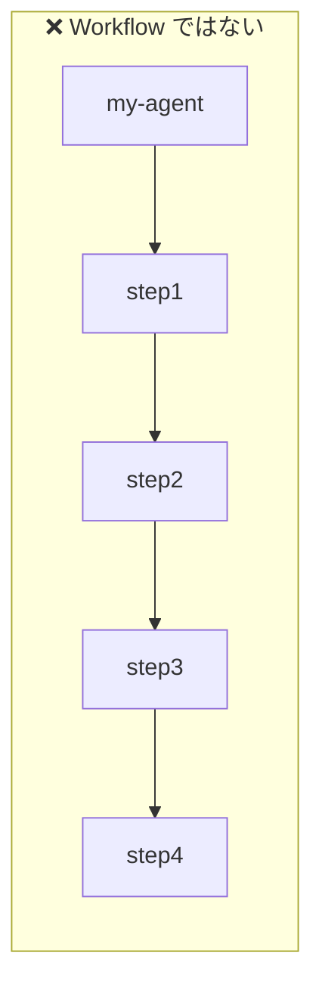
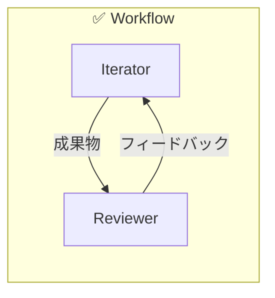

[English](../en/00-1-concepts.md) | [日本語](../ja/00-1-concepts.md)

# Agent 設定の基本概念

Agent を設定する前に、**何を** 設定し **なぜ** そうするのかを理解しましょう。

## Agent とは？

Agent は **設定（JSON）** と **プロンプト（Markdown）** の組み合わせです。

```
Agent = 設定 + プロンプト
       (何をするか) (どう指示するか)
```

Agent の定義にコードは不要です。設定ファイルが動作を制御し、プロンプトが AI
を導きます。

## Workflow とは？

**プロジェクトが必要とする役割やプロセスに基づいて Agent を定義してください。**
Agent は独立した責務を表すものであり、手順の一ステップではありません。異なる役割
を持つ複数の Agent が連動することで Workflow が生まれます。





Iterator が作業を行い、Reviewer が検証する。**独立した役割間のループ**が品質を
生み出します — 自分で書いた文章を自分で校正しても効果が薄いのと同じです。

### 最小構成の Workflow

最低 **2 つの Agent** を相補的な役割で登録します：

```json
{
  "registries": {
    "iterator": ".agent/iterator/registry.json",
    "reviewer": ".agent/reviewer/registry.json"
  }
}
```

## ファイル構成の概要

```
.agent/{agent-name}/
├── agent.json              ← どんな Agent か？
├── steps_registry.json     ← ステップ間の遷移は？
├── schemas/                ← 出力形式は？
│   └── step_outputs.schema.json
└── prompts/                ← どんな指示を与えるか？
    ├── system.md
    └── steps/{c2}/{c3}/f_default.md
```

### なぜこの構成か？

| ファイル              | 目的               | 分離する理由                         |
| --------------------- | ------------------ | ------------------------------------ |
| `agent.json`          | Agent の定義       | プロンプトに触れずに動作を変更できる |
| `steps_registry.json` | フロー制御         | フローロジックを独立して変更できる   |
| `schemas/`            | 出力バリデーション | AI の応答が期待する形式か検証する    |
| `prompts/`            | AI への指示        | 設定を変えずにプロンプトを改善できる |

## 基本概念

### 1. completionType: Agent はいつ停止するか？

Agent 作成時の最も重要な判断です。

| タイプ            | 用途                                              | 例                                                                             |
| ----------------- | ------------------------------------------------- | ------------------------------------------------------------------------------ |
| `externalState`   | 外部状態の変化で停止（Issue クローズ、PR マージ） | Issue 駆動開発（`github.defaultClosureAction` でクローズ or ラベルのみを制御） |
| `iterationBudget` | N 回のイテレーション後に停止                      | 固定スコープのタスク                                                           |
| `keywordSignal`   | 特定のキーワード発話で停止                        | シンプルな完了検知                                                             |
| `stepMachine`     | 明示的な遷移を持つステートマシン                  | 複雑な多段階ワークフロー                                                       |

**判断ガイド:** 外部状態に依存？→ `externalState`。固定回数？→
`iterationBudget`。キーワード？→ `keywordSignal`。それ以外 → `stepMachine`。

### 2. C3L パス構造: なぜ3階層か？

プロンプトは C3L と呼ばれる3階層で整理されます：

```
prompts/{c1}/{c2}/{c3}/f_{edition}.md
         │     │    │
         │     │    └─ 対象（何に対して）
         │     └─ 操作（何をするか）
         └─ ドメイン（どの領域か）
```

| 階層           | 目的                     | 例                        | メリット       |
| -------------- | ------------------------ | ------------------------- | -------------- |
| c1（ドメイン） | 関連する操作をグループ化 | `git`, `code`, `test`     | 関心事で整理   |
| c2（操作）     | 実行する操作             | `create`, `review`, `fix` | 対象間で再利用 |
| c3（対象）     | 操作対象                 | `issue`, `branch`, `file` | 具体的な指示   |

**解決例：**

```
コマンド: climpt-git create issue
パス:     prompts/git/create/issue/f_default.md
```

### 3. Step の種類: なぜ3タイプか？

Agent は3種類の Step を使い、それぞれ異なる責務を持ちます：

| 種類             | Step                          | 責務       | 許可される Intent                    |
| ---------------- | ----------------------------- | ---------- | ------------------------------------ |
| **Work**         | `initial.*`, `continuation.*` | 出力を生成 | `next`, `repeat`, `jump`, `handoff`  |
| **Verification** | `verification.*`              | 出力を検証 | `next`, `repeat`, `jump`, `escalate` |
| **Closure**      | `closure.*`                   | 完了を判断 | `closing`, `repeat`                  |

**なぜ分けるのか？**

- **Work step** は「完了」と言えない — 早期終了を防ぐ
- **Verification step** は完了前に検証する — 品質を保証
- **Closure step** だけがフローを終了できる — 完了権限の明確化

### 4. 構造化出力: なぜスキーマ検証か？

すべての Step は出力スキーマを定義する必要があります。AI の応答はこのスキーマ
に対して検証されます。

| スキーマなし                    | スキーマあり                    |
| ------------------------------- | ------------------------------- |
| AI が予期しない形式を返す可能性 | 形式が保証される                |
| Intent の抽出が不安定           | `next_action.action` が常に存在 |
| 不正な出力でフローが壊れる      | 無効な出力が即座に検知される    |

**最低限必要な構造：**

```json
{
  "next_action": {
    "action": "next",    ← 必須: 次に何をするか
    "reason": "..."      ← 必須: 判断の理由
  }
}
```

## 設定ファイルの説明

### app.yml: アプリケーションレベル設定

プロンプトとスキーマの場所を定義します。

```yaml
working_dir: ".agent/climpt"
app_prompt:
  base_dir: "prompts" # プロンプトファイルの場所
app_schema:
  base_dir: "schema" # スキーマファイルの場所
```

**カスタマイズする場合：**

- プロジェクトごとにプロンプトの場所が異なる
- チームで共通ディレクトリのプロンプトを共有する

### user.yml: ユーザーレベル設定

ユーザーや環境ごとに動作をカスタマイズします。

```yaml
options:
  destination:
    prefix: "output/git" # 全出力パスに付加
params:
  two:
    directiveType:
      pattern: "^(create|update)$" # c2 の値を検証
```

**カスタマイズする場合：**

- 命名規則を強制する
- ドメインごとに利用可能なコマンドを制限する

### registry_config.json: 複数 Agent の管理

Agent 名をレジストリファイルにマッピングします。

```json
{
  "registries": {
    "climpt": ".agent/climpt/registry.json",
    "iterator": ".agent/iterator/registry.json"
  }
}
```

**カスタマイズする場合：**

- 1つのプロジェクトで複数 Agent を管理
- プロジェクト間で Agent を共有

## 次のステップ

| 目的                  | ドキュメント                                                      |
| --------------------- | ----------------------------------------------------------------- |
| Climpt のセットアップ | [02-climpt-setup.md](./02-climpt-setup.md)                        |
| Agent を作成する      | [Agent Quickstart](../../../agents/docs/builder/01_quickstart.md) |
| 設定ファイルの詳細    | [06-config-files.md](./06-config-files.md)                        |
| プロンプト構造を学ぶ  | [08-prompt-structure.md](./08-prompt-structure.md)                |
