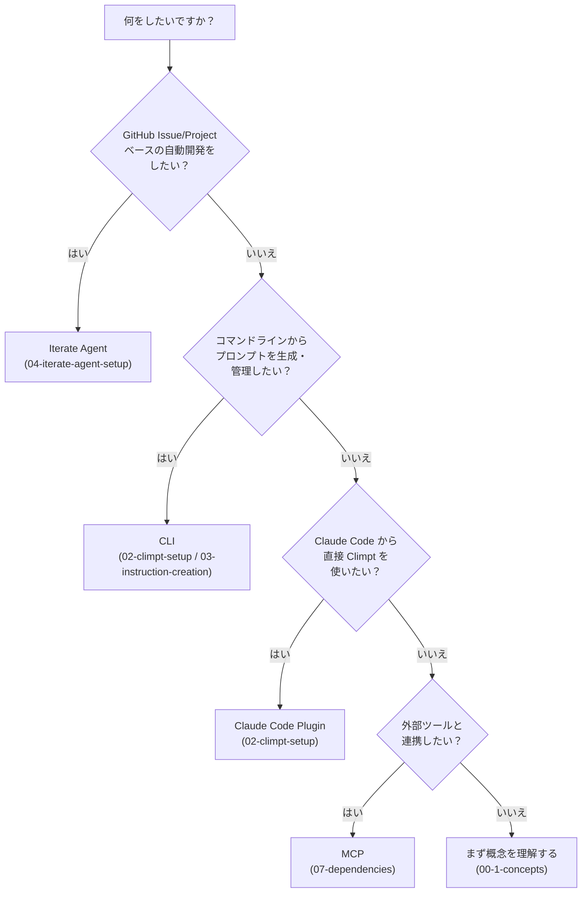

[English](../en/10-getting-started-guide.md) |
[日本語](../ja/10-getting-started-guide.md)

# 10. はじめに

このガイドでは、ユースケースに応じた最適なアプローチを選び、数分で最初の実行を
完了するまでを案内します。

---

## 10.1 何をしたいですか？

以下の意思決定ツリーを使って、目的に合った最適な出発点を見つけてください。



| 目的                           | アプローチ                                                                              | ガイド                                                                                           |
| ------------------------------ | --------------------------------------------------------------------------------------- | ------------------------------------------------------------------------------------------------ |
| Issue/Project 駆動の自動開発   | **Iterate Agent** -- 要件取得・作業委譲・検証を自律的に反復するエージェント             | [04-iterate-agent-setup](./04-iterate-agent-setup.md)                                            |
| CLI でプロンプトを生成・管理   | **CLI** -- `climpt` コマンドでプロンプトの作成・ビルド・出力を実行                      | [02-climpt-setup](./02-climpt-setup.md), [03-instruction-creation](./03-instruction-creation.md) |
| Claude Code 内で Climpt を使用 | **Claude Code Plugin** -- `climpt-agent` プラグインでエディタ内からプロンプトにアクセス | [02-climpt-setup](./02-climpt-setup.md)                                                          |
| 外部ツールとの連携             | **MCP** -- Model Context Protocol によるツール間連携                                    | [07-dependencies](./07-dependencies.md)                                                          |

---

## 10.2 ユースケース別クイックスタート

3つのシナリオで、それぞれ約5分で最初の実行を体験できます。

### シナリオ A: CLI でプロンプトを生成する

インストール、初期化、プロンプト生成までの最小手順です。

```bash
# 1. プロジェクトで Climpt を初期化
deno run -A jsr:@aidevtool/climpt init

# 2. 初期化の確認
ls .agent/climpt/config/

# 3. ヘルプで利用可能なコマンドを確認
deno run -A jsr:@aidevtool/climpt --help

# 4. プロンプトを生成（例: project プロンプトの作成）
deno run -A jsr:@aidevtool/climpt to project
```

**期待出力**: Markdown
形式のプロンプトが標準出力に表示されます。パイプやコピーに
そのまま利用できます。

### シナリオ B: Claude Code Plugin で使う

プラグインをインストールし、Claude Code 内から Climpt コマンドを直接使用します。

```bash
# 1. プロジェクトで Climpt を初期化（未実施の場合）
deno run -A jsr:@aidevtool/climpt init
```

Claude Code 内で以下を実行：

```
# 2. Climpt マーケットプレイスを追加
/plugin marketplace add tettuan/climpt

# 3. プラグインをインストール
/plugin install climpt-agent

# 4. インストール確認
/plugin list
```

**期待結果**: プラグインリストに `climpt-agent` が表示され、
`delegate-climpt-agent` Skill が利用可能になります。

### シナリオ C: Iterate Agent で Issue を自動処理する

Iterate Agent をセットアップし、GitHub Issue を自律的に処理させます。

```bash
# 1. 前提条件: gh の認証を確認
gh auth status

# 2. Climpt を初期化（未実施の場合）
deno run -A jsr:@aidevtool/climpt init

# 3. Claude Code プラグインをインストール（Iterate Agent に必要）
# Claude Code 内で: /plugin marketplace add tettuan/climpt
# Claude Code 内で: /plugin install climpt-agent

# 4. Iterate Agent を初期化
deno run -A jsr:@aidevtool/climpt/agents/iterator --init

# 5. 特定の Issue に対して実行（123 を実際の Issue 番号に置き換え）
deno run -A jsr:@aidevtool/climpt/agents/iterator --issue 123
```

**期待結果**: エージェントが Issue を取得し、タスクを委譲し、Issue
が解決されるまで反復実行します。完了時にパフォーマンスレポートが表示されます。

---

## 10.3 セットアップ確認チェックリスト

選択したワークフローに進む前に、各項目を確認してください。

### 全ワークフロー共通

- [ ] **Deno がインストール済み**

  ```bash
  deno --version
  ```

  期待値: `deno 2.x.x`（2.5 以上）

- [ ] **Climpt が初期化済み**

  ```bash
  ls .agent/climpt/config/
  ```

  期待値: `default-app.yml`, `registry_config.json`

### Iterate Agent 使用時に必要

- [ ] **GitHub CLI がインストール・認証済み**

  ```bash
  gh auth status
  ```

  期待値: `Logged in to github.com as <ユーザー名>`

- [ ] **GitHub リモートが設定された Git リポジトリ**

  ```bash
  git remote -v
  ```

  期待値: `github.com` を指す `origin` リモートが存在

- [ ] **Iterate Agent が初期化済み**

  ```bash
  ls agents/iterator/config.json
  ```

  期待値: `config.json` が存在

- [ ] **Claude Code プラグインがインストール済み**

  Claude Code 内で:

  ```
  /plugin list
  ```

  期待値: 出力に `climpt-agent` が含まれる

### MCP 連携時に必要

- [ ] **MCP 設定が存在する**

  ```bash
  ls .agent/climpt/config/
  ```

  期待値: MCP 関連の設定ファイルが存在

---

## 10.4 次のステップマップ

最初の実行を完了したら、目的に応じて次の学習パスを選んでください。

| あなたの目的                           | 次に読むべきガイド                                            |
| -------------------------------------- | ------------------------------------------------------------- |
| カスタム指示書（プロンプト）を作りたい | [03-instruction-creation](./03-instruction-creation.md)       |
| Iterate Agent を設定・実行したい       | [04-iterate-agent-setup](./04-iterate-agent-setup.md)         |
| アーキテクチャを理解したい             | [05-architecture](./05-architecture.md)                       |
| 設定ファイルを詳しく知りたい           | [06-config-files](./06-config-files.md)                       |
| 依存構造や MCP を学びたい              | [07-dependencies](./07-dependencies.md)                       |
| プロンプト構造と C3L を理解したい      | [08-prompt-structure](./08-prompt-structure.md)               |
| 独自の Agent を作りたい                | [13-agent-creation-tutorial](./13-agent-creation-tutorial.md) |

---

## 関連ドキュメント

- [概要](./00-overview.md) -- ガイド構成と目次
- [基本概念](./00-1-concepts.md) -- Agent、Runner、Workflow の基礎
- [前提条件](./01-prerequisites.md) -- Deno と gh CLI のインストール

---

## サポート

問題が発生した場合は Issue を作成してください:
https://github.com/tettuan/climpt/issues
