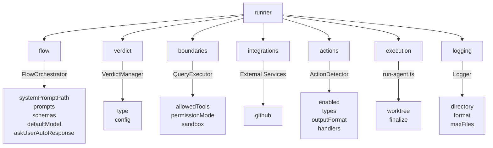
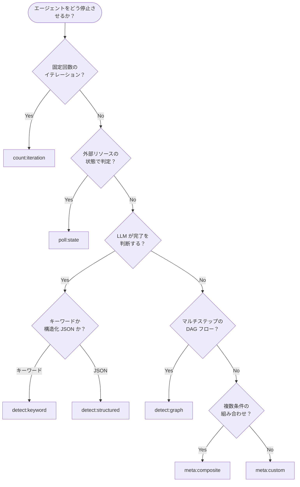

[English](../en/11-runner-reference.md) | [日本語](../ja/11-runner-reference.md)

# 11. Runner 設定リファレンス

`agent.json` における `runner.*` 名前空間の完全リファレンス。全フィールド、型、
デフォルト値、バリデーションルールは、スキーマ
(`agents/schemas/agent.schema.json`)、デフォルト値
(`agents/config/defaults.ts`)、バリデータ (`agents/config/validator.ts`)
に基づいています。

---

## 11.1 概要

`runner` は `agent.json` の必須トップレベルキーです。Agent Runner
がエージェントを実行する方法を制御します。名前空間は 7
つのサブグループに分かれ、
それぞれが異なるランタイムモジュールに対応しています。



| サブグループ | 必須 | ランタイムオーナー | 用途                             |
| ------------ | ---- | ------------------ | -------------------------------- |
| flow         | Yes  | FlowOrchestrator   | プロンプト解決、モデル、スキーマ |
| verdict      | Yes  | VerdictManager     | 実行完了判定ロジック             |
| boundaries   | Yes  | QueryExecutor      | ツール/権限の制約                |
| integrations | No   | External services  | GitHub 連携                      |
| actions      | No   | ActionDetector     | アクションブロック検出           |
| execution    | No   | run-agent.ts       | Worktree とファイナライズ設定    |
| logging      | No   | Logger             | ログ出力設定                     |

---

## 11.2 runner.flow

プロンプト読み込み、モデル選択、スキーマ検査を制御します。

| フィールド          | 型      | 必須 | デフォルト              | 説明                                                                                                                                         |
| ------------------- | ------- | ---- | ----------------------- | -------------------------------------------------------------------------------------------------------------------------------------------- |
| systemPromptPath    | string  | Yes  | --                      | システムプロンプトファイルへのパス（`.agent/{name}/` からの相対パス）。                                                                      |
| prompts.registry    | string  | Yes  | `"steps_registry.json"` | ステップレジストリ JSON ファイルへのパス。                                                                                                   |
| prompts.fallbackDir | string  | Yes  | `"prompts"`             | レジストリ検索が失敗した場合のフォールバックディレクトリ。                                                                                   |
| schemas.base        | string  | No   | --                      | スキーマ検査で使用する JSON スキーマのベースディレクトリ。                                                                                   |
| schemas.inspection  | boolean | No   | --                      | スキーマ検査モードを有効化。                                                                                                                 |
| defaultModel        | string  | No   | --                      | 全ステップのデフォルト LLM モデル。列挙値: `"sonnet"`, `"opus"`, `"haiku"`。解決順序: step.model > defaultModel > `"opus"`（システム既定）。 |
| askUserAutoResponse | string  | No   | --                      | AskUserQuestion ツールへの自動応答メッセージ。設定するとユーザー入力を待たず自動的に応答し、自律実行を可能にする。                           |

**補足:** `prompts.registry` と `prompts.fallbackDir` はスキーマ上 required
です。 `agent.json` で省略した場合、`applyDefaults()`
が上記のデフォルト値を適用します。

---

## 11.3 runner.verdict

エージェント実行の終了条件を決定します。

### 11.3.1 verdict.type

`category:variant` 命名規則に従う 8 種の verdict type:

| Type                | カテゴリ | 用途                     | 必須 config                   | 説明                                                         |
| ------------------- | -------- | ------------------------ | ----------------------------- | ------------------------------------------------------------ |
| `count:iteration`   | count    | 単純回数制限             | `maxIterations`               | N 回のイテレーション後に完了。                               |
| `count:check`       | count    | チェック回数制限         | `maxChecks`                   | N 回のステータスチェック後に完了。                           |
| `poll:state`        | poll     | 外部状態ポーリング       | _（ランタイムパラメータ）_    | 外部リソース（例: GitHub Issue）の状態をポーリングして判定。 |
| `detect:keyword`    | detect   | LLM 出力のキーワード検出 | `verdictKeyword`              | LLM が特定のキーワードを出力したら完了。                     |
| `detect:structured` | detect   | 構造化出力の検出         | `signalType`                  | LLM が特定の JSON アクションブロックを出力したら完了。       |
| `detect:graph`      | detect   | DAG ベースのステップ遷移 | _（registryPath, entryStep）_ | ステップ状態機械が終端に到達したら完了。                     |
| `meta:composite`    | meta     | 複数条件の組み合わせ     | `operator`, `conditions`      | and/or/first ロジックで複数の verdict 条件を組み合わせる。   |
| `meta:custom`       | meta     | カスタムハンドラ         | `handlerPath`                 | 外部 ESM モジュールに委譲。                                  |

**デフォルト:** `verdict.type` を省略した場合、`applyDefaults()` は
`"count:iteration"`（`maxIterations: 10`）に設定します。

### 11.3.2 verdict.type 選択フローチャート



### 11.3.3 verdict.config

各 verdict type の設定フィールド。`validator.ts` の `validateVerdictConfig()`
によりロード時にバリデーションされます。

| フィールド     | 型                      | 使用元              | 必須 | 説明                                                                                                                                |
| -------------- | ----------------------- | ------------------- | ---- | ----------------------------------------------------------------------------------------------------------------------------------- |
| maxIterations  | number (最小: 1)        | `count:iteration`   | Yes  | **意味は verdict type により異なる。** `count:iteration`: 完了閾値。その他: 安全上限（[11.3.4](#1134-maxiterations-の意味) 参照）。 |
| maxChecks      | number (最小: 1)        | `count:check`       | Yes  | 実行するステータスチェック回数。                                                                                                    |
| verdictKeyword | string                  | `detect:keyword`    | Yes  | LLM 出力で検出すると完了とみなすキーワード。                                                                                        |
| signalType     | string                  | `detect:structured` | Yes  | LLM 出力で検出するアクションブロックの型名。                                                                                        |
| requiredFields | object \| array         | `detect:structured` | No   | 検出シグナルに必須のフィールド。オブジェクト形式: キー値マッチ。配列形式: フィールド名の存在チェック。                              |
| resourceType   | enum                    | `poll:state`        | No   | 監視対象リソース: `"github-issue"`, `"github-project"`, `"file"`, `"api"`。                                                         |
| targetState    | string \| object        | `poll:state`        | No   | 完了と判定する目標状態。                                                                                                            |
| registryPath   | string                  | `detect:graph`      | No   | 状態機械用のステップレジストリへのパス。                                                                                            |
| entryStep      | string                  | `detect:graph`      | No   | 状態機械のエントリーステップ ID。                                                                                                   |
| operator       | enum                    | `meta:composite`    | Yes  | 論理演算子: `"and"`, `"or"`, `"first"`。                                                                                            |
| conditions     | array of {type, config} | `meta:composite`    | Yes  | サブ verdict 条件の配列。各要素は独自の `type` と `config` を持つ。                                                                 |
| handlerPath    | string                  | `meta:custom`       | Yes  | カスタム verdict ハンドラをエクスポートする ESM モジュールへのパス。                                                                |

### 11.3.4 maxIterations の意味

> **注意:** `maxIterations` の意味は verdict type によって異なります。

| コンテキスト                   | 意味                                                                                    |
| ------------------------------ | --------------------------------------------------------------------------------------- |
| `count:iteration` verdict type | **完了閾値。** この回数に達したら実行を完了する。                                       |
| その他の verdict type          | **安全上限。** verdict が完了を検出できなかった場合、この回数で強制的に実行を停止する。 |

`AGENT_LIMITS.DEFAULT_MAX_ITERATIONS` からのデフォルト値: **10**。

verdict config で `maxIterations` が未指定かつ type が `count:iteration`
でない場合、ランナーは安全上限として
`AGENT_LIMITS.FALLBACK_MAX_ITERATIONS`（**20**）を使用します。verdict
ハンドラ内部では
`AGENT_LIMITS.VERDICT_FALLBACK_MAX_ITERATIONS`（**100**）が絶対最大値として使用されます。

### 11.3.5 プロンプト解決の優先順位

Runner は2つの解決パスを順に試行する。最初に非 null の結果が使用される。

- **Path A** -- `stepPromptResolver` / `closureAdapter` による C3L ファイル解決
- **Path B** -- Verdict handler 解決、次に `fallbackKey` 参照

```
Iteration 1:
  +-- Path A: stepPromptResolver.resolve()
  |   +-- 成功 -> コンテンツ使用
  +-- Path B: verdictHandler.buildInitialPrompt()
      +-- C3L 解決 -> fallbackKey 参照

Iteration > 1:
  +-- Path A: closureAdapter.tryClosureAdaptation()
  |   +-- 成功 -> コンテンツ使用
  +-- Path A: stepPromptResolver.resolve()
  |   +-- 成功 -> コンテンツ使用
  +-- Path B: verdictHandler.buildContinuationPrompt()
      +-- C3L 解決 -> fallbackKey 参照
```

#### `poll:state` の注意点

`poll:state` では Path B が UV 変数を自動注入する:

| 変数               | 値                       | 備考                   |
| ------------------ | ------------------------ | ---------------------- |
| `issue`            | Issue 番号               | `--issue` CLI 引数から |
| `repository`       | リポジトリパス           | 未設定時は空文字列     |
| `iteration`        | 現在のイテレーション     | Continuation のみ      |
| `previous_summary` | フォーマット済みサマリー | Continuation のみ      |

空 UV 値 (例: `--uv-repository=`) は `breakdown` の C3L
解決を拒否させる。`fallbackKey`
が最終的なセーフティネットとして正しく設定されている必要がある。

> `poll:state` エージェントで `fallbackKey`
> 設定ミスが即エラーとなる理由。`count:iteration` (Path A のみ、UV 注入なし)
> には影響しない。

---

## 11.4 runner.boundaries

ツールアクセスと権限モードを制御します。

| フィールド     | 型       | 必須 | デフォルト | 説明                                                   |
| -------------- | -------- | ---- | ---------- | ------------------------------------------------------ |
| allowedTools   | string[] | Yes  | `["*"]`    | エージェントが使用可能なツール。`"*"` は全ツール許可。 |
| permissionMode | enum     | Yes  | `"plan"`   | Claude 権限モード（下記参照）。                        |
| sandbox        | object   | No   | --         | 詳細なサンドボックス設定。                             |

### 11.4.1 permissionMode

| 値                  | 説明                                                                 |
| ------------------- | -------------------------------------------------------------------- |
| `default`           | 通常モード。各アクションでユーザー確認を求める。                     |
| `plan`              | プランモード（読み取り専用）。読み取りのみ可能で書き込みは不可。     |
| `acceptEdits`       | ファイル編集を自動承認。書き込み操作がユーザー確認なしで実行される。 |
| `bypassPermissions` | 全権限チェックをバイパス。完全自律動作、確認プロンプトなし。         |

### 11.4.2 sandbox

| フィールド              | 型       | デフォルト  | 説明                                                                          |
| ----------------------- | -------- | ----------- | ----------------------------------------------------------------------------- |
| enabled                 | boolean  | `true`      | サンドボックスモードを有効化。                                                |
| network.mode            | enum     | `"trusted"` | ネットワークアクセス: `"trusted"`（事前承認ドメイン）、`"none"`、`"custom"`。 |
| network.trustedDomains  | string[] | --          | 許可ドメインリスト（`*.github.com` のようなワイルドカード対応）。             |
| filesystem.allowedPaths | string[] | --          | 書き込みアクセスを許可する追加パス。                                          |

---

## 11.5 runner.integrations

外部サービス連携設定。現在は GitHub のみサポート。

### 11.5.1 integrations.github

| フィールド           | 型      | 必須 | デフォルト | 説明                                         |
| -------------------- | ------- | ---- | ---------- | -------------------------------------------- |
| enabled              | boolean | Yes  | `false`    | GitHub 連携を有効化。                        |
| labels               | object  | No   | --         | ワークフロー状態に対応するラベルマッピング。 |
| defaultClosureAction | enum    | No   | `"close"`  | Issue 完了時のアクション。                   |

**labels サブフィールド:**

| フィールド        | 型       | 説明                       |
| ----------------- | -------- | -------------------------- |
| requirements      | string   | 要件ドキュメント用ラベル。 |
| inProgress        | string   | 作業中状態のラベル。       |
| blocked           | string   | ブロック状態のラベル。     |
| completion.add    | string[] | 完了時に追加するラベル。   |
| completion.remove | string[] | 完了時に削除するラベル。   |

**defaultClosureAction の値:**

| 値                | 動作                                               |
| ----------------- | -------------------------------------------------- |
| `close`           | Issue をクローズする。                             |
| `label-only`      | ラベルのみ変更し、Issue はオープンのまま維持する。 |
| `label-and-close` | ラベル変更を適用してから Issue をクローズする。    |

---

## 11.6 runner.actions

LLM 出力内のアクションブロック検出と実行を制御します。

| フィールド   | 型       | 必須 | デフォルト | 説明                                                         |
| ------------ | -------- | ---- | ---------- | ------------------------------------------------------------ |
| enabled      | boolean  | Yes  | --         | アクション検出と実行を有効化。                               |
| types        | string[] | No   | --         | 許可されるアクションタイプ（例: `"issue-action"`）。         |
| outputFormat | string   | No   | --         | Markdown コードブロックのマーカー形式（例: `"json"`）。      |
| handlers     | object   | No   | --         | ハンドラマッピング: アクションタイプからハンドラ指定文字列。 |

---

## 11.7 runner.execution

Worktree 分離と実行後のファイナライズを制御します。

### 11.7.1 execution.worktree

| フィールド | 型      | 必須                  | デフォルト | 説明                          |
| ---------- | ------- | --------------------- | ---------- | ----------------------------- |
| enabled    | boolean | Yes（オブジェクト内） | `false`    | git worktree 分離を有効化。   |
| root       | string  | No                    | --         | Worktree ルートディレクトリ。 |

### 11.7.2 execution.finalize

| フィールド | 型      | デフォルト | 説明                                                 |
| ---------- | ------- | ---------- | ---------------------------------------------------- |
| autoMerge  | boolean | `true`     | 成功時に worktree ブランチをベースに自動マージする。 |
| push       | boolean | `false`    | マージ後にリモートへプッシュする。                   |
| remote     | string  | `"origin"` | プッシュ先のリモート。                               |
| createPr   | boolean | `false`    | 直接マージの代わりに PR を作成する。                 |
| prTarget   | string  | --         | PR のターゲットブランチ。                            |

---

## 11.8 runner.logging

ログ出力設定を制御します。

| フィールド | 型              | 必須 | デフォルト | 説明                                  |
| ---------- | --------------- | ---- | ---------- | ------------------------------------- |
| directory  | string          | Yes  | `"logs"`   | ログディレクトリパス。                |
| format     | enum            | Yes  | `"jsonl"`  | ログ形式: `"jsonl"` または `"text"`。 |
| maxFiles   | number (最小:1) | No   | --         | 保持するログファイルの最大数。        |

---

## 11.9 デフォルト値一覧

`agents/config/defaults.ts` の `applyDefaults()` が適用する全デフォルト値:

| パス                                | デフォルト値            | ソース定数                            |
| ----------------------------------- | ----------------------- | ------------------------------------- |
| runner.flow.prompts.registry        | `"steps_registry.json"` | `PATHS.STEPS_REGISTRY`                |
| runner.flow.prompts.fallbackDir     | `"prompts"`             | `PATHS.PROMPTS_DIR`                   |
| runner.verdict.type                 | `"count:iteration"`     | `defaults.ts` にハードコード          |
| runner.verdict.config.maxIterations | `10`                    | `AGENT_LIMITS.DEFAULT_MAX_ITERATIONS` |
| runner.boundaries.permissionMode    | `"plan"`                | `defaults.ts` にハードコード          |
| runner.boundaries.allowedTools      | `["*"]`                 | `defaults.ts` にハードコード          |
| runner.integrations.github.enabled  | `false`                 | `defaults.ts` にハードコード          |
| runner.execution.worktree.enabled   | `false`                 | `defaults.ts` にハードコード          |
| runner.logging.directory            | `"logs"`                | `PATHS.LOGS_DIR`                      |
| runner.logging.format               | `"jsonl"`               | `defaults.ts` にハードコード          |

**イテレーション制限定数**（`agents/shared/constants.ts` より）:

| 定数                              | 値  | 使用箇所                                        |
| --------------------------------- | --- | ----------------------------------------------- |
| `DEFAULT_MAX_ITERATIONS`          | 10  | `verdict.config.maxIterations` のデフォルト値。 |
| `FALLBACK_MAX_ITERATIONS`         | 20  | config で maxIterations 未指定時の安全上限。    |
| `VERDICT_FALLBACK_MAX_ITERATIONS` | 100 | verdict ハンドラ内部で使用される絶対最大値。    |

---

## 11.10 完全な agent.json サンプル

iterator エージェント（`.agent/iterator/agent.json`）を参考にした、
各セクションの解説付き完全サンプルです。

**トップレベルフィールド** -- エージェントの ID とパラメータ宣言:

```json
{
  "$schema": "../../agents/schemas/agent.schema.json",
  "version": "1.12.0",
  "name": "iterator",
  "displayName": "Iterator Agent",
  "description": "Autonomous development agent that works on GitHub Issues",
  "parameters": {
    "issue": {
      "type": "number",
      "description": "GitHub Issue number to work on",
      "required": true,
      "cli": "--issue"
    },
    "iterateMax": {
      "type": "number",
      "description": "Maximum number of iterations (fallback)",
      "required": false,
      "default": 500,
      "cli": "--iterate-max"
    },
    "resume": {
      "type": "boolean",
      "description": "Resume previous session",
      "required": false,
      "default": false,
      "cli": "--resume"
    }
  },
```

**runner.flow** -- システムプロンプトパス、プロンプト解決、モデル選択:

```json
"runner": {
  "flow": {
    "systemPromptPath": "prompts/system.md",
    "prompts": {
      "registry": "steps_registry.json",
      "fallbackDir": "prompts/"
    }
  },
```

**runner.verdict** -- エージェントの完了判定方法。この例では `poll:state` で
GitHub Issue を監視し、`maxIterations: 500` を安全上限として設定:

```json
"verdict": {
  "type": "poll:state",
  "config": {
    "maxIterations": 500
  }
},
```

**runner.boundaries** -- ツールアクセスと権限モード。`acceptEdits`
はファイル書き込みを自動承認:

```json
"boundaries": {
  "allowedTools": [
    "Skill", "Read", "Write", "Edit",
    "Bash", "Glob", "Grep", "Task", "TodoWrite"
  ],
  "permissionMode": "acceptEdits"
},
```

**runner.integrations** -- ラベル管理付きの GitHub 連携。
`defaultClosureAction: "label-only"` は Issue
をオープンのまま維持しラベルのみ変更:

```json
"integrations": {
  "github": {
    "enabled": true,
    "labels": {
      "requirements": "docs",
      "inProgress": "in-progress",
      "blocked": "need clearance",
      "completion": {
        "add": ["done"],
        "remove": ["in-progress"]
      }
    },
    "defaultClosureAction": "label-only"
  }
},
```

**runner.actions** -- LLM 出力内のアクションブロック検出:

```json
"actions": {
  "enabled": true,
  "types": ["issue-action", "project-plan", "review-result"],
  "outputFormat": "json"
},
```

**runner.execution** -- Worktree
分離。エージェントはメインの作業ツリーを汚さないよう 別の git worktree で動作:

```json
"execution": {
  "worktree": {
    "enabled": true,
    "root": "../worktree"
  }
},
```

**runner.logging** -- ログ出力設定:

```json
    "logging": {
      "directory": "tmp/logs/agents/iterator",
      "format": "jsonl",
      "maxFiles": 100
    }
  }
}
```

---

## 関連ドキュメント

- [09-migration-guide.md](./09-migration-guide.md) -- v1.11.x および v1.12.0
  から現行フォーマットへのマイグレーション。
- [05-architecture.md](./05-architecture.md) -- ランタイムアーキテクチャの概要。
- [06-config-files.md](./06-config-files.md) -- その他の設定ファイル（`app.yml`,
  `user.yml`）。
