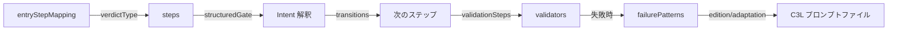
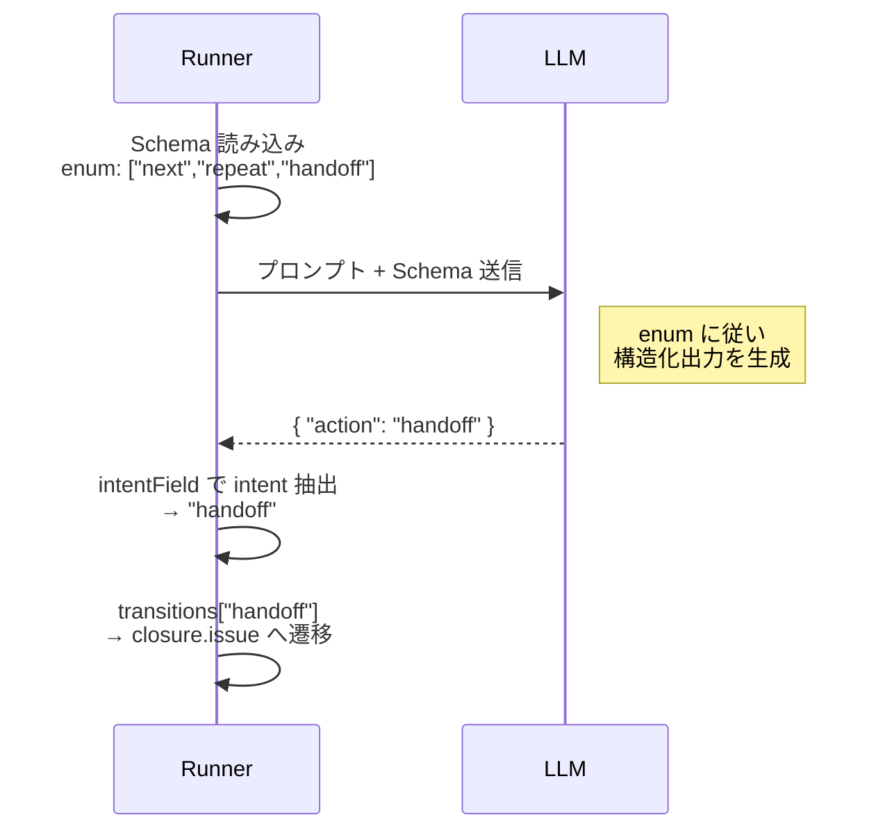
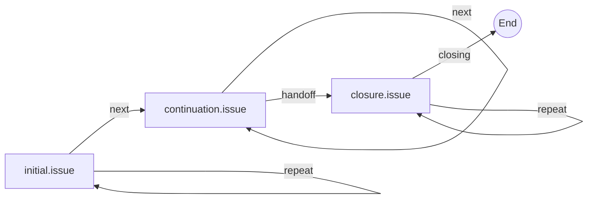
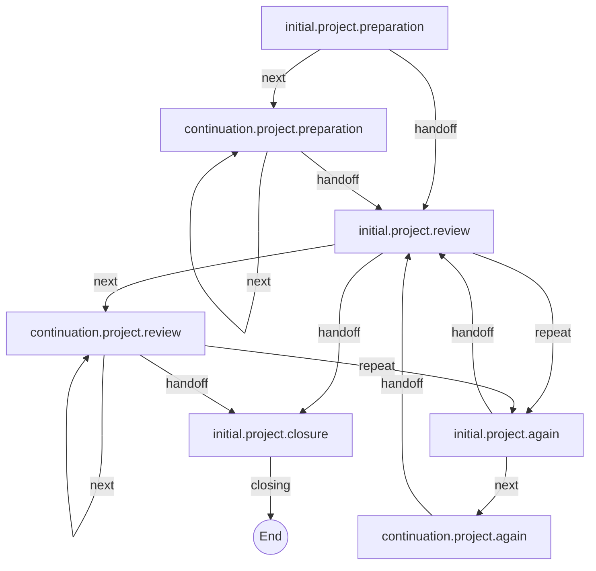
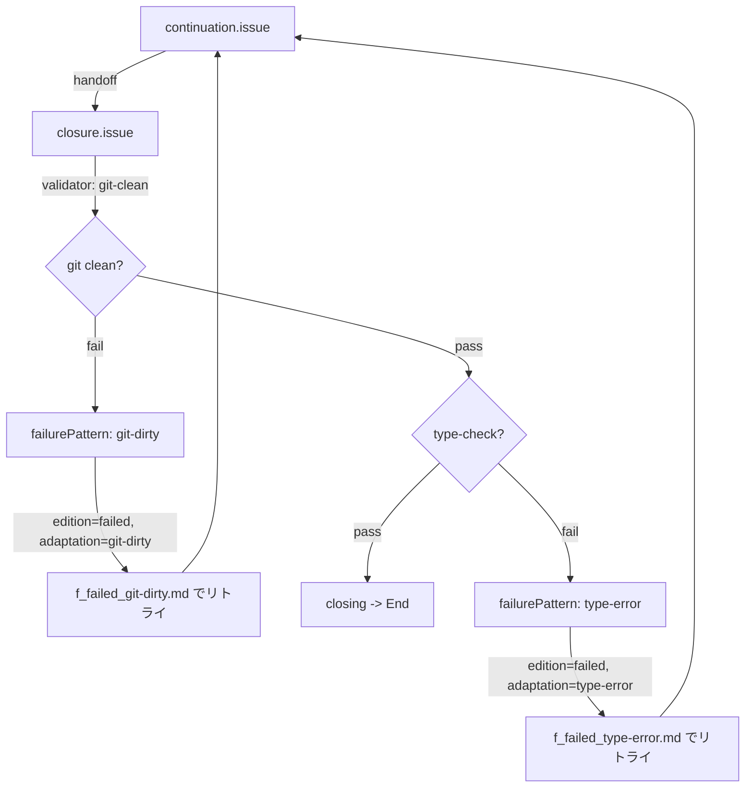

[English](../en/14-steps-registry-guide.md) |
[日本語](../ja/14-steps-registry-guide.md)

# 14. Steps Registry ガイド

`steps_registry.json` はエージェントのステップフロー制御の中核となる設定ファイル
です。ステップ遷移、構造化ゲートルーティング、バリデーション、失敗リカバリパターン
を定義します。

## 14.1 steps_registry.json とは？

Steps Registry はエージェント実行フローの宣言的な制御プレーンです。以下を決定し
ます：

- **ステップ遷移**: AI 出力の intent に基づく次のステップの決定
- **構造化ゲートルーティング**: AI の構造化出力からフロー判断へのマッピング
- **バリデーション**: 完了前チェック（git clean、テスト通過など）
- **失敗リカバリ**: リトライプロンプト用の edition/adaptation 選択

レジストリはエージェント定義の `runner.flow.prompts.registry` で参照されます
（デフォルト: `"steps_registry.json"`）。

### アーキテクチャ概要



### 設計モデル: Runner-LLM 間の JSON 契約

3つの設定フィールド — `outputSchemaRef`、`structuredGate`、`transitions` — が
Runner と LLM の間の送受信契約を構成します。



- **送信（JSON Schema）**: `outputSchemaRef`
  がスキーマファイルを指す。スキーマ内の `enum` が LLM の返却値を制約する。
- **受信（transitions）**: `transitions`
  がその制約された値をキーにして遷移先を宣言 する。
- **接続（structuredGate）**: `intentSchemaRef` がスキーマ内の `enum`
  の位置を指定し、 `intentField` が LLM
  レスポンスから値を抽出するパスを指定する。

利用可能な intent は Runner が定義する固定の7種です：

| intent     | 意味                     | 使える stepKind    |
| ---------- | ------------------------ | ------------------ |
| `next`     | 次のステップへ進む       | work, verification |
| `repeat`   | 現在のステップを再実行   | all                |
| `jump`     | 指定ステップへ飛ぶ       | work, verification |
| `handoff`  | closure や別フローへ委譲 | work               |
| `closing`  | ワークフロー完了         | closure            |
| `escalate` | 検証サポートへ転送       | verification       |
| `abort`    | エラー終了               | all（常に許可）    |

カスタマイズできるのは、この7種から**ステップごとにどの組み合わせを許可するか**と、
**各 intent の遷移先をどこにするか**です。独自の intent
を追加することはできません （`StepGateInterpreter`
が未知の値をエラーにします）。

送信と受信が同じ JSON 語彙を共有するため、スキーマの `enum` と `transitions`
キーを並べるだけで整合性を検証できます：

| ステップ             | Schema enum（送信）         | transitions キー（受信）    |
| -------------------- | --------------------------- | --------------------------- |
| `initial.issue`      | `next`, `repeat`            | `next`, `repeat`            |
| `continuation.issue` | `next`, `repeat`, `handoff` | `next`, `repeat`, `handoff` |
| `closure.issue`      | `closing`, `repeat`         | `closing`, `repeat`         |

**ルール**: ステップのスキーマ `enum` で intent を選択したら、`transitions` にも
対応するキーを追加します。`enum` と `transitions` キーは一致させます。これにより
契約の一貫性が保たれます。

## 14.2 全体構造

| キー                       | 必須 | 説明                                             |
| -------------------------- | ---- | ------------------------------------------------ |
| `agentId`                  | Yes  | エージェント識別子（例: `"iterator"`）           |
| `version`                  | Yes  | semver 形式のスキーマバージョン                  |
| `c1`                       | Yes  | C3L 最上位パスコンポーネント（例: `"steps"`）    |
| `userPromptsBase`          | No   | ユーザープロンプトの基底ディレクトリ             |
| `schemasBase`              | No   | スキーマファイルの基底ディレクトリ               |
| `pathTemplate`             | No   | adaptation 付き C3L パステンプレート             |
| `pathTemplateNoAdaptation` | No   | adaptation 無し C3L パステンプレート             |
| `entryStep`                | No   | デフォルトのエントリステップ ID                  |
| `entryStepMapping`         | No   | モードベースのエントリステップマッピング         |
| `failurePatterns`          | No   | 名前付き失敗パターン定義                         |
| `validators`               | No   | 名前付きバリデータ定義                           |
| `validationSteps`          | No   | クロージャ前チェック用バリデーションステップ定義 |
| `steps`                    | Yes  | ステップ ID からステップ定義へのマップ           |

## 14.3 entryStepMapping

エージェントの verdict type を初期ステップにマッピングします。verdict type は
エージェント定義の `runner.verdict.type` から取得されます。

```json
{
  "entryStepMapping": {
    "poll:state": "initial.polling",
    "count:iteration": "initial.iteration"
  }
}
```

エージェント開始時、`FlowOrchestrator.getStepIdForIteration(1)` は以下の順序で
エントリステップを解決します：

1. `entryStepMapping[verdictType]` -- モード固有のエントリ
2. `entryStep` -- 汎用フォールバック
3. いずれも未設定の場合はエラー

iterator エージェントの例:

| Verdict Type      | Entry Step          | 用途                        |
| ----------------- | ------------------- | --------------------------- |
| `poll:state`      | `initial.polling`   | GitHub Issue 状態ポーリング |
| `count:iteration` | `initial.iteration` | 固定イテレーション回数      |

## 14.4 Steps

### 14.4.1 ステップ定義

各ステップは `steps` オブジェクトのキー付きエントリです。キーは `stepId` と
一致する必要があります。

```json
{
  "initial.issue": {
    "stepId": "initial.issue",
    "name": "Issue Initial Prompt",
    "stepKind": "work",
    "c2": "initial", "c3": "issue", "edition": "default",
    "fallbackKey": "issue_initial_default",
    "uvVariables": ["issue_number"],
    "usesStdin": false,
    "outputSchemaRef": { "file": "issue.schema.json", "schema": "initial.issue" },
    "structuredGate": { ... },
    "transitions": { ... }
  }
}
```

**stepId の命名規則:**

| プレフィックス   | フェーズ     | stepKind | 説明                                   |
| ---------------- | ------------ | -------- | -------------------------------------- |
| `initial.*`      | initial      | work     | 各フローの最初のステップ               |
| `continuation.*` | continuation | work     | 後続イテレーションステップ             |
| `closure.*`      | closure      | closure  | 終端/完了ステップ                      |
| `section.*`      | section      | (なし)   | 注入プロンプトセクション（フロー無し） |

**stepKind と許可される intent:**

| stepKind       | 許可される Intent                    | 目的           | 制限理由                                         |
| -------------- | ------------------------------------ | -------------- | ------------------------------------------------ |
| `work`         | `next`, `repeat`, `jump`, `handoff`  | 成果物の生成   | `closing` 不可 — フロー終了は closure のみが行う |
| `verification` | `next`, `repeat`, `jump`, `escalate` | 作業成果の検証 | `handoff` 不可 — 検証が closure を飛ばせない     |
| `closure`      | `closing`, `repeat`                  | 最終検証/完了  | 最小セット — 完了か再実行のみ                    |

Intent が固定 7 種に限定されているのは、AI の出力揺れを最小化しフローの安全性を
保証するためです。設計の詳細と Runner-LLM 間の契約モデルについては、上の
[設計モデル](#設計モデル-runner-llm-間の-json-契約) を参照してください。

`stepKind` を省略した場合、`c2` から推論されます：

- `"initial"`, `"continuation"` -> `work`
- `"verification"` -> `verification`
- `"closure"` -> `closure`

**モデル選択:**

各ステップは `model` フィールド（`"sonnet"`, `"opus"`, `"haiku"`）を指定可能
です。解決順序: `step.model` > `runner.flow.defaultModel` > `"opus"`（システム
デフォルト）。ルーチンステップのコスト最適化には `"haiku"` を使用します。

#### fallbackKey 命名規則

`fallbackKey`
はデフォルトテンプレートレジストリのキーと一致する**アンダースコア区切り**形式で指定する。

| フィールド  | 形式                 | 例              |
| ----------- | -------------------- | --------------- |
| stepId      | ドット区切り         | `initial.issue` |
| fallbackKey | アンダースコア区切り | `initial_issue` |

ドット区切りのキー (例: `"initial.issue"`) を `fallbackKey`
に使用すると以下のエラーが発生する:

```
No fallback prompt found for key: "initial.issue" (step: initial.issue)
```

#### 利用可能な fallbackKey 一覧

**Initial / Continuation ペア:**

| fallbackKey                                                    | 説明                                         |
| -------------------------------------------------------------- | -------------------------------------------- |
| `initial_iterate` / `continuation_iterate`                     | イテレーション verdict (`count:iteration`)   |
| `initial_issue` / `continuation_issue`                         | Issue ポーリング verdict (`poll:state`)      |
| `initial_issue_label_only` / `continuation_issue_label_only`   | Issue ラベルのみ variant (`poll:state`)      |
| `initial_project` / `continuation_project`                     | プロジェクト verdict                         |
| `initial_keyword` / `continuation_keyword`                     | キーワード検出 verdict (`detect:keyword`)    |
| `initial_manual` / `continuation_manual`                       | 手動モード (keyword のエイリアス)            |
| `initial_structured_signal` / `continuation_structured_signal` | 構造化シグナル verdict (`detect:structured`) |

**プロジェクトフェーズ variant:**

| fallbackKey                        | 説明                         |
| ---------------------------------- | ---------------------------- |
| `continuation_project_preparation` | プロジェクト準備フェーズ     |
| `continuation_project_processing`  | プロジェクト処理フェーズ     |
| `continuation_project_review`      | プロジェクトレビューフェーズ |

**Closure およびその他のプロンプト:**

| fallbackKey                            | 説明                         |
| -------------------------------------- | ---------------------------- |
| `issue_closure_default`                | Issue 完了                   |
| `project_closure_default`              | プロジェクト完了             |
| `polling_closure_default`              | ポーリング完了 (汎用)        |
| `review_closure_default`               | レビュー完了                 |
| `iteration_closure_default`            | イテレーション予算消化       |
| `facilitation_closure_default`         | ファシリテーション完了       |
| `project_continuation_closure_default` | プロジェクト継続完了         |
| `statuscheck_continuation_default`     | ステータスチェック継続       |
| `system`                               | デフォルトシステムプロンプト |

#### UV 変数の制約

- breakdown は空値の UV 変数を拒否する (例: `--uv-repository=` は
  `Empty value not allowed` エラーになる)
- 一部の verdict type は空になりうる UV 変数を自動注入する (例: `poll:state`
  は未設定時に空文字列の `repository` を注入)
- 空 UV 変数により C3L 解決が失敗した場合、runner は `fallbackKey`
  にフォールバックする
- このフォールバックを正しく機能させるために、`fallbackKey` を正確に設定すること

### 14.4.2 Structured Gate

`structuredGate` 設定は AI の構造化出力がどのように解釈され、次のアクションが
決定されるかを制御します。

```json
{
  "structuredGate": {
    "allowedIntents": ["next", "repeat", "handoff"],
    "intentSchemaRef": "#/properties/next_action/properties/action",
    "intentField": "next_action.action",
    "targetField": "next_action.details.target",
    "handoffFields": ["analysis.understanding", "analysis.approach"],
    "failFast": true,
    "fallbackIntent": "next"
  }
}
```

| フィールド        | 必須 | 説明                                                     |
| ----------------- | ---- | -------------------------------------------------------- |
| `allowedIntents`  | Yes  | このステップが発行できる intent                          |
| `intentSchemaRef` | Yes  | スキーマ内の intent enum への JSON Pointer (`#/` 接頭辞) |
| `intentField`     | Yes  | 出力から intent を抽出するドット記法パス                 |
| `targetField`     | No   | jump 先ステップ ID のドット記法パス                      |
| `handoffFields`   | No   | 次のステップに渡すデータのドット記法パス                 |
| `targetMode`      | No   | `"explicit"` / `"dynamic"` / `"conditional"`             |
| `failFast`        | No   | 解決不能な intent でエラー送出（デフォルト: `true`）     |
| `fallbackIntent`  | No   | `failFast` が `false` の場合のフォールバック intent      |

**GateIntent 値**（`step-gate-interpreter.ts` より）:

| Intent     | 説明                               | 発行元             |
| ---------- | ---------------------------------- | ------------------ |
| `next`     | 次のステップに進む                 | work, verification |
| `repeat`   | 現在のステップをリトライ           | すべて             |
| `jump`     | ID 指定で特定ステップに遷移        | work, verification |
| `closing`  | ワークフロー完了をシグナル         | closure のみ       |
| `abort`    | エラーでワークフロー終了           | すべて（常に許可） |
| `escalate` | 検証サポートステップにルーティング | verification のみ  |
| `handoff`  | closure / 別ワークフローへ引き渡し | work のみ          |

**アクションエイリアス**（`StepGateInterpreter` が認識）:

| AI レスポンス値    | マッピング先 |
| ------------------ | ------------ |
| `continue`         | `next`       |
| `retry`, `wait`    | `repeat`     |
| `done`, `finished` | `closing`    |
| `pass`             | `next`       |
| `fail`             | `repeat`     |

### 14.4.3 Transitions

`transitions` オブジェクトは intent をターゲットステップにマッピングします。

**シンプルターゲット:**

```json
{
  "transitions": {
    "next": { "target": "continuation.issue" },
    "repeat": { "target": "initial.issue" },
    "handoff": { "target": "closure.issue" }
  }
}
```

**終端遷移**（`target: null` で完了をシグナル）:

```json
{
  "transitions": {
    "closing": { "target": null },
    "repeat": { "target": "closure.issue" }
  }
}
```

**条件付き遷移:**

```json
{
  "transitions": {
    "next": {
      "condition": "status",
      "targets": {
        "ready": "continuation.process",
        "blocked": "continuation.wait",
        "default": "continuation.fallback"
      }
    }
  }
}
```

`condition` フィールドはハンドオフデータのキー名を指定します。その値が `targets`
マップと照合され、一致しない場合は `"default"` が使用されます。

## 14.5 Validators

バリデータはクロージャ前に実行されるコマンドベースのチェックを定義します。

```json
{
  "git-clean": {
    "type": "command",
    "command": "git status --porcelain",
    "successWhen": "empty",
    "failurePattern": "git-dirty",
    "extractParams": { "changedFiles": "parseChangedFiles" }
  }
}
```

| フィールド       | 必須 | 説明                                        |
| ---------------- | ---- | ------------------------------------------- |
| `type`           | Yes  | バリデータ種別（現在は `"command"` のみ）   |
| `command`        | Yes  | 実行するシェルコマンド                      |
| `successWhen`    | Yes  | 成功条件（`"empty"` または `"exitCode:N"`） |
| `failurePattern` | Yes  | 失敗時に参照する名前付き失敗パターン        |
| `extractParams`  | No   | コマンド出力からのパラメータ抽出ルール      |

バリデータは `validationSteps` から参照され、バリデータとクロージャステップを
関連付けます：

```json
{
  "validationSteps": {
    "closure.issue": {
      "stepId": "closure.issue",
      "name": "Issue Validation",
      "c2": "retry",
      "c3": "issue",
      "validationConditions": [
        { "validator": "git-clean" },
        { "validator": "type-check" }
      ],
      "onFailure": { "action": "retry", "maxAttempts": 3 }
    }
  }
}
```

## 14.6 failurePatterns

失敗パターンはバリデーション失敗を C3L の edition/adaptation バリアントに
マッピングし、特化したリトライプロンプトを有効にします。

```json
{
  "git-dirty": {
    "description": "未コミットの変更がある",
    "edition": "failed",
    "adaptation": "git-dirty",
    "params": ["changedFiles", "untrackedFiles"]
  }
}
```

| フィールド    | 必須 | 説明                                     |
| ------------- | ---- | ---------------------------------------- |
| `description` | Yes  | 人間が読める失敗の説明                   |
| `edition`     | Yes  | 失敗プロンプト用の edition バリアント    |
| `adaptation`  | No   | 失敗プロンプト用の adaptation バリアント |
| `params`      | No   | マッチ時に抽出するパラメータ名           |

**C3L 連携**: バリデータが失敗すると、その `failurePattern` 参照が
edition/adaptation を選択します。`pathTemplate` が実際のプロンプトファイルに
解決されます：

```
pathTemplate: {c1}/{c2}/{c3}/f_{edition}_{adaptation}.md
failurePattern "git-dirty": edition="failed", adaptation="git-dirty"

解決パス: steps/closure/issue/f_failed_git-dirty.md
```

C3L パスの詳細は [08-prompt-structure.md](./08-prompt-structure.md) を参照して
ください。

## 14.7 pathTemplate

パステンプレートはステップ定義からディスク上のプロンプトファイルへの解決方法を
定義します。

### テンプレート構文

```
{c1}/{c2}/{c3}/f_{edition}_{adaptation}.md    # adaptation 付き
{c1}/{c2}/{c3}/f_{edition}.md                  # adaptation 無し
```

### テンプレート変数

| 変数           | ソース                                     | 例          |
| -------------- | ------------------------------------------ | ----------- |
| `{c1}`         | レジストリレベルの `c1` フィールド         | `steps`     |
| `{c2}`         | ステップ定義の `c2` フィールド             | `initial`   |
| `{c3}`         | ステップ定義の `c3` フィールド             | `issue`     |
| `{edition}`    | ステップの `edition` または失敗パターン    | `default`   |
| `{adaptation}` | ステップの `adaptation` または失敗パターン | `git-dirty` |

### 解決例

前提条件:

- `userPromptsBase`: `.agent/iterator/prompts`
- `pathTemplate`: `{c1}/{c2}/{c3}/f_{edition}_{adaptation}.md`
- ステップ: `c1="steps"`, `c2="initial"`, `c3="issue"`, `edition="default"`

adaptation 無しの場合:

```
.agent/iterator/prompts/steps/initial/issue/f_default.md
```

失敗パターン `git-dirty`（`edition="failed"`, `adaptation="git-dirty"`）の場合:

```
.agent/iterator/prompts/steps/initial/issue/f_failed_git-dirty.md
```

## 14.8 ステップフロー設計

### 14.8.1 リニアフロー

最もシンプルなパターン: initial -> continuation -> closure。



### 14.8.2 分岐フロー

準備、レビュー、再実行ブランチを含むプロジェクトフロー。



設計のポイント:

- review からの `repeat` は `initial.project.again`（再実行）にルーティング
- review からの `handoff` は `initial.project.closure`（完了）にルーティング
- again ステップは再実行後に review にループバック

### 14.8.3 リトライ / リカバリフロー

バリデーション失敗時、失敗パターンがコンテキスト付きエラー情報を含む特化プロンプト
を選択します。



リトライフロー:

1. work ステップが closure ステップにハンドオフ
2. `validationSteps` が各バリデータを順次実行
3. 失敗時、マッチする `failurePattern` が edition/adaptation を提供
4. リトライプロンプトが失敗 edition/adaptation を含む `pathTemplate` で解決
5. 失敗コンテキストと共に work ステップに戻る
6. `onFailure.maxAttempts` でリトライ回数を制限

## 14.9 完全サンプル

完全な動作例は `.agent/iterator/steps_registry.json` を参照してください。

そのレジストリで示されている主要な設計ルール:

1. すべてのフローステップは `structuredGate` と `transitions` を定義する必要が
   ある
2. `section.*` ステップ（例: `section.projectcontext`）はフロー制御なしの注入
   プロンプトセクション -- ゲートや遷移は不要
3. `closing` intent と `target: null` でワークフロー完了をシグナル
4. work ステップからの `handoff` は closure ステップにルーティング
5. `failFast: true`（デフォルト）により、解決不能な intent はサイレントフォール
   バックではなくエラーを送出する

最小の3ステップレジストリ（issue フロー）に必要な構造:

- `initial.issue` (stepKind: work) -- `next` -> `continuation.issue`
- `continuation.issue` (stepKind: work) -- `handoff` -> `closure.issue`
- `closure.issue` (stepKind: closure) -- `closing` -> `null` (終端)
