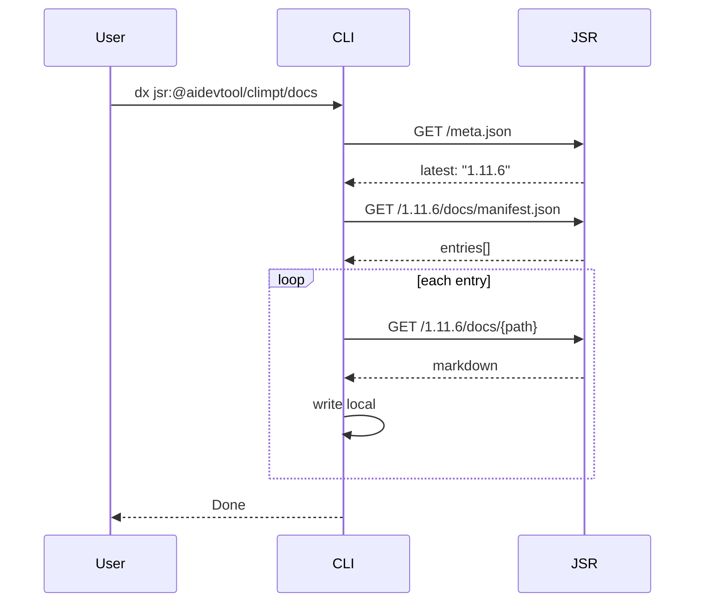

# Docs Distribution Design

JSRからdocsをmarkdownとしてローカルにインストールする機能の設計。

## 構成

```
src/docs/
├── mod.ts       # API
├── cli.ts       # CLI
├── source.ts    # JSR fetch
├── resolver.ts  # フィルタ
├── writer.ts    # 出力
└── types.ts     # 型

scripts/
└── generate-docs-manifest.ts
```

## フロー



## マニフェスト

`docs/manifest.json` (リリース前に自動生成):

```json
{
  "version": "1.11.6",
  "entries": [
    {
      "id": "overview-ja",
      "path": "guides/ja/00-overview.md",
      "category": "guides",
      "lang": "ja"
    }
  ]
}
```

## CLI

```bash
dx jsr:@aidevtool/climpt/docs                          # 全docs
dx jsr:@aidevtool/climpt/docs install ./docs --lang=ja # 日本語のみ
dx jsr:@aidevtool/climpt/docs install --mode=single    # 1ファイル結合
dx jsr:@aidevtool/climpt/docs list                     # 一覧
```

## API

```typescript
import { install, list } from "jsr:@aidevtool/climpt/docs";

await install({ output: "./docs", lang: "ja" });
const { entries } = await list();
```

## deno.json 変更

```json
{
  "exports": {
    "./docs": "./src/docs/mod.ts",
    "./docs/cli": "./src/docs/cli.ts"
  },
  "include": ["docs/"],
  "tasks": {
    "generate-docs-manifest": "deno run -A scripts/generate-docs-manifest.ts"
  }
}
```

## 特徴

| 特徴             | 説明                         |
| ---------------- | ---------------------------- |
| オンデマンド     | cli.tsのみDL → 実行時にfetch |
| バージョン自動   | meta.jsonから最新取得        |
| マニフェスト自動 | docsから自動生成             |
| 3モード          | preserve / flatten / single  |
