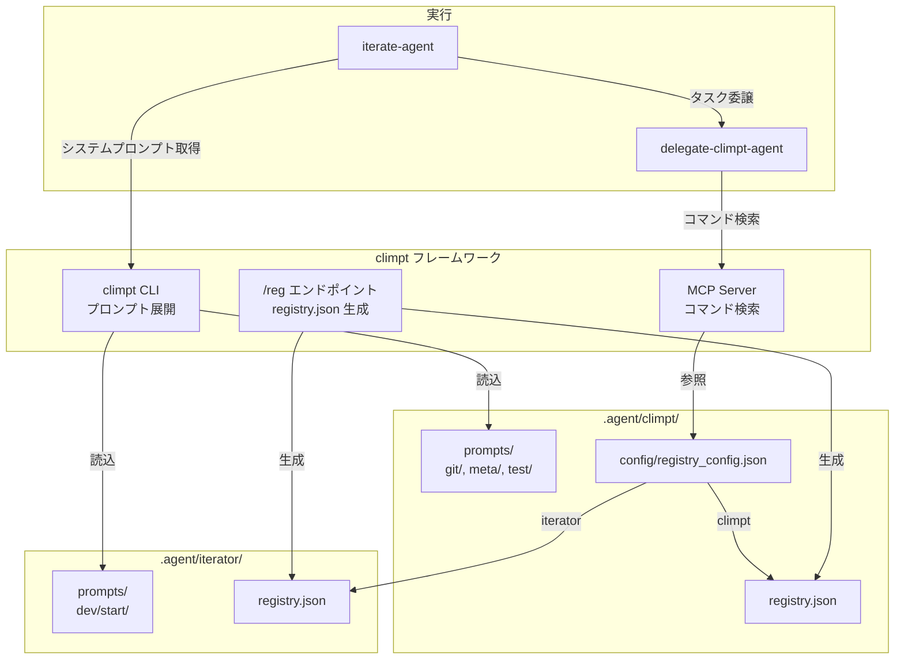
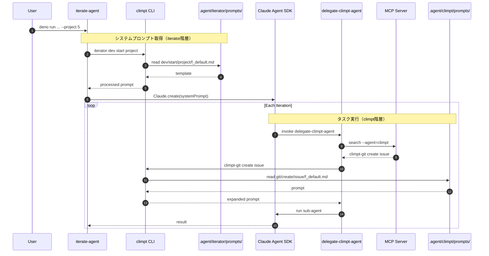
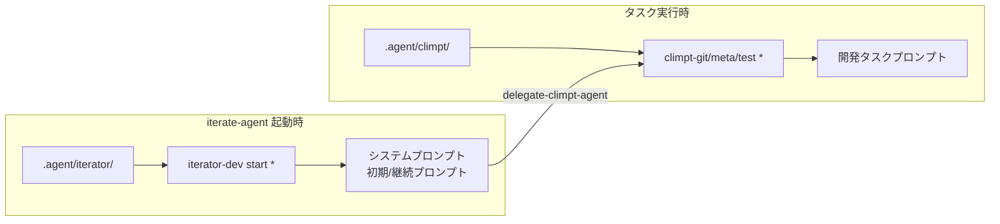
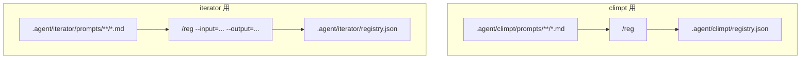
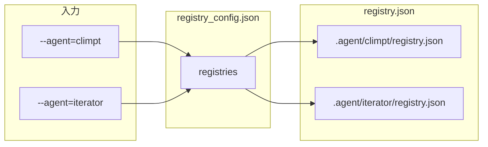
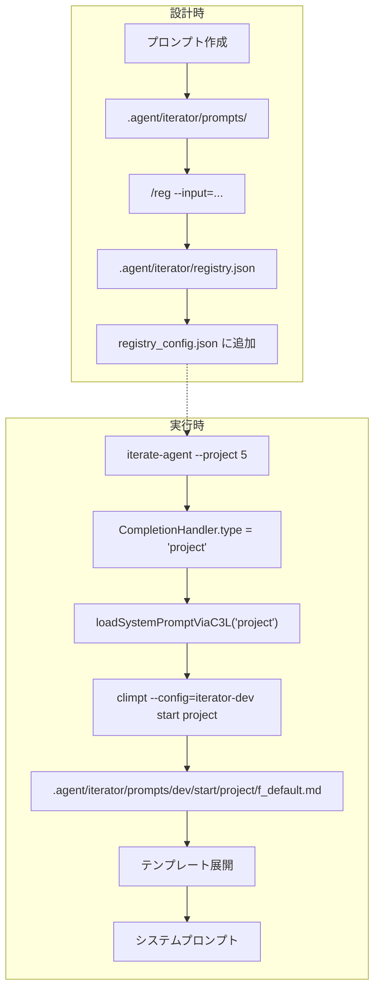

# Iterate Agent C3L 統合設計

> 設計日: 2026-01-01
> ステータス: Final

---

## 1. 設計概要

### 1.1 目的

iterate-agent のプロンプト管理を climpt の C3L フレームワークに統合し、
`.agent/iterator/` として独立した階層で管理する。

### 1.2 設計原則

| 原則 | 説明 |
|-----|------|
| **climpt 機能の活用** | registry.json 生成、プロンプト展開は既存 climpt 機能を使用 |
| **階層の分離** | `.agent/climpt/` と `.agent/iterator/` は独立 |
| **C3L 準拠** | `iterator-dev start <mode>` の命名規則に従う |

---

## 2. アーキテクチャ

### 2.1 コンポーネント関係図



### 2.2 階層分離の確認

| 項目 | `.agent/climpt/` | `.agent/iterator/` |
|-----|-----------------|-------------------|
| 用途 | 汎用開発タスク | iterate-agent 専用 |
| C3L Agent | `climpt` | `iterator` |
| c1 例 | `git`, `meta`, `test` | `dev` |
| 使用者 | delegate-climpt-agent | iterate-agent 起動時 |
| 独立性 | 既存（変更なし） | 新規追加 |

---

## 3. ディレクトリ構造

```
.agent/
├── climpt/                               # 既存（一部変更）
│   ├── config/
│   │   ├── git-app.yml
│   │   ├── meta-app.yml
│   │   ├── iterator-dev-app.yml          # ← iterator 用 config 追加
│   │   └── registry_config.json          # ← iterator エントリ追加
│   ├── frontmatter-to-schema/
│   │   ├── registry.schema.json
│   │   ├── command.schema.json
│   │   └── registry.template.json
│   ├── prompts/
│   │   ├── git/
│   │   ├── meta/
│   │   └── test/
│   └── registry.json
│
└── iterator/                             # 新規作成
    ├── frontmatter-to-schema/            # climpt からコピー
    │   ├── registry.schema.json
    │   ├── command.schema.json
    │   └── registry.template.json
    ├── prompts/
    │   └── dev/                          # c1 = dev
    │       └── start/                    # c2 = start
    │           ├── project/              # c3 = project
    │           │   └── f_default.md
    │           ├── issue/                # c3 = issue
    │           │   └── f_default.md
    │           └── default/              # c3 = default
    │               └── f_default.md
    └── registry.json                     # /reg で生成
```

**Note**: iterator の config (`iterator-dev-app.yml`) は `.agent/climpt/config/` に配置。
breakdown ライブラリがこの場所から config を読み込むため。

---

## 4. C3L 命名設計

### 4.1 コマンド体系

```
iterator-dev start project
    │     │    │     │
    │     │    │     └── c3: Target (project/issue/default)
    │     │    └── c2: Action (start)
    │     └── c1: Domain (dev)
    └── Agent: iterator
```

### 4.2 モード対応

| iterate-agent オプション | C3L コマンド |
|------------------------|-------------|
| `--project 5` | `iterator-dev start project` |
| `--issue 123` | `iterator-dev start issue` |
| (デフォルト) | `iterator-dev start default` |

---

## 5. 呼び出し連鎖

### 5.1 全体フロー



### 5.2 2つの階層の役割



---

## 6. registry.json 管理

### 6.1 生成フロー



### 6.2 生成コマンド

```bash
# climpt 用（デフォルト）
deno run --allow-read --allow-write --allow-env jsr:@aidevtool/climpt/reg

# iterator 用
deno run --allow-read --allow-write --allow-env jsr:@aidevtool/climpt/reg \
  --input=".agent/iterator/prompts/**/*.md" \
  --output=".agent/iterator/registry.json"
```

### 6.3 registry_config.json

```json
{
  "registries": {
    "climpt": ".agent/climpt/registry.json",
    "iterator": ".agent/iterator/registry.json"
  }
}
```

### 6.4 --agent パラメータによる解決



---

## 7. プロンプトファイル設計

### 7.1 Frontmatter 形式

```yaml
---
c1: iterator-dev
c2: start
c3: project
title: Project Mode System Prompt
description: System prompt for GitHub Project iteration
usage: iterator-dev start project
c3l_version: "0.5"
options:
  edition: ["default"]
  adaptation: ["default"]
  file: false
  stdin: false
  destination: false
---
```

### 7.2 テンプレート変数

| 変数 | 置換タイミング | 説明 |
|-----|--------------|------|
| `{{AGENT}}` | iterate-agent | エージェント名 |
| `{{COMPLETION_CRITERIA}}` | iterate-agent | 完了条件（短） |
| `{{COMPLETION_CRITERIA_DETAIL}}` | iterate-agent | 完了条件（詳細） |

### 7.3 モード別差分

| 要素 | project | issue | default |
|-----|---------|-------|---------|
| 目的 | 全Issue完了 | 単一Issue完了 | N回反復 |
| issue-action | 必須 | なし | なし |
| GitHub連携 | Project API | Issue API | なし |

---

## 8. 実装変更

### 8.1 変更ファイル一覧

| ファイル | 変更内容 |
|---------|---------|
| `.agent/iterator/` | 新規ディレクトリ作成 |
| `.agent/iterator/config/dev-app.yml` | 新規作成 |
| `.agent/iterator/prompts/dev/start/*/f_default.md` | 新規作成 (3ファイル) |
| `.agent/iterator/registry.json` | /reg で生成 |
| `.agent/climpt/config/registry_config.json` | iterator エントリ追加 |
| `agents/iterator/scripts/config.ts` | C3L 経由読み込み対応 |

### 8.2 config.ts 変更

```typescript
export async function loadSystemPromptViaC3L(
  mode: "project" | "issue" | "iterate",
): Promise<string> {
  const c3 = mode === "iterate" ? "default" : mode;

  const command = new Deno.Command("deno", {
    args: [
      "run", "--allow-read", "--allow-write", "--allow-env",
      "jsr:@aidevtool/climpt",
      "--config=iterator-dev",
      "start",
      c3,
    ],
  });

  const { stdout } = await command.output();
  return new TextDecoder().decode(stdout);
}
```

---

## 9. 整合性確認

### 9.1 climpt 機能の活用

| 機能 | 使用箇所 | 確認 |
|-----|---------|------|
| `/reg` | iterator registry.json 生成 | ✅ `--input`, `--output` オプションで対応 |
| CLI プロンプト展開 | iterator-dev start * | ✅ `--config=iterator-dev` で対応 |
| registry_config.json | --agent=iterator 解決 | ✅ iterator エントリ追加で対応 |
| frontmatter-to-schema | registry.json 生成 | ✅ 既存スキーマ再利用 |

### 9.2 階層の独立性

| 確認項目 | climpt | iterator | 独立性 |
|---------|--------|----------|-------|
| prompts/ | git/, meta/, test/ | dev/start/ | ✅ 別ディレクトリ |
| registry.json | .agent/climpt/ | .agent/iterator/ | ✅ 別ファイル |
| config/*.yml | git-app.yml, meta-app.yml | dev-app.yml | ✅ 別ファイル |
| C3L Agent 名 | climpt | iterator | ✅ 別名 |

### 9.3 データフロー確認



---

## 10. 参考資料

- [Iterate Agent 設計仕様](./iterate-agent-design.md) - iterate-agent の全体設計
- [C3L Specification v0.5](../c3l_specification_v0.5.md)
- [Iterate Agent README](../../agents/iterator/README.md)
- [Climpt README](../../README.md)
- [delegate-climpt-agent SKILL.md](../../plugins/climpt-agent/skills/delegate-climpt-agent/SKILL.md)
