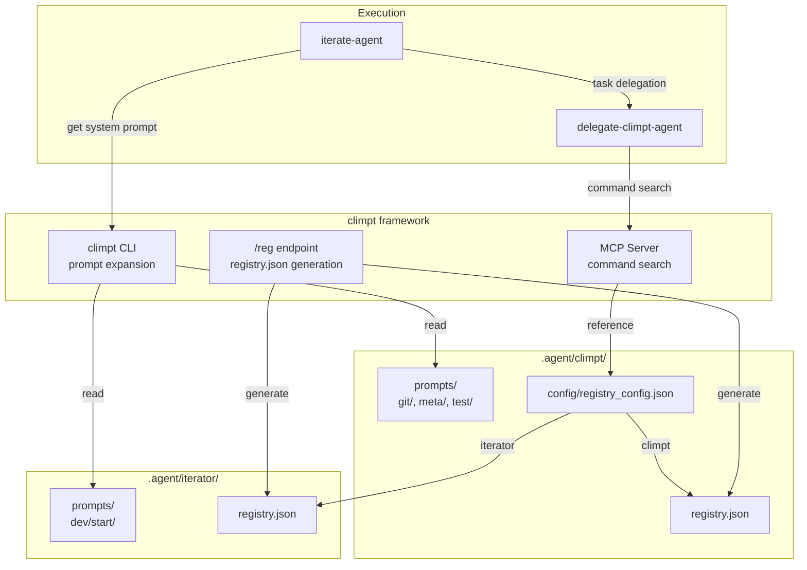
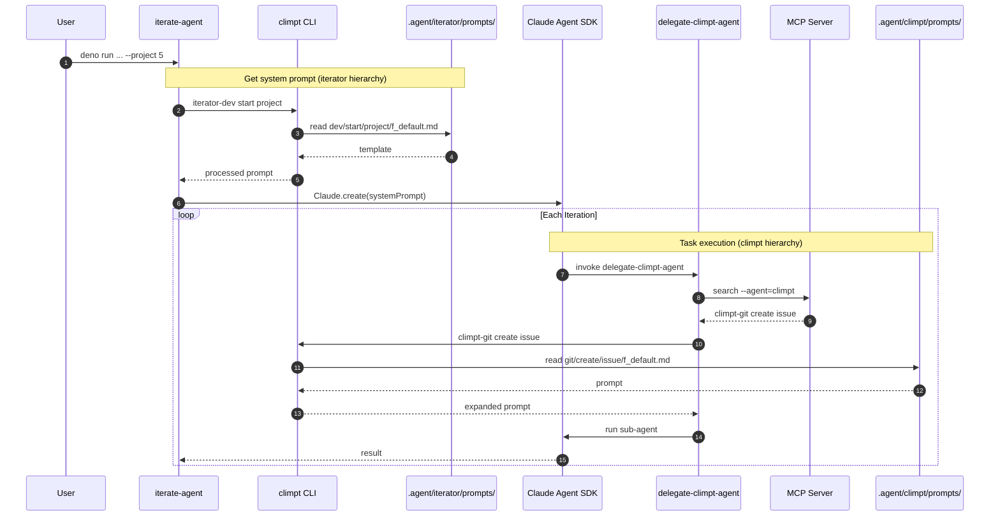
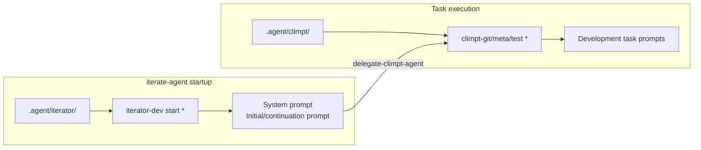
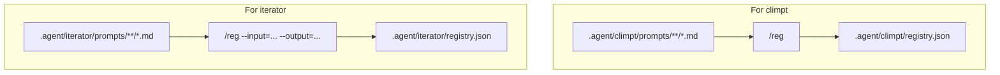
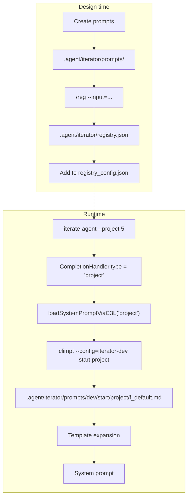

# Iterate Agent C3L Integration Design

> Design Date: 2026-01-01 Status: Final

---

## 1. Design Overview

### 1.1 Purpose

Integrate iterate-agent's prompt management into climpt's C3L framework,
managing it as an independent hierarchy under `.agent/iterator/`.

### 1.2 Design Principles

| Principle                   | Description                                                                    |
| --------------------------- | ------------------------------------------------------------------------------ |
| **Utilize climpt features** | Use existing climpt features for registry.json generation and prompt expansion |
| **Hierarchy separation**    | `.agent/climpt/` and `.agent/iterator/` are independent                        |
| **C3L compliance**          | Follow `iterator-dev start <mode>` naming convention                           |

---

## 2. Architecture

### 2.1 Component Relationship Diagram



### 2.2 Hierarchy Separation Confirmation

| Item         | `.agent/climpt/`          | `.agent/iterator/`     |
| ------------ | ------------------------- | ---------------------- |
| Purpose      | General development tasks | iterate-agent specific |
| C3L Agent    | `climpt`                  | `iterator`             |
| c1 examples  | `git`, `meta`, `test`     | `dev`                  |
| Users        | delegate-climpt-agent     | iterate-agent startup  |
| Independence | Existing (no changes)     | Newly added            |

---

## 3. Directory Structure

```
.agent/
├── climpt/                               # Existing (partial changes)
│   ├── config/
│   │   ├── git-app.yml
│   │   ├── meta-app.yml
│   │   ├── iterator-dev-app.yml          # ← iterator config added
│   │   └── registry_config.json          # ← iterator entry added
│   ├── frontmatter-to-schema/
│   │   ├── registry.schema.json
│   │   ├── command.schema.json
│   │   └── registry.template.json
│   ├── prompts/
│   │   ├── git/
│   │   ├── meta/
│   │   └── test/
│   └── registry.json
│
└── iterator/                             # Newly created
    ├── frontmatter-to-schema/            # Copied from climpt
    │   ├── registry.schema.json
    │   ├── command.schema.json
    │   └── registry.template.json
    ├── prompts/
    │   └── dev/                          # c1 = dev
    │       └── start/                    # c2 = start
    │           ├── project/              # c3 = project
    │           │   └── f_default.md
    │           ├── issue/                # c3 = issue
    │           │   └── f_default.md
    │           └── default/              # c3 = default
    │               └── f_default.md
    └── registry.json                     # Generated by /reg
```

**Note**: iterator's config (`iterator-dev-app.yml`) is placed in
`.agent/climpt/config/`. This is because the breakdown library reads config from
this location.

---

## 4. C3L Naming Design

### 4.1 Command System

```
iterator-dev start project
    │     │    │     │
    │     │    │     └── c3: Target (project/issue/default)
    │     │    └── c2: Action (start)
    │     └── c1: Domain (dev)
    └── Agent: iterator
```

### 4.2 Mode Mapping

| iterate-agent option | C3L command                  |
| -------------------- | ---------------------------- |
| `--project 5`        | `iterator-dev start project` |
| `--issue 123`        | `iterator-dev start issue`   |
| (default)            | `iterator-dev start default` |

---

## 5. Call Chain

### 5.1 Overall Flow



### 5.2 Roles of Two Hierarchies



---

## 6. registry.json Management

### 6.1 Generation Flow



### 6.2 Generation Commands

```bash
# For climpt (default)
deno run --allow-read --allow-write --allow-env jsr:@aidevtool/climpt/reg

# For iterator
deno run --allow-read --allow-write --allow-env jsr:@aidevtool/climpt/reg \
  --input=".agent/iterator/prompts/**/*.md" \
  --output=".agent/iterator/registry.json"
```

### 6.3 registry_config.json

```json
{
  "registries": {
    "climpt": ".agent/climpt/registry.json",
    "iterator": ".agent/iterator/registry.json"
  }
}
```

### 6.4 Resolution via --agent Parameter


---

## 7. Prompt File Design

### 7.1 Frontmatter Format

```yaml
---
c1: iterator-dev
c2: start
c3: project
title: Project Mode System Prompt
description: System prompt for GitHub Project iteration
usage: iterator-dev start project
c3l_version: "0.5"
options:
  edition: ["default"]
  adaptation: ["default"]
  file: false
  stdin: false
  destination: false
---
```

### 7.2 Template Variables

| Variable                         | Replacement Timing | Description                    |
| -------------------------------- | ------------------ | ------------------------------ |
| `{{AGENT}}`                      | iterate-agent      | Agent name                     |
| `{{COMPLETION_CRITERIA}}`        | iterate-agent      | Completion criteria (short)    |
| `{{COMPLETION_CRITERIA_DETAIL}}` | iterate-agent      | Completion criteria (detailed) |

### 7.3 Mode Differences

| Element            | project             | issue                 | default      |
| ------------------ | ------------------- | --------------------- | ------------ |
| Purpose            | Complete all Issues | Complete single Issue | N iterations |
| issue-action       | Required            | None                  | None         |
| GitHub integration | Project API         | Issue API             | None         |

---

## 8. Implementation Changes

### 8.1 File Change List

| File                                               | Change Content       |
| -------------------------------------------------- | -------------------- |
| `.agent/iterator/`                                 | Create new directory |
| `.agent/iterator/config/dev-app.yml`               | Create new           |
| `.agent/iterator/prompts/dev/start/*/f_default.md` | Create new (3 files) |
| `.agent/iterator/registry.json`                    | Generate with /reg   |
| `.agent/climpt/config/registry_config.json`        | Add iterator entry   |
| `agents/iterator/scripts/config.ts`                | Support C3L loading  |

### 8.2 config.ts Changes

```typescript
export async function loadSystemPromptViaC3L(
  mode: "project" | "issue" | "iterate",
): Promise<string> {
  const c3 = mode === "iterate" ? "default" : mode;

  const command = new Deno.Command("deno", {
    args: [
      "run",
      "--allow-read",
      "--allow-write",
      "--allow-env",
      "jsr:@aidevtool/climpt",
      "--config=iterator-dev",
      "start",
      c3,
    ],
  });

  const { stdout } = await command.output();
  return new TextDecoder().decode(stdout);
}
```

---

## 9. Consistency Verification

### 9.1 climpt Feature Utilization

| Feature               | Usage                             | Confirmation                                    |
| --------------------- | --------------------------------- | ----------------------------------------------- |
| `/reg`                | iterator registry.json generation | ✅ Supported with `--input`, `--output` options |
| CLI prompt expansion  | iterator-dev start *              | ✅ Supported with `--config=iterator-dev`       |
| registry_config.json  | --agent=iterator resolution       | ✅ Supported by adding iterator entry           |
| frontmatter-to-schema | registry.json generation          | ✅ Reuse existing schema                        |

### 9.2 Hierarchy Independence

| Verification Item | climpt                    | iterator         | Independence            |
| ----------------- | ------------------------- | ---------------- | ----------------------- |
| prompts/          | git/, meta/, test/        | dev/start/       | ✅ Separate directories |
| registry.json     | .agent/climpt/            | .agent/iterator/ | ✅ Separate files       |
| config/*.yml      | git-app.yml, meta-app.yml | dev-app.yml      | ✅ Separate files       |
| C3L Agent name    | climpt                    | iterator         | ✅ Different names      |

### 9.3 Data Flow Verification



---

## 10. References

- [Iterate Agent Design Specification](./iterate-agent-design.md) - Overall
  iterate-agent design
- [C3L Specification v0.5](../c3l_specification_v0.5.md)
- [Iterate Agent README](../../agents/iterator/README.md)
- [Climpt README](../../README.md)
- [delegate-climpt-agent SKILL.md](../../plugins/climpt-agent/skills/delegate-climpt-agent/SKILL.md)
